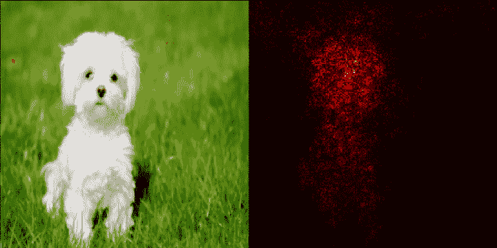
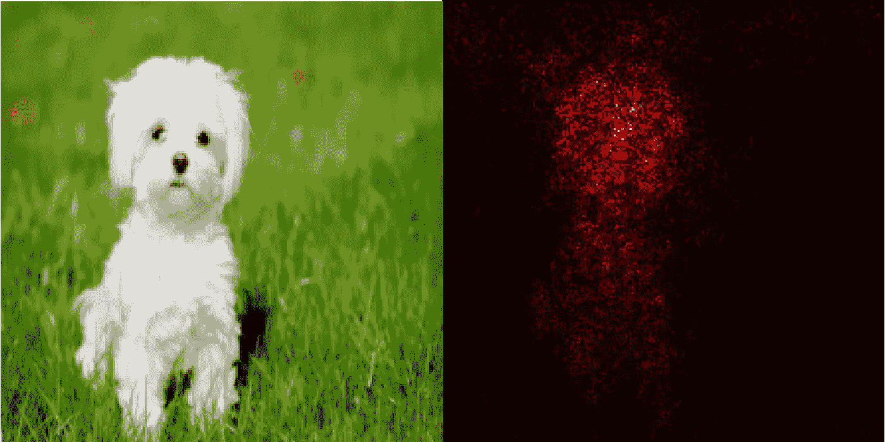
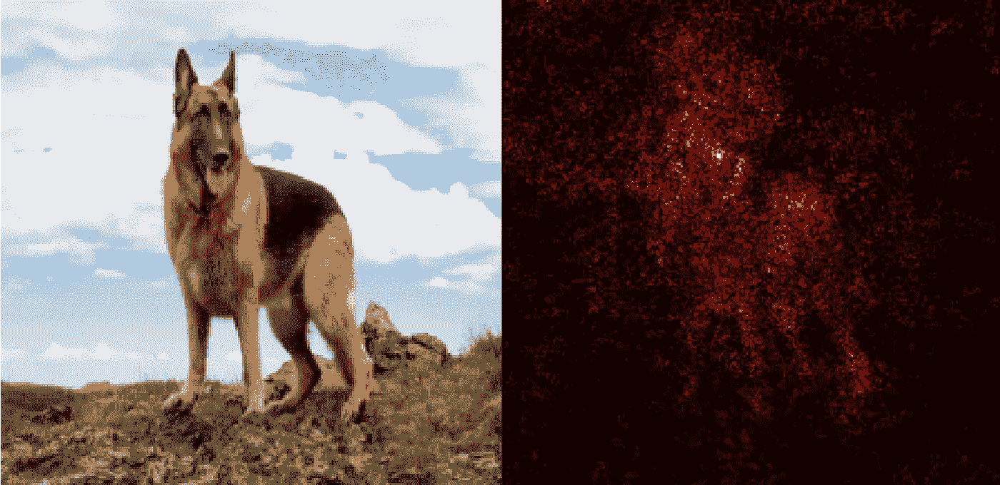
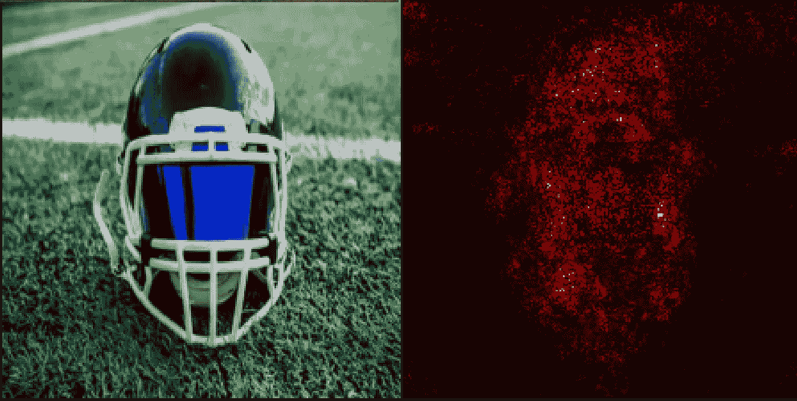
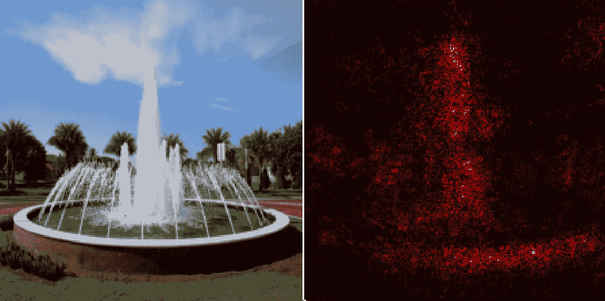
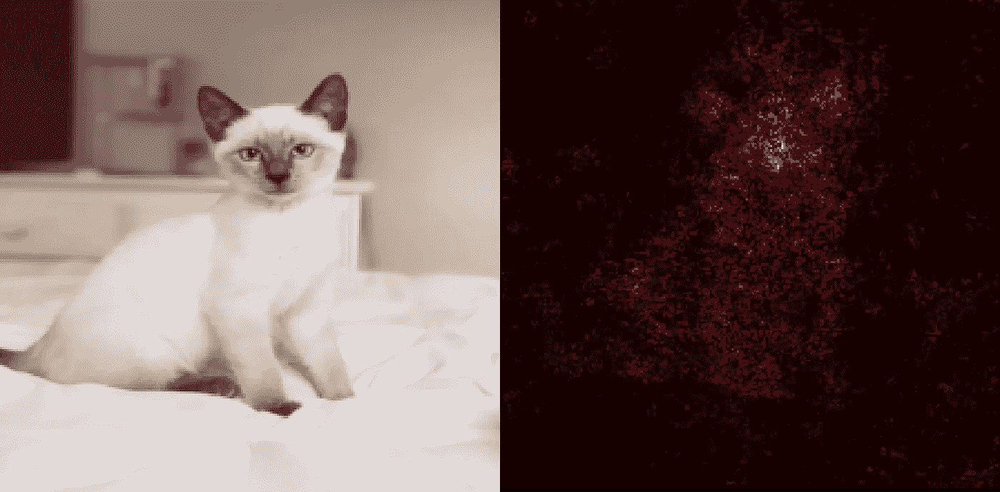
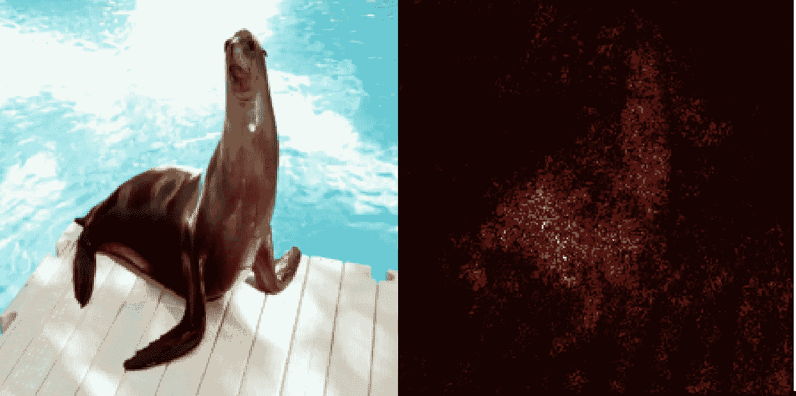
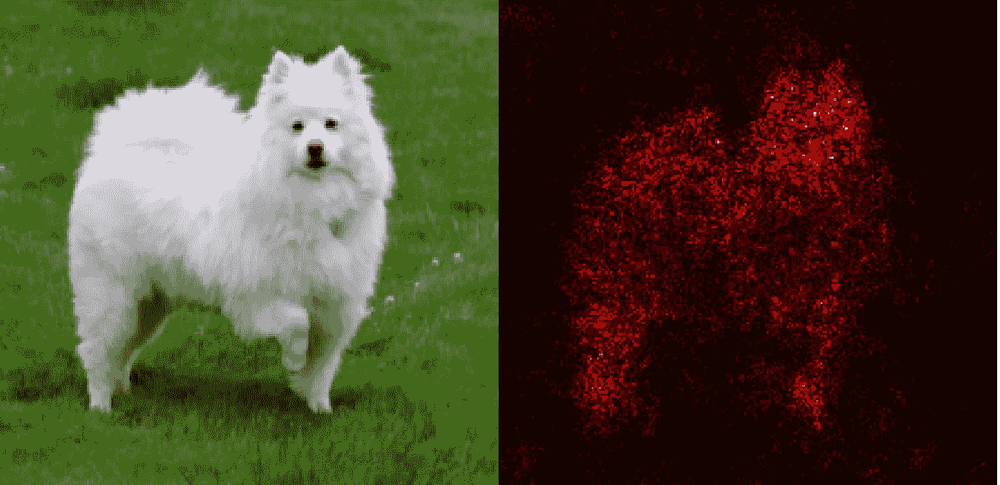

# PyTorch 中使用显著图可视化神经网络

> 原文：<https://medium.datadriveninvestor.com/visualizing-neural-networks-using-saliency-maps-in-pytorch-289d8e244ab4?source=collection_archive---------0----------------------->

神经网络正被用于许多应用中，并且它们的用例正以惊人的速度增长。人们越来越需要神经网络能够被人类理解。理解**神经网络在寻找什么**以及它对新样本的鲁棒性有多强，不仅有助于解释它的决定，也有助于满足科学好奇心。

# 什么是显著图？

在这篇博文中，我们将讨论显著性图— **它们是高亮显示输入图像中最容易导致输出分类的像素的热图。**

假设我们有一个用于图像分类问题的训练好的 ConvNet。这个 ConvNet 会产生一些类分数，根据最大分数，我们会得到输入图像的一些输出类。

*顺便说一下，类得分是神经网络在 softmax 之前分配给类的输出层中的值，因此它们不是概率，但它们通过 softmax 这样的函数与概率直接相关。*

 [## 人工智能与创造力:梦想成真|数据驱动的投资者

### 人工智能总是让我着迷。不仅作为一套有用的工具，不断发展，而且作为一个…

www.datadriveninvestor.com](https://www.datadriveninvestor.com/2019/01/28/ai-creativity-deep-dream-comes-true/) 

现在，考虑输出类得分相对于输入图像像素值的梯度。**梯度较大(正或负)的像素是需要改变最少而对类别分数影响最大的像素。人们可以预期这些像素对应于图像中物体的位置。这是显著图背后的基本思想。**

# PyTorch 中的显著图提取

首先，我们需要一个预训练的神经网络来进行图像分类。在这里，我们将使用预训练的 VGG-19 通信网。在 PyTorch 中，这是 torchvision 模块附带的。

*VGG-19 是一个卷积神经网络，它已经在 ImageNet 数据集的 100 多万张图像上进行了训练。该网络有 19 层深，可以将图像分为 1000 个对象类别，如键盘、鼠标、铅笔和许多动物。因此，该网络已经学习了各种图像的丰富特征表示。网络的图像输入大小为 224×224。[4]*

Imports and code for using pretrained VGG-19 model. Note that since we don’t need to find gradients with respect to the parameters of the network, so we’re setting param.requires_grad to False.

我们需要一个输入图像来提取显著图。作为一个例子，我们将使用一只非常可爱的马耳他狗的图片。

Image borrowed from [https://specials-images.forbesimg.com/imageserve/5db4c7b464b49a0007e9dfac/960x0.jpg?fit=scale](https://specials-images.forbesimg.com/imageserve/5db4c7b464b49a0007e9dfac/960x0.jpg?fit=scale)

Downloading and opening the image

现在我们需要对打开的图像进行预处理，这样我们就可以将它输入到 ConvNet 中。我们需要将图像的大小调整为所需的 224 * 224，然后将图像转换为 PyTorch 张量。请注意，ToTensor 函数将范围[0，255]中的 PIL 图像或 NumPy 数组(高度 x 宽度 x 通道)转换为范围[0，1]中的火炬形状浮动张量(通道 x 高度 x 宽度)。我们还需要使用 ImageNet 数据集的图像的平均值和标准偏差来归一化张量。所有这些都可以按如下方式实现。

Functions for preprocessing and displaying the image.

显著图是最大得分值相对于输入图像的梯度。但是注意，输入图像具有 3 个通道，R、G 和 b。为了导出每个像素(I，j)的单个类别显著性值，**我们在所有颜色通道上取最大值。**这可以通过以下方式实现。

# 结果

我们得到下面的热图，它显示了 ConvNet 在输入图像中实际寻找的位置，以预测每个图像的类别。

我们看到热图**紧密地集中在狗**身上，这令人放心，因为这意味着 conv net**只关注狗，而不是其他任何东西来做出预测**。

在这里，我们看到**热图与之前的热图相比更加分散**，如果在这里被照亮的其他区域没有出现在新图像中，则可能会发生 ConvNet 在这一类别中的表现更差的情况。

这一个看起来也令人放心，因为我们看到 ConvNet 只查看足球头盔来做出预测。

我们看到，甚至背景中的一些**树**和前景中的**喷泉基座的圆形形状**也是驱动 ConvNet 做出预测的原因，即这幅图像是一个喷泉。这种偏见可能已经出现，因为 ConvNet 可能已经在许多具有圆形喷泉底座和背景树木的喷泉图像上进行了**训练。**

这张看起来也很令人欣慰，因为 ConvNet 正在寻找暹罗猫的面部特征来进行分类。请注意，与猫的身体相比，**热图在猫的面部附近更亮，这意味着在预测分类器的输出时，猫的独特面部特征更重要。**

虽然这张看起来也很令人放心，**但我们仍然看到一些扩散，这可能是因为大多数海狮的图像都是在水边拍摄的**，因此 ConvNet 可能已经获得了这种模式，即周围的水对预测它是海狮也很重要。

这看起来也很不错，因为我们看到热图主要集中在这只美国爱斯基摩犬的身上。

# 结论

我们看到了显著图如何告诉我们神经网络在输入图像中寻找什么，同时预测它的输出类别。值得注意的是，显著图是使用在图像标签上训练的分类 ConvNet 提取的，因此不需要额外的注释。

在这篇文章中，我们使用图像梯度来生成显著性映射。使用这些图像梯度，我们还可以通过以这样一种方式改变输入图像来产生对立的例子，以便将 ConvNet 的输出推向不正确的类。如果变化如此细微，以至于输出类对人类和对 ConvNets 来说看起来不一样，这可能会非常令人不安。

此外，使用显著图和图割算法[5]，人们还可以在这些图像中执行对象分割，而无需训练专用分割或检测模型，从而将这种类型的对象分割命名为**弱监督**。

# 参考

[1]卡伦·西蒙扬，韦达尔迪安德烈亚，和齐塞曼安德鲁。卷积网络深处:可视化图像分类模型和显著图。ICLR，2013 年。https://arxiv.org/pdf/1312.6034.pdf

[2][https://github . com/sijoonlee/deep _ learning/blob/master/cs 231n/network visualization-py torch . ipynb](https://github.com/sijoonlee/deep_learning/blob/master/cs231n/NetworkVisualization-PyTorch.ipynb)

[3][https://gist.github.com/yrevar/942d3a0ac09ec9e5eb3a](https://gist.github.com/yrevar/942d3a0ac09ec9e5eb3a)

[https://in.mathworks.com/help/deeplearning/ref/vgg19.html](https://in.mathworks.com/help/deeplearning/ref/vgg19.html)

[5] Y .博伊科夫和 M. P .乔利 N-D 图像中物体的最佳边界和区域分割的交互式图切割。进行中。ICCV，第二卷，第 105-112 页，2001 年。