# 可视化 scikit 模型性能

> 原文：<https://medium.datadriveninvestor.com/visualizing-scikit-model-performance-fb26ff16f7c6?source=collection_archive---------0----------------------->

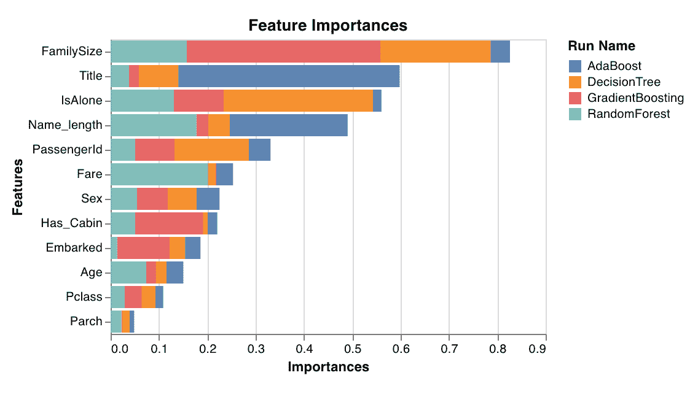

深度学习似乎最近得到了所有的炒作和所有的花哨工具。

然而，对于许多应用来说，传统的机器学习方法如提升树、线性回归和朴素贝叶斯是正确的解决方案。你不需要火箭筒，用针就可以了。

在这篇文章中，我将向你展示如何用 scikit-learn 和[权重&偏差](http://wandb.com/)来可视化和比较你的机器学习模型性能。我们还将探索这些图如何帮助我们更好地理解我们的模型，并选择最好的一个。

我们将介绍对分析分类、回归和聚类模型有用的图表。

# 数据集

我在描述泰坦尼克号乘客的[泰坦尼克号数据集](https://web.stanford.edu/class/archive/cs/cs109/cs109.1166/problem12.html)上训练了几个模型。我们的目标是预测乘客是否幸存。

在此 →，尝试生成这些图 [**的完整代码示例。
你可以在这里**](https://colab.research.google.com/drive/1j_4UQTT0Lib8ueAU5zXECxesCj_ofjw7) →，找到详细描述剧情的 [**文档。**](https://docs.wandb.com/library/frameworks/scikit)

# 分类图

## 学习曲线


学习曲线是在不同长度的数据集上训练模型，并为训练集和测试集生成交叉验证分数与数据集大小的关系图的结果。

这里我们可以观察到我们的模型过度拟合。虽然它在训练集上表现很好，但测试精度逐渐提高，但从未完全达到与训练精度相当的水平。

```
# Plot learning curve
wandb.sklearn.plot_learning_curve(model, X, y)
```

## 特征重要性


为分类任务评估和绘制每个要素的重要性。仅适用于具有“feature_importances_”属性的分类器，如树。

在这里，我们可以看到标题*(小姐、夫人、先生、主人)*高度显示了谁幸存了下来。这很有意义，因为“头衔”同时包含了乘客的性别、年龄和社会地位。奇怪的是,“姓名长度”是第二个最具预测性的特征，探究为什么会这样可能会很有趣。

```
# Plot feature importances
wandb.sklearn.plot_feature_importances(model, [‘width’, ‘height, ‘length’])
```

## 受试者工作特征曲线

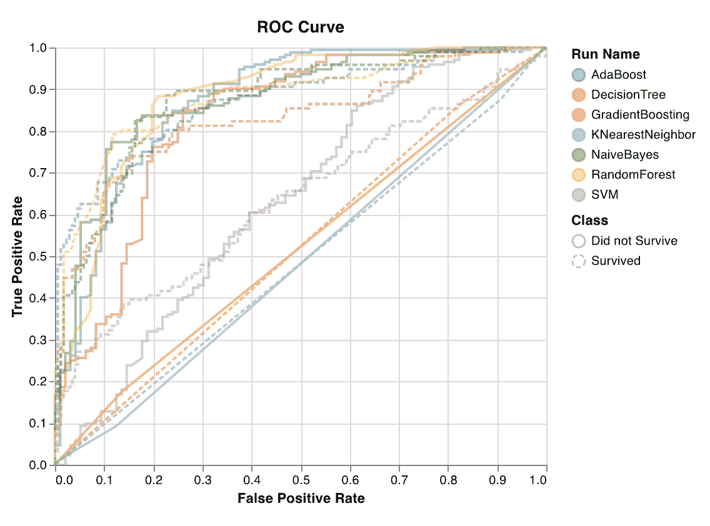

ROC 曲线绘制了真阳性率(y 轴)对假阳性率(x 轴)。理想的分数是 TPR = 1，FPR = 0，这是左上角的点。通常我们计算 ROC 曲线下的面积(AUC-ROC ), AUC-ROC 越大越好。

在这里，我们可以看到我们的模型在预测类存活方面稍好，这由较大的 AUC-ROC 所证明。

```
# Plot ROC curve
wandb.sklearn.plot_roc(y_true, y_probas, labels)
```

## 类别比例

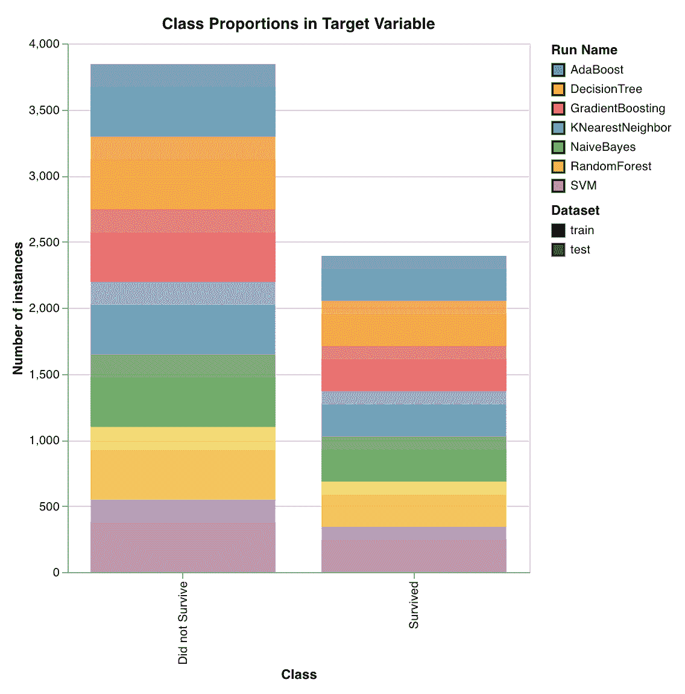

绘制目标类在训练集和测试集中的分布。用于检测不平衡的类，并确保一个类不会对模型产生过大的影响。

[](https://www.datadriveninvestor.com/2019/01/23/which-is-more-promising-data-science-or-software-engineering/) [## 数据科学和软件工程哪个更有前途？数据驱动的投资者

### 大约一个月前，当我坐在咖啡馆里为一个客户开发网站时，我发现了这个女人…

www.datadriveninvestor.com](https://www.datadriveninvestor.com/2019/01/23/which-is-more-promising-data-science-or-software-engineering/) 

这里我们可以看到，没有生还的乘客比幸存的乘客多。训练集和测试集似乎共享目标类的分布，这对于推广我们的模型输出来说是个好消息。

```
# Plot class proportions
wandb.sklearn.plot_class_proportions(y_train, y_test, [‘dog’, ‘cat’, ‘owl’])
```

## 精确召回曲线

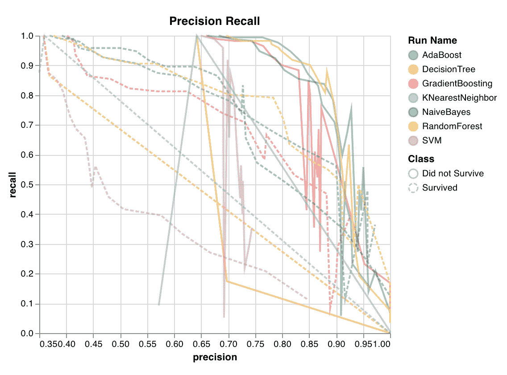

针对不同的阈值计算精确度和召回率之间的折衷。曲线下的高区域表示高召回率和高精度，其中高精度与低假阳性率相关，高召回率与低假阴性率相关。

两者的高分表明分类器正在返回准确的结果(高精度)，以及返回所有肯定结果的大部分(高召回)。当班级非常不平衡时，PR 曲线是有用的。

```
# Plot precision recall curve
wandb.sklearn.plot_precision_recall(y_true, y_probas, labels)
```

## 校准曲线

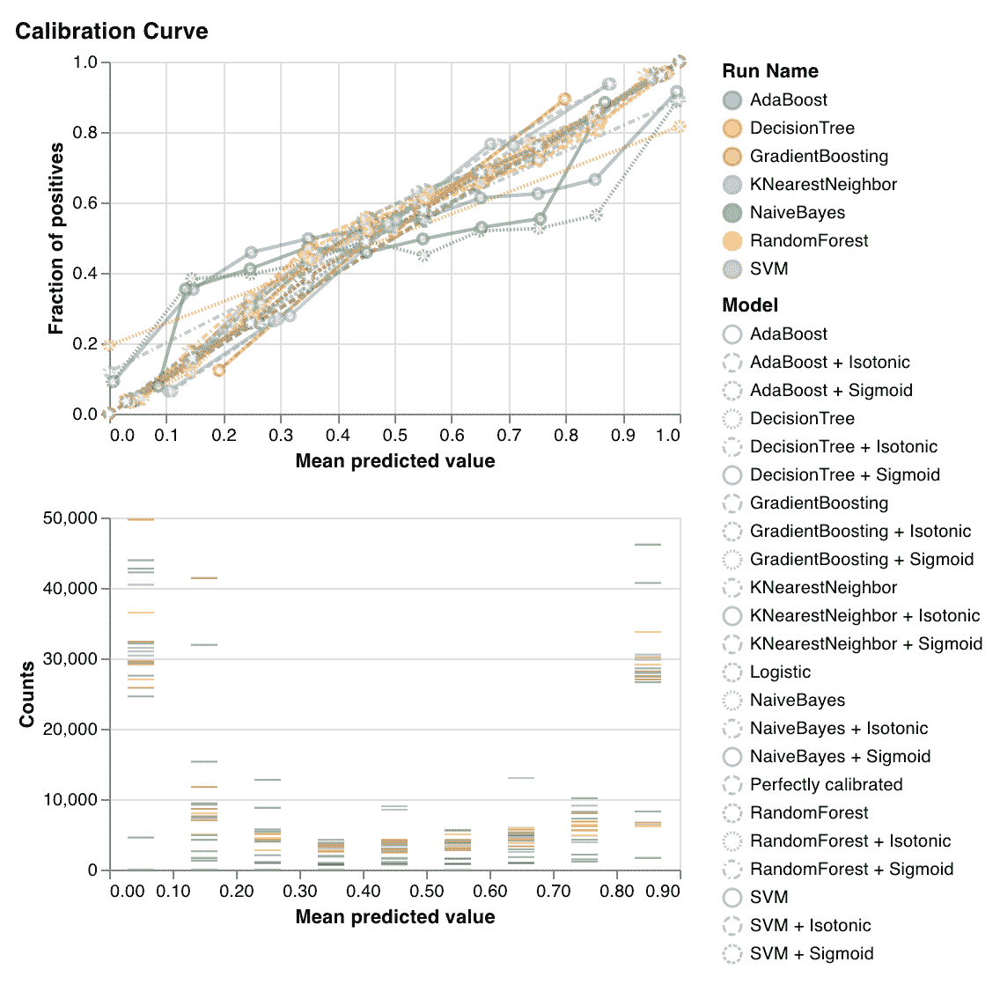

绘制分类器预测概率的校准程度以及如何校准未校准的分类器。比较基线逻辑回归模型、作为参数传递的模型及其等渗校正和 sigmoid 校正的估计预测概率。

校准曲线越接近对角线越好。转置的类 sigmoid 曲线表示过拟合的分类器，而类 sigmoid 曲线表示欠拟合的分类器。通过训练模型的等张校准和 sigmoid 校准并比较它们的曲线，我们可以找出模型是否过度拟合或拟合不足，如果是这样，哪种校准(sigmoid 或等张)可能有助于解决这一问题。

要了解更多细节，请查看 scikit-learn 的文档。

在这种情况下，我们可以看到，普通 AdaBoost 遭受过拟合(如转置的 sigmoid 曲线所示)，这可能是因为冗余特征(如“title”)违反了特征独立性假设。使用 sigmoid 校准来校准 AdaBoost 似乎是解决这种过拟合最有效的方法。

```
# Plot calibration curve
wandb.sklearn.plot_calibration_curve(clf, X, y, ‘RandomForestClassifier’)
```

## 混淆矩阵

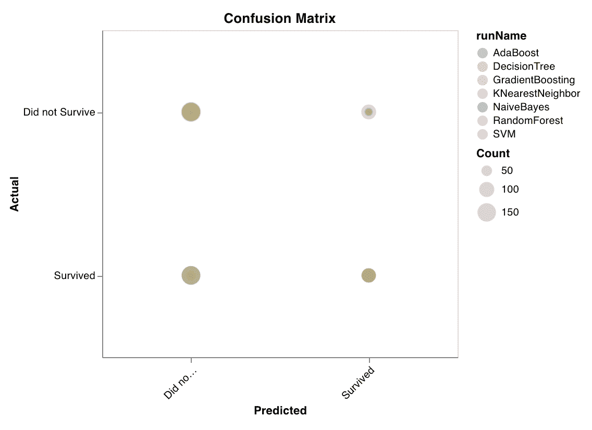

计算混淆矩阵以评估分类的准确性。这对于评估模型预测的质量以及在模型出错的预测中寻找模式非常有用。

对角线表示模型得到的正确预测，即实际标注等于预测标注。

```
# Plot confusion matrix
wandb.sklearn.plot_confusion_matrix(y_true, y_probas, labels)
```

## 汇总指标

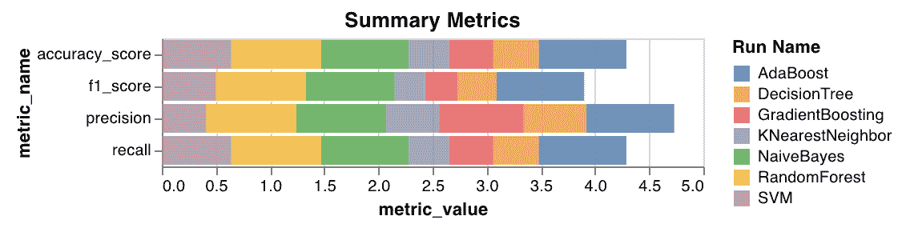

计算回归和分类算法的摘要指标(如分类的 f1、准确度、精确度和召回率以及均方差、平均绝对误差、回归的 r2 分数)。

```
# Plot summary metrics
wandb.sklearn.plot_summary_metrics(model, X_train, X_test, y_train, y_test)
```

# 聚类图

## 轮廓图

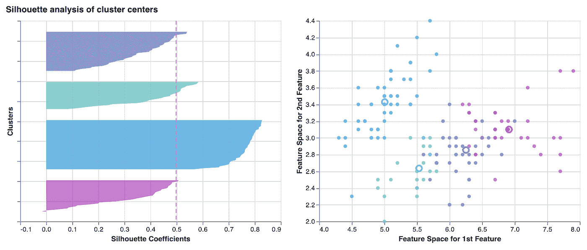

测量和绘制一个簇中的每个点与相邻簇中的点的接近程度。簇的厚度对应于簇的大小。垂直线代表所有点的平均轮廓分数。

接近+1 的轮廓系数表明样本远离相邻聚类。值为 0 表示样本位于或非常接近两个相邻聚类之间的判定边界，负值表示这些样本可能被分配到错误的聚类。

总的来说，我们希望所有的轮廓聚类分数都高于平均值(越过红线)并尽可能接近 1。我们也更喜欢反映数据中潜在模式的集群大小。

```
# Plot silhouette curve
wandb.sklearn.plot_silhouette(model, X_train, [‘spam’, ‘not spam’])
```

## 肘图

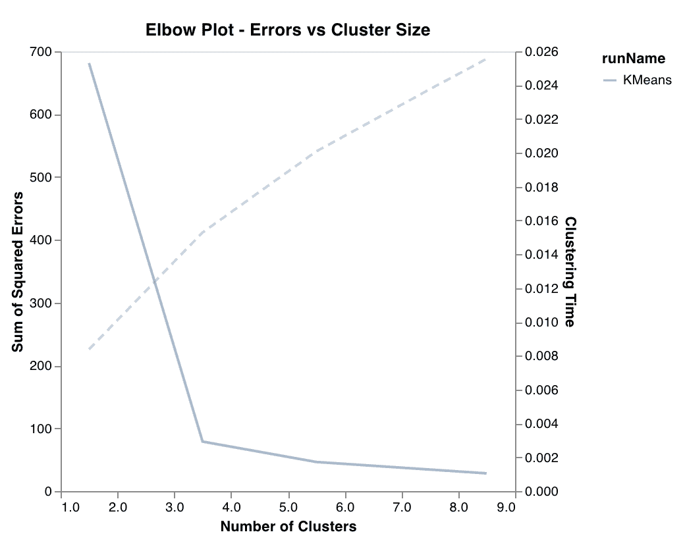

测量并绘制方差百分比，解释为聚类数和训练时间的函数。有助于选择最佳的聚类数。

在这里，我们可以看到根据肘图的最佳聚类数为 3，这反映了数据集(该数据集有 3 个类-鸢尾、杂色鸢尾和海滨鸢尾)。

```
# Plot elbow curve
wandb.sklearn.plot_elbow_curve(model, X_train)
```

# 回归图

## 异常候选图

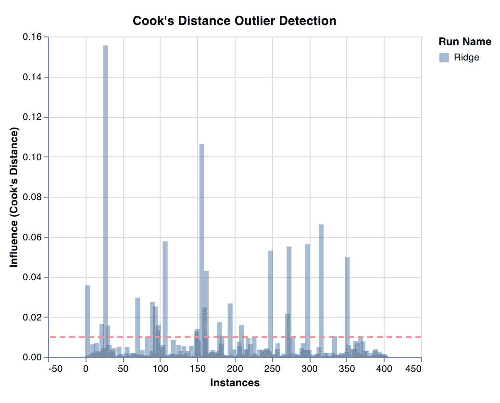

通过库克距离测量数据点对回归模型的影响。具有严重偏差影响的实例可能是异常值。适用于异常值检测。

```
# Plot outlier candidates
wandb.sklearn.plot_outlier_candidates(model, X, y)
```

## 残差图

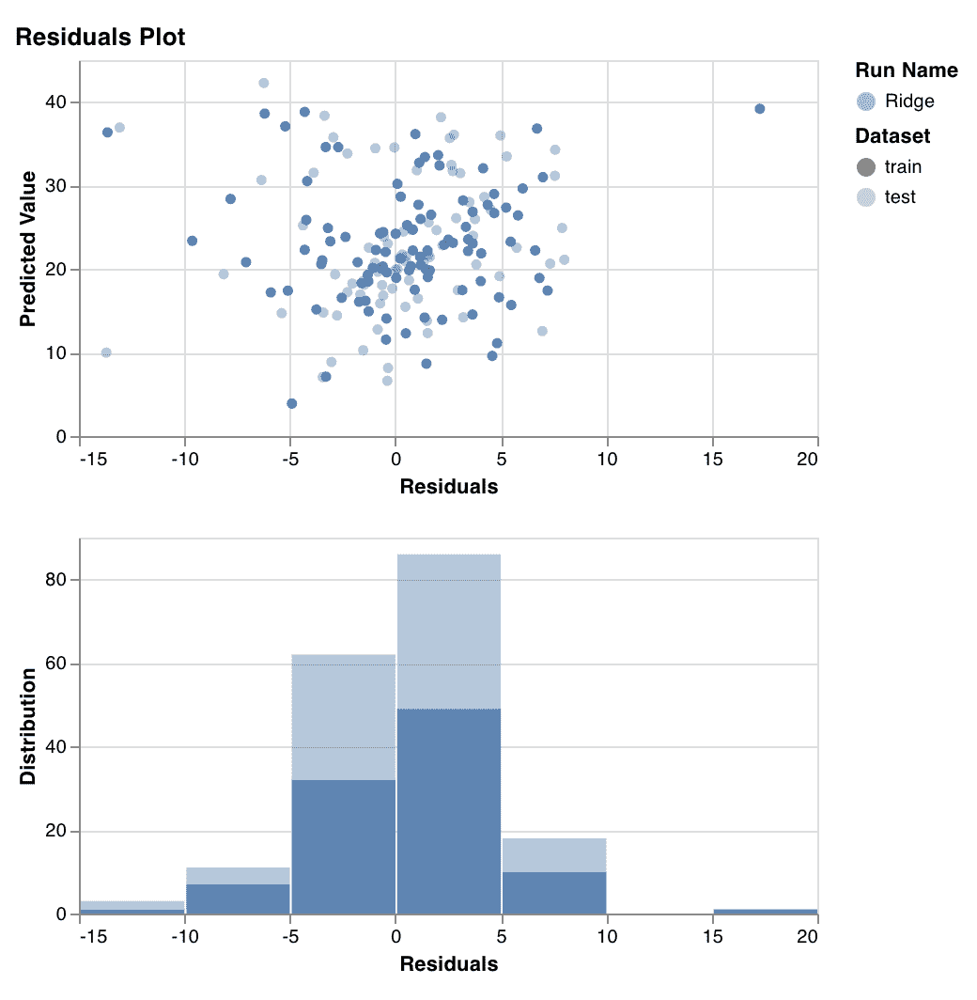

测量并绘制预测目标值(y 轴)与实际目标值和预测目标值之间的差值(x 轴)以及残差分布。

一般来说，拟合良好的模型的残差应该是随机分布的，因为除了随机误差之外，好的模型可以解释数据集中的大多数现象。

在这里，我们可以看到我们的模型产生的大部分误差在+/-5 之间，并且对于训练和测试数据集都是均匀分布的。

```
# Plot residuals
wandb.sklearn.plot_residuals(model, X, y)
```

## 汇总指标


计算回归和分类算法的摘要指标(如分类的 f1、准确度、精确度和召回率以及均方差、平均绝对误差、回归的 r2 分数)。

```
# Plot summary metrics
wandb.sklearn.plot_summary_metrics(model, X_train, X_test, y_train, y_test)
```

# 你自己试试吧

创建这些情节很简单。 [**试举一例**](https://colab.research.google.com/drive/1j_4UQTT0Lib8ueAU5zXECxesCj_ofjw7) **→**

## 步骤 1:导入 wandb 并初始化新的运行。

```
import wandb
wandb.init(project=”visualize-sklearn”)
```

## 第二步:可视化情节

```
# Visualize single plot
wandb.sklearn.plot_confusion_matrix(y_true, y_probas, labels)
```

或者一次可视化所有图:

```
# Visualize all classifier plots
wandb.sklearn.plot_classifier(clf, X_train, X_test, y_train, y_test, y_pred, y_probas, labels, model_name=’SVC’, feature_names=None)# All regression plots
wandb.sklearn.plot_regressor(reg, X_train, X_test, y_train, y_test, model_name=’Ridge’)# All clustering plots
wandb.sklearn.plot_clusterer(kmeans, X_train, cluster_labels, labels=None, model_name=’KMeans’)
```

## 你可以在这里 →，看到一个带有这些图 [**的实时仪表盘。**](https://app.wandb.ai/lavanyashukla/visualize-sklearn/reports/Visualize-Scikit-Models--Vmlldzo0ODIzNg/)**[这里试一个例子](https://colab.research.google.com/drive/1j_4UQTT0Lib8ueAU5zXECxesCj_ofjw7) →**

我很想知道你是否觉得这有用。如果你有改进的建议或者任何你想看的情节，我很乐意听听！