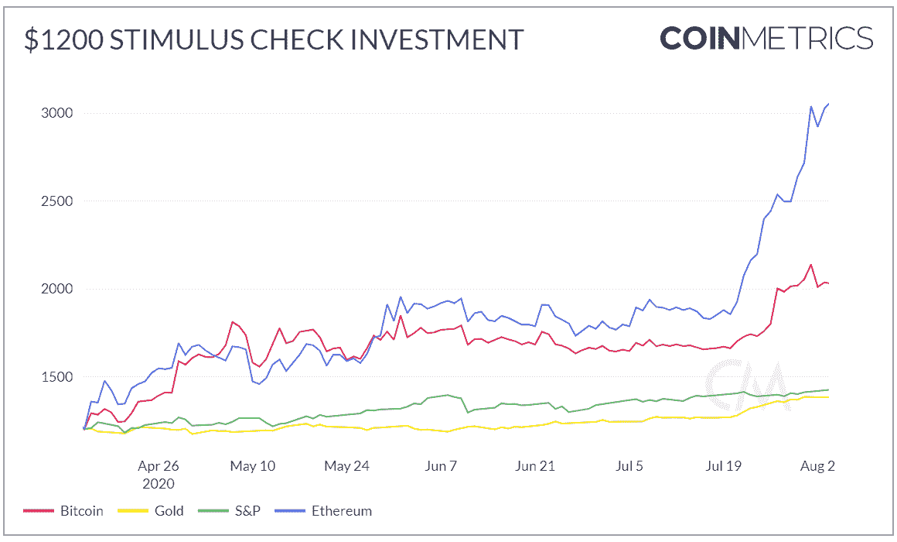
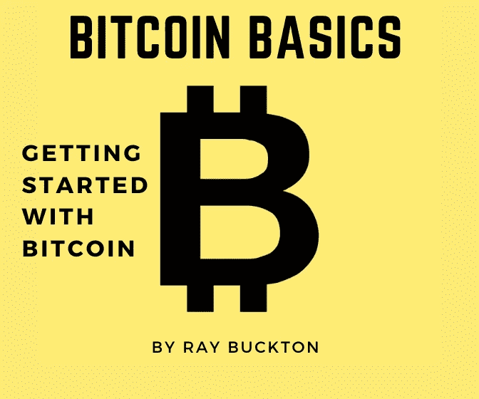

# 易变，跟随黄金，高收益—加密！

> 原文：<https://medium.datadriveninvestor.com/volatile-follows-gold-high-yield-crypto-dd6e55ae9bb1?source=collection_archive---------16----------------------->

## **DDI 加密每周节拍| 8 月 7 日的一周 Alpha 交易**

又是一个过山车周。比特币和以太坊崩盘，再次崩盘，然后反弹。与此同时，在 BTC 与贵金属相关的时候，每个人都在寻找替代收益。抓住上一期关于加密货币[**【here】**](https://medium.com/datadriveninvestor/bitcoin-rises-defi-recharges-28f162f4c86b)以及所有关于市场和经济的[**【here】**](https://medium.com/datadriveninvestor/the-last-dance-trump-deletes-tiktok-f436edac2c76)*。*

*(注意:如果您喜欢此内容，请考虑与可能从中受益的人分享。* [*订阅 DDI 简讯*](https://medium.com/datadriveninvestor) *让你不会错过任何一个节拍。)*

# 分析

Photo by Jakob Owens on Unsplash

[**隐恐&贪婪指数:**](https://alternative.me/crypto/fear-and-greed-index/)**【77—极度贪婪】(截至 2020 年 8 月 11 日)**

**看涨政权|** 链上分析公司 Glassnode 发现，93%的流通比特币(BTC) [在突破 11000 美元后进入盈利](https://www.cryptoglobe.com/latest/2020/07/93-of-bitcoin-addresses-profitable-after-btc-crossed-11000-glassnode/) 。加密空间已经一年多没这么绿了。[流通中 90%以上](https://cointelegraph.com/news/over-90-of-ether-supply-is-now-in-state-of-profit-says-glassnode)的以太坊(ETH)也在盈利。

这并没有持续很长时间，BTC 价格在接近 12，000 美元的高点后暴跌了 13%，清算了超过 10 亿美元的 BTC/美元期货合约。ETH 跳水高达 21%(在资产[两年来首次突破 400 美元](https://decrypt.co/37426/ethereum-breaks-400-for-first-time-in-two-years)后几乎没有眨眼)。自那以来，市场经历了多日反弹，BTC 和加密市场普遍波动，为日内交易者创造了成熟的环境。

当 BTC 资金从个人钱包转移到交易所时，小心获利回吐。在价格大幅上涨的情况下尤其如此。这就是在比特币最近的震荡之前[发生的事情](https://cryptobriefing.com/bitcoin-prepares-consolidate-investors-take-profit/)。现在，交易所持有的 BTC 数量最近下降了超过 12 亿美元。这可能意味着 BTC 已经进入了一个健康的盘整期，因为财大气粗的人会“买入下跌的股票”(感谢 CryptoQuant 首席执行官@ki_young_ju 为[提供的早期提示](https://twitter.com/ki_young_ju/status/1289959892187414528)。)

**爆满|** 当 DeFi 爆炸，ETH 2.0 测试网[上线](https://cointelegraph.com/news/ethereum-20-final-testnet-set-to-launch-on-august-4)时，所有人都挤进以太坊俱乐部。但是 ETH 网络堵塞的真正原因是像 Forsage 这样的大规模庞氏骗局，自 7 月中旬以来，这类骗局已经占到智能合同交易总量的 30%。

发光的都是金子。还有聪聪。 BTC 与贵金属的相关性[从未如此之高](https://cryptopotato.com/safe-haven-bitcoins-recent-rally-correlated-with-gold-and-silver/)，这为“数字黄金”的论点增添了价值。

 [## 为什么参与正确的加密交换至关重要|数据驱动型投资者

### 到目前为止，与黄金和美元相比，加密货币，尤其是比特币，已经显示出巨大的增长

www.datadriveninvestor.com](https://www.datadriveninvestor.com/2020/07/16/why-engaging-with-right-crypto-exchange-matters/) 

# 加密采用

**杰米，把那个调出来|** 乔·罗根，网络上最受欢迎的播客之一，[最近插入了](https://cointelegraph.com/news/cash-app-for-comment-joe-rogan-tells-200m-listeners-to-buy-bitcoin)一个现金应用广告，他列举了 BTC 的优点。欢迎来到派对，罗根的 2 亿订户。

生活在区块链的一面| 可口可乐的装瓶供应链[通过以太坊主网从区块链得到了推动](https://cryptonews.com/news/coca-cola-bottling-harbor-to-use-baseline-protocol-ethereum-7318.htm)。

# 每个人都想成为银行。

随着经济停滞和低利率，人们正在寻找更好的收益。另一方面，股票、贵金属和 BTC 提供了投机但无比高的回报。与此同时，美国银行监管者 Brian Brooks 认为区块链的解决方案会比该国目前的支付系统更加务实。

从散户投资者用他们的刺激支票做的事情来看，人们可能会说他们同意布鲁克斯的观点。

Credit to @AlexSaundersAU

作为先例， [**85%的意大利银行**](https://www.coindesk.com/85-of-italian-banks-are-exchanging-interbank-transfer-data-on-corda) **已经在利用区块链**进行银行间数据传输。金融机构广场[报告称，BTC 为 Q2 购买了 8 . 75 亿美元，比上一季度增长了 186%。富达数字资产也吹响了 BTC 的价值号角。该公司在一篇投资论文中表示，BTC 可以作为抵御当前不稳定的货币体系的保险。](https://messari.io/article/square-reports-875-million-in-bitcoin-purchases-for-q2-2020-up-186-from-last-quarter)

每周都有更多的公司整合区块链并提供加密货币服务，尤其是现在美国银行已经为提供加密托管服务开了绿灯。

在收购了数字资产借记卡公司 Swipe 之后，币安加密交易所将把它的加密借记卡运往欧洲。离简单加密支付的世界又近了一步。

# 政府

随着现代货币体系让几乎所有人胆战心惊，世界各国政府开始认真对待区块链，尤其是稳定的货币。

**Eastside:** 中国基于区块链的服务网络(BSN) [将于 2021 年底整合 40 条公链](https://cointelegraph.com/news/chinas-bsn-aims-to-integrate-with-40-public-chains-within-a-year)。

**Westside:** [欧盟选择 IOTA](https://www.crypto-news-flash.com/iota-chosen-by-eu-as-key-innovator-in-funding-programme/amp/) 作为其 Horizon 2020 研究计划的“关键创新者”，该计划得到了超过 800 亿€(946 亿美元)的支持。

# 黑市

虽然关于加密只不过是一个巨大的洗钱计划的旧叙述终于开始消失，但加密空间仍然充满风险。

过去几个月的主要攻击包括:

*   总账网站上的[数据泄露](https://www.ledger.com/addressing-the-july-2020-e-commerce-and-marketing-data-breach)(该公司承诺其客户的资金和信息是安全的)。
*   对 DeFi options 协议 Opyn 的一次[双花费攻击](https://cryptobriefing.com/defi-options-protocol-opyn-hacked-371000-lost/)(失窃 371，000 美元，团队承诺全额赔偿)。

中国当局逮捕了 BTC 有史以来最大的庞氏骗局 PlusToken 的 109 名成员。骗子骗了投资者大约 58 亿美元。是啊，正义！

# 挑战

我们可以每天花 24 小时来报道 DeFi 空间，我们在以前的时事通讯中已经说了很多。这次我们长话短说:锁定的总价值本周突破了 42.2 亿美元。

# 经济

阅读我们上一期的《市场和经济》以获得更深入的了解，但这里是节拍:美国 GDP 在 Q2 暴跌 32.9%，年初至今已处理的失业申请总数达到 5400 万。美元指数(DXY)跌至两年低点，相比之下，BTC 和瑞士联邦理工学院的市值几乎翻了一番。

最重要的是，美国造币厂减少了对购买者的金银币供应，以应对贵金属需求的激增。此外，新冠肺炎[极大地扰乱了贵金属的供应链。随着接触这些闪亮的东西的机会减少，股票市场处于令人鼻血的水平，以及另一轮刺激检查可能很快就会触及银行账户，这可能是 crypto 找到第二次机会的完美风暴。](https://www.visualcapitalist.com/impact-of-covid-19-on-the-gold-supply-chain/)

# 对于真正的密码技术人员来说

*   关注隐私的数字货币 Monero (XMR)为其采矿激励问题找到了解决方案。总供应量的 90%已经开采，开发商将实施“尾气排放”。阅读更多关于如何保证 XMR 网络安全的信息。
*   **直根、软叉和短叉。对于那些对 BTC 即将推出的 Taproot soft fork 以及开发者如何实现未来升级感兴趣的人来说，这里有一本好书。**
*   **SHA-256，一本入门书。对于那些已经掉进兔子洞的人，你可能知道 BTC 引擎盖下的算法。如果你正处于区块链深海潜水的早期和中期阶段，[这是一个开始的好地方](https://komodoplatform.com/sha-256-algorithm/)。**

# 找到你的优势。

[订阅 Alpha Trades Discord 服务器](https://bit.ly/2KJ1oor)，寻找专业人士的一对一指导。加入阿尔法包两天，无风险。

# DDI 编写器亮点

每周，我们都会为读者带来一些精选的故事，这些故事来自《数据驱动投资者》的朋友。

[**为什么我们都需要拥抱创新**](https://www.datadriveninvestor.com/2020/08/03/ai-blockchain-and-smart-contracts-why-we-all-need-to-embrace-innovation/) **|** “新兴技术就在现在，开始了解它们的最佳时间是昨天。”Emily NicLeò id 强调区块链是我们都应该关注的重大事件。

[**资本市场治理 101**](https://www.datadriveninvestor.com/2020/08/06/capital-markets-governance-101/) **|** 什么是资本市场？尽管花了这么多时间和精力来简化，为什么它们还是这么复杂？分布式总账系统(DLT)如何解决这些低效问题？经验丰富的衍生品交易员 STéphane revere 为外行人解答了这些问题。

[**长期购买比特币的 9 个理由**](https://medium.com/datadriveninvestor/9-reasons-to-buy-bitcoin-for-the-long-run-8d8c9b5b352) **|** BTC 和加密可能是一场赌博，但美联储不会羞于把所有筹码都放在桌面上。托尼·科拉扎认为，冒这个险可能是值得的。

[**拜占庭将军问题用区块链解决**](https://medium.com/datadriveninvestor/the-byzantine-generals-problem-solution-using-the-blockchain-31eb5318f37f) **|** [文斯·塔宝拉](https://medium.com/@vincetabora)论述了区块链的一个核心价值。

# 观看表演

我们在 Alpha Trades 的朋友们本周深入研究了市场、密码和经济。通过最近的剧集找到你的优势:

[趁着比特币不等，Altcoins 党！|在 BTC 购买 dip 的地区](https://www.youtube.com/watch?v=-lbZdPE6sgc)

[这是我的比特币交易计划|链接交易场景](https://youtu.be/4thGJ9-Uh68)

[美国股市|轮动成价值股？|花旗集团、OKTA、Fastly、Everquote、Shopify](https://youtu.be/URvst_KPyoA)

# 比特币到底是什么？

比特币被一些人誉为“数字黄金”，被另一些人誉为“纯粹的货币”，对许多人来说，它意味着许多东西。 [**比特币基础知识:比特币入门**](https://www.amazon.com/dp/B08FBP9W4Y) 帮助你开启比特币之旅。

这本书将帮助你对构成比特币的**基本概念**感到舒适，无论你是寻求被告知还是**准备好亲自参与**比特币。**了解比特币网络的关键特征**，解释比特币如何从一个人转移到另一个人，探究**比特币的历史**，等等。

# 放弃

数据驱动投资者(DDI)提供的信息不用于做出任何金融决策，也不是购买、持有和/或出售特定证券或金融工具的请求或建议。

Alpha Trades，LLC 提供的信息不用于制定任何财务决策，也不是购买、持有和/或出售特定证券或金融工具的请求或建议。

访问 Alpha Trades 的完整服务条款:[https://bit.ly/3faVeeV](https://bit.ly/3faVeeV)

**访问专家视图—** [**订阅 DDI 英特尔**](https://datadriveninvestor.com/ddi-intel)