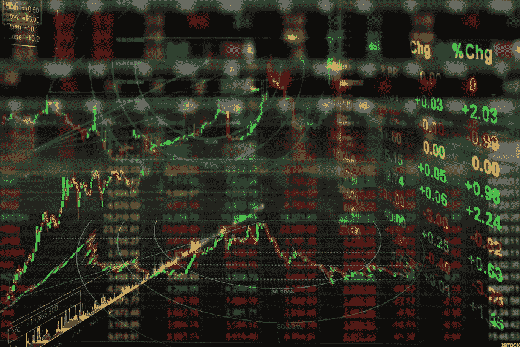

# 如果你是平均成本，波动是你的朋友

> 原文：<https://medium.datadriveninvestor.com/volatility-is-your-friend-if-you-dollar-cost-average-20df00deffc?source=collection_archive---------2----------------------->

市场现在有点恐慌。供应链和旅游业正因新冠肺炎疫情而陷入混乱，并可能在未来几个月(甚至更长时间)继续如此。一场衰退，或者至少是一次大的减速，可能会发生。

在撰写本文时，SPY(追踪标准普尔 500 的最大 ETF)在过去一个月下跌了 11%以上，而 VIX(波动指数)却飙升。

> 当看到市场陷入恐慌时，你的第一反应是恐慌

11%并不是一个特别的下降。如果你只是在过去五年里投资，可能会有这种感觉，但实际上，自 1945 年以来，****已经有 80 次 5-10%的回调，现在有 30 次 10-20%的回调。真正罕见的情况是超过 40%。自二战结束以来，这种情况只发生过三次。****

****

**当看到市场陷入恐慌时，你的第一反应是恐慌。"我应该卖出并减少损失吗？"以及“如果市场变为零呢？”可能是目前两种流行的想法。这两个问题的答案当然都是否定的。不要因为很多人不理智，就做出不理智的行为。**

**你应该做的，如果这是你的计划，继续这样做，是美元成本平均(DCA)到你的退休帐户。像这样的时刻是这些计划值得的原因。从长远来看，波动是你的朋友。**

** [## 算法交易的机器学习|数据驱动的投资者

### 当你的一个朋友在脸书上传你的新海滩照，平台建议给你的脸加上标签，这是…

www.datadriveninvestor.com](https://www.datadriveninvestor.com/2019/01/30/machine-learning-for-stock-market-investing/) 

下面，我将谈谈为什么你应该继续在低迷的市场中兑现你的薪水。但是首先，顺便说明一下为什么你应该*永远不要*一次性付清。

# 跟着数字一起算

如果你得到一大笔遗产，卖掉一栋房子，或者任何其他你突然手头有一吨现金的事情，不立刻投资是合乎逻辑的。如果我买入后市场马上崩溃了怎么办？成捆做不是更安全吗？

嗯，不。你可以从 Nick Magguilli 这里查看更深入的分析，他分析了背后的所有数字，但 95%的情况下 DCA 策略的表现都不如一次总付策略。增量购买可能会让人感觉安全，但对你的投资组合来说，这通常没什么好处。

然而…

# 大多数人不会进行一次性投资

大多数个人投资者(我希望如此)每两周都会通过他们的 401k 计划或个人退休账户将资金投入股市。这种一致性是由按月或两周支付工资的公司推动的。

> 立即停止任何 DCA 策略将是最糟糕的选择，即使它感觉很安全

因此，除了年度奖金，我们大多数人都采用 DCA 策略进行投资。当股票向右上涨时，这必然会滞后于市场，因为当你增加资金时，它的估值会更高。

但是如果我们颠倒这种情况，当股票下跌 10%、20 %,或者在极少数情况下，甚至 40%,你是在以更低的估值买入股票市场，从而增加了更高的长期回报的可能性。立即停止任何 DCA 策略都将是最糟糕的选择，即使它看起来很安全。当然，股票可能会再跌 15%，但你(希望)仍然每个月都能拿到薪水，所以你仍然会以很低的倍数投资。**没有风险就没有风险溢价**。

(请查看[本·卡尔森 2018 年末的帖子](https://awealthofcommonsense.com/2018/10/a-lost-decade-of-dollar-cost-averaging/)，了解更多 DCA'ing 统计数据)

我想我想说的是:持有现金，试图把握市场时机，或者等待底部已经被证明是不可能的。不要让恐惧左右你的决定，确保你明白在低迷时期持有现金时，你在统计上错过了什么。**