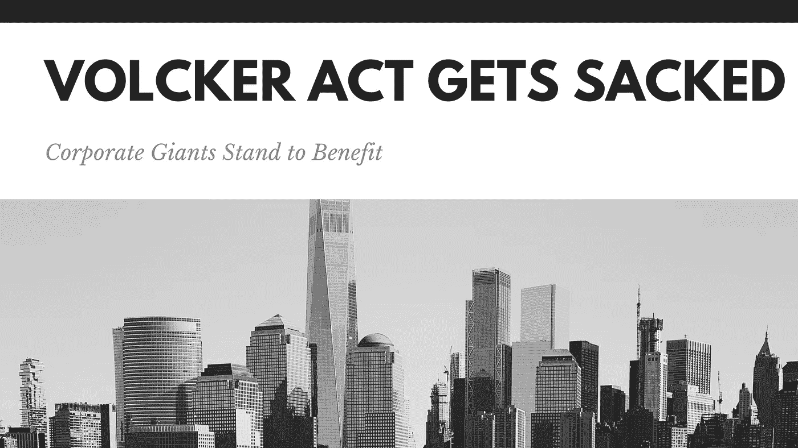

# 沃尔克法案被解雇，企业巨头受益|数据驱动的投资者

> 原文：<https://medium.datadriveninvestor.com/volcker-act-gets-sacked-corporate-giants-stand-to-benefit-data-driven-investor-54a8af0b8adb?source=collection_archive---------22----------------------->

## 不出意外的话，演出必须继续。

@jordanmerrick via Unsplash

金融市场极其复杂。虽然在某种程度上可以由中央政府来管理，但人鼠计划往往会出问题。各个国家的监管机构起草了数万页的金融法规，以最大限度地减少金融市场中的欺诈和惩罚不道德行为。不幸的是，这些各种各样的法规的复杂性和偶尔的冲突性经常给那些财力雄厚的大机构以可乘之机。大多数较小的机构和个人缺乏准确解释这些漏洞的金融手段，导致不对称的结果。

 [## 如果资本主义失败了，那么还有什么选择呢？数据驱动的投资者

### 在当前政治领域的修辞之旅中，我们都可以面对面地接触到流行词汇，如…

www.datadriveninvestor.com](https://www.datadriveninvestor.com/2020/03/16/if-capitalism-is-a-failure-then-what-is-the-alternative/) 

最近，[多德-弗兰克法案第 619 条，也被称为沃尔克规则，出于澄清的目的被扩充](https://www.fdic.gov/news/volcker-6-25-20.pdf)。多德-弗兰克法案(Dodd-Frank Act)是在 2008 年大金融危机(GFC)后出台的，旨在更有效地监管金融市场以防止另一场连锁崩溃。虽然沃尔克规则仍然不允许自营交易，但它现在允许银行为信用良好的投资基金提供资金。 [**【点击继续阅读……】**](https://www.datadriveninvestor.com/2020/06/30/volcker-act-gets-sacked-corporate-giants-stand-to-benefit/)

*原载于 2020 年 6 月 30 日 https://www.datadriveninvestor.com**[*。*](https://www.datadriveninvestor.com/2020/06/30/volcker-act-gets-sacked-corporate-giants-stand-to-benefit/)*

## *访问专家视图— [订阅 DDI 英特尔](https://datadriveninvestor.com/ddi-intel)*