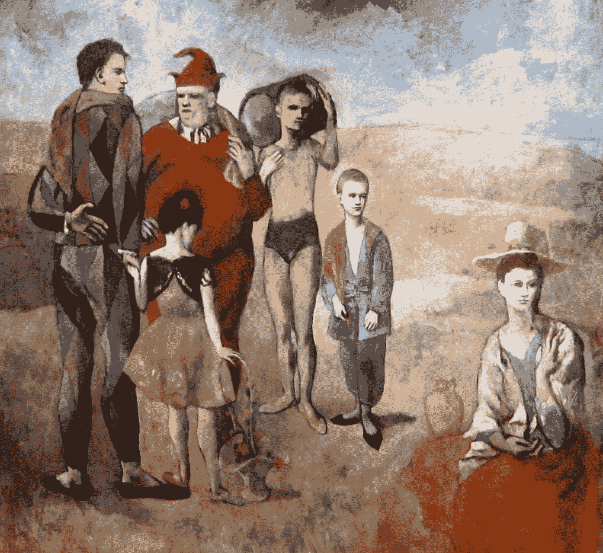

# 最好的 VTS:紫苏·哈米尔访谈

> 原文：<https://medium.datadriveninvestor.com/vts-with-the-best-an-interview-with-suzi-hamill-c12cf37f3635?source=collection_archive---------18----------------------->

上周，我写了一篇关于视觉思维策略(VTS)的文章，这是一个利用艺术来教授视觉素养、思维和沟通技巧的过程。

VTS 通常用于小学教室，现已进入企业环境，帮助个人和团队建立和加强他们解决问题和批判性思维的技能、沟通和协作的能力，以及传递和接收反馈的效率。

虽然我在那篇文章中尽了最大努力去捕捉 VTS 的原因、内容和方式，但是向专家学习是无可替代的。这就是为什么我邀请[紫苏·哈米尔](https://www.linkedin.com/in/suzanne-hamill-b6a8a02/)，富达公司前设计思维负责人，也是将我介绍给 VTS 的女士，分享她使用该工具的经验。

**你好，紫苏。感谢您今天分享您的 VTS 智慧和经验。我知道你最近做了不少 VTS-ing。**

紫苏:是的！就在几个月前，我在牛津大学指导 30 位来自大型跨国公司的首席营销官如何将视觉思维策略应用到他们的工作和团队中。就在上周，我和美国西海岸的一群女性开了一个会议。

这是我发现 VTS 最吸引人的地方之一。它的创建是为了帮助人们学习艺术，并被设计用于学校，但它可以在各种各样的业务中产生如此强大的影响。

紫苏:绝对是。在商业环境中，有大量的系统和大量的问题，每个人对正在发生的事情都有自己的解释。(想象一下，医生对诊断进行深思熟虑，投资分析师对公司的内在价值进行辩论，零售商预测下一个时尚趋势……)这就产生了冲突。你如何将一系列的人和想法聚集在一起，以打造最佳的前进道路？VTS 是一个伟大的，简单但严谨的方法来帮助商业团体解决大问题。VTS 是与不同人群进行开放式探索性对话的一种方式

在非常注重执行的组织中尤其如此。通常，组织没有时间、空间或习惯来处理模糊性。VTS 为歧义和对话打开了空间。它允许人们探索想法，犯错，并听到不同的观点。

**所有这些行为对于做出好的商业决策都是必不可少的。我在想，你有没有发现，有些人比其他人更需要“允许”？**

**紫苏:**我认为每个人都可以从 VTS 体验中受益，在某些情况下，这种体验可能会带来变革。

我们经常被教导不要质疑权威。但在挑战权威和理解观点之间有一个微妙的平衡。在富达，我们的第一个实验侧重于当房间里出现电力不平衡时，用它作为一种促进公开对话的方式。我们向大约 100 人的设计团队推出了 VTS，以帮助初级设计师与首席执行官或高级管理人员谈论他们的工作，而不是进行防御。我们训练他们问 VTS 问题，特别是“你看到了什么让你这么说？”我们发现这是设计师学习如何获得设计反馈的好方法。

一旦我们开始在 VTS 方面取得成功，它就被整合到富达针对前 100 名潜在领导者的 6 个月培训计划中。

这就是我们发现的下一种情况——在领导团队中使用 VTS。我们发现，VTS 作为一种实用的方式来介绍你现在不仅仅是一个实干家，你还是一个思想家，因此，你将面临模糊性。不要回避它，你需要看到模糊性不仅是好的，而且是我们发展业务的沃土。

那很好，但是我们都知道，仅仅因为你在培训中学到了一些东西并不意味着你在现实生活中真的做到了。你见过变形战斗机跳跃吗？让人们从知道走向行动？

在富达，我们会 VTS 客户研究。我们会更多地使用 VTS 的原理，而不是遵循严格的方法。我们会把我们的研究贴在墙上——便利贴、客户照片、流程图，所有的东西，我们会让利益相关者参与进来，利用 VTS 流程梳理出见解。在我们告诉人们思考什么之前，我们给他们时间去观察和内化他们所看到的。通过提问，我们会发现他们在解释什么，识别无意识的偏见，并了解他们已经知道或想要知道的关于客户的信息。

在牛津的活动中，我们对商业模式画布进行了视频录制，因为大多数 CMO 对此并不熟悉。仅仅通过看它，他们就梳理出它的用途，什么是重要的，什么是不重要的，什么是令人困惑的，什么是行不通的。他们带着对其意义的更深刻的内在化离开了

**VTS 是如何做到的？帮助人们快速内化新的见解或行为？**

**紫苏**:我能解释的最好的方式就是 VTS 就像瑜伽。当你教一个人瑜伽时，通过持续的练习，他们会有更好的姿势，走路和移动流畅而有力。因此，当他们度过一天时，他们会更加注意自己的姿势并进行调整，但他们不会进入一个完整的 vinyasa 流。

VTS 是相似的，因为当你对人使用它时，你在教授对话的机制，使用证据来进步，管理模糊和冲突。

梳理这个过程的力量需要时间，但最终，我看到它帮助人们认识到，你不必马上同意或不同意。相反，它给了他们表达意见的空间，并教会他们以一种心理上安全的方式提问和寻求证据。

好的，但是这和问 3 个 VTS 问题一样简单吗？

**紫苏**:但愿如此。你需要一个有经验的主持人，他能让团队继续前进，探索新的想法。

领导者知道他们应该刺激谈话…征求他人的意见，但他们不知道如何去做。在会议中，领导者会表达自己的观点，依靠最响亮的声音，引导对话。人们会察觉到这些信号。他们会停止探索，专注于给出正确的答案。

通常，当人们开会议时，他们会努力参与。但那就像试图在水下呼吸一样。你不能促成和参与。

**你学了什么&应用了？**

紫苏:如果你想让人们参与到精彩的对话中，试着先给他们一些东西看看。可以是比喻，也可以是真实的反映。但是给他们一些具体的点来锚定他们的想法。

在人们说话或行动之前，给他们时间去观察和思考。沉默是金。沉默不是敌人。给人时间默默观察一些东西。即使是 1 分钟，人们的反应也会有很大的不同。

你不需要称赞人们的想法来让他们参与进来。向他们要求更多…你看到了什么让你这么说？我们还能找到什么？人们不经常被询问他们的意见。光是这个动作就非常吸引人。

作为一名领导者，把显而易见的东西摆在桌面上同样重要，这样你才能获得真正的洞察力。

**了解更多有关 VTS 的信息或亲身体验…**

*   阅读菲利普·耶纳温的书， [*视觉思维策略:利用艺术深化跨学校学科的学习*](https://www.amazon.com/Visual-Thinking-Strategies-Learning-Disciplines/dp/1612506097)
*   请访问 VTS 网站查看[每日图像](https://vtshome.org/daily-image/)
*   访问纽约时报学习网[“这张图是怎么回事？”](https://www.nytimes.com/column/learning-whats-going-on-in-this-picture)因为“有趣的时报图片被剥去了说明文字，并邀请学生现场讨论。”
*   **联系** [**紫苏哈米尔**](https://www.linkedin.com/in/suzanne-hamill-b6a8a02/) **体验 1 小时 VTS 课程**

*Robyn M. Bolton 是 MileZero 的创始人兼首席导航员，她与大型组织的高管合作，超越创新理论和戏剧，以释放组织的潜力，创造真正的变化，并获得真正的结果。你可以在*[*www . mile zero . io*](http://www.milezero.io/)了解更多关于她的信息和她的作品

*原载于 2020 年 6 月 18 日*[*https://www . mile zero . io*](https://www.milezero.io/2020/06/18/vts-with-suzi-hamill)*。*