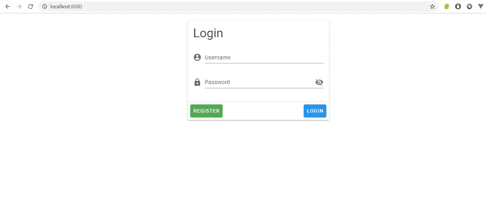

# 对任何创作者都有吸引力

> 原文：<https://medium.datadriveninvestor.com/vuetify-for-any-creator-ea7933d1fbda?source=collection_archive---------6----------------------->

## 如何用最少的编程和设计知识创建漂亮的网站？


Photo by [Halacious](https://unsplash.com/@halacious?utm_source=medium&utm_medium=referral) on [Unsplash](https://unsplash.com?utm_source=medium&utm_medium=referral)

在这个美丽而简单的网站时代，仅仅拥有一个功能简单的网站是远远不够的。虽然网站的后端功能可以保持不变，但必须牢记视觉设计并确保最佳的用户体验。这可能很难，尤其是如果你不是一个真正的设计师。幸运的是，我们有*设计系统*，这是确保一致和适当的用户体验的基本准则。你可能听说过一些流行的设计系统，如 Bootstrap、布尔玛和 Material Design。

*材料设计*是谷歌推广的一个系统，包含了谷歌的设计方针和原则。有了素材设计的帮助，做一个过瘾又好用的网站变得极其简单。虽然看起来创建一个 CSS 文件并将其包含在您的应用程序中可以完成工作，但它并没有充分利用可用的设计功能。这就是为什么 *Vuetify* 被创建的原因，它是一个 Vue 组件库构建，将材料设计考虑在内。

[](https://www.datadriveninvestor.com/2020/07/23/learn-data-science-in-a-flash/) [## 一瞬间学会数据科学！？数据驱动的投资者

### 在我之前的职业生涯中，我是一名训练有素的古典钢琴家。还记得那些声称你可以…

www.datadriveninvestor.com](https://www.datadriveninvestor.com/2020/07/23/learn-data-science-in-a-flash/) 

对于用 Javascript 制作网站来说， *Vue* 是初学者的最佳选择，因为它非常简单，并且允许你在同一天创建专业外观的网站。Vuetify 使它变得更加简单，并添加了能够打动任何用户的组件和设计项目。

在本文中，我将演示如何轻松地创建一个像 Google 使用的登录模块。当你看到代码时不要害怕，它非常简单，你会很快学会的。

# 入门指南


Photo by [Gia Oris](https://unsplash.com/@giabyte?utm_source=medium&utm_medium=referral) on [Unsplash](https://unsplash.com?utm_source=medium&utm_medium=referral)

在开始之前，如果你以前从未使用过 Vue，我们将需要安装一些东西，这应该不是那么复杂。首先，下载 NodeJS，我们将需要它来安装软件包。去官网按照步骤下载就行了。

其次，打开终端或命令提示符，键入:

```
npm install -g @vue/cli
```

就这样，现在我们有了 Vue，我们可以开始制作我们的第一个网站了。

# 准备项目



(Image by the author)

在本文结束时，您将能够创建以下内容。

首先，让我们先创建我们的项目。在控制台中键入:

```
vue create login_project
```

现在，按 Enter 键选择默认设置。一旦设置完成，我们将导航到正确的文件夹，并添加默认预设的 Vuetify。第三个命令将启动我们的网站，所以我们可以看到我们正在改变什么。

```
cd login_project
vue add vuetify
npm run serve
```

要查看您的网站，请在任何浏览器中键入“localhost:8080”。在 Visual Studio 代码或任何选择的 IDE 中打开您的项目。打开 App.vue，这是我们程序的起点。然后，删除模板中的所有内容。从这里我们有一个干净的页面，我们可以制作我们的登录屏幕。

我们放在模板括号里的东西会被编译。脚本括号包含我们项目的组件。

# 编码


Photo by [Florian Olivo](https://unsplash.com/@florianolv?utm_source=medium&utm_medium=referral) on [Unsplash](https://unsplash.com?utm_source=medium&utm_medium=referral)

现在我们可以添加项目所需的元素。为了让文章尽可能简单，请跟随 GitHub 资源库，从这里您只需要 App.vue 文件。首先，在 **v-app** 内增加一个 **v-card** 。这是一个包含我们所有元素的容器，因此我们将能够轻松地管理一切。

现在添加一个 **v-card-title** ，这将使我们的页眉看起来漂亮整洁。接下来，使用 **h1 在其中放置一个 header 元素。**

接下来，我们要添加正文以及用户名和密码字段。 **V 型卡片-文字**和 **v 型**将使其看起来美观清晰。 **V 文本字段**就是我们的文本。您可以注意到，根据材料设计标准，标签变得小了一点，并且上升了。

```
<v-card-text>  
  <v-form>    
    <v-text-field label="Username" />    
    <v-text-field label="Password" />  
  </v-form>
</v-card-text>
```

通过将 **type="password"** 添加到标签前的密码字段，我们的输入将被隐藏，它将成为一个正确的密码字段。

现在，我们可以在代码中添加一些功能。 **v-card-actions** 将存放我们所有的功能部件。我们只需添加一个 **v 型按钮**并给它一个颜色。V-spacer 将使我们的按钮很好地分离。

```
<v-card-actions>  
  <v-btn color="success">Register</v-btn>  
  <v-spacer></v-spacer>  
  <v-btn color="info">Login</v-btn>
</v-card-actions>
```

到目前为止，我们应该有一个很好的登录界面，我们已经完成了很多。我们可以添加图像到我们的领域，并添加一个“显示密码”按钮。这个按钮可以让用户随时隐藏和显示密码。为此，我们添加了一个点击监听器和一个基于它的条件。

添加图标很简单，我们可以通过对文本字段进行以下修改来完成。

```
<v-text-field label="Username" prepend-icon="mdi-account-circle" />
<v-text-field type="password"label="Password" prepend-icon="mdi-lock" />
```

随着可视性眼图标及其功能的增加，事情变得有些棘手。就像在任何一个谷歌服务登录界面一样，你可以在右边看到一只眼睛，让你的密码可见。我们可以通过一些修改来实现它。首先，我们需要稍微修改一下**脚本**部分的代码。

在**导出默认**后，我们需要放一个逗号并添加**数据**。在这里我们可以存储所有的变量。为了这个项目的目的，我们只需要一个。这将允许系统知道是否显示密码。最初，我们将它设置为 false，这样它在默认情况下是隐藏的。

```
data: () **=>** ({
  showPassword: false
})
```

其次，我们需要再次修改密码文本以添加图标，并基于 showPassword 变量设置它。这部分有点棘手。之前，我们已经将类型设置为“密码”，因此它永远不可见。现在，我们希望能够改变这一点，所以我们添加了一个冒号，这意味着它将在每次发生事情时被修改。Append-icon 将添加眼睛图标，根据 showPassword 变量，它将被设置为正常的眼睛或交叉的眼睛。最后，如果我们点击图标，它会变成相反的。试着看看它是如何工作的。

```
<v-text-field
  :type="showPassword ? 'text' : 'password'"
  label="Password"
  prepend-icon="mdi-lock"
  :append-icon="showPassword ? 'mdi-eye' : 'mdi-eye-off'"
  @click:append="showPassword = !showPassword"
/>
```

# 结论

Vuetify 和材质设计可以让任何人快速变成专业的 UI 设计师。从简单的事情开始，比如我在本文中演示的登录屏幕，很快你就可以创建任何你想要的东西。应用程序开发人员正在尽最大努力简化网站创建和设计的过程，所以现在是开始的最佳时机。享受过程，祝你旅途好运！

# 教程的完整代码

[](https://github.com/sharrik21/vuetify_login) [## sharrik21/vuetify_login

### 在 GitHub 上创建一个帐户，为 sharrik21/vuetify_login 开发做贡献。

github.com](https://github.com/sharrik21/vuetify_login) 

**进入专家视角—** [**订阅 DDI 英特尔**](https://datadriveninvestor.com/ddi-intel)