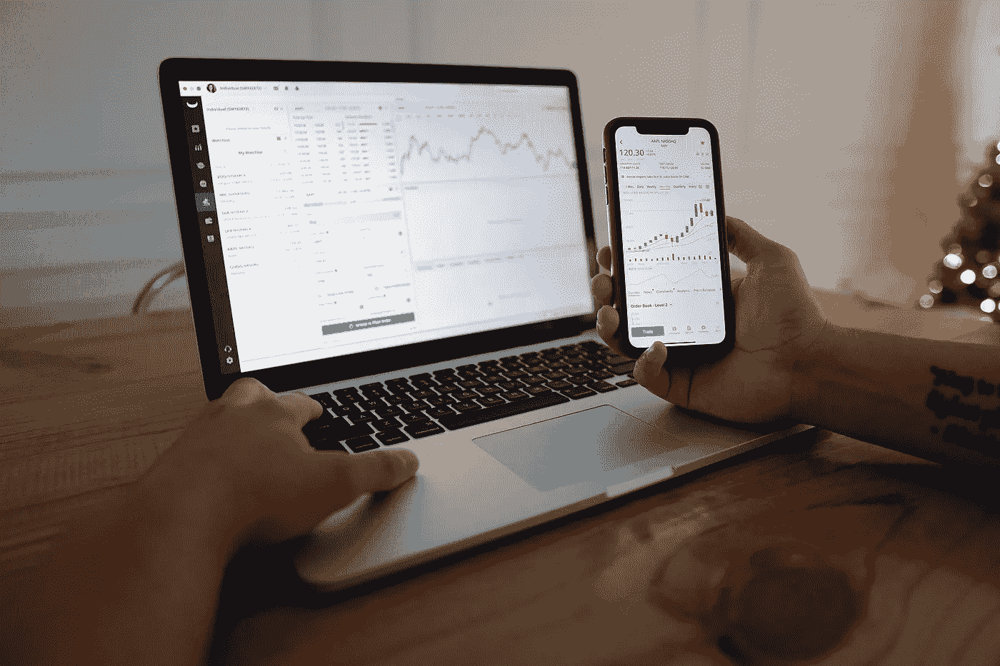

# 华尔街，忘记你学到的有效市场假说

> 原文：<https://medium.datadriveninvestor.com/wall-street-forget-what-you-learnt-about-efficient-market-hypothesis-fa47f6451148?source=collection_archive---------14----------------------->

资本市场的民主化正在打破传统的交易策略，并显示出正在崛起的散户投资者的超级力量。

Stock trading has become the new IG story. Credits: Pixabay Free for commercial use image

**什么是有效市场假说？你为什么要烦恼呢？**

有效市场假说是由著名的加州大学教授、诺贝尔经济学奖获得者尤金·法马推广的金融市场理论。他在 1970 年的论文中概述了如何根据市场信息的可用性将金融市场分为三种类型。

**A .弱式有效市场**——这个市场反映的资产价格捕捉了所有投资者可获得的历史信息。换句话说，市场根本不考虑未来的增长。市场中的每一个参与者，无论是散户投资者还是机构投资者，都没有人占上风。因此，没有真正隐藏的阿尔法可供投资者追逐。随着电子交易和计算机使数据处理更快、更准确，这样的市场实际上已经不复存在了。

**B .半弱式有效市场** -该市场反映了捕捉历史数据和公开预测数据的资产价格。换句话说，这代表了考虑了增长因素的市场，有些市场定价为较高的增长率，有些市场定价为较低的增长率。这里有一些好的阿尔法可以追逐，这取决于每个玩家对未来的展望。这也是所谓的“理性市场”的立足点。

**C .强式有效市场-** 该市场反映的资产价格不仅包含历史数据和公开数据，还包含非公开的重要信息，即“内幕信息”。尽管利用“内幕信息”进行交易会让美国证券交易委员会(SEC)上门，但这种市场类型的一种形式可能存在于流动性非常差、难以找到信息的私人资产市场。

将以上三种类型结合在一起，就是资产定价中的另一个概念，叫做**随机游走理论**。根据这一理论，资产价格是随机的，很难预测。当买方和卖方同意交换他们的商品或服务以换取金钱时，市场就形成了。想想全世界有多少这样的人。此外，想想每个人如何看待金融工具的价格。同样的 AAPL 股票对市场上的某个人来说可能值 20 美元、40 美元或 2000 美元。这正是这个理论所展示的。

为什么你现在才读到一些资产定价理论？今天每个人都在谈论 Gamestop、黑莓、AMC theatres 和诺基亚，以及它们的股票在市场上前所未有的上涨。这里发生的事情是这两种理论的经典例子。

你可能会问，怎么做？

在 GameStop 的情况下，该公司的表现相当糟糕。财务状况一塌糊涂。当管理层正努力通过让新人进入董事会来扭转公司局面时，两家对冲基金注意到了这一点。他们已经做了多年的基础研究(使用自由现金流模型、倍数估值、蒙特卡洛模拟等复杂模型对 Gamestop 的股价进行金融建模)。)并认定这支股票的价格会进一步下跌。带着满满一口袋的现金，他们决定通过卖空这家濒临破产的公司来快速获利，也就是借入股票，在市场上出售，等待价格下跌，然后以更低的价格买回。这是相当冒险的动量交易。它的上升空间有限(在股价跌至 0 美元之前，它们永远不会是负数)。所以他们的行为符合 b .半强有效市场假说。

他们一点也不知道，一群手里有几千英镑闲钱的散户投资者正伺机推翻对冲基金的押注。在一个鲜为人知的 reddit 帖子 r/ [WallStreetbets](https://www.reddit.com/r/wallstreetbets/) (几年前我加入时它只有几千人，今天它有大约 320 万会员)正在关注这些被严重做空的股票。这就是随机漫步理论的用武之地。这些小投资者中的每一个都意识到，他们可以聚集力量，驾驭市场(或从对冲基金的蛋糕中分得一杯羹)。他们开始下期权订单，以不同的*价格(随机价格，除了在这种情况下价格越来越高)购买股票，导致他们的做市商(交易平台)开始购买这些期权的未来结算。最终，这推动股价上涨，并做空(因为价格上涨而不是下跌)对冲基金(又名大败)。*

为什么这对华尔街来说是疯狂的？

在过去的一年里，华尔街第一次(但不是唯一一次)意识到，公司使用的交易策略可能会被一群相当无知的散户投资者颠覆。 ***单个散户投资者的举动无法左右市场，但随着市场民主化程度的提高，随着 Robinhood 等易于使用的交易工具、零佣金定价以及强大的社交媒体覆盖范围的出现，经过充分研究的传统机构策略失败了，散户投资者正在成为一股强大的市场力量。***

多年来，华尔街公司采取了类似的“激进投资者”策略来拥抱大公司，或通过大量机构交易使股票价格暴跌。卡尔·伊坎(Carl Icahn)和比尔·阿克曼(Bill Ackman)最近围绕康宝莱的口水战也有类似的滑稽动作。

但最近大众散户投资者在推高价格方面的胜利相当引人注目。他们把所有的财务警告都抛到了九霄云外，因为没有披露，没有免责声明，也没有可靠的研究。随着拜登政府预计将出台更多刺激措施，这种散户投资者趋势是否会进一步刺激市场，或者会让 VIX 在今年剩余时间里保持平稳，仍有待观察。

就个人而言，我已经明白，我不需要重温过去几季的几十亿美元来体验动量交易的刺激。我可以简单地调至 Reddit 和 doom scroll 看华尔街戏剧。