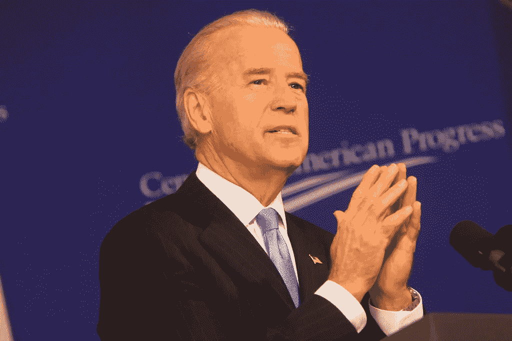

# 华尔街认为拜登，而不是特朗普，是美国经济健康发展的最佳选择

> 原文：<https://medium.datadriveninvestor.com/wall-street-sees-biden-not-trump-as-best-bet-for-a-healthy-economy-for-americans-1ed99e5c3600?source=collection_archive---------11----------------------->

flickr.com

唐纳德·特朗普(Donald Trump)继续试图吓唬美国人投票给他，描绘了一幅美国经济崩溃的悲观图景，如果他们在今年 11 月选举乔·拜登(Joe Biden)为总统的话。

然而，华尔街和大银行的经济学家描绘了一幅截然不同的画面。

根据他们的设想，不仅仅是拜登的胜利，而是拜登的胜利伴随着民主党人也赢得了对国会两院的控制，这将推动最强大和稳定的经济复苏。

谁这么说的？由马克·赞迪领导的穆迪分析公司在最近的报告中得出非常明确的结论，马克·赞迪曾在参议员约翰·麦凯恩 2008 年竞选总统时为其提供建议:

> *“在拜登和民主党横扫国会并完全采纳他们的经济议程的情况下，经济前景最为强劲。”*

穆迪的分析[肯定了](https://www.cnn.com/2020/10/06/business/economy-election-blue-wave-goldman-sachs/index.html)拜登在第一次总统辩论中试图断言的内容，反对川普不断的打断:拜登的经济提案将创造 740 万个就业机会。此外，报告详细阐述了拜登的计划，如果得以实施，该计划有望在 2022 年下半年让经济恢复充分就业，比特朗普计划中的预测早两年。

如果拜登当选总统，特朗普预言的股市崩盘会怎样？

嗯，[高盛](https://www.cnn.com/2020/10/06/business/economy-election-blue-wave-goldman-sachs/index.html)已经提醒其客户，民意调查“表明民主党人获得对华盛顿的统一控制的‘蓝色浪潮’变得越来越有可能”，并且他们已经告诉他们的客户，这样的结果预示着强劲的股票市场表现。

高盛首席经济学家简·哈兹尤斯(Jan Hatzius)远没有建议客户卖出股票，而是在特朗普预测经济灾难的推特发布后，于上周一发布的一份报告中写道，事实上，“在其他条件相同的情况下，这样的蓝色浪潮最有可能促使我们提高预测。”

市场最近的波动是由财政刺激方案通过的不确定性引起的，该方案旨在为疫情期间苦苦挣扎的美国人提供救济。特朗普在他的政府是否会就这样的一揽子计划进行谈判上的摇摆不定是这种不确定性的主要原因。

高盛(Goldman Sachs)的报告特别强调，一波蓝色浪潮将“大幅提高”国会在 1 月就职后通过超过 2 万亿美元刺激法案的可能性。

简而言之，华尔街甚至支持民主党政策，认为这对经济更有利。此外，拜登提出的基础设施、医疗保健、气候变化和教育方面的长期支出被视为有利于经济的长期健康和稳定，因此，即使银行预计税收和监管会增加，这些增加也会被整体经济的改善所抵消。用报告的话说，“这可能导致美国财政政策大幅宽松，贸易升级风险降低，全球增长前景更加强劲，”报告称。

 [## 为什么看起来不可能战胜特朗普？数据驱动的投资者

### 我注意到标题说拜登仍然在总统竞选中领先。在这样的标题背后，人们可以感觉到一种恐惧…

www.datadriveninvestor.com](https://www.datadriveninvestor.com/2020/10/07/why-it-seems-impossible-to-trump-trump/) 

华尔街似乎足够聪明，能够比特朗普更宏观地看待经济，认识到普通美国人的经济健康和财富与整体经济的成功有很大关系。

正如美国有线电视新闻网(CNN)商业作家保罗·拉莫尼卡(Paul R. La Monica)在他最近的一篇文章中所说，“拜登想要取消特朗普的减税政策。反正华尔街是支持他的:

> *“拜登获胜还可能导致针对上层中产阶级和富裕阶层的***略高的个人所得税税率。但你不能只看税收情况，而不分析在拜登或特朗普推出更多刺激措施的情况下，更广泛的经济可能会是什么样子。”**

*事实上，正如一位基金经理向拉莫尼卡指出的那样。。。任何加强中产阶级的新政策都应该让消费者更有信心获得更多贷款。”*

*换句话说，华尔街现在正在寻找一种涓滴经济政策，以确保财富的持续创造和经济的健康发展。*

*市场在 9 月的大部分时间里发出了同样的信息。例如，上周一，即 9 月 21 日，标准普尔 500 指数出现了自 2 月份以来的首次连续四天下跌，道琼斯工业指数暴跌 500 点，美国消费者新闻与商业频道的 [Fred Imbert 将这一下跌归因于“对疫情冠状病毒可能恶化的担忧，以及对美国进一步财政刺激的不确定性”，这两个因素都令“交易员感到不安”](https://www.cnbc.com/2020/09/20/stock-market-futures-open-to-close-news.html)*

*对股市来说，这个残酷的周一开始了一周，这一周将结束道指和标准普尔 500 指数的四周连跌，这是自 2019 年 8 月以来最长的连跌。*

*尽管特朗普继续不断否认现实——无论是冠状病毒的现实，系统性种族主义的现实，还是美国人正在遭受的经济困境——但股市似乎一直拒绝参与特朗普对我们所有人都在目睹的事情的盲目否认，我们是否应该关注一下，就在我们眼前，特别是当特朗普在管理疫情方面的可悲失败，更不用说关心了，以及他喜欢制造政治混乱，而不是领导他的政党为绝望的美国人通过更多的财政救济时。*

*正如[Barrow Hanley 的全球投资组合经理 Brad Kinkelaar](https://www.cnbc.com/2020/09/20/stock-market-futures-open-to-close-news.html) 告诉美国消费者新闻与商业频道，“这是一个医疗保健问题，我们仍然没有取得任何进展。我们仍然没有疫苗；显然，仍然没有解决办法，我们仍在想办法应对这场危机。”*

*根据金克尔的说法，市场至少在一段时间内接受了特朗普的神奇思维，即冠状病毒会在没有国家协调反应的情况下消失，让我们回归常态。他解释说，“因此，我们从一个基本上定价于在合理的时间框架内恢复正常活动的市场，转向一个定价于我们尚未弄清楚这一点的市场，就不足为奇了。”*

*正如另一家公司[的策略师注意到的](https://www.cnbc.com/2020/09/24/futures-rise-slightly-as-market-tries-to-avoid-loss-for-the-week.html)，“在一个充满希望的夏天之后，面对现实，金融市场正在降温。”*

*随着财政刺激方案的前景改善，市场本周反弹，但也因为拜登获胜和民主党横扫国会的前景变得光明。*

*似乎最好不要理会特朗普对经济预测的精彩描绘，而去关注华尔街的水晶球。*

## *访问专家视图— [订阅 DDI 英特尔](https://datadriveninvestor.com/ddi-intel)*