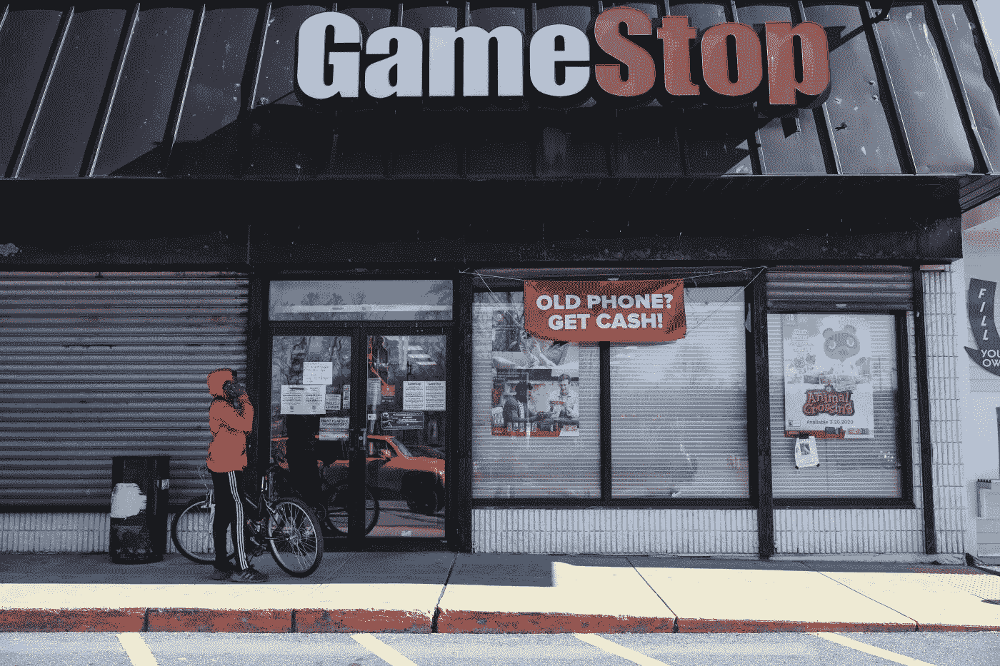
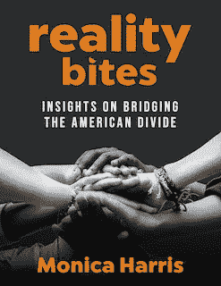

# 华尔街联手小科技阻止 GameStop 革命

> 原文：<https://medium.datadriveninvestor.com/wall-street-teams-up-with-little-tech-to-stop-the-gamestop-revolution-3f8c245213f0?source=collection_archive---------26----------------------->

## 当权派正在利用技术和“wokeness”来压制任何威胁体制的人

Boston Globe/Getty Images

在过去的一周里，你可能已经听说了一些关于一家名为 GameStop 的公司及其在华尔街引起的危机的大惊小怪。你可能已经完全忘记了，因为你对金融市场不感兴趣。但是我鼓励你们试着去理解正在发生的事情——不仅仅是因为这部戏剧突出了我们破碎的金融系统真正为谁服务，还因为这是技术在未来如何被用来压制任何威胁该系统的人的又一个迹象。

以下是事情经过的简要概述:

华尔街通常通过卖出(即*做空)苦苦挣扎的公司股票来做空它们。随着股价下跌，投资者“赢得”他们的赌注，并获得利润。其中一些公司甚至借钱下注(如果你或我用借来的钱赌博，人们会说我们疯了；但正如你将看到的，超级富豪们遵循不同的规则。更疯狂的是*一些对冲基金“做空”根本不存在的公司股票*(这就像向某人出售从未建造过的房屋的房契)。显然，这也是非法的，但华尔街已经逍遥法外多年，赚了数千亿美元。SEC 和国会都没有采取任何措施来阻止它。*

几周前，Reddit 上一个名为 WallStreetBets 的小组的一群投资者决定扭转局面。他们发现对冲基金正在出售/做空*数百万股*股票，而这些股票在 GameStop、AMC Theatres 和诺基亚等公司中并不存在。他们看到了机会。他们决定通过购买这些公司应该卖出/做空的股票来揭穿对冲基金的谎言。这是一个完全出乎意料的举动，让华尔街的赌徒们暴露无遗，造成了数十亿美元的损失。另一方面，聪明的 Reddit 投资者一夜之间成了百万富翁。

媒体关注的是华尔街投行是否通过操纵股价违反了法律，但我发现更有趣的是机构对这一戏剧性事件的反应，因为这很有意义。

事件曝光几小时后，国会要求对交易波动进行调查，美国证券交易委员会很快宣布了对 T2 的调查。事实证明，当普通美国人因为抵押贷款危机或锁定造成的大规模失业而陷入财务困境时，会有轻微的担忧，但不会恐慌。议员们对这个问题喋喋不休，但并不迫切需要找到解决方案或惩罚做错事的人:花了几个月的时间才批准给数百万遭受重创的美国人 600 美元的“刺激”支票，而且只有[一位备受瞩目的银行家最终因导致 2008 年金融危机的广泛欺诈而被起诉](https://www.nytimes.com/2014/05/04/magazine/only-one-top-banker-jail-financial-crisis.html)。

但是，当食物链顶端的人开始流血时，情况就不同了。找出问题所在并尽快“修复”问题，这是一种迫在眉睫的巨大压力。当富人大量出血时，会发生其他事情:来自四面八方的帮助会迅速止血。这就是事情变得有趣的地方。

随着对冲基金的损失上周达到令人眩晕的水平，罗宾汉(华尔街赌注交易员的首选交易平台)采取了前所未有的措施:它[阻止用户购买 GameStop 和对冲基金做空的其他公司的](https://www.nytimes.com/2021/01/28/business/gamestop-robinhood.html)股票。当然，罗宾汉没有合法的商业理由阻止其客户购买这些公司的股票。这一举措只帮助了一群人:做空这些股票的对冲基金。为什么？因为如果太多人一直买股票，卖出/做空股票就不起作用。停止亏损的唯一方法是停止买入。

愤怒的用户指责罗宾汉“迎合精英阶层”，但其首席执行官[否认“阴谋论”，坚称公司的行为不受财大气粗的影响。因为有钱有势的人绝不会为了避免损失数十亿美元而幕后操纵，对吗？GameStop 的传奇充满了讽刺，但最大的讽刺之一是，一个声称使用技术来平衡金融竞争环境的平台反而被用来颠覆小投资者和保护富人。本应解放大众并给予他们更多自主权的技术正被用来对付他们。](https://www.the-sun.com/news/2237543/robinhood-ceo-denies-conspiracy-theory-gamestop-stock/)

上周变得清晰的是，脸书、推特和谷歌、*即*大型科技公司并不是唯一愿意使用技术来保护机构的公司；更小的平台*，也就是*小科技，也可以用来做这项工作。

流行的即时通讯平台 Discord 通过迅速禁止华尔街赌注(WallStreetBets)来惩罚该交易集团——不是基于其金融活动，而是因为“违反针对仇恨言论的社区标准”、美化暴力和传播错误信息。“听起来熟悉吗？应该，因为这就是上个月 [Discord 对一个在其服务器上运行的亲特朗普团体所做的](https://www.theverge.com/2021/1/8/22221579/discord-bans-the-donald-server-reddit-subreddit)。虽然没有证据表明它使用服务器组织了 1 月 6 日的骚乱，但 Discord 决定采取行动，因为该组织与 Reddit 论坛有“公开联系”，该论坛被用于“煽动暴力，在美国策划武装叛乱，并传播与 2020 年美国选举欺诈有关的有害错误信息”。“因为在一个开明的美国，人们不再根据我们的言行来评判我们，而是根据可能与我们有关联的人的言行来评判我们。[亚马逊甚至终止了保守的社交媒体应用 Parler](https://www.seattletimes.com/business/amazon/until-u-s-capitol-riot-amazon-expressed-scant-concern-about-violent-content-on-parler-social-network-says/) 的托管，因为其成员发布了 100 篇引发恐惧、仇恨和传播错误信息的帖子，违反了社区标准(从长远来看，Parler 当时有 800 万成员)。

非常明确地说，我毫不怀疑华尔街和特朗普集团的一些成员发表了暴力、仇恨和不恰当的评论。任何群体中都有“坏”苹果，认为我们总能避开它们是天真的。即使在民主党这个打着被剥夺公民权旗号的政党中，我们也可能会发现大量选民抵制女权、同性恋权利和种族平等。然而常识和经验告诉我们，这些人在任何群体中都是少数，而不是多数。当坏演员出现时，明智的做法是惩罚那些个人，而不是整个团队。

但这不是大科技和小科技现在在做的事情。他们禁止婴儿洗澡水的做法就像把整个班级送去关禁闭一样有道理，因为教室后面的几个孩子很吵，很爱捣乱。

这又引出了另一个讽刺。在努力提高敏感度的过程中，技术控制者愿意将整群人贴上种族主义者、性别歧视者或叛乱者的标签——即使绝大多数人不是。为了消除对其他人的成见或创造“团结”，他们毫不犹豫地提出对一些人的成见。这是一种虚伪，与宽容的叙事背道而驰，它告诉我，可能是时候考虑这里发生其他事情的可能性了。这种对宽容的追求可能比看上去的要多。

虽然“wokeness”表面上有利于有色人种、女性和其他被剥夺权利的群体，但我认为我们第一次看到它如何被用于完全不相关的目的。当权派可以间接地运用政治正确作为武器，来对付那些敢于挑战体制及其运作方式的人。

想想吧。如果只需要几个“坏”人来证明让整个群体保持沉默是合理的，那么任何组织或运动，无论其目标或使命陈述如何，都可能面临风险。大科技和小科技可以废除占领华尔街 2.0(指责成员传播错误信息)或支持独立候选人的政治团体(指责 500 万成员中的 50 人是种族主义者)。如果以男性为主的在线交易者的活动威胁到对冲基金未来的命运，他们可能会因性别歧视而被禁止。

在“wokeness”的幌子下，任何越线或对运行系统的人构成威胁的人都可能被打上不受欢迎和沉默的标签。这意味着我们会发现自己身处一个没有人被冒犯的社会，*然而没有人被保证有发言权。*

也许是时候问问我们自己，哪个对我们更重要:不被冒犯，还是在日益压迫的体制面前有权说出我们的想法。因为我认为这是一个我们很快都会面临的选择。

# 准备好脱离阻碍我们康复的现实了吗？和我一起拔掉[这里](https://www.letsgetunplugged.com/)。

我的新书 [*现实叮咬:关于弥合美国鸿沟*](https://www.amazon.com/Reality-Bites-Insights-Bridging-American-ebook/dp/B08KHK22YX/ref=zg_bsnr_154855011_8?_encoding=UTF8&psc=1&refRID=NVX4DTEB29RNBH330RKV)*现在已经在[亚马逊](https://www.amazon.com/Reality-Bites-Insights-Bridging-American-ebook/dp/B08KHK22YX/ref=zg_bsnr_154855011_8?_encoding=UTF8&psc=1&refRID=NVX4DTEB29RNBH330RKV)上架。*

**