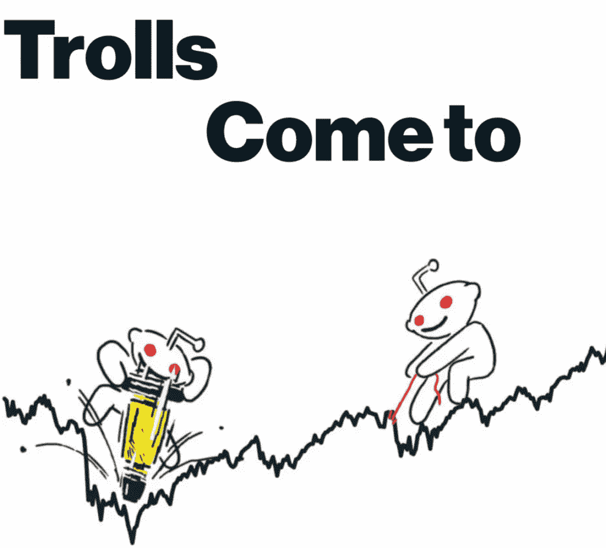
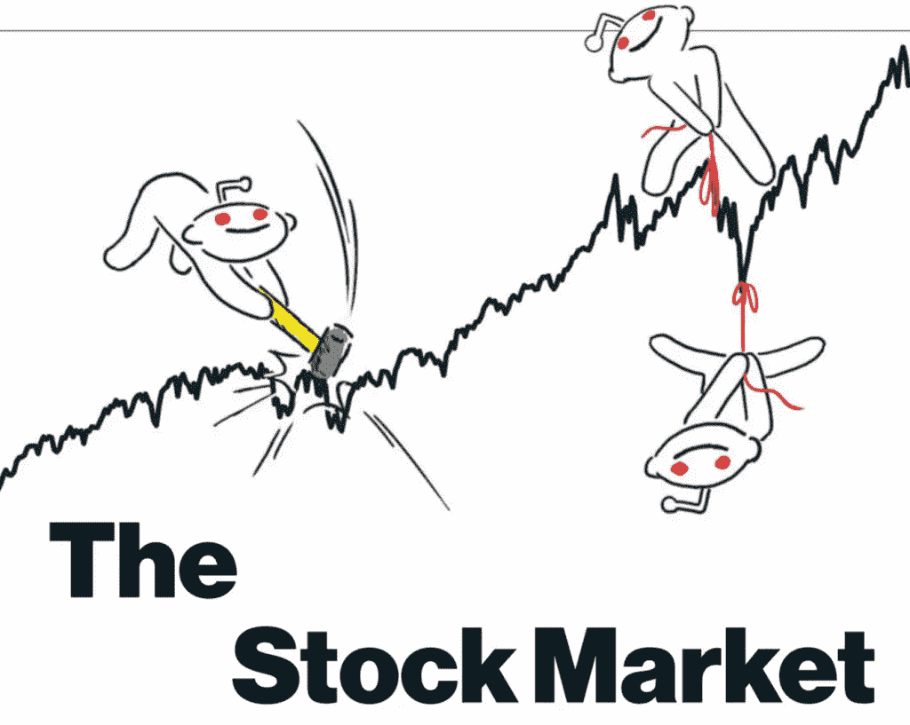
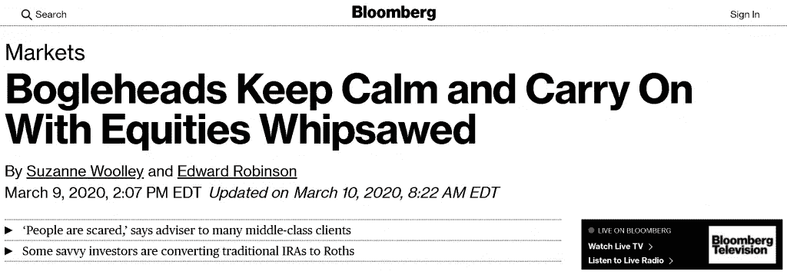
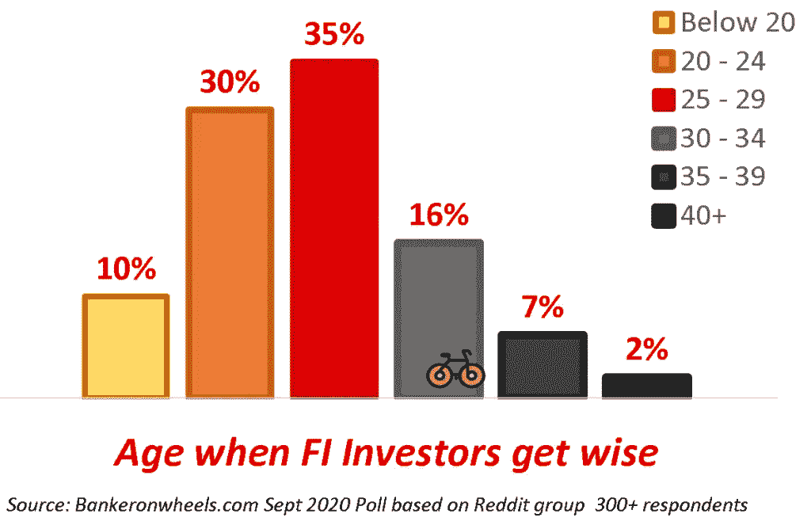
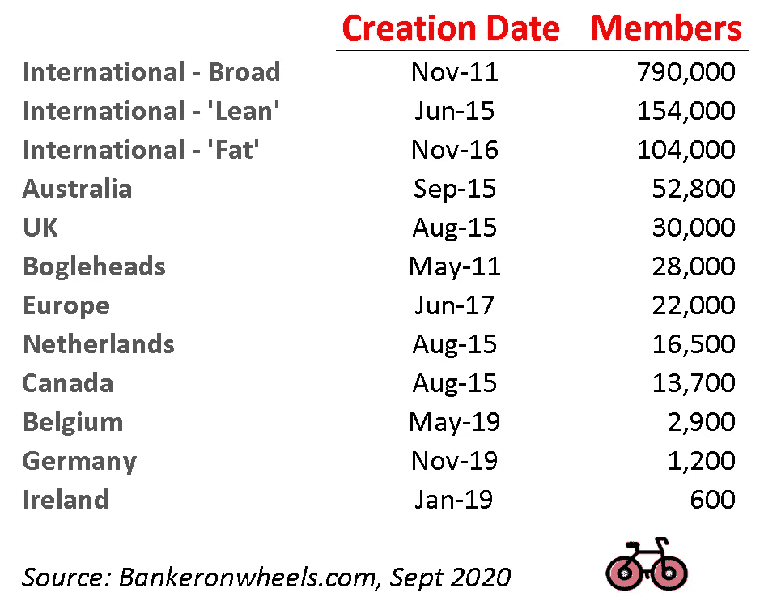
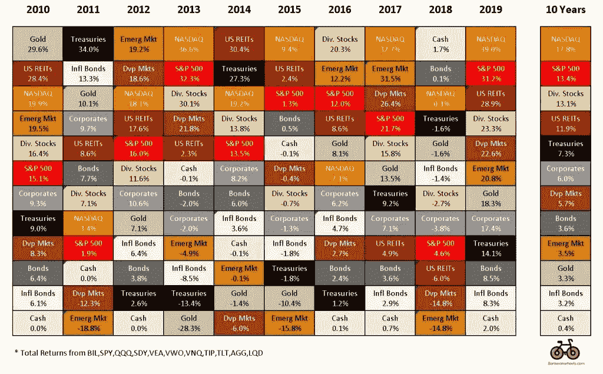
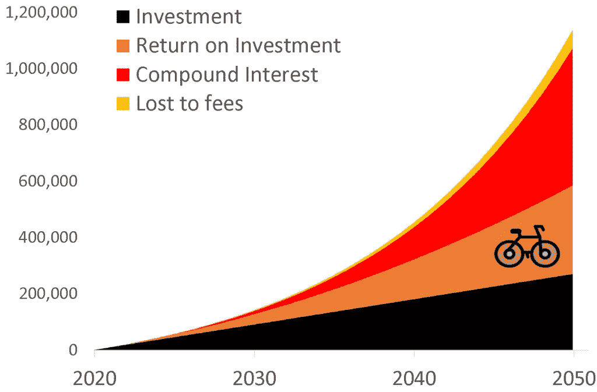

# 华尔街认为你很蠢

> 原文：<https://medium.datadriveninvestor.com/wall-street-thinks-youre-dumb-d90e1ab0967b?source=collection_archive---------2----------------------->

# 明智资金的崛起

# 精明的投资

当你加入一家大型华尔街银行或资产管理公司，开始在市场部门工作，你会很快学会术语

对我来说，鉴于我是在法国长大的，这是一个三重挑战——掌握行话、专业英语(因为法国教育系统在教授语言方面相当糟糕)和我老板的爱尔兰口音

哦…我的导师是苏格兰人(更不用说我们很快就开始和印度人一起工作，并开始适应他们的口音)

不管怎样，回到金融术语的话题

你必须了解你与谁互动，客户，数据供应商等。很快你就会意识到华尔街对“钱”有多种定义

智能资金(机构投资者)和非智能资金(散户投资者)之间有着广泛的区别

让我们从聪明开始，然后**进入愚蠢，这才是真正有趣的地方**

# 有些形式的钱可能不是真的…

聪明的资金进一步分成多股，最聪明的资金通常被认为是对冲基金，其中一些被称为**快钱**因为他们的短期策略。**真正的钱**是长期投资者(其中复杂程度变化很大)，包括养老基金、基金经理的基金或主权财富基金

投资银行就是为所有这些投资者服务的——帮助他们的客户在资本市场上筹集资金，提供各种金融咨询服务，并协助并购活动

但是，尽管大多数华尔街银行家广泛使用这些定义，但其背后有许多细微差别，令人惊讶的是，在零售业也是如此……

# 骑自行车走向财务独立

我花了[“环游世界”自行车旅行](https://bankeronwheels.com/about/)，然后当我因新冠肺炎而在摩洛哥停留时进一步研究这个主题(如果你与机构客户打交道，你几乎没有时间去研究零售部分)，才真正发现了 [Boglehead](https://www.kiplinger.com/article/investing/t030-c009-s002-investing-lessons-from-vanguard-s-bogleheads.html) 和[F.I . r . e .](https://en.wikipedia.org/wiki/FIRE_movement)(“财务独立提前退休”)或 F . I .(“财务独立”)社区— **，这是一个有趣的发现**

这里只是我所了解的一小部分

# 愚蠢的钱

每个人都知道**傻钱**(散户日内交易者和临时选股者)**——**华尔街忽视他们，因为他们缺乏资产和经验/技术知识，尽管作为一个整体，他们是一股强大的市场力量，**但作为个体，他们毫无意义**(与机构客户相比)

有时，愚蠢的钱会出现在彭博商业周刊杂志的封面上，并且对于购买零售活动数据的期权交易者和对冲基金来说是一个容易的猎物。)

因此，我不会在愚蠢的钱上花太多时间

我主要担心的是，许多媒体机构将所有散户投资者聚集在一起，而且很大程度上不了解有很多东西可以教给普通大众和华尔街的明智资金

以晨星为例，它日夜为散户投资者提供服务(它专注于投资研究和服务)

**它的个人金融首席分析师**花了几年**才完全认识到 FIRE Movement 投资理念的优点** (他们终于[认识到了](https://www.morningstar.co.uk/uk/news/203715/why-im-a-fire-movement-convert.aspx)，在 2020 年 6 月！)

# 明智资金的崛起

**引入“明智理财”概念**

你可能很聪明，但这并不意味着你很聪明。我观察到了许多明智投资者的共同特征，但他们都有一个共同点，那就是— **明智的投资者不会预测股市**

# 明智的投资是无预测的

明智的投资者知道自己的局限性，正如我在最近一篇关于阿拉斯加和北海道灰熊的文章中所解释的，一个人需要为最可能的情况做好准备

你的投资组合需要尽可能地抗冲击

现在，并不是所有明智的投资者都具备技术知识，并通过[研究过去](https://bankeronwheels.com/how-to-take-advantage-of-a-recession/)来使他们的投资组合免疫

但至少他们有**的谦逊，承认他们不知道会发生什么**，这可能来自生活的其他方面，在那里聪明人**知道如何区分在你控制之内和在你控制之外的事情**

 [## 为什么大多数人在日内交易中亏损(以及如何不成为他们中的一员)|数据驱动的投资者

### 日内交易很难，大多数人都赔钱。我确实有。事实上，我曾经在一个单一的损失更多的钱…

www.datadriveninvestor.com](https://www.datadriveninvestor.com/2020/09/23/why-most-people-lose-money-day-trading-and-how-to-not-be-one-of-them/) 

# 明智的资金通常是有耐心的

彭博 3 月 9 日在新冠肺炎股市暴跌期间的头条新闻

## 你可能在华尔街工作，很笨

尽管你拥有所有的技术知识，但你可能仍然对自己的钱不感兴趣

我一遍又一遍地看到这种情况

尽管有严格的合规制度(当你在华尔街工作时，购买股票真的不容易)**人们会经历所有的痛苦来获得批准，挑选股票或使用其他方式来“把握市场时机”**(我指的是其他金融领域的人，他们对股票市场没有洞察力，所以他们****无法利用他们的知识和经验**)**

**让你的 ETF 投资得到合规部门的批准要容易得多，因为合规部门知道你几乎没有优势(除非你是一个宏观投资组合经理或者对未来流动有洞察力的人，这对一些流动性差的市场可能有用)**

**但是一些银行家有控制 T21 的错觉，并凌驾于市场之上**

****他们的交易频率也超过了需要**他们对大局没有远见，也不明白为什么保持冷静和拥有最佳资产组合(例如，在股票便宜的时候购买股票)**

# **明智的钱是年轻的**

**…当它第一次听说财务独立时**

**为了了解消防投资者何时开始**我在一个欧洲消防论坛上进行了一项调查****

**300 多名受访者中，大多数人在人生的相对早期就做出了明智的投资决定，这并不令我感到惊讶。安全的钱。投资指数基金。多样化。**

**75%的消防投资者在 30 岁之前就已经弄清楚了他们的财务状况**

****

# **聪明的钱有天使**

# **做上帝的工作**

**大金融危机后不久，高盛首席执行官[说](https://www.reuters.com/article/us-goldmansachs-blankfein-idUSTRE5A719520091108)银行服务于社会目的，而**银行正在做“上帝的工作”****

**事实是，**没有一个投资银行家曾经给散户投资者带来任何重大的积极影响****

# **圣杰克**

**令我感到惭愧的是，尽管我在华尔街工作了十多年，却从未听说过杰克·博格尔**

**另一方面，我的同事也没有(我知道这不是一个好借口)**

**但是**杰克**(他本身并不是银行家，而是资产管理公司 [Vanguard](https://investor.vanguard.com/corporate-portal) 的创始人)**为普通储户创造的收益比金融界任何人都多****

**下面是我最喜欢的财经博客作者鲍勃·卡尔森对他的遗产的总结。他被称为圣人杰克并不奇怪**

# **愚蠢的钱的领导人是明智的**

**戴夫·波特诺伊，**“散户交易者大军”**的首领可能是一个非常聪明的人**

**他估计自己的净资产超过 1 亿美元，并表示目前为止他已经在日内交易账户中投入了 500 万美元**

**它告诉你什么？**

**这很有可能，他的净资产的 95%是某种形式的长期投资(他的追随者应该知道)**

**5%的交易是一笔可观的游戏资金，他在 T2 的推特活动创造了一台强大的营销机器，远远抵消了交易风险**

# **聪明的钱有初学者的运气**

**主要的博格尔海德论坛创建于 2008 年 5 月，[金钱小胡子先生博客](https://en.wikipedia.org/wiki/Mr._Money_Mustache)于 2011 年才推出**

**在过去的十年里，各种各样的消防团体在全球各地涌现**

**以下是我截至 2020 年 9 月的统计**

**相比之下，**最大的傻钱论坛(又名华尔街投注)到今天为止有 150 万会员****

**当然，这些数字存在偏差，因为明智的投资者知道社区可以带来有价值的信息，而且更集中在这里，而愚蠢的资金通常会被媒体和所有可能想象到的金融陷阱分散注意力**

**如你所见，在 FIRE 社区中，能够负担得起他们希望的退休类型的成员之间存在进一步的差异(**瘦火是极简主义，而肥火是奢华的**)**

**消防和 Bogleheads 论坛成员计数和创建日期**

****

# **运气偏爱有准备的人**

**这些投资者中的大多数在过去十年开始投资确实有所帮助**

**在过去的十年中，纳斯达克的平均年回报率为 17.8%，标准普尔 500 指数为 13.4%，甚至债券也表现良好**

**华尔街会说，在未来复制这种情况可能会很棘手，明智的投资者还必须在一个低回报的世界里设定适当的预期**

**但是，请记住，明智的资金是以几十年而不是几年来考虑的**

**考虑到他们的国际多元化，基于他们年龄明智的资金的积极的股票配置将不可避免地在下一波浪潮中结束**

**按绩效排名的资产(2010 年至 2019 年)**

****

# **明智的金钱会成为百万富翁**

**最终，明智的投资者将成为百万富翁——数学证明了这一点**

*   **最初注入 1000 英镑**
*   **每月注射 750 支**
*   **假设长期回报率为 8%**

**30 年后你将成为百万富翁**

**乐观的假设还考虑到你需要在退休前降低风险，但注入更多现金也不是不合理的**

**30 年投资组合价值预测**

****

# **关键要点**

*   ****为了你自己&你的孩子:**如果你希望你的孩子成功，尽早投资，利用复利的力量。他们出生时就把钱存进去，每年登陆一次重新平衡(可能的话再充值)。让他们经济独立，专注于自己热爱的事情，而不是追逐金钱**
*   ****对于我们的领导者:**一些消防投资者是足够幸运的，因为他们听说了股票市场可以成为强大的被动赚钱机器，只要你遵循正确的原则。金融教育应该在很早的时候就开始，这样我们才能为每个人提供一个更公平的竞争环境——尤其是在这个不平等日益加剧的时代**
*   ****对华尔街来说:**投资更多的(或者至少同样多的)是智慧，而不是技术。作为一个行业，我们应该认识到智慧和长期思考的价值。今年骑车环游世界的时候听了不少有声读物(主要是自传)。随着时间的推移，富人倾向于投身慈善事业——如果你想成为金融界少有的对世界有所贡献的人，就像杰克一样**
*   **火苗:保持冷静，在下一次重大危机中继续以身作则**

## **祝你好运！(早点投资，如果为时已晚，就把收益给你的孩子)**

## **访问专家视图— [订阅 DDI 英特尔](https://datadriveninvestor.com/ddi-intel)**