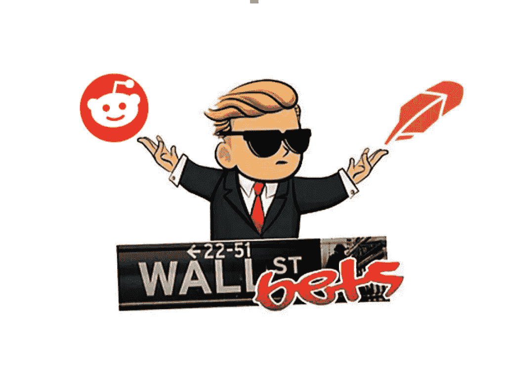

# 华尔街 Bets 是我们都想看的罗宾汉故事

> 原文：<https://medium.datadriveninvestor.com/wallstreetbets-is-the-robinhood-story-we-all-wanted-to-see-1963b4d4d5ad?source=collection_archive---------16----------------------->

## 预言正在实现

华尔街赌注也有相当多的恶名。早在 2019 年，基于 Reddit 的社区因允许用户无限保证金交易的“黑客”而成为新闻。现在，他们出现在 Gamestop(GME)、黑莓(BB)和 AMC Theatres(AMC)票房飙升至历史新高的新闻中。随着罗宾汉成为 WSB 的首选武器，投资者正以大财团的名义把谨慎抛在脑后。

每个人都不喜欢突然的价格波动。做空 GameStop 的投资者现在陷入了做空困境。纽约对冲基金 Melvin Capital 在 2020 年初做空了 GameStop。

一群散户交易者会有其他计划，因为他们会将几只股票推至突然的高点。Citadel 和 Point72 也被卷入风暴，平仓损失 50 亿美元。1 月 27 日卖空者的总损失为 143 亿美元。

据美国消费者新闻与商业频道报道，仅本周 GameStop 的股价就飙升了 400%以上，达到每股 347.51 美元，使其一月份的涨幅达到 685%。去年 4 月 3 日，这支股票价值 3 美元。尽管有破产的消息，AMC 剧院的股票在不到一个月的时间里从 2 美元飙升到 22 美元。

华尔街赌注，或 WSB，再次成为新闻和网络上最热门的话题。埃隆·马斯克、查马斯·帕利哈皮提亚和迈克尔·布里都参与了这场惨败。

这种增长造就了一些一夜暴富的人。2020 年 8 月，Reddit poster u/DeepFuckingValue 向$GME calls 投资了 5 万美元。在撰写本文时，他的账户上有 4700 万美元。

在媒体的大肆报道下，聚会很快就会突然中断。

TD Ameritrade、查尔斯·施瓦布和其他经纪商停止了用户交易。纳斯达克首席执行官 Adena Friedman 引用了“不寻常的活动”，并调查了“社交媒体聊天”当天晚上晚些时候，臭名昭著的 subreddit 在返回前不久进行了私有化。从周三开始，WSB 的不和谐频道被禁止进入其服务器。

从疯狂中可以学到很多东西。片刻之间，散户投资者暴露了银行系统的腐败行为。

## 大卫 vs 歌利亚

大卫和歌利亚的故事是一个叫歌利亚的巨人让一个小镇感到恐惧，一个叫大卫的小男孩敢于反抗他。大卫最终杀死了巨人，成为了这片土地的国王。

在这个故事中，华尔街是歌利亚，WSB 是大卫。对冲基金多年来一直参与不公平行为。2013 年的《就业法案》改变了这一游戏。现在，散户投资者比以前更容易进入市场。这是向银行家开战的第一步。

2008 年，金融公司重创了美国经济，导致许多人失去工作和家园——我们永远不会忘记。我们很多人都不会忘记，当其他人都咬紧牙关时，银行家是如何得到纾困的。社会资本首席执行官查马斯·帕里哈皮提亚接受了美国消费者新闻与商业频道的采访，解释了这场运动背后的动机。

华尔街的腐败已经展现多年。没人会想到一群散户会走到一起，让对冲基金屈服。这是一个清晰的信息，数字的力量正在改变金融业的动态。

华尔街投注就像占领华尔街，但战争准备。大男孩们第一次意识到他们并不像他们想象的那样不可侵犯。他们面对的是精通技术、聪明、年轻的投资者，他们来这里是为了他们应得的一切。

这是罗宾汉预言成真。通过人民的手，商人从富人(华尔街/银行家)那里拿走了钱，给了穷人(普通人)。)

## 大局

自我描述为“像 4chan 发现了彭博绝症。”这个社区到处都是说话粗鲁的投资者，他们把钱投资在最新的热门股票上。这是实际交易的用户和不知道自己在做什么的用户的混合体。

尽管角色混杂，但用户有两个主要目标——赚大钱和改变生活。

尽管行为古怪，一些人还是能够用收入购买基本必需品。该社区帮助成员摆脱债务，支付医疗费用，并照顾他们所爱的人。对于那些想要解决日常系统问题的人来说，subreddit 已经成为了一个危险的避风港。

## 权力属于人民

我们在看金融版的法国大革命。人民已经受够了虚伪，他们要血洗。

许多人发言支持 WSB，认为银行家们变得一贫如洗是理所应当的。这个系统不想让小人物赢，会尽一切努力阻止这种事情发生。

几条推文表达了银行家们如何无法拿出他们抛出的东西。他们不喜欢在自己的游戏中被打败。

华尔街的生存法则是“你有规则，我没有规则。”

**WSB 的人生格言是“失败者上车，失败者才上车！”**

WSB 挑战华尔街是一个历史性的时刻。每个人都想看到失败者打败老板。每个人都喜欢看到校园恶霸自食其果。

我们看到 2008 年的孩子们成长起来，为他们的父母和亲人报仇。这一次，民众情绪高涨，银行家们为此付出了代价。就华尔街 Bets 而言，这只是一个开始。

记住，石头只会上升。