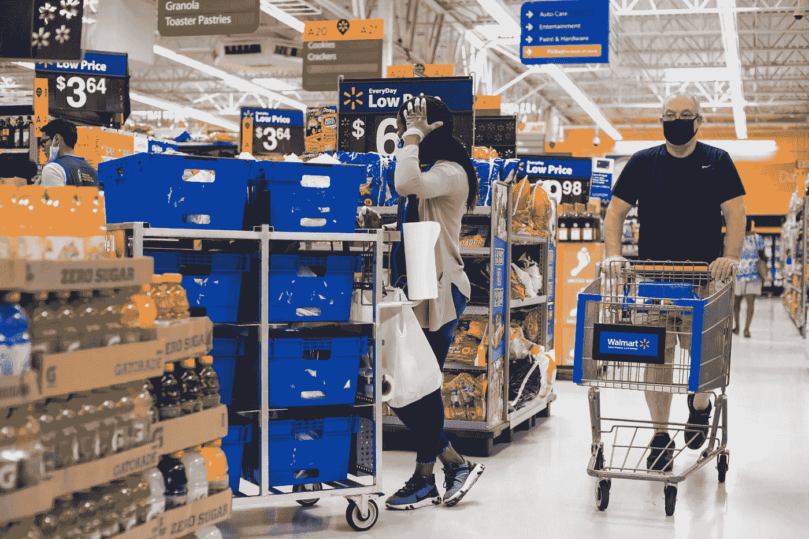
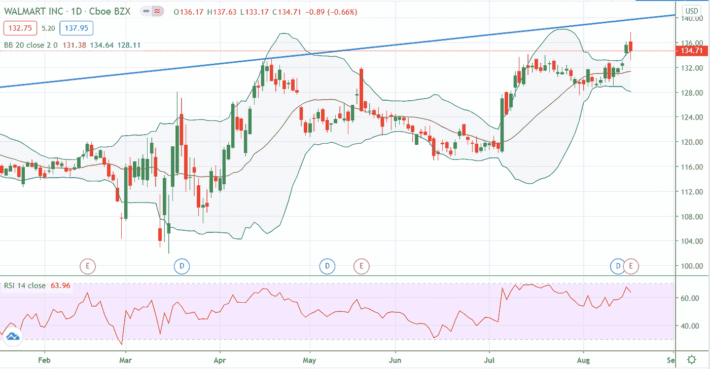

# 沃尔玛攀升至新的高度

> 原文：<https://medium.datadriveninvestor.com/walmart-climbed-to-new-heights-943c9451fb61?source=collection_archive---------27----------------------->

美国最大的零售商沃尔玛(WMT 股票交易所代码:Walmart)在疫情期间显示了其持续增长，该公司周二宣布了好于预期的第二季度财务业绩。该公司第二季度业绩显示，与 Q2 2019 年相比，美国 comp-store 销售额增长了 9.3%，电子商务增长了 97%。提货和送货服务的销售额创下历史新高，约有 3，450 家商店允许提货，2，730 家商店提供当天送货服务。

*   每股收益(EPS)1.56 美元，预期为 1.25 美元
*   收入 1377 亿美元，而预期为 1355 亿美元

> “我非常感谢我们的同事在这个前所未有的时期所做的不懈努力。我们也感谢客户的信任和信心。我们现在仍然专注于为他们提供良好的服务，并扩展我们的全球能力，以便在未来为他们提供良好的服务。”—沃尔玛首席执行官道格·董明伦(Doug McMillon)说。

在本季度，沃尔玛的收入比去年同期增长了 5.6%，即 74 亿美元。与此同时，沃尔玛表示，自今年年初以来，它雇用了超过 50 万名新员工，并在冠状病毒相关成本上花费了 15 亿美元，包括本季度员工的三笔现金奖金。

 [## 关于大多数人不了解的颠覆性创新，你应该知道的 5 件事|数据…

### 2020 年 1 月，商业世界失去了一位伟大的思想家和实践者，关于为什么好，甚至伟大的公司…

www.datadriveninvestor.com](https://www.datadriveninvestor.com/2020/04/02/5-things-you-should-know-about-disruptive-innovation-that-most-people-dont-understand/) 

另一方面，家得宝(NYSE: HD)也报告了强劲的销售增长，该公司的同店销售额在第二季度跃升 23.4%，超过了分析师平均估计的 10.5%的增幅。

周二，在业绩公布后，沃尔玛股价在盘前飙升 6%，后来该股从 137.63 美元的历史新高回落，收盘时下跌近 1%。

**进入专家视角—** [**订阅 DDI 英特尔**](https://datadriveninvestor.com/ddi-intel)