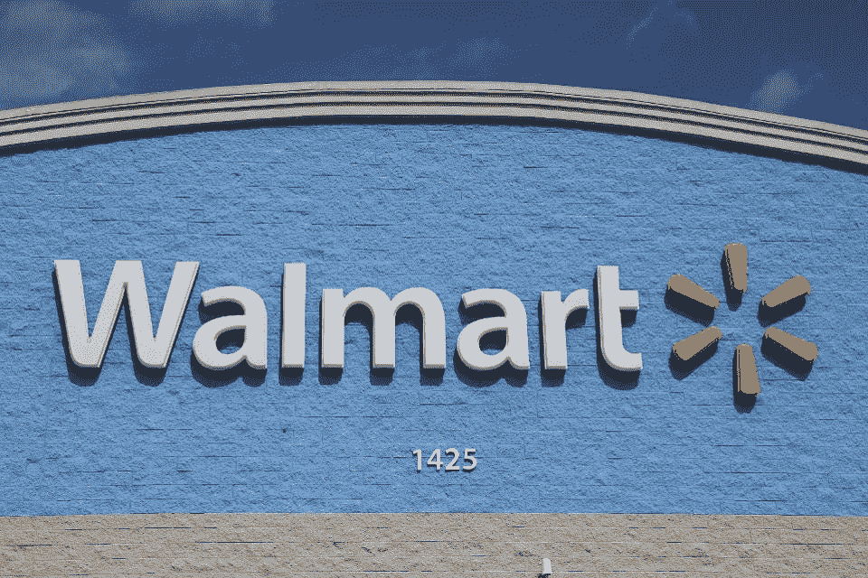

# 沃尔玛和其他七名新成员一起加入了 Hyperledger

> 原文：<https://medium.datadriveninvestor.com/walmart-joins-hyperledger-along-with-seven-other-new-members-a657ed87e9bc?source=collection_archive---------20----------------------->

SAN FRANCISCO, CA — SEPTEMBER 06: speaks Hyperledger Project Executive Director Brian Behlendorf onstage during Day 2 of TechCrunch Disrupt SF 2018 at Moscone Center on September 6, 2018 in San Francisco, California. (Photo by Kimberly White/Getty Images for TechCrunch)

3 月 3 日，Hyperledger，一个为推进区块链技术而创建的开源项目，宣布了八个新成员，特别是 Clear，Conduent 和 Walmart。

Hyperledger 还迎来了六家新的 Hyperledger 认证服务提供商(HCSP)。新闻稿称，“北京 Proinsight Technology、Kompitech、LimeChain、Mindtree、Xoaa 和桂芝是完成最近启动的项目标准的最新组织。成员是经过资格预审和审查的服务提供商，他们在帮助企业成功采用 Hyperledger 企业区块链技术方面拥有丰富的经验。”

Hyperledger 执行董事布莱恩·贝伦多夫表示:“新成员和 HCSPs 的加入是 Hyperledger 全球论坛的一个伟大开端。

Hyperledger 允许组织通过开源的分布式分类帐框架、库和工具创建特定于行业的应用程序。像 R3 一样，他支持一个类似的开源区块链平台 Corda，Hyperledger 一直在与不同行业的合作伙伴合作，以了解如何应用这项技术。

其他新成员包括爱欧科技、Joisto 集团、Tangem 和 Tokenation。

MIAMI, FLORIDA — FEBRUARY 18: A Walmart store is seen as the company reported fiscal fourth-quarter earnings that fell short of analysts’ estimates on February 18, 2020, in Miami, Florida. Walmart earned $1.38 a share, short of some analysts' expectations for $1.43 per share. (Photo by Joe Raedle/Getty Images)

沃尔玛全球技术副总裁 Sanjay Radhakrishnan 表示:“沃尔玛很高兴参与开源社区，共同创造可扩展和适应性强的技术。“通过我们对区块链的各种部署，我们已经看到了强劲的成果，并相信继续参与开源社区将进一步改变我们业务的未来。”

 [## 5 行业转型区块链应用|数据驱动投资者

### 除非你一直生活在岩石下，否则我相信你现在已经听说过区块链了。而区块链…

www.datadriveninvestor.com](https://www.datadriveninvestor.com/2019/02/13/5-real-world-blockchain-applications/) 

区块链改善和增强供应链信任的能力是一个受欢迎的用例。这一领域的发展仍在不断变化和发展。

在[推特](https://www.twitter.com/@robertanzalon15)或 [LinkedIn](https://www.linkedin.com/in/robertanzalonejr/) 上关注我。点击这里，查看我的其他作品[。](https://medium.com/@ranzalonejr)

…阅读更多内容

*原载于*[*https://www.forbes.com*](https://www.forbes.com/sites/robertanzalone/2020/03/08/walmart-joins-hyperledger-along-with-seven-other-new-members/)*。*