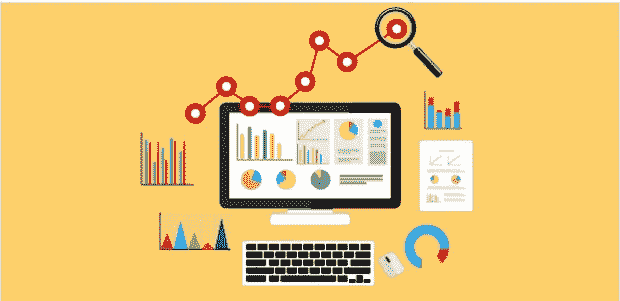

# 沃尔玛向数据分析和供应链分析迈出了一大步

> 原文：<https://medium.datadriveninvestor.com/walmart-taking-a-giant-leap-towards-data-analytics-and-supply-chain-analytics-2c48c9e38f9d?source=collection_archive---------1----------------------->

沃尔玛是一家美国跨国零售公司，经营连锁超市、折扣百货商店和杂货店，在 27 个国家拥有 11，695 家商店和俱乐部，以 55 个不同的名称运营。沃尔玛是世界上最大的零售商，并开发了世界上最大的私有云数据咖啡馆，这是一个最先进的分析中心，足以每小时处理 2.5 的数据。这只能说明沃尔玛在商业分析方面有多大。

这个数据咖啡馆从内部和外部资源获取数据，包括 40pb 的事务性数据，这些数据可以快速建模、处理和可视化。这有助于公司每天分析所有地点的每家商店的销售额。这种详细的数据反馈和分析有助于沃尔玛更好地制定在线和实体店销售产品的战略。

 [## 物联网解决方案如何改变供应链中的机遇|数据驱动型投资者

### 物联网(IoT)可能开始时规模很小，但它正在成为世界经济中的一个重要因素。事实上…

www.datadriveninvestor.com](https://www.datadriveninvestor.com/2018/11/14/how-iot-solutions-are-shifting-opportunities-in-the-supply-chain/) 

沃尔玛以各种方式使用分析，以确保在其在线和线下空间的平台上吸引更多顾客。这种分析有助于他们确保在正确的时间、正确的地点、以正确的价格为所有年龄段的客户提供正确的库存。这反过来会提高公司收入和客户满意度。

90%的美国人居住在离沃尔玛 10 英里以内的地方，沃尔玛每周为 1.4 亿顾客提供服务。如果我们追溯沃尔玛的发展历程，萨姆·沃尔顿开设零售店的主要理念是通过省钱让顾客的日常生活变得更好，他的座右铭仍然是公司成功的驱动力，即“省钱”。更好地生活”和在线空间，该公司正在遵循同样的使命，为顾客省钱，无论他们想如何购物*即*无论是在店内还是在 Walmart.com。如果你是沃尔玛的购物者之一，你一进商店就会看到横幅，看起来就像日常低价一样。帮助沃尔玛数千种产品保持低价的主要因素之一是供应链管理。供应链管理就像整个生态系统的大脑。它与多个系统协调，如支付、入站&出站库存、商家、客户、第三方卖家、供应商等。以确保它从每个角落的系统中提取数据，并将其输入智能分析模型，该模型使用各种定制的机器学习算法来预测整个沃尔玛网络中所有商店/仓库的库存预测。这项练习有助于沃尔玛的供应链支柱确定和识别模式&趋势，并帮助准确回答了解其所有在线和线下商店需要什么、需要多少以及何时需要的问题，并确保其任何商品永远不会缺货。通过利用众多关键指标，如客户数据—年龄、性别、位置、职业、购买方式(在线或离线)、商店或仓库的位置、销售点数据、产品数据—频率、数量季节性&类型/类别等。，沃尔玛迅速将它们纳入其预测&分配分析算法，并以最低的制造成本补充库存，提前从不同供应商处订购，减少运输成本、仓储成本和运营/管理成本，最终为顾客带来每日低价。

通过从现有原始数据中识别模式、行为和趋势来发现知识，并通过各种业务指标/场景对数据建模来预测/推荐未来，这就是我所说的分析。

互联网为电子商务打开了新的视野，并迫使世界各地的零售商为其客户提供更好的满意度和服务。沃尔玛正在利用其大数据咖啡馆在竞争对手中获得竞争优势，随着物联网无处不在，我认为沃尔玛可以整合其大数据技术和分析平台，以更好地预测客户需求，并推荐或订购基本的家庭用品，如牛奶、鸡蛋、面包等。代表客户使用客户购买历史和资料。沃尔玛可以与 Google Home、Apple Home pods 和智能冰箱、智能垃圾/垃圾桶等物联网设备集成，以查看家中食品杂货的当前消费率，并帮助客户在这些物品完全耗尽之前提前补充，帮助个人节省时间、精力和金钱。由于沃尔玛现在向所有顾客提供送货上门服务，这种基于分析和购买历史代表顾客订购的想法可以帮助独自一人的老年购物者，他们经常忘记订购药物和日常杂货，直到最后一刻。