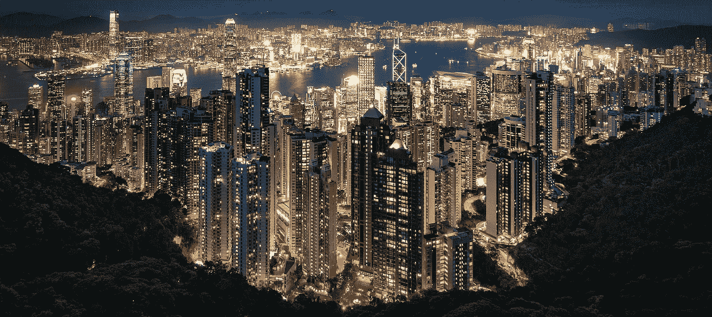

# 想从我的盒子里出来。但是高科技让我呆在里面！

> 原文：<https://medium.datadriveninvestor.com/wanna-get-out-of-my-box-but-high-tech-is-keeping-me-in-341e4df73afb?source=collection_archive---------23----------------------->

## 将来的

## 我们的技术非常了解我们。他们给了我们更多过去已经拥有的东西。Grrr…我想要多样化！

Picture credit: [Gerd Altmann](https://pixabay.com/nl/users/geralt-9301/?utm_source=link-attribution&utm_medium=referral&utm_campaign=image&utm_content=4861605) via [Pixabay](https://pixabay.com/nl/?utm_source=link-attribution&utm_medium=referral&utm_campaign=image&utm_content=4861605)

在 [道教](https://en.wikipedia.org/wiki/Taoism)中，我们被教导我们是背对着未来行走的。我们需要强大的后盾来明智地指引我们。我们的目光聚焦在过去。因为我们只知道这些。

嗯，我爱我的道智。

> “千里之行，始于足下”
> ― **老子**

但是在这个特殊的例子中，我想做不同的事情。我想把未来包含在我做的每一件事里。我想要真正的创新，基于我所看到的未来趋势。我想找到解决我们时代问题的方法。不要回头去看，假装一些半诙谐的、工业上看起来更聪明的解决方案。

 [## 创新农场和先锋精神:所有组织(和你)都需要在…

### “首席数字官”和“首席转型官”是组织目前的新管理角色…

www.datadriveninvestor.com](https://www.datadriveninvestor.com/2020/08/13/innovation-farm-and-a-pioneers-spirit-all-organization-and-you-need-to-still-have-a-say-in-the-future/) 

不，我想要真实的东西。支持生命的技术。解决不平等的商业模式。促进可持续发展和健康生活。

我的眼睛在鹰眼视角下茁壮成长。他们想看到未来，趋势和我还不知道的事情。我是一个博学的人。我喜欢从不同的角度磨砺我的大脑。

Night eyes. [Marci Marc](https://pixabay.com/nl/users/MarciMarc105-6128323/?utm_source=link-attribution&utm_medium=referral&utm_campaign=image&utm_content=3327550) via [Pixabay](https://pixabay.com/nl/?utm_source=link-attribution&utm_medium=referral&utm_campaign=image&utm_content=3327550)

我热爱文化，并试图理解它们。所以下次我遇到一个人，我可以真正地深入交流，而不是仅仅停留在表面。

我热爱不同的语言和渊博的知识。和科学。以及科学之外的一切，所谓的伪科学。所以我可以自己拿主意，看看 2030 年什么是可行的。或者 2050 年。或者 2080 年。

> 你知道的越多，你就越意识到自己一无所知
> 
> ——苏格拉底。

我想超越我的时代。同时，我意识到我什么都不知道。世界上有这样一个[集体智慧的大领域](https://www.murmurationproject.com/how)，我的理解是浩瀚宇宙中的一粒微小的尘埃。

尽管如此，这是我的使命，去了解每一个独立的拼图，并分享我自己独特创作的相关点。我想和世界分享我的视野，这样它就可以和其他人的点滴一起形成一个大的过渡波[。](https://medium.com/illumination/unseen-influence-is-all-9fde09516393)

变革的浪潮已经到来。如果我不跳出我的框框，我将永远不会成为一个有价值的变革者。我会给你更多同样的东西。

那么，我们需要做些什么来摆脱我们的束缚呢？

我们的高科技，如电话、社交媒体算法和搜索引擎都没有帮助。他们只是给了我们更多相同的东西。

答案:让我们好奇吧！

## 普通图片

今天我读了一篇来自 [Thomas Smith](https://medium.com/u/d00bc5bb7954?source=post_page-----341e4df73afb--------------------------------) 的关于加州天空的报道。它们变成了世界末日般的橙色。这是我们想要捕捉的与众不同的东西。这有意义。这是我们变革时代的写照。

 [## 这就是为什么你的手机拍不到加州天启的天空

### 它说明了信任你的智能手机摄像头的问题

onezero.medium.com](https://onezero.medium.com/heres-why-your-phone-can-t-capture-california-s-apocalypse-sky-3c98c43b810) 

托马斯说:

> “如果你住在西海岸，昨天早上醒来看到我们的[橙色、烟雾弥漫、天启般的天空](https://thebolditalic.com/good-morning-bay-area-the-skys-on-fire-fc251a0d75d0)，你可能会想“哇，*这个*需要放在 Instagram 上。
> 
> *但是当你走到外面用手机拍下一些照片来吓唬你东海岸的朋友时，你可能会失望。现实中可怕的火星天空在你的手机上看起来像是被冲刷过的白色。[..]*
> 
> *但是，当条件不正常时，这些自动设置可能会在很大程度上失败。例如，当你的 iPhone 看到目前困扰湾区的灾难性橙色天空时，它会假设你一定是在奇怪颜色的白炽灯下进行室内拍摄。“来，让我帮你修好它！”该软件有助于思考，调整白平衡以平衡颜色，去除天空中的橙色色调，使场景看起来更正常。"*
> 
> *——托马斯·史密斯。*

*托马斯的故事告诉我，我的手机让我保持在“正常”的盒子里。那么，这对我理解“新常态”有什么帮助呢？*

*Grrr…我的软件不用替我思考。*

*我完全有能力为自己做那件事！*

*我已经讨厌我的话的自动校正器。它给了我“pornsite”而不是“wide”。很高兴我及时看到了。我不想把它发给我 85 岁的妈妈。它总是把我的荷兰语和英语搞混，反之亦然。它怎么会聪明到对我有价值呢？*

*我讨厌脸书和媒体的建议。告诉我我想看无聊的闲聊，而我真正想要的是宝石！我一无所知的主题的质量宝石。这要求过分吗？*

*显然…*

## *多样性就是一切*

*前阵子看了一个关于如何应对多元化的故事。再也找不到了。但我记得它说了什么。*

*如果我们想共同创造一个和平的世界，多样性是非常重要的。白人需要看到黑人的视角。通过了解土著人的观点，我们都能变得更加明智。更不用说亚洲视角了。和非洲的视角。*

*我们还能如何创造未来幸福生活的世界？*

*那么，我需要做些什么来摆脱我的盒子呢？我打不过大型高科技。它太强大了，我会用尽全力去尝试。不去。*

*所以我必须像大卫一样，对抗巨人。*

*聪明点。别出心裁。放聪明点。*

*最重要的是:**保持好奇**。他们说好奇害死猫。见鬼不要。好奇心是那只猫活下去的动力！*

*如果你和我想过最好的生活，这就是我们能做的。*

*   *我们可以积极寻找与自己不同的作家*
*   *我们可以沐浴在多样性中。与来自其他文化的人联系。向我们智慧的大自然学习。与众不同。采取不同的行动。因独特而茁壮成长*
*   *我们可以用自己的眼睛看，而不仅仅是相机。用我们自己的鼻子闻。用我们自己的舌头品尝。用我们自己的耳朵听。用我们自己的皮肤去感受。唤醒我们所有的天线*
*   *我们可以[用我们的直觉保持开放的心态](https://medium.com/illumination/an-open-mind-some-explorations-597e7846d2a1)*
*   *并保持好奇。随时随地保持好奇。*

*快乐的发现。快乐生活！*

**如果你想联系，你可以在某个地方找到我，做我独特、固执的自己，在变化的浪潮中冲浪……**

## *进一步阅读*

* [## 独特、不寻常的商业模式将改变世界

### 所有的企业家、领导者和设计师都应该了解循环和再生的商业模式，以创造一个…

medium.com](https://medium.com/swlh/unique-unusual-business-models-will-change-the-world-2f1aaa258a7d) 

*我邀请你加入。下面是我的平台:* [*LinkedIn*](https://www.linkedin.com/in/desireedriesenaar/) *，* [*脸书*](https://www.facebook.com/desiree.driesenaar/) *，*[*Twitter*](https://twitter.com/driesenaar)*，*[*insta gram*](https://www.instagram.com/driesenaar/)*，*[*Pinterest*](https://nl.pinterest.com/driesenaar/boards/)*，* [*ManyStories*](https://www.manystories.com/@desireedriesenaar)

*德西雷·德里森纳尔*

## 访问专家视图— [订阅 DDI 英特尔](https://datadriveninvestor.com/ddi-intel)*