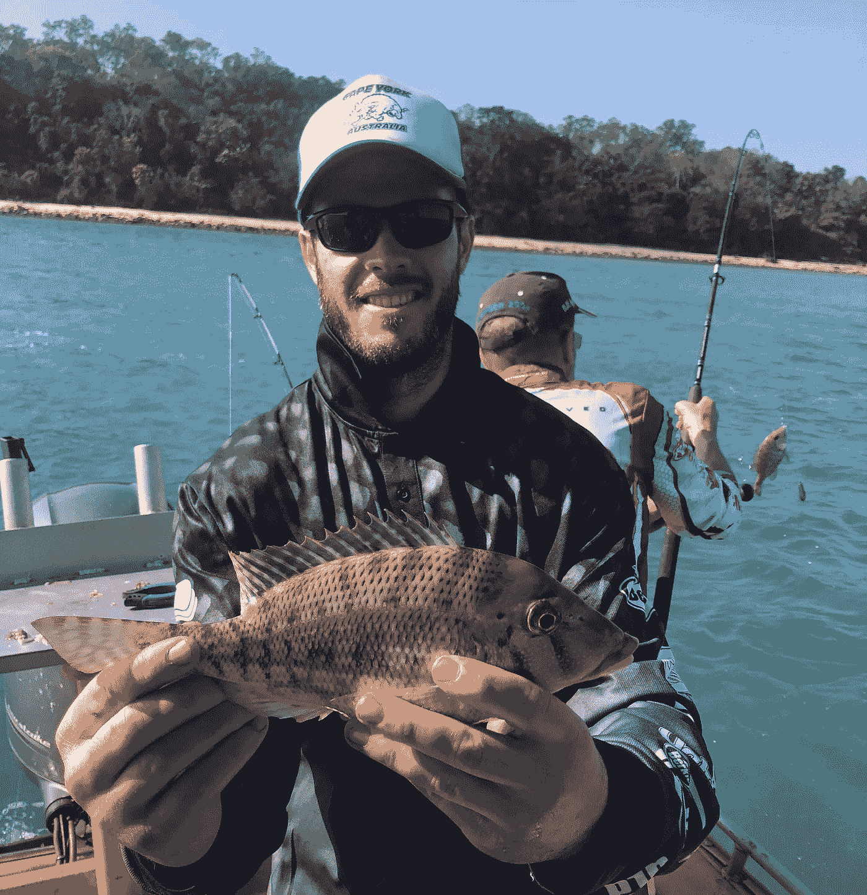

# 想成为一名出色的问题解决者吗？像渔夫一样思考。

> 原文：<https://medium.datadriveninvestor.com/want-to-be-a-great-problem-solver-think-like-a-fisherman-9a6b49638760?source=collection_archive---------18----------------------->

Image by [Volker Lekies](https://pixabay.com/users/lekies-82131/?utm_source=link-attribution&utm_medium=referral&utm_campaign=image&utm_content=209112) from [Pixabay](https://pixabay.com/?utm_source=link-attribution&utm_medium=referral&utm_campaign=image&utm_content=209112)

为自己和周围的人解决问题的能力是一项重要的生活技能。它不仅能让你把世界变得更好，也是一份有利可图、令人满意的职业的基础。

典型的问题分为三大类:战略、战术和操作。每一个都需要非常不同的技能和方法来解决。

## *战略*

当没有成功的明确定义和/或没有足够的资源来实现预期结果时，就会出现战略问题。

在战略层面，理解为什么你想要的结果是重要的，以及追求它将如何限制你追求其他结果的能力(即[机会成本](https://www.investopedia.com/terms/o/opportunitycost.asp))是至关重要的。

例如，如果我想抓鱼，在我去购买任何设备之前，我需要回答几个关键的战略问题:

*   为什么？是为了好玩还是因为我想吃鲜鱼？
*   我想钓哪种鱼？
*   我需要在什么样的海洋或河流中钓鱼才能钓到它？

得到我想要的鱼的一个选择是请一个朋友的朋友帮我抓一条，这个朋友碰巧是个渔夫。然而，通过让别人替我抓鱼，我将自己暴露于[委托代理问题](https://en.wikipedia.org/wiki/Principal%E2%80%93agent_problem)。

当一个人(我的熟人)可以代表另一个人(我)做决定和/或采取行动时，就会出现这种情况。如果我的熟人没有动力为我的利益而行动，他们可能会自己行动，把鱼据为己有。为了克服这一点，我可以制定一些激励措施，包括:

*   提出付钱给他买鱼。
*   支付他捕鱼设备的费用，并让他保留任何额外捕获的鱼
*   承诺以后和他分享我抓到的鱼。

然而，如果我想抓鱼取乐，激励别人帮我抓鱼将是一个错误。这就是为什么理解你的目标背后的“为什么”是至关重要的。

**要解决一个战略问题，先确定你想钓的鱼，以及在哪里可以钓到。或者确定你想要的鱼，并激励其他人为你捕捉它。**

## *战术*

当你对成功有一个清晰的定义，也有实现成功的资源，但你的策略不起作用时，战术问题就出现了。回到我们钓鱼的例子，如果我知道我想钓的鱼以及在哪里可以找到它，我的下一个挑战就是让它上钩。这意味着要弄清楚:

*   我应该用的诱饵
*   我需要的钓竿和线轴的类型
*   一天中鱼最活跃的时候

可以提高其有效性的常见战术变化包括:

*   时间-例如，选择一天中不同的时间钓鱼
*   强度-例如，同时使用多根鱼竿
*   位置-例如，尝试在不同的河流中钓鱼
*   规模-例如，租用一艘配备更多设备和专业技术的渔船

解决战术问题是工程师和科学家经常处于最佳状态的时候。如果给予所有权和责任，有明确目标和所需资源的、有技术头脑的人会找到解决方案。

相反，担任专家角色的人通常不擅长解决战略问题。他们更喜欢交付有形和具体的结果，不太可能问更高层次的问题:我们追求的是正确的结果吗？或者说，这是对我们有限资源的最佳利用吗？

**要解决一个战术问题，确定你需要什么装备才能钓到你想要的鱼。**

 [## 女性领导给你的企业带来的五大优势|数据驱动型投资者

### 从通用汽车和好时到 Ulta Beauty 和百思买，世界各地的大型企业都在证明…

www.datadriveninvestor.com](https://www.datadriveninvestor.com/2020/11/20/five-advantages-female-leadership-brings-to-your-business/) 

## 操作的

如果战略是合理的，战术是有效的，那么挑战就变成了执行。再次回到钓鱼，如果我知道我想钓什么，在哪里可以找到它，并有合适的设备，我的问题是时机和技术。我可能面临的运营挑战包括:

*   我使用了正确的铸造技术吗？
*   我是否以适合我当前位置的方式设置了钻机？(例如:我的鱼饵在水中是否足够深？)
*   我应该对我的位置做一个小小的改变吗？(例如:我应该沿着海滩走几百米吗？)

解决运营挑战就是要知道何时以及如何执行不同的策略。战术是工具箱，经验是知道使用什么工具。有时，工具箱中可能没有可用的工具。这是时候回到战术或战略层面，重新评估了。

**为了解决你的操作问题，在尝试不同策略的同时练习钓鱼技巧，直到你找到一个有效的组合。**

问题越复杂，就越难将它的战略、战术和操作部分分开。有些问题需要你在这三个层面都做出调整。

然而，解决方案将在很大程度上取决于首先解决最高阶的问题。试图在战术层面解决一个战略问题，就像试图在海洋中抓一条淡水鱼。

## 摘要

要成为一个有效的问题解决者，了解你所面临的问题是战略性的、战术性的还是操作性的是至关重要的。

战略问题需要看到全局的能力，战术问题需要技术洞察力，操作问题需要关注细节和执行。

下面是一个简单的清单，可以作为识别您所面临的问题类型的有用起点:

1.  我有具体的结果吗？
2.  我有足够的资源吗？
3.  我是否创造了激励措施来促进我想要的行为和结果？
4.  我有具体的设备和技能来交付我想要的结果吗？
5.  我的执行有效吗？

解决问题是一个动态的过程。你可能需要一步一步来，然后备份清单。例如，如果你的策略不再奏效，你可能需要更多的资源来尝试新的策略。如果你没有足够的资源，你可能需要调整结果。

如果有疑问，像渔夫一样思考！

Catching a ‘sweet lips’ off the coast of far North Queensland

**进入专家视角—** [**订阅 DDI 英特尔**](https://datadriveninvestor.com/ddi-intel)