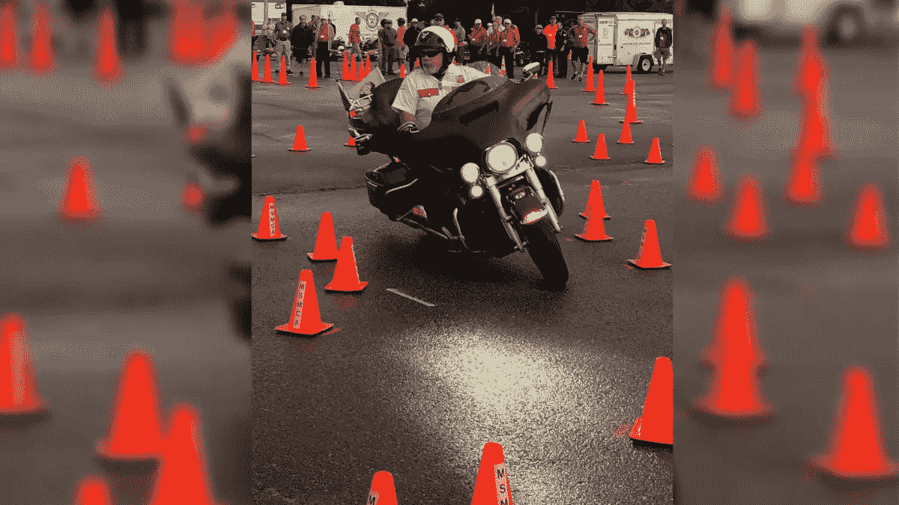

# 想成为更有效的问题解决者吗？目光移开

> 原文：<https://medium.datadriveninvestor.com/want-to-be-a-more-effective-problem-solver-look-away-c008ff209b04?source=collection_archive---------21----------------------->

Riding through an obstacle course

## 我喜欢骑摩托车。我喜欢参加摩托车竞技比赛。要想在这两方面都做得好，骑手需要将目光转向别处以避免灾难。这同样适用于解决问题。

有一个术语首次用于第二次世界大战战斗轰炸机飞行员训练，用来描述飞行员在扫射或轰炸过程中如何意外撞上目标。飞行员会太专注于目标，以至于他们会忘记退出跑道，然后无意中撞上目标。最近，当学习如何骑摩托车时，教练会试着教你转弯时不要看路边。把你的头和眼睛从目标上移开实际上会让你避免撞到路边。当跑障碍跑道时，有经验的骑手不是在看他们现在的转弯，而是在看他们想要遵循的清晰的路径，以避免撞到圆锥。这个术语叫做目标固定。

什么是目标固定？

粗略地定义，目标固定是一种行为，在这种行为中，一个人变得如此专注于一个单一的对象，以至于他们倾向于骑(或驾驶或飞行)直接撞上它。你可能听说过亚伯拉罕·马斯洛(Abraham Maslow)用另一种方式表述的目标固定——“我想，如果你唯一的工具是一把锤子，那么把一切都当成钉子是很诱人的。”

假设你面前的问题就像街上的坑洞。当你一直盯着坑洞看的时候，越靠近坑洞就越大。如果你继续盯着，或者看着坑坑洼洼，你就会撞到它。骑摩托车的时候，解决的办法就是看着坑坑洼洼旁边平整的路面。当你看着，并把注意力集中在坑洼周围的光滑路面上时，摩托车会跟着你的目光而不会在坑洼中触底。学会转移视线可能很难，但这对自行车和骑手的健康非常有用。

 [## 想知道领导是谁？请他决定。数据驱动的投资者

### 一个有效的领导者能为组织提供的最有价值的东西之一是决策能力…

www.datadriveninvestor.com](https://www.datadriveninvestor.com/2019/01/25/want-to-know-who-the-leader-is-ask-him-to-decide/) 

**目标固定会阻碍问题的解决**

解题也是一样。我们一直盯着这个问题，不断向自己强调，持续关注这个问题。我们总是以同样的方式看待问题。当你转换视角，审视问题时，你就向新的解决方案敞开了大门。例如，如果您的组织正在经历销售额下降，首先想到的问题可能是销售人员没有做好自己的工作。也许那个销售人员过去有其他问题。管理层变得专注于一个目标，认为问题在于销售人员。因此，一个解决办法是解雇那个人，再雇一个人。但是，如果公司进一步研究这个问题，看看围绕这个问题的情况，他们可能会发现他们的竞争对手推出了一种它不知道的新产品，并夺走了销售，或者竞争对手开辟了一个新的分销渠道，或者引入了一种新的代码，使你的产品功能更少。一个新的销售人员不能解决这些问题。

> 罗素·阿科夫说过——“我们失败更多是因为我们解决了错误的问题，而不是因为我们用错误的方法解决了正确的问题。”

当我们专注于一个单一的解决方案时，我们会阻碍或消除所有的创造力，以不同的方式来看待问题。我们创造了自己的限制性边界，阻止我们回过头去质疑问题的原始框架。我讨厌用“跳出框框思考”这个词。有些人说“忘记盒子”。要成为建设性的问题解决者，我们确实需要一些限制。例如，如果你的公司生产扳手，但销售额下降了，你就不能把生产喷气发动机作为解决方案。那真的是开箱即用，但不实际。你可以更有效地观察这个盒子。把盒子倒过来或翻过来。

有效的问题解决者会提出问题，然后倾听

解决问题的最重要的工具之一是思考和提出正确的问题。您需要使用不同类型的问题来帮助确定问题是什么，问题的程度和背景，解决方案的潜在障碍，以及帮助团队达成解决方案的问题。

> "你可以通过磨练提问能力来提高解决问题的能力。"迈克尔·j·盖尔布

解决问题的一个同样重要的工具是听——不是听——而是听。大多数人不听，因为他们只是在等待对方停止说话，这样他们就可以开始说话了。当其他人都理解你所听的深度，问与陈述相关的可靠的、发人深省的问题时，你就有能力找到更好的解决方案。

正如马可·奥勒留所说，我们应该“倾听任何人对公共利益的建议。”

如果你专注于一个问题，无论它是一个坑洼，一个障碍，一个销售下降，零件的物流问题，关键人员离开，无论它是什么，你都会击中它。看看你想去哪里，而不是你在哪里，自行车和组织就会去那里。要解决你的问题，你需要看得更远。一边，上下，左右。

> “不管你认为你能，还是你认为你不能——你都是对的。”―亨利·福特

Spevak Associates —参观[frankspevak.com](https://frankspevak.com/)

我帮助企业主、创始人和企业家重新聚焦他们的目标，重振他们的创新，重新激发他们的领导力，从而帮助他们重回成功的轨道。30 多年来，我一直在为各种公司开发市场、产品、服务和员工，这些公司有大有小，有公共的也有私营的，有国际的也有国内的。

游览 frankspevak.com。