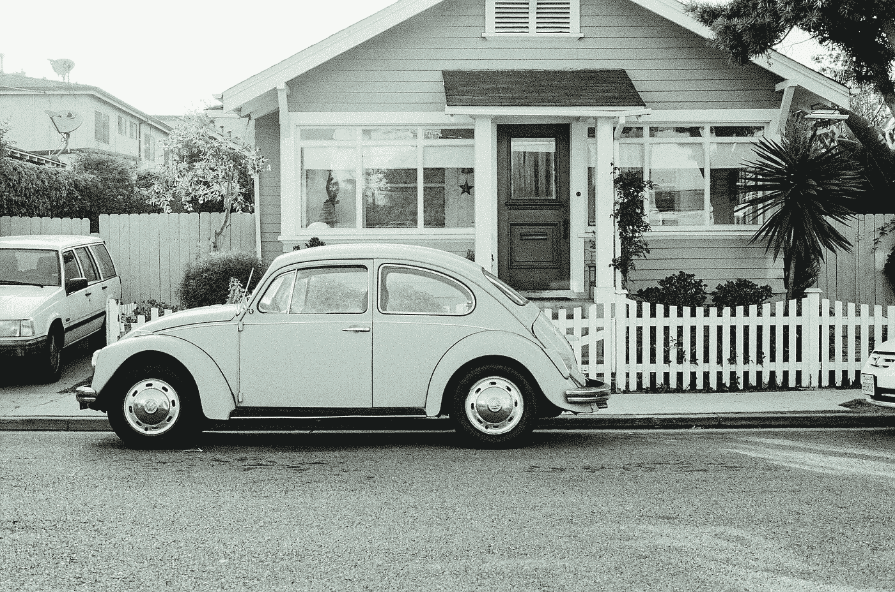
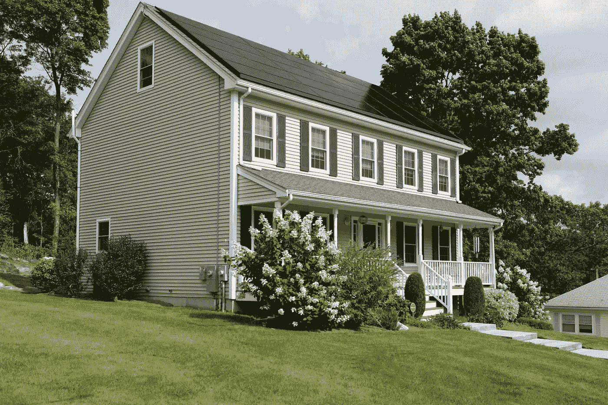
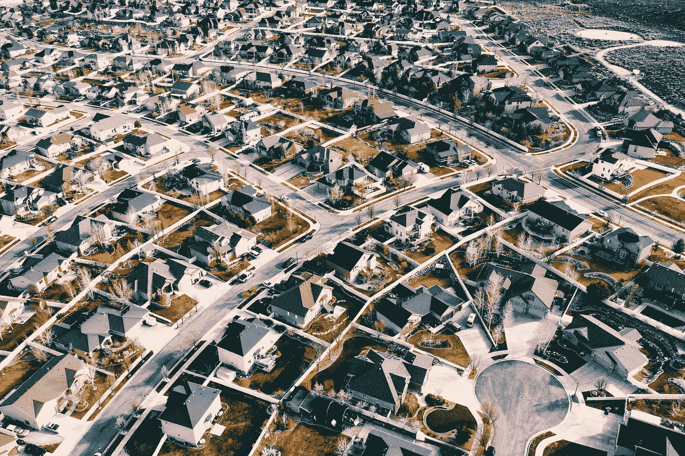
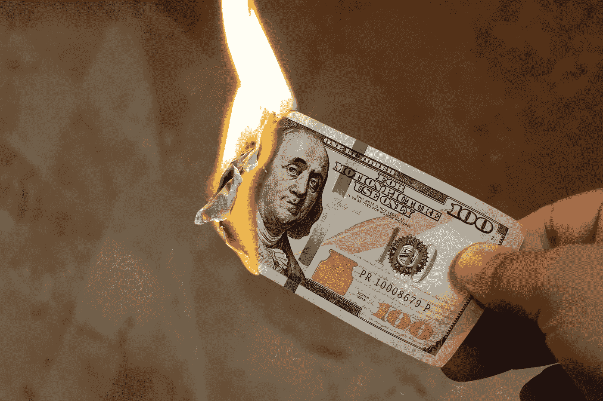

# 想成为房地产投资者？

> 原文：<https://medium.datadriveninvestor.com/want-to-be-a-real-estate-investor-808a99481a23?source=collection_archive---------12----------------------->

## 了解如何评估单户出租房的价值

Image by [JayMantri](https://pixabay.com/users/jaymantri-362084/?utm_source=link-attribution&utm_medium=referral&utm_campaign=image&utm_content=405876) from [Pixabay](https://pixabay.com/?utm_source=link-attribution&utm_medium=referral&utm_campaign=image&utm_content=405876)

投资独栋出租房是积累财富的绝佳机会。如果你在一个好地区以一个好价格买了一套好房子，谨慎地使用债务，并且运营良好，你将有一个月现金流的流来补充你的收入，并以高回报率增长你的股本。

> 为了明智地投资，你需要知道你想要的资产的价格和价值，这样你才能确保你得到的比你付出的更多。投资时一定要有安全边际。

价格很容易，因为它经常被宣传，但价值可能更难确定。有些人天真地认为价格和价值是一样的，不可能买到低于其价值的东西。这不仅是不正确的，而且他们错过了以优惠价格购买资产的机会。

正如我下面所展示的，以低于评估价值的价格购买房地产需要付出努力，但肯定是可能的。

## 概观

为什么有些人会以低于价值的价格卖掉房子？有时，卖方会因为个人原因而急于出售，并会以折扣价出售，以快速转移房产，可能该房产是出租的，但业主希望退出房东身份，房子是空的，每月都要花费他们的钱，或者可能由于某种原因，房子被忽视，在市场上待得太久，这使人们失去兴趣，因为他们认为它有问题。

> 有很多原因可以促使某人低价出售，作为投资者，你的工作就是识别这些将帮助你积累财富的资产。

记住，如果他们能在对他们来说重要的时间范围内得到更好的价格，他们不会卖给你，所以买他们的房子，即使是打折，也是在帮助他们解决问题。

有几种方法可以估算单户出租房屋的价值，但由于大多数房屋是由想住在那里的人而不是投资者购买的，我认为查看可比销售是最好的方法。这是一个很好的方法来估计价格，评估师会想出你的财产，这代表了一个耐心的卖家在正常市场上可以得到什么。

房地产经纪人可以帮助你，但如今很容易在 Zillow 或 Redfin 上找到同一地区过去一两年类似房屋的实际销售价格 (不询问上市房屋的价格，因为这些房屋可能会或可能不会以要价出售)。

Photo by [Vivint Solar](https://www.pexels.com/@vivint-solar-1479731?utm_content=attributionCopyText&utm_medium=referral&utm_source=pexels) from [Pexels](https://www.pexels.com/photo/white-2-storey-house-2850472/?utm_content=attributionCopyText&utm_medium=referral&utm_source=pexels)

您将希望查看最近的销售情况(而不是当前的销售情况)，然后根据卧室、浴室、平方英尺的数量和房产的年龄来过滤结果。这个搜索的结果将会给你你所需要的信息来做你的价值评估，我推荐你基于每平方英尺的价格。

对于每个搜索属性， ***我总是建议使用一个范围，这将有助于你开发一个保守的估计。*** 所以如果你想给一栋 2000 平方英尺的房子估价，可以看看 1800 平方英尺到 2500 平方英尺的房子；较大的房屋通常每平方英尺的成本较低，因此包括更多比目标物业大的房屋将有助于您的数字更加保守。如果您使用 1200 平方英尺到 2100 平方英尺的范围，您对每平方英尺价格的估计会更高，给您一个更小的(或负的)安全边际。

## Comps 示例

我想通过一个例子让您更好地了解这个过程是如何工作的。我们举一个[的例子:我在德克萨斯州圆石城快速搜索时发现的一处房产](https://www.redfin.com/TX/Round-Rock/3224-Corrigan-Ln-78665/home/32589237);这是一栋 2363 平方英尺的房子，有四个卧室，两个卫生间，位于一个好地段，有好学校，房子也不太旧，建于 2006 年。这处房产的要价是 317，500 美元或每平方英尺 134 美元。

作为投资者，这是买这所房子的好价钱吗？让我们找出答案。

> 一个业余爱好者可能会根据漂亮的照片或房地产市场繁荣的事实来购买房子，但一个精明的投资者会确保价格低于估计价值，这需要一些调查。

通过将搜索标准更改为过去两年中与相同属性匹配的“已售”房产，我在同一个小社区中找到了四所匹配的房子，如果我将西边的类似区域包括在内，我会得到 11 处房产。我总是想尝试在我的评估中使用至少十个相似的属性，以确保我得到一个好的样本。你不需要超过十个，所以你可以玩过滤器，直到你得到你需要的房子的数量。

***在你的分析中包括哪些区域时要非常小心*** 因为房地产是非常局部的，即使移动一条街道也会给你非常不同的信息。你还应该看看房子的图片和其他信息，以确保它们确实与你正在看的房子相似。新改建的房屋在原始状态下与遭受大规模洪水破坏的房屋之间会有很大的价格差异，所以要确保你是在比较苹果和苹果。你可能需要挖掘一点，甚至使用多个网站来获得你需要的所有信息，但经过一点努力，它应该不会太难找到。我看到一个出售的房子有一个游泳池，所以我把它从列表中删除，因为这将对房地产价值产生相当大的影响。

Photo by [Michael Tuszynski](https://www.pexels.com/@michael-tuszynski-1134777?utm_content=attributionCopyText&utm_medium=referral&utm_source=pexels) from [Pexels](https://www.pexels.com/photo/top-view-photography-of-city-2157401/?utm_content=attributionCopyText&utm_medium=referral&utm_source=pexels)

你可以用任何你最熟悉的工具来分析信息，包括纸和计算器。我喜欢用一个简单的电子表格来记录所有关于胶印房屋的重要信息，特别是它们的销售价格和平方英尺，计算价格是每平方英尺美元。

然后，我将这些房子作为一个整体进行分析，以了解中间值和平均成本(为了保守起见，我使用较小的一个)，这让你对房子的估计价值有一个概念。 我也用更多的统计来衡量数据，比如 P10(第 10 百分位，但如果你不熟悉数学的话就没必要了)。在本例中，十栋房屋的平均价格为 137.20 美元/平方英尺。如果房子的估价是 324，101 美元，比要价略高。我们可以四舍五入到最接近的千位，得到 324，000 美元。

这告诉我，与抵消相比，房子的价格并没有过高，但当只卖大约 6600 美元或比估计价值低 2%时，它没有给出多少安全边际。

> 我喜欢总是试图以低于估计价值至少 10%或 3 万美元(以价格较低者为准)的价格购买房屋，以确保我得到更好的交易，拥有提高回报率的内在权益，并在我得不到我希望的租金或市场疲软时有一个缓冲。

在这种情况下，估计价值的 10%是 32，000 美元，这比固定的 30，000 美元要大，所以我的目标是以低于价值至少 10%的价格购买这栋房子，即 324，000 美元——32，000 美元= 292，000 美元。

因此，基于我要求的安全边际，假设在检查期间没有发现重大问题(这需要额外的折扣来支付维修费用)，我不会为这所房子支付超过 292，000 美元的费用。如果我无法与卖家协商以这个价格买下这栋房子，那么我会继续寻找另一栋房子。当然，一旦你建立了你的商店，你就可以观察你所在地区的待售房屋，看看什么时候有房子以接近你想要的折扣价出售。

## 还有一点

另一个你必须经常做的计算是你估计的每月现金流。你不想买一栋租金不够支付所有费用(包括房贷)的房子。

> 拥有负现金流的房子意味着你每个月都要从口袋里掏钱加入投资来支付账单，这不是一个好情况，也不是一个积累财富的好方法。

Image by [Intellectual](https://pixabay.com/users/intellectual-4717896/?utm_source=link-attribution&utm_medium=referral&utm_campaign=image&utm_content=2113914) from [Pixabay](https://pixabay.com/?utm_source=link-attribution&utm_medium=referral&utm_campaign=image&utm_content=2113914)

细节不在本文讨论范围之内，但是你可以使用一个像[房产评估器](https://realestatetools.com/property-evaluator/)这样的应用来进行计算，并确认你将会有正的现金流。 ***记得用保守估计给自己留个安全边际！***

## 摘要

当你投资独栋出租房产时，就像任何投资一样，你可以寻找找出价值的方法，然后只购买售价低于其价值的房产。这种降价将通过内在权益提高你的回报，并在你对租金或维修的假设不成立的情况下给你一个安全边际。

请注意，以这种折扣率买到房子并不容易，但这就是游戏的名字。不要买你喜欢的第一套房子，而是大海捞针，你将踏上积累大量财富的道路。

举一个个人例子，我用上述方法以 40，000 美元的价格买下了我最近的两个投资公司，这给了我 80，000 美元的净值，作为我在这个过程中付出额外努力的回报。那些房子仍然出租，有正的现金流和坚实的升值，帮助我实现我的财务目标。

> 这是我所知道的积累财富的最好方法之一。

请在下面留下你的评论，让我知道你在积累财富的征途上进展如何。

## 资源

以下是一些相关文章，您可能会觉得有用:

 [## 积累财富的秘密

### 当我通过寻求价值购买投资性房地产时，我如何产生权益。

medium.com](https://medium.com/datadriveninvestor/the-secret-to-building-wealth-cab646114422)  [## 你可以投资房地产，方法如下

### 我用来投资独栋出租的资源。

medium.com](https://medium.com/datadriveninvestor/you-can-invest-in-real-estate-heres-how-fecbd1c2318b)  [## 如何(以及为什么)开始涉足房地产

### 最重要的第一步。

medium.com](https://medium.com/money-clip/how-and-why-to-get-started-in-real-estate-8a2e4e0ab50) 

*我与列出的任何网站都没有关系，也没有从任何合作伙伴或我的文章推荐中赚钱。我不是律师，会计师，或注册理财规划师。所有材料都是基于我的知识和经验，出于提供信息的目的而真诚呈现的。它无意取代专业建议。在做出任何法律、税务或财务决定之前，你都应该向专家咨询。*