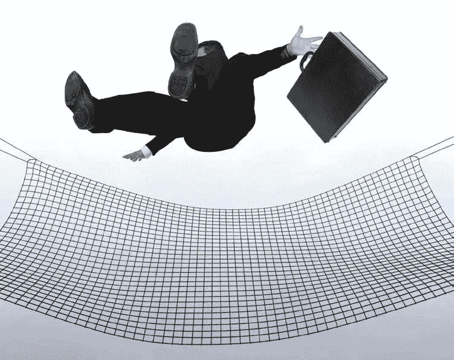

# 想成为企业家？建立更好的安全网。原因如下…

> 原文：<https://medium.datadriveninvestor.com/want-to-be-an-entrepreneur-build-a-better-safety-net-heres-why-1c8dea83a1ed?source=collection_archive---------25----------------------->

**反思企业家和安全网**

在许多方面，企业家已经成为新的摇滚明星。对我来说，成长就是韦德、斯拉什和博诺(当然还有文斯·尼尔)。如今是贝佐斯、马斯克和扎克伯格。但是，如果成为一名企业家如此神奇，为什么没有更多这样的人呢？如果这么有回报，为什么大部分人还在美国企业界埋头苦干？天知道我花了 20 年的大部分时间在大公司磨砺它。

当然，有很多原因。然而，我认为有一个极其重要的原因我们并没有谈论太多——金融安全网。我认为，缺乏足够的金融安全网阻碍了很多人走上创业之路。

 [## 不见面就做交易？风投和企业家的 5 个指南|数据驱动…

### 自从 covid 六个月前登陆美国以来，全球的风险投资家和企业家都不得不适应新的现实…

www.datadriveninvestor.com](https://www.datadriveninvestor.com/2020/09/20/doing-deals-without-meeting-in-person-5-guidelines-for-vcs-and-entrepreneurs/) 

对失败和财务破产的恐惧是一个非常强大(也是理性的)的动力，促使人们留在企业界，努力工作以获得一个月的薪水——即使这有时会令人心碎。一般人通常喜欢避免潜在的财务损失、不眠之夜以及失败带来的公开羞辱。是的，我明白了。这些都是强有力的威慑。

最近，我参加了一个硅熨斗企业家不插电活动。这位接受采访的企业家提到，在他的公司成立之初有几年不景气，而且肯定没有在他预期的时间框架内发生。有许多早期的失望，该公司不得不作出一些重大的转变。

然后他说了一些我认为极其重要的话。他说，在许多情况下，创业的最佳时机是在你没有什么可失去的年轻时候，或者是在你有机会建立财务安全网之后的较晚阶段。现在，我毫不怀疑，有许多企业家没有遵循这个时间表，却获得了成功。然而，我发现他的观点很有趣，而且是我没有听到人们谈论的观点。强大的金融安全网可以让个人承担创业风险，不幸的事实是，并非所有的安全网都是平等的。

**并非所有的安全网都是平等的**

我不断受到我遇到的企业家的启发。他们自由选择挑战，勇敢地努力克服成功的障碍。这种勇气从来不是我与生俱来的。在职业选择和冒险方面，我总是倾向于保守路线。我来自一个会计师家庭——保守深深地融入了我的 DNA。

然而，我知道每一个成功的人在他们的生活中都有一些重大的信仰飞跃。他们必须抛弃某种形式的惯例，对自己下赌注，制定一个计划，忽略反对者(可能每个人都有这种感觉)，最重要的是有勇气迈出第一步。那是一些相当重的东西。难怪更多的人不去做。

毫无疑问，这个等式的一部分是金融安全网。有些人就是没有，不能冒这种风险。

我在生活中学到的一件事是，有些人有惊人的安全网。拜托，我们都见过这些人。他们有“太阳马戏团质量”安全网。他们的安全网是由太空时代的技术纤维制成的，全新的，绷紧的——一件美丽的东西。即使经历了最大的飞跃和最大的失败，他们也不声不响地击中了那张严密的安全网的中心。网完全吸收了他们的下落，并迅速将他们反弹回空中。他们滑到球网的一侧，完成一个短暂而优雅的后空翻回到地面，然后轻快地跳回梯子再次跳跃。

嗯，我可以告诉你——那不是我的安全网！

在我职业生涯的大部分时间里，我的安全是一件看起来相当悲伤的事情。忘掉太阳马戏团吧——我的安全网是几捆松散、松散地挤在一起的干草。你知道我在说什么。有很大的缺口，一些松散的沙子倒在顶部。想象一下 20 世纪 30 年代大萧条时期一个贫穷的县集市上的马戏团。

从技术上讲，我的“安全网”会阻止我坠落，可能会让我活下来。然而，如果我跌倒了，我就不可能再跳起来。如果我撞到这东西，我的身体会砰的一声撞到干草上，然后滚向一边。没办法，我是蹦跶迅速回到梯子上再次飞跃。

年轻的我可能永远不会承认这一点。然而，现在我长大了，我很确定我不是一个人。我很确定大多数安全网看起来和我的很像。对于为什么我花了 20 年的大部分时间在企业界磨砺出恐惧，我没有任何误解。我一直(并且痴迷地)担心我的安全网。正如我所说的，我很确定我不是一个人。

恐惧是一种强大的力量。我知道有些人会说什么。他们会说恐惧是必要的。恐惧会让你的注意力集中在手头的任务上。我确信这其中有很多道理。然而，恐惧也会让你寸步难行。我怀疑这种类型的恐惧阻止了很多人进行创业飞跃——我认为这是不幸的。

随着年龄的增长(如今已经老得令人不安)，我越来越明白，我们都在以某种方式与我们的安全网的规模和质量作斗争。在某种程度上，这就是为什么我喜欢帮助企业家。我在底特律一个非常普通的郊区长大。我看到人们克服障碍和挑战，努力建设更美好的生活。我喜欢帮助那些需要帮助的人。我发现这一挑战鼓舞人心。

我不是假装有答案。也许对开始新事物的恐惧是成功的主要因素之一。也许这种恐惧确实会产生专注的努力。也许恐惧是必要的组成部分。

或者，也许恐惧正在阻碍我们拥有更多的企业家。也许这是人类进步的最大障碍。我想知道有多少变革性的想法和企业从未实现，因为恐惧太大了。我怀疑这是一个很大的数字。可悲的是，我们可能永远无法从这些梦想中获益。

正如我提到的，我不知道答案—我只是想知道…

建立更好的安全网。找人帮忙。

安全网不仅仅是金融方面的。安全网可以是精神的、社会的、金融的和教育的。如果你目前正在与一个有问题的安全网斗争——寻求一些帮助。有许多人经历着同样的恐惧和同样的挑战。建立一个更好的安全网的一部分是从那些每天都这样做的人那里得到帮助，从那些在你之前的人那里得到帮助。你放松、专注于手头的任务、真正冒险的能力与你下面的安全网有很大关系。

反正这几天也是这么想的。根据记录，韦德和斯拉什比贝佐斯和扎克伯格更适合做摇滚明星。扎克伯格不可能戴礼帽穿黑色皮裤。只是说…

马克·帕特森 2020，版权所有

**访问专家视图—** [**订阅 DDI 英特尔**](https://datadriveninvestor.com/ddi-intel)