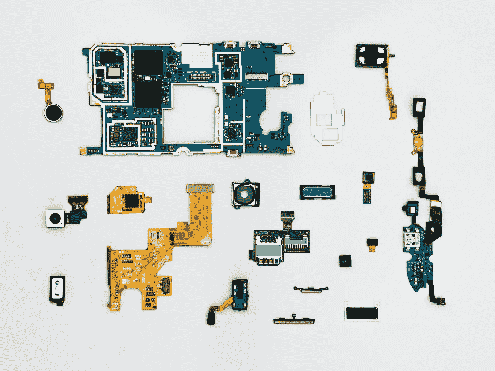

# 想学机电一体化？

> 原文：<https://medium.datadriveninvestor.com/want-to-learn-mechatronics-eee54dc1b174?source=collection_archive---------32----------------------->

## 机电一体化基础介绍…

# 介绍

***机电一体化*** 一词由 ***机甲+电子一体化*** 组成。其中 ***机甲***——意思是机械装置。和 ***tronics*** 为电子学。这个推导是由一家日本公司 *Yasakawa 电气公司*给出的。机电一体化不是*电子和机械甚至计算机工程*的结合。

# 机电一体化的关键要素

*   建模的物理系统
*   传感器和执行器
*   信号和系统
*   计算机和逻辑系统
*   软件和数据采集

# 工业范围

即使在现在，机电一体化在许多领域都有广泛的应用。但是未来机电一体化的范围将会很大。由于机电一体化和机器人技术的发展，工业领域将会有显著的增长。机电一体化范围在以下领域:

*   专家人工智能产业
*   数据通信和网络
*   动态引擎和机制
*   人机引擎界面
*   工业自动化过程管理

# 机电一体化产品分类:

机电产品分为四类。

**第一类产品:**

I 类产品由伺服技术、电力电子和控制理论支持。

*主要是机械产品+电子。*

**示例:**制造机械中的数控机床和变速驱动器。

**二类产品:**

II 类产品的出现得益于早期计算和存储设备的可用性以及传统机械系统的定制电路设计能力，传统机械系统具有显著更新的内部设备，包括外部用户接口。

*传统机械系统+更新的电子设备*

**例** : unalter 缝纫机及自动化制造系统

**三类产品:**

III 类产品严重依赖微处理器和集成电路来代替机械系统。保留传统机械系统功能的系统，但内部机制是电子的。

*传统机械系统+内部机械被电子取代*

**例子**:数字手表。

**第四类产品:**

最后，IV 类产品通过机械系统和电子产品的集成，标志着真正机电一体化系统的真正开始，这些电子产品通过协同集成采用机械和电子技术设计

**例子:**照片复印机、智能洗衣机和烘干机、电饭煲和自动烤箱。

# 机电一体化！下一步是什么🤔🤔

机电一体化在过去的 45 年中不断发展，对于一些工程师来说，机电一体化已经成为一种特殊的产品。对于其他工程师来说，机电一体化并不新鲜，它是设计的哲学方法，为他们的活动提供指导。当然，机电一体化是一个不断发展的过程，而不是一个革命性的过程。传感和传感器融合将是机电一体化系统获得的下一个能力，许多机电一体化单元已经具备了基本的传感能力，例如，现代空调单元能够通过单独的传感器感知空气温度和湿度，并通过模糊逻辑推理融合信号。

别忘了留下你的回答。✌

大家敬请关注！！想把我的故事发到你的邮箱，请订阅我的新闻信。

感谢您的阅读！不要忘记给你的掌声，分享你的回答，并与朋友分享！！