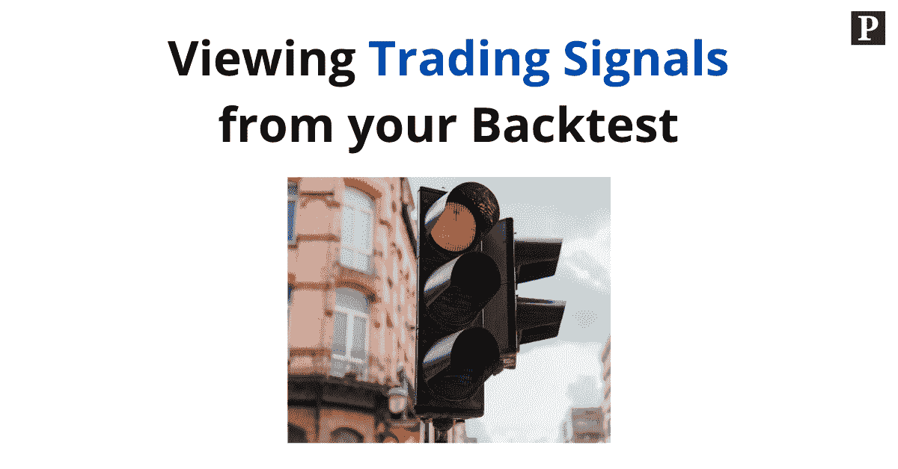
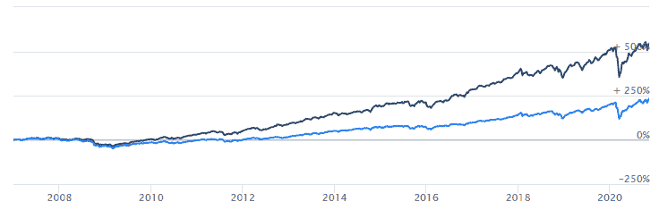
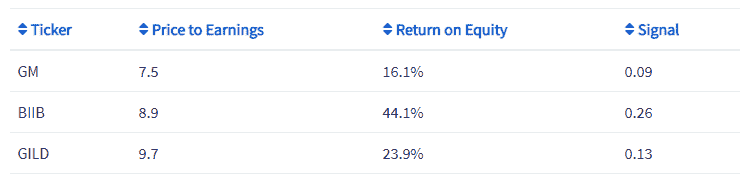

# 想查看魔术公式的交易信号吗？查看我们的回溯测试软件。

> 原文：<https://medium.datadriveninvestor.com/want-to-view-trading-signals-from-the-magic-formula-check-out-our-backtesting-software-88b81b4c070d?source=collection_archive---------7----------------------->

unsplash.com

大家好，我很高兴分享一个新功能，它允许你在回溯测试结果中查看你的交易策略产生的信号。

这一功能将为您的[回溯测试](https://pyinvesting.com/blog/12/heres-why-every-investor-should-backtest-their-investment-strategy/)带来更大的透明度，让您了解为什么您的投资策略会根据您的交易信号选择某些股票。

# 什么是交易信号？

交易信号是投资者用来决定是否买入或卖出股票的指标。

例如，价值投资者可以依靠市盈率来决定是买还是卖股票。低市盈率是买入信号，因为股票价格相对于其收益来说很低，而高市盈率是卖出信号。

有许多可能的交易信号类型。日内交易者和摇摆交易者倾向于看技术指标，如均线，波动性和价格的其他技术模式，以形成他们的交易信号。具有长期观点的投资者依赖基本面数据，如市盈率(PE 比率)、股本回报率(ROE)和利润增长，作为买卖股票的指标。

# 我如何组合交易信号？

谈到交易信号，投资者通常有多种偏好。例如，乔尔·格林布拉特的[神奇公式](https://www.investopedia.com/terms/m/magic-formula-investing.asp)依赖于收益和资本回报率。

然而，将这些信号组合在一起并不像将它们相加那么简单。这是因为收益的潜在价值范围与资本回报率非常不同。为了使收益信号与资本回报率信号具有可比性，我们需要对信号进行标准化。

这种标准化是通过使用 [z 值](https://en.wikipedia.org/wiki/Standard_score)来完成的，我们使用信号的平均值和标准差来调整信号。通过标准化收益和资本回报率，我们现在可以将这两个信号加在一起，形成一个同等加权的整体信号。

这个整体信号被用来排列我们的股票，这样我们就可以从我们的投资组合中找出最好的股票和最差的股票。

# 我如何查看我的交易信号？

要查看您的交易信号，请单击顶部导航栏中的“结果”按钮，并选择回溯测试结果。如果你在此之前还没有创建回溯测试，那么看看这篇关于如何创建回溯测试的教程。

举个例子，我用乔尔·格林布拉特的神奇公式选择了一个基本面回溯测试。该策略每年从一篮子 150 只美股中选出市盈率(PE 比)最低的前 30 只股票和净资产收益率(ROE)最高的股票。这种策略对标准普尔 500 表现不错，年回报率较高，为 14.4%对 9.0%，波动性较低，为 19.3%对 20.3%。

pyinvesting.com

向下滚动到结果页面的信号部分。在这里，你会发现一个信号表，在你的回溯测试中使用的每一列都有不同的交易信号。右边的最后一列显示了从每个单独的交易信号的 z 分数计算的整体交易信号。

您可以通过单击蓝色列标题，根据特定列对表格进行排序。这有助于你了解你的股票在每个交易信号中的排名。

根据市盈率(PE 比)交易信号排序，我们可以看到，在我们的投资组合中，通用汽车、Biogen 和吉利德科学的市盈率(PE 比)最低。

pyinvesting.com

根据净资产收益率(ROE)交易信号排序，穆迪、洛克希德·马丁和 Clorox 的净资产收益率(ROE)最高。

pyinvesting.com

# 结论

对大多数人来说，回溯测试软件往往是一个黑匣子。我们输入回溯测试的详细信息，运行回溯测试，并查看回溯测试者选择的股票。

然而，我认为了解回溯测试者使用的实际信号以及总体交易信号是如何根据 z 分数计算出来的是有用的。

我希望这个新的信号表能帮助你理解为什么回溯测试者选择了你当前投资组合中的各个股票，并帮助你根据它们的交易信号对这些股票进行排序。

如果你想看看这个新特性的实际应用，我邀请你使用神奇公式[创建一个基础回溯测试](https://pyinvesting.com/backtest/fundamentals/)。

祝你投资愉快，并祝你好运。