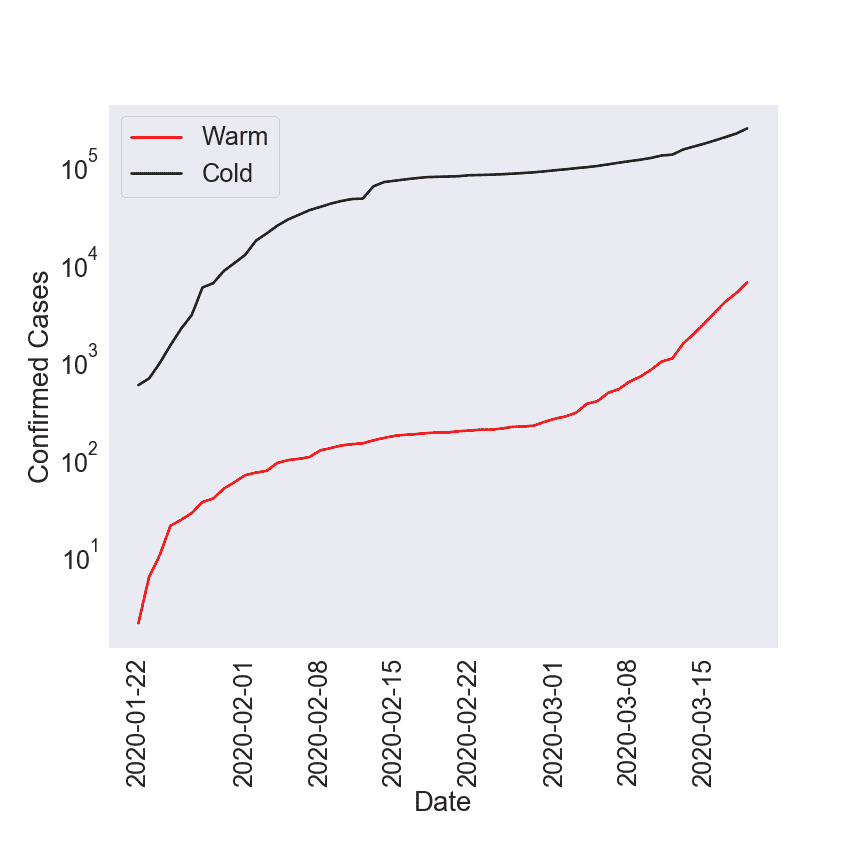
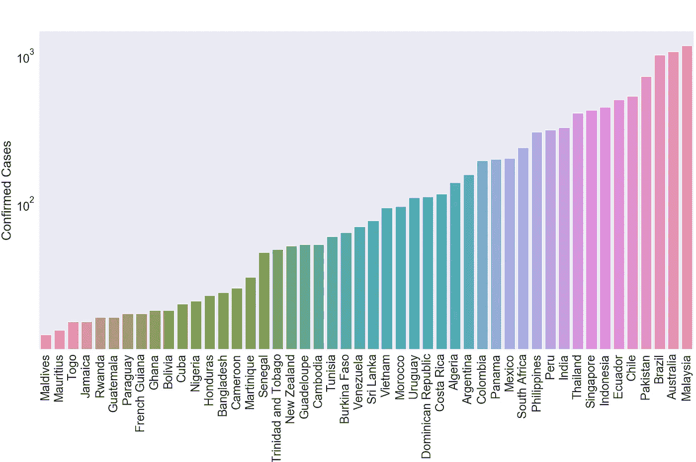
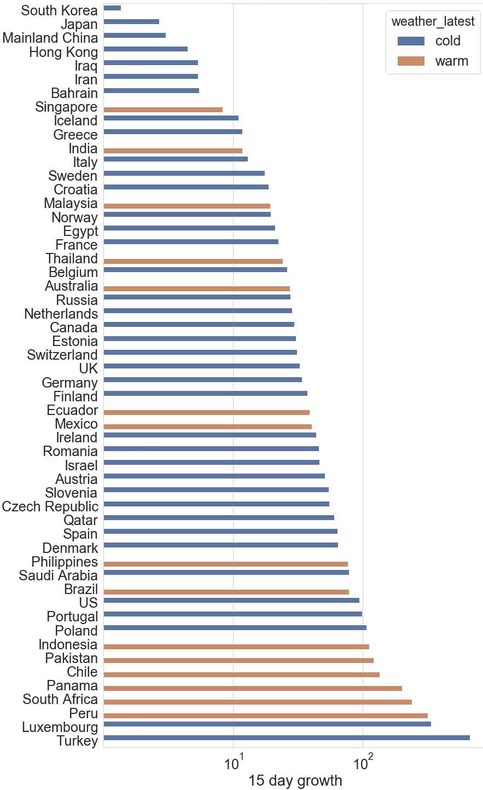
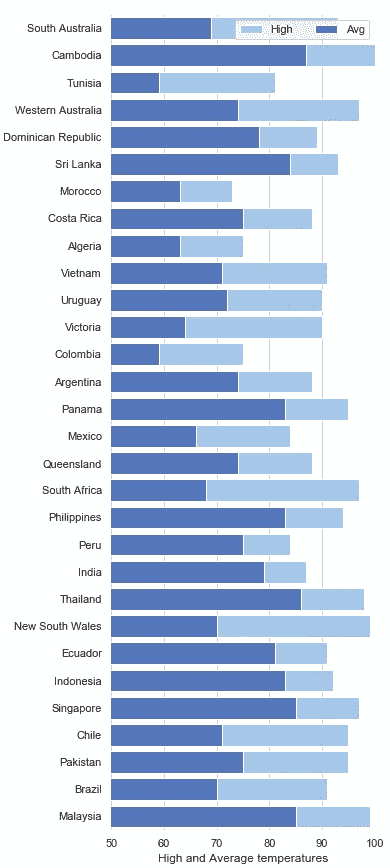

# 温暖的天气不会抑制新冠肺炎的传播

> 原文：<https://medium.datadriveninvestor.com/warm-weather-will-not-curb-the-spread-of-covid-19-aaed9f5322c6?source=collection_archive---------15----------------------->

## 我们需要现在就行动。

Photo by [Aleksandr Eremin](https://unsplash.com/@notevilbird?utm_source=medium&utm_medium=referral) on [Unsplash](https://unsplash.com?utm_source=medium&utm_medium=referral)

## **总结**

有明显的证据表明温暖的天气不会阻止病毒的传播。这对联邦、州和地方的政策决定有着巨大的影响。我们现在必须行动起来，制定类似于加州、伊利诺伊州和纽约州的严厉措施，目标是尽快实现零病例。

## **背景**

冠状病毒疾病 2019，或新冠肺炎最近被世卫组织归类为疫情。美国目前有超过 32，000 例活跃的病例，纽约，加利福尼亚和伊利诺伊州已经实施了全州封锁，以限制疫情的爆发。然而，没有其他州颁布封锁或采取迅速、严格的行动来控制疾病，可能是因为人们预期夏季带来的温暖天气将减缓病毒的传播。因此，当务之急是了解温度和病毒传播之间的关系——温暖的天气会减少新冠肺炎的传播吗？

 [## 医疗保健的未来正在被一场大型技术入侵所塑造|数据驱动型投资者

### 过去十年，全球经济的所有部门都经历了大规模的数字颠覆，而卫生部门现在…

www.datadriveninvestor.com](https://www.datadriveninvestor.com/2018/11/02/the-future-of-healthcare-is-being-shaped-by-a-big-tech-invasion/) 

目前，绝大多数病例来自较冷的国家(定义见附录)，如中国、意大利和西班牙。我们知道，在寒冷国家，感染人数呈指数增长，如图 1*图 1* 所示，而且增长没有停止的迹象。温暖国家的病例数量是寒冷国家的一小部分，这使得一些人认为温暖的天气降低了病毒的传播性。然而，自 3 月初以来，温暖国家(如澳大利亚和新加坡)的感染人数出现了显著增长(*图 1，2* )。*图 2* 揭示了温暖国家的最新确诊病例数，清楚地表明病毒已在众多温暖国家传播。我们将试图更好地理解这一点，并讨论其对政策的影响。

*Figure 1:* Comparison of the number of confirmed cases in warm and cold countries. Warm countries have begun to see significant growth since early March.

*Figure 2: The number of confirmed cases for the warm regions as of March 21, 2020\. This shows that the virus has spread to numerous warm countries.*

## **温暖和寒冷国家的病例增长速度有多快？**

显然，寒冷和温暖的国家都经历过疫情，但在这些地区感染人数的增长速度有多快？我们计算了过去 15 天的病例倍增因子；即在过去 15 天中感染增长的次数。这表示增长幅度或 R0。*100 倍的比率表示病例数在过去 15 天内增加了 100 倍。请注意，早期在湖北省，病例每 15 天增加 10 倍。*

*同样显而易见的是，几乎所有国家都在以超过 10 倍的速度增长(也就是说，今天有 50 个病例，你可以预计在 15 天内至少有 500 个，一个月内有 5000 个，等等。)此外，有多个国家的增长率超过了 100 倍，如土耳其、南非和智利。最重要的是，温度和疫情增长幅度之间似乎没有关联。也就是说，许多温暖的国家正经历着与寒冷国家相似的变化率，这表明温度对疫情的增长没有可察觉的影响。这对联邦、州和地方的政策制定有着巨大的影响；我们不能指望夏天的到来来阻止疾病的爆发。*

**

**Figure 3: The 15-day growth for all countries with more than 200 cases. This shows that both warm and cold countries increase at substantial rates and temperature appears to play no role in the spread of the virus.**

## *含义*

*温暖的天气很可能无法抑制病毒的传播；北半球夏季的到来不会阻碍也不会减缓病毒的传播。新冠肺炎疫情不会在夏天结束，除非国家、州和地方政府现在采取行动。*

*在州一级，每个州都必须实施封锁，如纽约、加州和伊利诺伊州。州政府必须确保他们的医疗基础设施为大规模爆发做好充分准备。最好采取紧急和积极的行动，以便尽快将病例数减少到零。*

*在联邦一级，有必要动员军队，授权生产诸如呼吸机、口罩等用品，以及其他相关的医疗保健用品。政府还必须与各州政府合作，确保案件数量降至零。此外，一场人道主义危机可能会在卫生保健系统薄弱的国家爆发。许多国家——特别是撒哈拉以南非洲、南亚/东南亚和拉丁美洲——都没有能力应对如此规模的危机。因此，政府必须监管国际旅行，直到生产出可行的疫苗。*

## *附录*

*温暖国家的定义:被定义为温暖的国家有:"阿尔及利亚"、"安提瓜和巴布达"、"阿根廷"、"阿鲁巴"、"澳大利亚"、"孟加拉国"、"巴巴多斯"、"贝宁"、"玻利维亚"、"巴西"、"布基纳法索"、"柬埔寨"、"喀麦隆"、"中非共和国"、"乍得"、"智利"、"哥伦比亚"、"哥斯达黎加"、"古巴"、"吉布提"、"多米尼加共和国"、"厄瓜多尔"、"萨尔瓦多"、"赤道几内亚"、"埃斯瓦蒂尼"、"埃塞俄比亚"、"斐济"、"法属圭亚那"、"加蓬"、"加纳"、"瓜德罗普岛"、"关岛"、"危地马拉"、"几内亚"、"圭亚那"、"洪都拉斯"、"印度"、"印度尼西亚"、"牙买加"、"肯尼亚"、"利比里亚"、"马来西亚"、"马尔代夫"、"马提尼克岛"、"毛里塔尼亚"、"毛里塔尼亚" “巴拉圭”、“秘鲁”、“菲律宾”、“波多黎各”、“卢旺达”、“圣卢西亚”、“圣文森特和格林纳丁斯”、“塞内加尔”、“塞舌尔”、“新加坡”、“索马里”、“南非”、“斯里兰卡”、“苏丹”、“苏里南”、“坦桑尼亚”、“泰国”、“多哥”、“特立尼达和多巴哥”、“突尼斯”、“乌拉圭”、“委内瑞拉”、“越南”、“赞比亚”*

**

**Figure 4: High and average temperatures for countries defined as warm. Excluded countries with less than 50 cases as of March 22.**

*这些国家真的温暖吗？我们查看了所有温暖的国家(目前有 100 多个病例)，并获得了自 3 月 1 日以来的最高和平均温度(图 4)。这清楚地表明，几乎所有的国家都有超过 80 华氏度的高温，这证实了我们对国家的选择。*

*感谢阅读。*