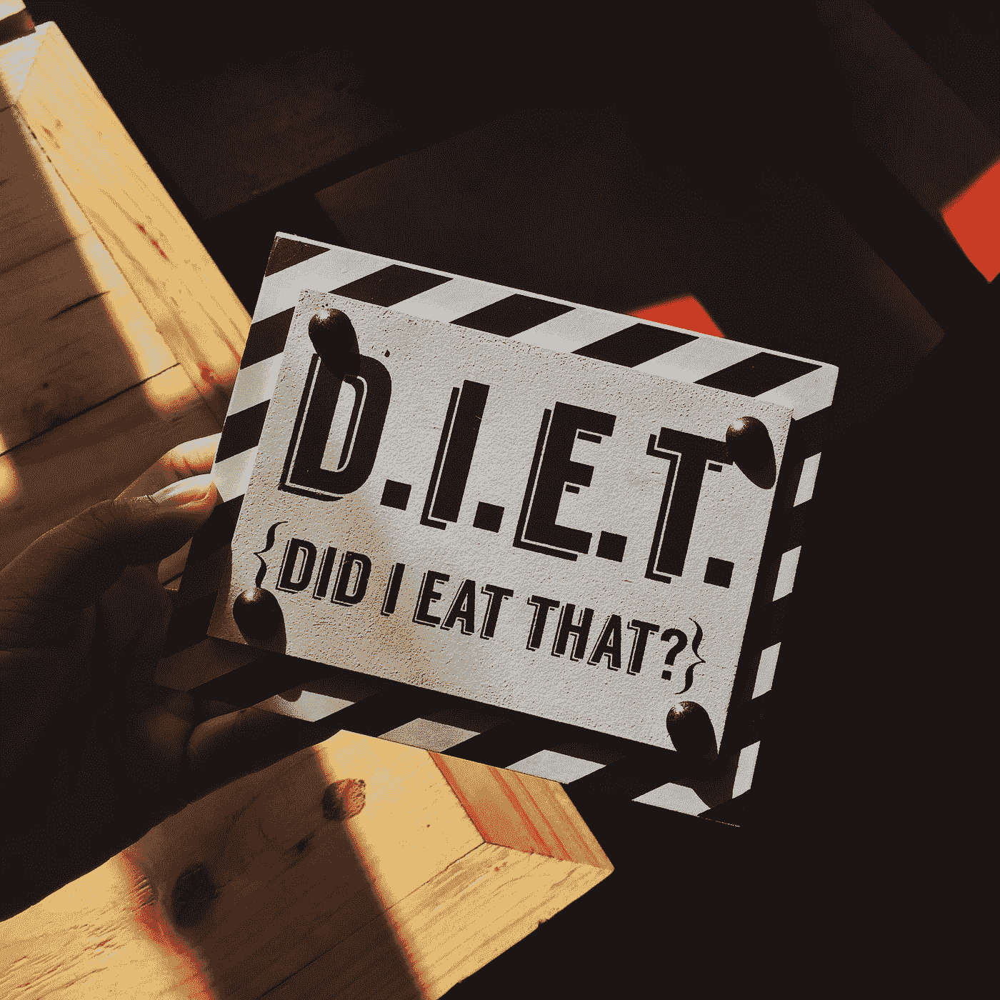

# 华纳音乐集团刚刚斥资 8500 万美元收购了青年流行文化 Instagram memes 公司

> 原文：<https://medium.datadriveninvestor.com/warner-music-group-just-paid-85m-for-youth-pop-culture-instagram-memes-company-fc74f75c33db?source=collection_archive---------12----------------------->

# 从表面上看，今年音乐行业最大的收购之一与音乐无关。

这种对年轻观众的“本土”理解的探索不仅非常受欢迎，而且非常有利可图。理解文化的关键因素是数据。WMG 收购 IMGN 的一个重要原因是，IMGN 是一家在社交媒体上制造流行文化迷因的公司。

该公司的频道目前拥有超过 4000 万订阅者/追随者，每个月的浏览量超过 30 亿次。IMGN 称，这些观众中有 85%是“Z 世代和年轻的千禧一代”，这是音乐行业的一个高度目标人群。

**Barak Shragai 解释了 IMGN 的商业客户:**

> “品牌必须愿意承担风险，进行对话，不要把自己看得太重。他们还需要愿意交易下一代内容的 Z 代货币，其中大部分他们不理解。这就是我们在 IMGN 的工作——最大化每个品牌的社会潜力。”

其最受欢迎的频道大全当然也是如此，该频道在 Instagram 上拥有超过 1500 万的[粉丝。](https://www.instagram.com/daquan/?hl=en)(大全)

Photo by [Jamie Matociños](https://unsplash.com/@jamievalmat?utm_source=medium&utm_medium=referral) on [Unsplash](https://unsplash.com?utm_source=medium&utm_medium=referral)

# 什么是模因？

一种文化或行为系统的要素，可以被认为是通过非遗传的方式，尤其是模仿，从一个个体传递到另一个个体。

 [## 抓住智能营销，获得巨大成果|数据驱动的投资者

### 网上的人都看过。每当人们在谷歌上搜索某样东西，他们最终都会与类似的广告互动…

www.datadriveninvestor.com](https://www.datadriveninvestor.com/2020/08/19/grab-on-to-intelligent-marketing-for-great-results/) 

T4 迷因是一种在人与人之间传播的概念或行为。**模因**的例子包括信仰、时尚、故事和短语。… **行为互联网**迷因**的例子**包括使用脸书和一天几次查看电子邮件。

Photo by [Jon Tyson](https://unsplash.com/@jontyson?utm_source=medium&utm_medium=referral) on [Unsplash](https://unsplash.com?utm_source=medium&utm_medium=referral)

## 迷因的意义是什么？

一个**模因**作为一个单位来承载文化观念、符号或实践，可以通过书写、演讲、手势、仪式或其他模仿主题的可模仿现象从一个头脑传递到另一个头脑。

你如何让一个迷因像病毒一样传播？

为了让一个**迷因成为病毒**，你必须确保它在第一时间被理解它的正确观众看到。

Pinterest 是一个迅速发展的流行文化网站。这个视觉分享点非常适合让图片在网上疯传。

你可以把你的**迷因**放在其他地方，包括你自己的博客和照片分享网站，比如 Flickr。

许多模因也在 reddit 和 9gag 等网站上疯传。facebook、instagram 等网站上也有**的 meme 页面**。开启了许多迷因。

为你自己创建一个，并开始在那里描绘它，你永远不知道它是否是好的和新鲜的，然后很有可能你会**让**有人把它贴出来。

杰奎琳·杰克斯撰写

[***返回本周简讯第 1 页:***](/@JacquelineJax/jax-daily-music-news-social-media-influencers-making-5-million-a-year-82ab2cd91094)

[***见本刊第 2 页***](/@JacquelineJax/hipgnosis-songs-fund-next-phase-of-growth-with-hundreds-of-millions-of-dollars-to-spend-8267c9b8b045?sk=72d7fe26447b72085f9b6fa62d256675)

**获取专家观点—** [**订阅 DDI 英特尔**](https://datadriveninvestor.com/ddi-intel)