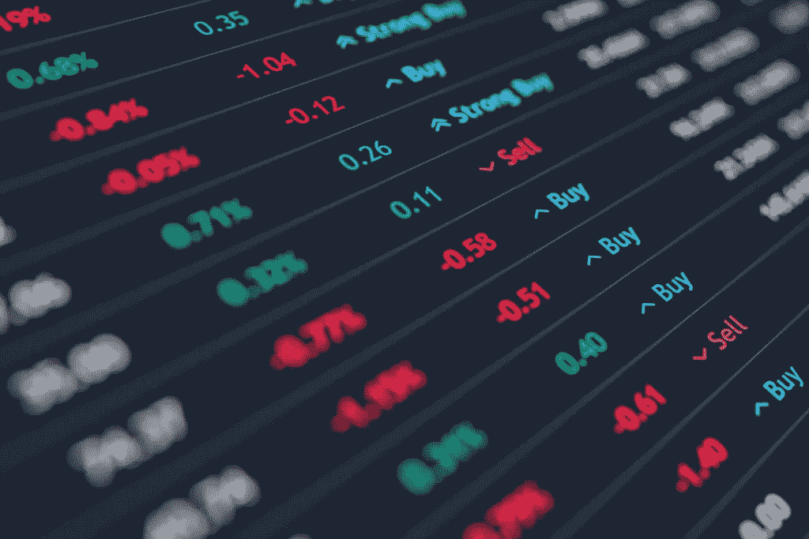

# 2020 年的警告信号——步履蹒跚的市场

> 原文：<https://medium.datadriveninvestor.com/warning-signs-for-2020-the-faltering-market-42613d1c8290?source=collection_archive---------12----------------------->

18 世纪的经典哲学家埃德蒙·伯克曾经说过，“不了解历史的人注定要重复历史。”但当经济开始偏离有文字记载的历史时，你该怎么办？

你做最坏的打算，抱最好的希望。

# 外表会骗人。

截至 12 月，美国有史以来第一次成功地开始和结束了一个没有衰退的十年。

但是不要让那愚弄你。

尽管美国经济在过去十年中取得了一些成功，但其背后的原因仍值得高度怀疑。

# 从底层开始。

经济学家对最近 10 年的经济扩张持续如此之久给出了相当多的原因，但他们大多认为这是因为美国在上个十年开始时处于如此低点。

我们都记得 2008 年的危机。全国无数人失去了他们的退休金和一生的积蓄。

 [## 为什么包容性财富指数比 GDP 更能衡量社会进步？|数据驱动…

### 你不需要成为一个经济奇才或金融大师就能知道 GDP 的定义。即使你从未拿过 ECON 奖…

www.datadriveninvestor.com](https://www.datadriveninvestor.com/2019/03/08/why-inclusive-wealth-index-is-a-better-measure-of-societal-progress-than-gdp/) 

事实上，美国经济自那时以来一直在增长，这并不令人惊讶，特别是考虑到手机革命后科技行业的爆炸式增长——然而，即使如此，与其他几十年相比，美国在过去 10 年的增长仍然没有那么令人印象深刻……人们开始意识到这一点。

# 警告信号。

一般来说，当人们不再相信时，价格就开始下跌。如果是这样的话，那就准备好上路吧。

研究显示，企业经理和消费者对美国经济未来状态的乐观情绪正在下降。

根据 CFO 杂志:

> 随着人们对经济动荡的担忧日益加剧，悲观情绪似乎已经潜入了一些金融高管的视野。杜克大学和首席财务官研究公司第三季度调查的 225 名美国首席财务官中，超过一半(53%)认为美国将在 2020 年第三季度陷入衰退。

如果最近的发展有任何迹象的话，衰退可能会比这更早发生。

世界大型企业联合会(Conference Board)经济指标主管林恩·弗兰科(Lynn Franco)最近发表公开声明，透露消费者的预期正在下降。正因为如此，她说，“没有什么迹象表明增长，特别是消费支出，将在 2020 年初获得动力。”

换句话说，生产者和消费者的行为都发生了巨大的变化。之前推动经济发展的乐观情绪正在慢慢消退。它现在正在发生。

# 免受经济衰退的影响。

考虑到未来的前景越来越暗淡，你现在能做的最好的事情就是最小化风险。这意味着避开高波动性的高投机性股票，转而选择投资于更广泛的领域，如整体股票市场 ETF 或债券。

或许应该远离高收入房地产基金，转而瞄准低收入住房。

虽然这样的投资会限制你的上升空间，但也会极大地限制你的下降空间。这应该是我们的目标。

用沃伦·巴菲特的话说:

> “当别人贪婪时要恐惧，当别人恐惧时要贪婪。”

今天的单词是:**小心**。