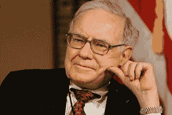
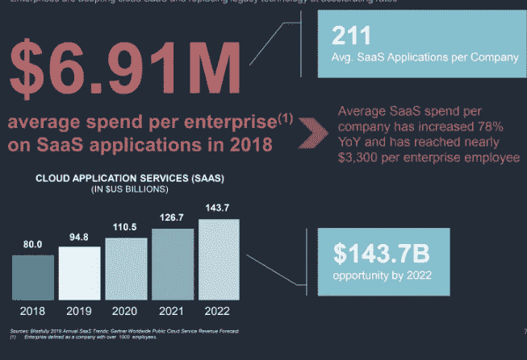

# 沃伦·巴菲特、鲍比·费舍尔和投资的黄金法则

> 原文：<https://medium.datadriveninvestor.com/warren-buffet-bobby-fischer-and-the-golden-rule-of-investing-471d8f883bb3?source=collection_archive---------9----------------------->

## *投资你所知道的*

沃伦·巴菲特的年度[股东信](https://www.berkshirehathaway.com/letters/letters.html)于周末发布。这封广受期待的信件吸引了大量观察人士，他们希望深入了解伯克希尔的运营(他明确提到了[的接班人计划)](https://www.fool.com/investing/2020/02/24/6-big-surprises-from-warren-buffetts-2019-sharehol.aspx)，他对市场的看法[适度乐观，尽管感叹市场的“善变”本质](https://markets.businessinsider.com/news/stocks/warren-buffetts-annual-letter-to-shareholders-biggest-takeaways-2020-2-1028928853)，甚至是他对美国政治的看法(这次他对美国政治保持了[明显的沉默](https://finance.yahoo.com/video/breaking-down-warren-buffett-annual-215240549.html?guccounter=1&guce_referrer=aHR0cHM6Ly93d3cuZ29vZ2xlLmNvbS8&guce_referrer_sig=AQAAAAfBF0In9_i-vpuC1fioYtr3xr8KhqCQeKWUolW-HQm7GMO3iPHihX55wMbAPZysCq9ZbEYAKuC3M2M3lSAT7POawIYpaVQu3dyg8kj23MCb9dzoMgTtdeKc0eQGkbu-8bqaQsgXlbWL0BJ82gV9J-dEBfzpwgEQNtII69tRuGG2))。像往常一样，里面有很多有趣的见解和建议。最能引起我共鸣的一句格言是:

> “我们都是这样或那样的庸才。重要的是要认识到，如果你是鲍比·费舍尔，你必须只为钱而下棋。”

这让我想起了另一个我最喜欢的巴菲特公理。

> “永远不要投资一个你无法理解的公司。”

他的观点是，投资者需要学会如何在他们的“能力圈”内识别和评估企业，并远离其他企业。本质上，当谈到投资时，要保持在自己的领域内。多年来，这个想法帮助我做出了几乎所有的投资决定。当我无视这些建议，冒险走出我的车道时，我总是会遇到不太成功的情况。但是，当你的领域变宽，突然你的能力圈包括了几十个新的行业和领域，会发生什么呢？

在 Revel，我们的能力范围围绕着 B2B 和 SaaS，然而软件解决方案在企业活动各个方面的应用意味着我们的能力范围正在扩大。从[破产索赔市场](https://www.x-claim.com/)到[建筑设备](https://www.tenderd.com/ae/home)到[法律研究](https://trellis.law/)，似乎没有一个企业领域(无论这个行业多么传统)可以免于潜在的 SaaS 申请。这为数据驱动的软件解决方案打开了新的、未开发的市场，也为投资开辟了新的领域，即使在 5 年前，我也不会认为这是我圈子的一部分。

 [## 算法交易的机器学习|数据驱动的投资者

### 当你的一个朋友在脸书上传你的新海滩照，平台建议给你的脸加上标签，这是…

www.datadriveninvestor.com](https://www.datadriveninvestor.com/2019/01/30/machine-learning-for-stock-market-investing/) 

对于我和我在 Revel 的合作伙伴来说，这一切都始于 Adtech — [数据分析应用](https://techcrunch.com/2016/08/14/big-datas-humble-beginnings/)的 1.0 版本。它是第一个接受新媒体设计和测量方式的非数字部门。作为 Revel 的合作伙伴，Joe Apprendi 曾经指出:Adtech 对于大数据就像宇宙大爆炸对于宇宙一样。

自从我们多年前开始衡量广告的表现以来，我们现在可以衡量几乎任何东西的表现——包括人。数据驱动的洞察力正在帮助公司认识到跨企业所有元素的规模效率。此外，在 Adtech 的榜样下，其他行业正在利用大数据和预测技术全面提高效率和准确性。

看看亚马逊在使用数据为整个组织的决策提供信息方面对零售业做了什么。像 [Omnichain](https://www.omnichains.com/) 这样的公司现在使用数据进行供应链管理，或者 [Pathr](https://pathr.ai/) 使用数据驱动的空间洞察力在零售、商业房地产等领域做出更好的实时业务决策。 [LendingFront 的](https://lendingfront.com/)数据驱动技术正在帮助大银行更好地为小企业服务。事实上，在全球企业中，很难想象有哪个领域不会受到利用数据驱动软件解决方案的平台的积极影响。

2018 年，每个企业在 SaaS 应用上的平均支出为[691 万美元。大数据软件和服务市场预计到 2022 年将增长到](https://www.blissfully.com/saas-trends/2019-annual/)[1440 亿美元](https://www.blissfully.com/saas-trends/2019-annual/)，这在很大程度上要归功于 SaaS 平台在多个行业和领域的持续扩张。随着对数据需求的增长，对复杂软件解决方案的需求也将增长，以利用这些机会并完善它们。

在[最近的一篇文章](https://www.forbes.com/sites/forbestechcouncil/2020/02/12/saas-at-middle-age-what-the-future-holds-for-software/)中，保罗·穆马提到 SaaS 正在步入中年。然而，尽管它已经存在了一段时间，但我们似乎仍处于初期阶段。例如，有数不清的后台应收账款和应付账款流程既陈旧又耗时，而且还没有真正从 SaaS 应用程序和市场中受益。需要大量人工开销或过度耗时的提案生成或订单处理以及其他与收入相关的任务对于软件解决方案来说已经成熟。随着建筑、房地产、物流、供应链、公用事业和农业等传统行业都开始获得 SaaS 待遇，就数据和 SaaS 对全球企业的总体影响而言，我们才真正开始触及皮毛。

对于我们这些在广告技术的起源和发展过程中磨练了自己技能的人来说，大数据和人工智能在企业生产力的各个方面的应用意味着“我们所知道的”的范围和部署大幅增加。这意味着我们能够在一系列行业中提供更大的投资价值，更善于在多个领域中挑选赢家，更善于为我们投资的那些公司提供价值。在 Revel，我们将继续听取沃伦巴菲特的建议，投资我们所知道的东西。只是，由于我们在广告技术领域的经验以及 B2B SaaS 平台向企业各个方面的扩展，我们现在所知道的比过去要重要得多。