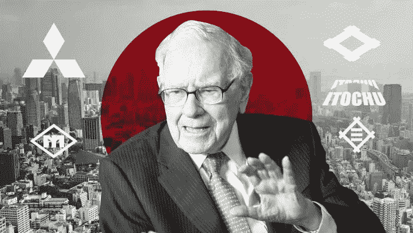

# 沃伦巴菲特的 5 个新的购买是经典的自助餐与扭曲

> 原文：<https://medium.datadriveninvestor.com/warren-buffets-5-new-purchases-are-classic-buffet-with-a-twist-4051e37d158d?source=collection_archive---------17----------------------->

Buffet Bets Big on Japan — Photo Copyright of © FT montage

当沃伦·巴菲特进行收购时，金融媒体会崩溃。头条新闻说他带进了五家日本贸易公司。但如果你仔细观察，这笔交易并不那么令人惊讶。

## 仅在位置上的曲线球

沃伦·巴菲特这些年来发表了很多言论。[有些正确，](https://www.visualcapitalist.com/warren-buffetts-biggest-wins-and-fails/)有些[不那么正确。](https://www.investopedia.com/financial-edge/0210/buffetts-biggest-mistakes.aspx)

一个伟大的投资者会做的一件事是对他们周围的市场状况进行准确的调查。了解风向是有好处的。

巴菲特最近做了一些选择，这些选择是他以前回避的。[他投资了一家金矿公司](https://www.bloomberg.com/news/articles/2020-08-14/buffett-s-gold-averse-berkshire-jumps-into-a-big-bullion-miner)，作为对通货膨胀和美元崩溃的对冲，因为无限制的印钞正在进行。

在真正专注于美国之后，巴菲特在美国之外进行了大量投资。60 亿美元。作为“贸易公司”的一部分公司，它们涵盖了广泛的行业。

他在 1977 年致股东的信中暗示，他热衷于日本贸易公司。这是他们的本性使然。这些是他能够理解的业务，可能会存在很长一段时间。

这证明了这个人的耐心，他一直等到指标看起来合适才扣动扳机。一些我们都可以从中学习的东西。

早到有时可能等同于犯错。

 [## 这么说一家大型风投基金正在投资你的初创公司？4 实际考虑|数据驱动的投资者

### 首先，恭喜你。融资总是需要努力的，一个大的风险投资基金当然是一个大的…

www.datadriveninvestor.com](https://www.datadriveninvestor.com/2020/08/09/so-a-big-vc-fund-is-investing-in-your-startup-4-practical-considerations/) 

## 他的策略

如果某样东西有效，为什么要改变它？

这就是沃伦·巴菲特大部分职业生涯一直在做的事情。用同样的哲学，一次又一次地运用它来巩固他的胜利。

沃伦·巴菲特用来投资企业的估值标准是保密的。但是看看他这些年的购买，有些事情是有规律可循的。

他倾向于选择有以下共同点的公司:

*   不断增长的股息收益率
*   高水平的自由现金流
*   低负债或轻松偿还债务的能力。
*   长期盈利前景。
*   稳定的管理实践。

我写过一些他可以直接收购的公司，这些公司符合他的收购标准。

## 处理整个部门

一个伟大的投资策略是垄断市场的一个特定部分。行业中往往会出现的情况是，它们往往由 2-5 家大型企业主导。在科技、能源、通讯等领域都是如此。

从这个领域获得最大收益的一个方法是在大公司持有重要的头寸。这样，你就覆盖了大部分市场。

例如:

*   支付处理商:投资维萨和万事达
*   消费品:投资沃尔玛和好市多。

这是他以前在航空公司和银行做过的事情。他投资了美国四大航空公司。美国三大银行。

这是他在日本重复的策略。他投资了日本五家最大的“贸易公司”,涵盖了日本经济的很大一部分。

值得注意的是，“贸易公司”并不像你在西方想象的那样。它们是日本独有的。他们是企业集团类型的企业，经营方式类似于这里的私募股权公司。他们投资于一系列多元化的公司，并利用它们的规模、资本和人力资源来充分利用投资。

巴菲特在这里所做的是垄断日本经济的一个重要部分，而不是购买日经 225 指数基金。这样，他可以获得更高的股息和潜在的更高回报。

## 5 项新采购

以下是巴菲特带来的五项业务的简要介绍:

## 三菱公司

这家企业集团涉及七个主要业务领域，包括金融、银行、能源、工业和食品——所有这些都是易于理解的高需求业务。

## 三井公司

这家企业集团涉足多个商业领域，包括能源、机械、化工、食品、纺织、物流和金融。

## 伊藤忠公司

这家企业集团涉足多个商业领域，包括纺织、机械、金属、能源、食品和信息通信技术。

## 马里贝努公司

这家企业集团涉足多个业务领域，包括消费品、化工、能源、金属、航空航天、运输和工业机械。

## **住友商事株式会社**

这家企业集团涉足多个商业领域，包括金属、建筑、运输、基础设施、化工、能源
矿产资源、食品和消费品。

## 离别的思绪

沃伦·巴菲特正在美国以外寻找交易，并且找到了，这一事实很能说明问题。在之前专注于美国市场之后，它可能会向投资者发出信号，表明还有其他值得投资的机会。

资金向亚洲转移已经有一段时间了，如果回报足够稳定，基金经理就会去回报高的地方。

我们都可以从中吸取教训，开始让我们的投资组合更加多样化。

## 如果你想要一本免费的股息投资成功指南电子书，请在下面的链接留下你的电子邮件。

 [## 免费终极指南股息投资成功电子书-千禧年净值之旅

### 当我开始我的投资之旅时，我发现很难在网上找到关于如何投资的清晰信息

millennialnetworthjourney.com](http://millennialnetworthjourney.com/free-ultimate-guide-to-dividend-investing-succes-ebook/) 

**访问专家视图—** [**订阅 DDI 英特尔**](https://datadriveninvestor.com/ddi-intel)