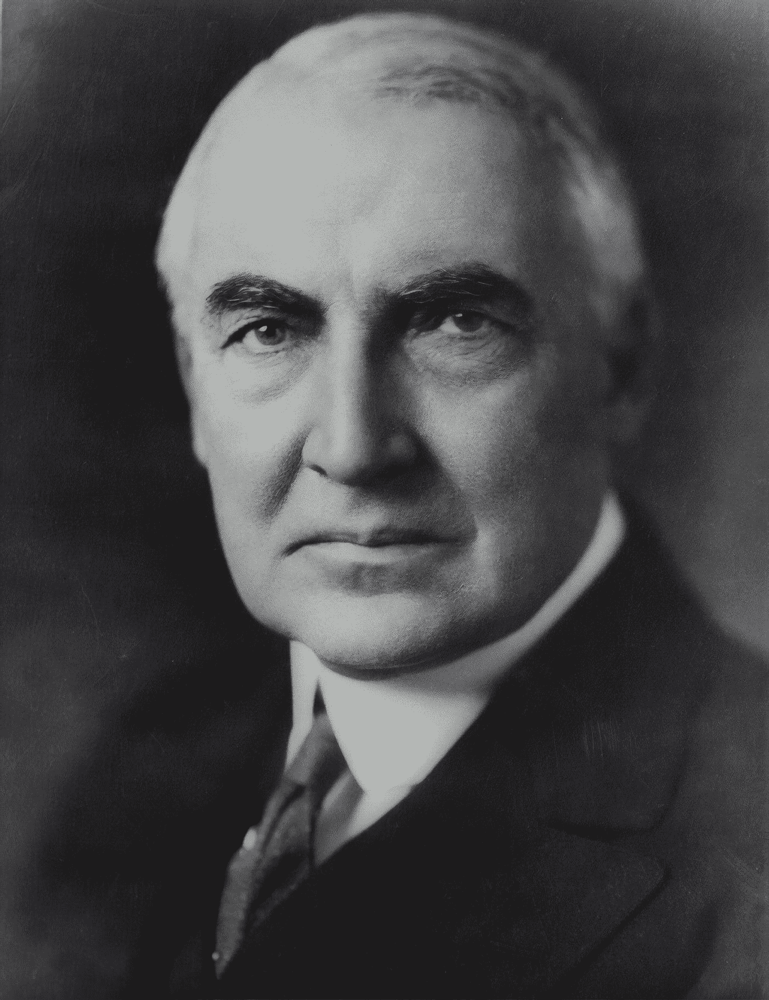

# 沃伦·巴菲特和 30 万美元的发型

> 原文：<https://medium.datadriveninvestor.com/warren-buffett-and-the-300-000-haircut-dcf0090a911d?source=collection_archive---------2----------------------->

## 他 90 岁时成为亿万富翁是有原因的:他在 10 岁时就掌握了复利的力量。我们其他人越早完全理解这一点，我们就会过得越好。

Photo by [Library of Congress](https://unsplash.com/@libraryofcongress?utm_source=medium&utm_medium=referral) on [Unsplash](https://unsplash.com?utm_source=medium&utm_medium=referral)

这位伯克希尔·哈撒韦公司的董事长是有史以来最成功的投资者之一，累计净资产约为 820 亿美元。然而，他在 65 岁后散发了其中近 90%的能量。

沃伦·巴菲特曾经说过:“今天有人坐在树荫下，是因为很久以前有人种了一棵树。”在我们的例子中，*种植、*是投资，*树*是钱。

超过 78 年前，巴菲特进行了他的第一笔投资。从很小的时候起，巴菲特就明白，财富的增长不仅取决于你的钱增长了多少，还取决于它增长了多久。

10 岁左右，他看了一本关于如何赚到 1000 美元的书，直观地把握住了时间的重要性。

五年后，收益 10%的 1000 美元将价值超过 1600 美元；10 年 10%的增长会使它变成大约 2600 美元；25 年后，它会变成超过 10，800 美元；50 年后，它将增加到将近 117，400 美元。“钱就在那里。”

随着时间的推移，这个数字以恒定的速度增长，这种爆炸式的增长方式说明了一笔小数目是如何变成一笔财富的。他可以生动地描绘出这些数字的组合，就像雪球滚过草坪时变大一样。

人们严重低估了复合增长的能力，这些错误随着时间的推移和更高的回报率而恶化。

现在想象一下，你拥有一个年平均复利 8.4%的组织。

举个例子，假设你的公司本周赚了 28500 美元，年复利略低于 1.6%，那么它在 2099 年 12 月 31 日的价值是多少？
答案是:10 万美元

如果你的组织年平均收益率为 4.6%会怎样？这将使该指数在本世纪末达到 100 万美元。

 [## 为市场注入资金——FAANG 继续依靠永久牛市能源|数据驱动的投资者

### FAANG 股票在 FDA 对 COVID 等离子治疗紧急放行的消息下拉高了市场。经过一周的…

www.datadriveninvestor.com](https://www.datadriveninvestor.com/2020/08/24/injection-for-the-market-faang-continues-to-ride-that-perma-bull-energy/) 

现在想象一下，你的组织年复合增长率为 7.7%，仍然低于过去 30 年 8.4%的平均值。这将推动平均价格在 2099 年 12 月 31 日突破 10，000，000 美元。如果你不觉得这些结果令人惊讶，你要么擅长数学，要么你一直阅读速度太快。

只专注于几项投资，并持有数年或数十年，为巴菲特带来了巨大的收益，但可能只会让不那么懂行的投资者头疼。

即使在低到中等的回报率下，长期的持续增长也会将小额资金转化为堆积如山的现金。投资者必须记住这一点。巴菲特漫长的职业生涯提供了另一个教训:要灵活。他年纪越大，就越不像以前那样投资。

几十年前，巴菲特获得了最大的回报。他过去常常买入他能找到的最小、最便宜的股票，比如市场微生物，比如水泵生产商 Dempster Mill Manufacturing Co .和制图公司 Sanborn Map Co。

甚至在十几岁之前，巴菲特就开始以不同的方式思考时间。如果今天的一美元在几年后变得值 10 美元，那么在他看来这两者是等价的。到他 20 多岁的时候，巴菲特考虑复利的方式就像是一种反射。

当他花 31，500 美元买下房子时，他称之为“巴菲特的愚蠢”，因为在他看来，31，500 美元在未来复利后就是一百万美元。

他的朋友和家人经常听到巴菲特在购物时喃喃自语，比如“我真的想要或需要在这个发型上多花 30 万美元吗？”一边琢磨着要不要花几块钱。

对他来说，那天花的几块钱是未来的几千美元，因为他们不能复利。

认识到你今天花费的每几美元是你将来不会有的 10 美元、100 美元或 1000 美元，并不一定会让你成为守财奴。它教会你承认权衡的重要性。你交易越频繁，你就越有可能扰乱复利，不得不从头再来。

现在，耐心和耐力比以往任何时候都更能赋予超能力。

> "如果你买你不需要的东西，很快你就不得不卖掉你需要的东西。"—沃伦·巴菲特

我希望你喜欢你所读的，并带走一些关于投资重要性的有价值的信息。现在，你要决定是用你的钱买一些你并不真正需要的东西，还是投资一个大的安全网，表现得像个专家。

想了解更多关于金钱如何运作的知识，请阅读蒂姆·丹宁的文章:

 [## 沃伦·巴菲特最近对货币运作方式的解释是历史上最重要的解释

### 你拥有的钱的价值正在改变。“债务”及其含义正在发生根本变化。

medium.com](https://medium.com/the-ascent/warren-buffetts-recent-explanation-of-how-money-now-works-is-the-most-important-in-history-2e45461a5969) 

*本文仅供参考，不应视为财务或法律建议。在做任何重大财务决定之前，先咨询财务专家。*

暂时干杯:)

曼文德拉【2020 年 8 月

**访问专家视图—** [**订阅 DDI 英特尔**](https://datadriveninvestor.com/ddi-intel)