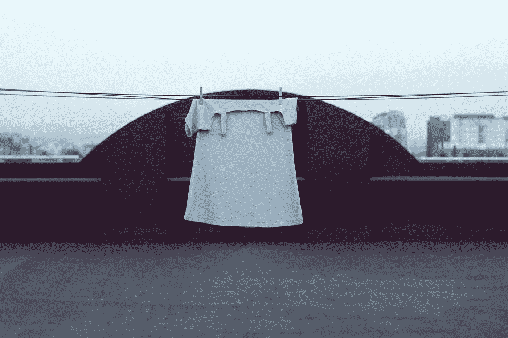

# 穿之前洗干净

> 原文：<https://medium.datadriveninvestor.com/wash-before-you-wear-64339abb0979?source=collection_archive---------44----------------------->

Photo by [Ari Spada](https://unsplash.com/@ari_spada?utm_source=unsplash&utm_medium=referral&utm_content=creditCopyText) on [Unsplash](https://unsplash.com/s/photos/washing-clothes?utm_source=unsplash&utm_medium=referral&utm_content=creditCopyText)

在 COVID 之后，我一直对购买一个感染者可能试穿过的新衣服感到不安。一种感觉更安全的方法是在我穿之前洗一洗。事实证明，如果你不先洗就穿新衣服，有可能几天后你会为它支付另一笔费用。那个代价可能是红的，痒的，痛的。

过敏性接触性皮炎是免疫系统对接触过皮肤的过敏原的反应。它会导致一种延迟反应:在暴露后几天出现皮疹，每次可持续数周。

大学医院克利夫兰医学中心皮炎项目主任 Susan Nedorost 博士说，这通常来自分散染料，这些染料主要用于合成服装材料，如聚酯和尼龙。这些染料可能以较高的浓度存在于新的、未洗涤的衣物中。

出汗和摩擦会导致分散染料从衣服中漏出。由闪亮、有弹性的防水材料制成的合成运动装备通常是罪魁祸首。这最常见于脖子后面和腋窝周围的皮疹。

尚不清楚普通大众对分散染料过敏的普遍程度。但是减少不良反应风险的方法是在穿新衣服之前先洗干净。即便如此，你也可以去掉一点额外的染料，降低曝光度。

硝基苯胺和苯并噻唑是出现在衣物中的另外两种化合物，实验室和动物证据表明它们可能会对健康产生不利影响，包括癌症。虽然这些化学物质中的一些可能仍然“锁”在你衣服的纤维中，但随着你衣服的老化和降解，其他化学物质可能会慢慢进入你的皮肤甚至空气中。

还不清楚暴露在衣服中的这些化学物质是否会让你生病。对纺织工业中化学品使用的调查显示，服装通常用防污剂、固色剂、抗皱剂、柔软度增强剂和其他化学处理剂进行处理。

服装制造商不必向客户披露任何这些信息，而且，许多化合物，包括流行的防水化学品氟表面活性剂(通常被称为 PFAS)，很少或根本没有研究支持它们的安全性。这些化学物质不仅会对公众健康造成威胁，还会最终进入空气和水源，造成进一步的危害。

专家说，在穿衣服之前，最好先洗干净。洗新衣服会减少化学物质的含量，尤其是制造后可能残留的残留化学物质。

对服装的进一步研究表明，合成材料可能比像棉花这样的天然纤维用更多的化学物质处理。但是没有标签指示或认证来确保一件衣服是无化学物质的。