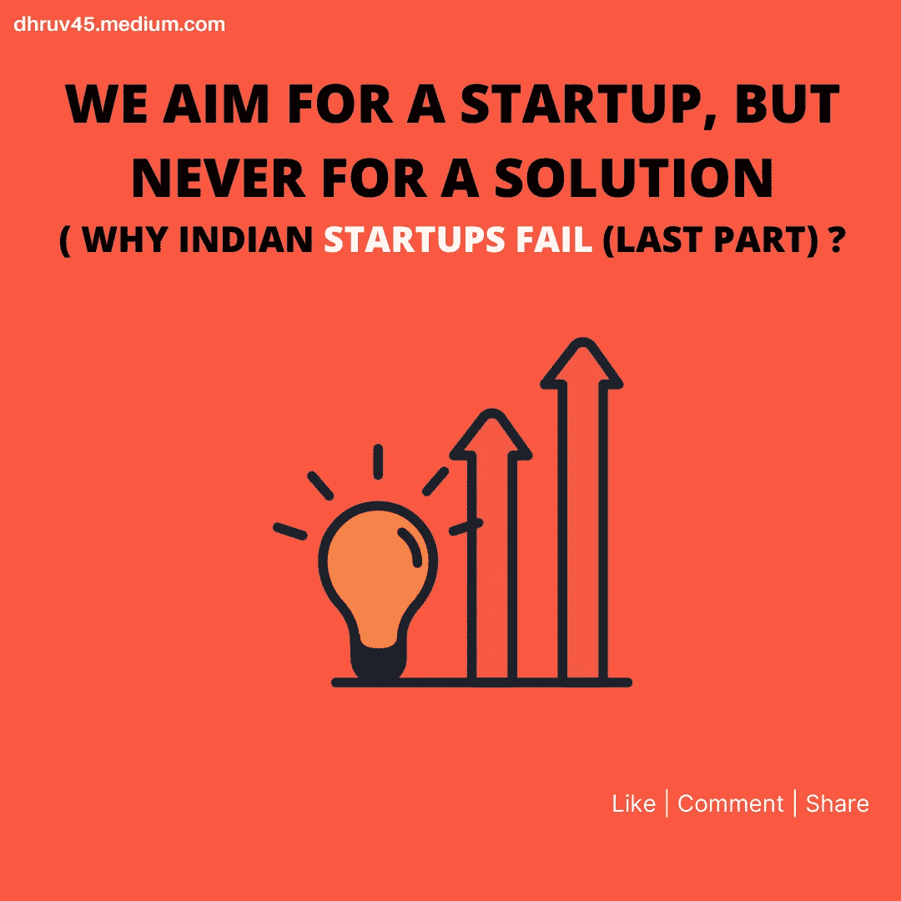
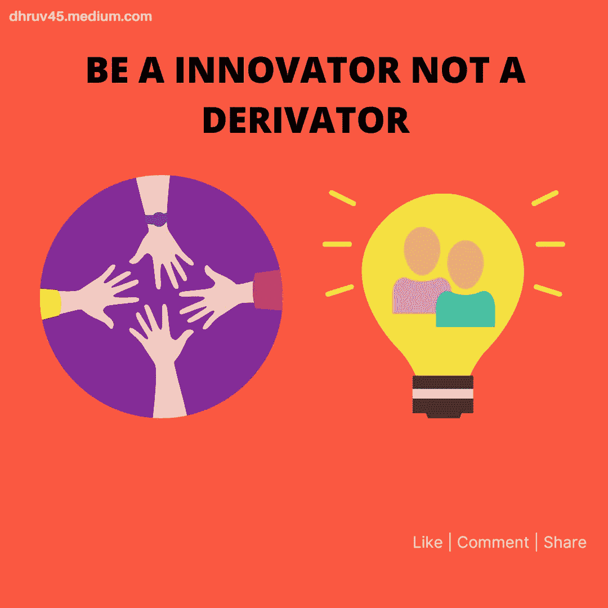
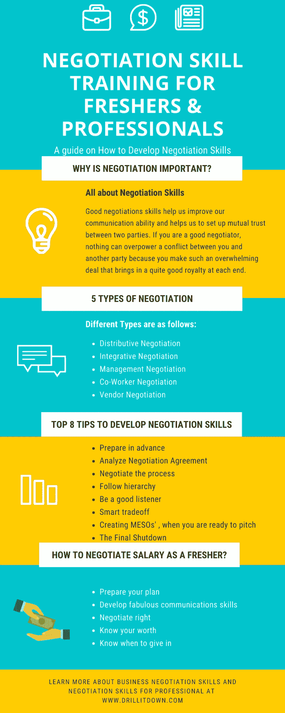

# 我们的目标是创业，而不是解决方案:为什么印度的创业会失败(最后一部分)？

> 原文：<https://medium.datadriveninvestor.com/we-aim-for-a-startup-but-never-for-a-solution-why-indian-startups-fail-last-part-48d69af1b52b?source=collection_archive---------12----------------------->

嘿伙计们，

很高兴看到您回来阅读本系列的第五篇文章，标题是“我们探索，您学习”。

THE CONCLUSION

**列表中以前的文章:**

第一条:“[如果你想创业，你应该问自己的 9 个问题”](https://link.medium.com/wnfYAHOtbab)

第 2 条:[“如何发展谈判技巧的 5 个小贴士？”](https://link.medium.com/jywj4loc89)

第三条:[“如何借助模因预测自己的心态？”](https://medium.com/datadriveninvestor/how-to-predict-your-mindset-with-the-help-of-memes-31ebeb1dc432)

第四篇:[“为什么印度的创业公司会失败(第一部分)？”](https://medium.com/swlh/why-indian-startups-fail-part-1-588183cb5cd6)

> 这一条是第四条的延续。

> 声明:这篇文章是基于我和我的团队所做的研究。这无意伤害任何人的感情。它完全基于我们对所做研究工作的个人理解。欢迎任何建设性的批评。

呜哇！！现在，让我们一起探索每个创新者脑海中最可信的想法。

当我们有任何想法时。我们最终会想到我们可以从这个想法中获得的利润。我们不是开发解决方案，而是开发创业公司。

我们的目标是打造下一个佐马托、下一个 OYO、下一个比特，但我们的目标从来不是打造一个没人讨论的产品。

LEARN TO INNOVATE FOR THE PROBLEMS AROUND YOU.

所以，第一个学习是:

> **独来独往。试着为你当地的问题开发一个解决方案，然后如果你认为消费者最终会从你的产品中获利。拓展你的业务，让它成为下一件大事。**

对我来说，一个人为自己周围的问题创造了一个解决方案，以一种给他带来一些利润的方式，那么他就为别人的生活做出了小小的贡献，基于他的技能，他的创造力，他的思维过程。

然后，这个人最终可以结合自己的行动去开一家创业公司。

所以，第二个学问是:

> **把身边的屎收拾的井井有条。**

如果你想成为一名企业家，你需要成为一名优秀的观察者。从你周围发生的事情中挑选。为你身边发生的事情建立一个强制性的解决方案。

Be a keen observer

例如:如果你看到，一个摊主无法满足正确的观众，帮助特定的所有者得到。对这种帮助收费。

走出市场，了解市场的深度。

所以，第三个学问是:

> 如果你想像梅西那样踢球，你需要一支像巴塞罗那那样的球队

是什么让梅西成为世界上最好的前锋之一？很明显，他的技术。但是，很可能他的团队也是。

当他击球时，他对他的防守，对他的中场球员，对他的守门员非常有把握。所以，当你出去做生意的时候。组建一个你也可以信任的团队。

虽然，第四个学问是:

> **尽力协商**

在开始创业之前，你需要具备一些良好的管理技能。其中一项管理技能就是:谈判。

在你公司的最初几天，这项技能将帮助你以可承受的价格得到最好的人与你一起工作。

这项技能可以帮助你接触到世界上最好的投资者，并影响他们与你合作。

INSIGHTS ABOUT NEGOTIATION

如果你想发展这项技能，我发现了完整的培训课程:

 [## 谈判技巧培训|如何培养谈判技巧的指南

### 为什么我的家人，不理解我的梦想？为什么总是要求我调整？为什么我的每段感情都结束得这么快？为什么…

www.drillitdown.com](https://www.drillitdown.com/negotiation-skills-training/) 

最后的学习是:

> **享受你的旅程**

当你的创业有相当好的发展前景时，你将不得不面对某些现实的考验。你会发现你提供的服务中存在的问题，你会感受到市场竞争的激烈。你将会得到一个所有事情的实际学习，这是你到目前为止所想象的。

我给你的唯一建议是:“*享受这段旅程”。因为，你的公司将会出名，你将永远不会有第二次机会享受生活中的这些时刻。*

目前，我拥有一个名为[www.drillitdown.com](http://www.drillitdown.com)的博客，所以无论何时，我都会被诸如覆盖面、参与度、质量这样的问题吓到。我向自己保证，“耶！博客现在表现得相当好”，事实上，事情需要时间来改善。

所以，每天试着做一些你喜欢做的事情&不要担心你可能会失败或者你可能会目睹成功。

这样，我们就可以结束这篇文章了。那么，告诉我你希望我们下一篇文章的主题是什么？

在我的社交媒体上让我知道这篇文章最精彩的部分。

如果你喜欢这篇文章，请分享！！

请关注我们，了解我和我的团队为您带来的更多内容。

请通过 [Dhruv Trehan](https://www.linkedin.com/in/dhruv-trehan-8a0466156/) 与我联系

THANK YOU FOR READING