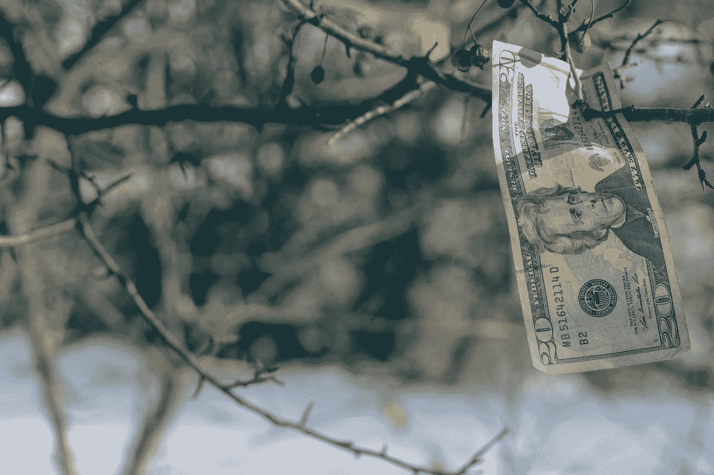

# 我们正在进入恶性通货膨胀，即使新闻说我们没有

> 原文：<https://medium.datadriveninvestor.com/we-are-entering-hyperinflation-even-if-the-news-says-we-are-not-864ebefe8705?source=collection_archive---------9----------------------->

Photo by [Joshua Hoehne](https://unsplash.com/@mrthetrain?utm_source=medium&utm_medium=referral) on [Unsplash](https://unsplash.com?utm_source=medium&utm_medium=referral)

什么是通货膨胀？通货膨胀是商品和服务成本的上升，在很大程度上是由于向经济注入了更多的货币(即美联储印刷更多的货币，并通过降低银行同业拆借利率来扩大货币供应)。

我们的利率处于历史最低点。最低的。低于 2008 年后的水平，当时我们被告知，在我们有生之年，抵押贷款利率永远不会低于 4.5%。

> 我们现在已经接近一半了。

# 商品成本正在上升

尽管低利率似乎是件好事，但情况并非总是如此。以房屋贷款为例，现在因为不同的日子利率在 2-3%左右。

这意味着以前只能支付 1200 美元月供的小乔伊只能获得价值 15 万美元左右的抵押贷款。

现在，在撰写本文时，利率徘徊在 2.9%左右，Joey 现在可以获得价值 180，000 美元的抵押贷款，每月支付相同金额的 20 美元左右。

# 但是杰西卡，利率低不是一件好事吗？

可能是因为这意味着借钱几乎是免费的。这是件好事。

然而，由于利率如此之低，房间里的大象实际上是一夜之间经济价格的上涨。

所以在我们之前的场景中，乔伊只能支付 1200 美元的抵押贷款。如果利率为 5%，他的抵押预算允许他借 15 万美元

再加上 3.5%的首付(因为不管你最喜欢的博主想告诉你什么，大多数人都不会首付 20%)。

乔伊能负担得起大约 15.5 万美元的购房款。

然而，乔伊住在杰克逊维尔，那里的大多数独栋住宅(我们被灌输的认为是保值的)大约在 18 万美元到 20 万美元之间。

乔伊很难过，因为他不想买公寓。他想要一栋带院子的房子。他唯一的选择是买一套公寓，或者等到他有了更多的首付。

## 然后利率下降

所以现在我们的朋友乔伊决定等到他能付得起更大的首付时再等！房贷利率下调了！他的抵押贷款经纪人打电话给他说你可以借比以前更多的钱！

同样是 1200 美元/月的乔伊现在可以获得 18 万美元左右的抵押贷款。

乔伊欣喜若狂！他可以去得到他梦想中的有足够的后院空间打高尔夫球的单身家庭。

他预先批准了 18 万美元的抵押贷款。。。乔伊现在开始关注单户家庭。

> 毕竟，他有额外的 3 万美元可以使用。他现在绝对可以买一栋独栋的房子。

# 只是他不能。

而乔伊通过较低的利率获得了更多的购买力。。。

> 其他人也是

因此，当利率较低时，房价会上涨，因为更多的人有能力购买房产，即使月供相同，他们也能支付更高的总价。

不幸的是，乔伊还是被炒了鱿鱼。

# 但是杰西卡，现在每个人都在买所有的东西，股票市场在上涨，TeeVee 说经济很好。

新闻通常比经济衰退滞后 6 个月。这相当于你的父母发现一首“新歌”或“新节目”所花的时间，即使它已经推出一年了。

# 当新闻报道经济衰退时，它几乎已经结束了

 [## 如何在不牺牲孩子或财务的情况下安全理智地离婚|数据驱动…

### 在美国，七月是以孩子为中心的离婚月。作为 cdfaⓡ的专业人士，我可以向你保证，从长远来看…

www.datadriveninvestor.com](https://www.datadriveninvestor.com/2020/07/28/how-to-divorce-safely-and-sanely-without-sacrificing-your-children-or-your-finances/) 

# 通货膨胀检查表

美联储是否向经济注入了更多资金？是

利率是人为压低的吗？是

住房的实际成本增加了吗？是

食品杂货的价格上涨了吗？是

汽油的成本增加了吗？还没有，因为川普在疫情爆发时购买了石油期货(他并不全是坏人)

工资在增加吗？这甚至不应该是一个问题没有。

当商品成本增加，而消费者的购买力下降(意味着花更多的钱买同样的东西)时，你就处于通货膨胀状态。

让我再说一遍。

> 你没有赚更多的钱，为了生活而买东西的成本在增加。看到问题了吗？

TeeVee 告诉你什么并不重要。这就是通货膨胀的定义，它就在这里。

# 但是杰西卡，很多州投票提高了最低工资，所以我们不用担心通货膨胀

还记得我们的朋友乔伊想买上面故事中的房子吗？同样的情景也适用于一次性全面提高大部分人口的工资。

> 是的，他们会赚更多的钱。但是他们的购买力并没有增加。

# 两类贫困

绝对贫困意味着没有人拥有任何东西。极端贫困的第三世界国家就是一个例子。。。阿巴拉契亚的许多地方。

相对贫穷意味着你的购买力比你周围的人低。与你竞争商品和服务的人。

# 经济竞争因素

这就是为什么我一直讨厌这样的废话:如果你口袋里有 5 美元，你就比世界上 98%的人都富有。

是的，鲍勃牧师，但不幸的是，我不生活在第三世界国家，在那里可以买东西。我住在美国，在那里充其量只能在 Wawa 买到一杯喷泉饮料和半个椒盐卷饼(只有一半，因为整个太贵了)

购买力是通过你能用你的美元获得多少，你拥有多少来与其他买家竞争，以及你的市场中的其他买家(即你的经济竞争对手)可以获得多少来衡量的。

示例 1:

你在阿拉巴马乡下挣 10 万美元你是富有的，因为很少有人能挣到那样的收入水平。你几乎没有经济竞争，因此受益于更高的生活质量。

例 2:你在旧金山挣 10 万美元，你勉强算是中产阶级。你面临巨大的经济竞争，因此生活质量下降。

你能以同样的成本借到更多的钱，这种好处只有在你或少数人能获得资金的情况下才会产生，因为与地理上的经济同行相比，你提高了在收集商品和服务方面的竞争能力。

当每个人都可以获得更多的资金时，尽管你比以前有更多的钱可以花(标价而不是支付价格)，但其他人(你的地理经济同行)也是如此。

# 所以你的情况没有任何改善，事实上你比以前更糟，因为你不得不为同样的东西支付更多的钱，而数量却没有增加。

你没有受益。最好的结果是净中性影响。我要进一步说，这对所有参与者都是负面的。

我想过解决工资停滞的问题，但我觉得大多数人都已经意识到了这一点。

总之，我是否认为我们已经处于通胀状态，由于人为支撑的市场，基础商品和服务的成本正在上升？是

媒体是这么跟你说的吗？没有(但那是另一天的另一篇文章)

我们是否了解了通货膨胀和经济竞争以及这两者如何同时影响生活质量？操他妈的

## 访问专家视图— [订阅 DDI 英特尔](https://datadriveninvestor.com/ddi-intel)