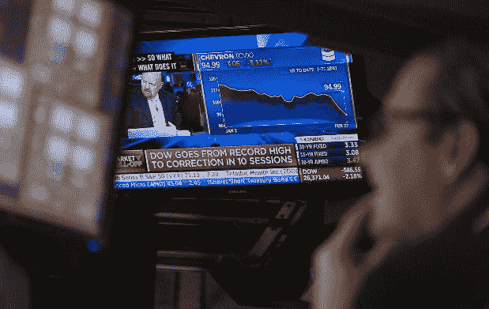
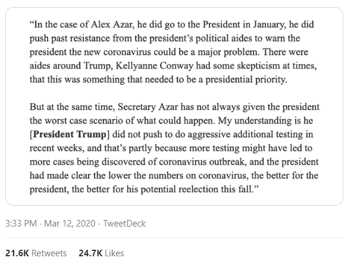

# 我们正坐在炸弹上

> 原文：<https://medium.datadriveninvestor.com/we-are-sitting-on-a-bomb-dab8f236d3f2?source=collection_archive---------4----------------------->

## 病毒式的疫情和油价战争点燃了导火索

他们说历史不会重演，但它会押韵。没有什么比我们目前所处的时代更能证明这一格言了。也没有什么比全球紧急事件更能显示出做好准备的重要性——并暴露出那些没有做好准备的人。正如沃伦·巴菲特曾经调侃的那样，“只有当潮水退去，你才能发现谁在裸泳。”

我们马上就会知道了。3 月 9 日周一开盘时，股市暴跌，这是对俄罗斯和沙特阿拉伯之间的石油价格战以及目前席卷全球的新冠肺炎病毒的双重威胁的恐慌反应。尽管出现了一些短暂的缓和，金融大屠杀仍持续了一周。3 月 12 日，星期四，道琼斯工业平均指数，一个衡量 30 家美国最大公司的指数，暴跌 10%，这是自 1987 年市场崩溃以来最大的单日跌幅。道琼斯指数和另一个重要的股票指数标准普尔 500 指数都已经进入熊市阶段，比之前的高点下跌了 20%。

 [## 为什么包容性财富指数比 GDP 更能衡量社会进步？|数据驱动…

### 你不需要成为一个经济奇才或金融大师就能知道 GDP 的定义。即使你从未拿过 ECON 奖…

www.datadriveninvestor.com](https://www.datadriveninvestor.com/2019/03/08/why-inclusive-wealth-index-is-a-better-measure-of-societal-progress-than-gdp/) 

甩卖反映出投资者认识到，随着数百万人越来越多地进入隔离区，而不是外出在餐馆、购物中心、电影院或航班上消费，对商品和服务的需求将大幅放缓。债券市场传统上是投资者在不确定时期存放资金的避风港，随着 2 年期、10 年期和 30 年期国债收益率有史以来首次跌破 1%，债券市场提供了另一个严峻的预兆。这是所谓的[反转收益率曲线](https://www.investopedia.com/terms/i/invertedyieldcurve.asp)的一个极端例子，它表明市场的警报，因此几乎总是预示着即将到来的衰退。

更糟糕的是，企业界在过去十年中积累了 13.5 万亿美元的巨额债务，这些债务是由草率的监管监督和超低利率促成的——这是上一次经济危机的遗迹( [**见文章**](https://blog.usejournal.com/raising-taxes-on-the-rich-isnt-just-fair-it-s-necessary-732eb7a40b80) )。国际金融研究所(Institute of International Finance)全球政策倡议(Global Policy Initiatives)研究主任埃姆雷·蒂夫提克(Emre Tiftik)表示:“我们一直在说，我们正坐在一颗未爆炸的炸弹之上，但我们不知道什么会引发它。”。目前的形势令人毛骨悚然地想起了引发 2007 年金融危机的次贷泡沫。好像有些人永远学不会。

就像一个在加速跑步机上的短跑运动员需要持续供应能量饮料来保持极快的速度一样，许多大公司用借来的钱来资助他们的运营，因为这可以让他们产生更大的利润。显而易见的风险是，即使现金流或红牛(Red Bull)枯竭，持续不断的偿债活动也不会放缓，这使其更难跟上步伐。对于那些犯了把快速拨号调到 11 的严重错误的人来说，他们最好希望他们脚下的土地是软的。

认识到这种危险，世界各地的央行行长，包括美国美联储的央行行长，在将关键利率下调 0.5 个百分点时，抛出了他们版本的羽毛枕头，试图平息市场的恐惧。它没有。美联储随后更进一步，向华尔街注资 1.5 万亿美元，这一非同寻常的举措显示了全球经济形势有多严峻。但是，在短暂飙升后，市场又开始了螺旋式下跌。

许多“僵尸”公司，其低劣的商业模式早就应该杀死他们，反而能够在过去十年中依靠廉价信贷生存下来。他们一直过着勉强糊口的生活，现在面临着痛苦的清算。去年，国际货币基金组织警告说，只有 2008 年危机一半规模的经济冲击将危及近 40%的公司债务。“这意味着，”伦敦资产管理公司 Algebris Investments 宏观策略主管阿尔贝托·加洛(Alberto Gallo)说，“我们的经济越来越脆弱，很容易受到真正的冲击。”

换句话说，我们在跑步机上的朋友将会经历一段艰难的旅程。

最后，让我们不要忘记另一半美国人和加拿大人，他们也是靠薪水过活的。如果被隔离在家里没有收入，可能连续几周没有收入的前景不足以说明带薪病假和基本收入概念的价值，那么什么都不是。

# 太少，太晚

这种规模的紧急情况在任何情况下都是严重的，但由于一个长期以来声称拥有所有答案的人惊人地缺乏远见和领导力，这种情况变得比必要的情况更糟糕。因为市场反应不佳的因素之一是特朗普总统在这一危机时刻的完全笨拙的反应，其标志是否认、欺骗和犹豫不决的签名组合。

> 在唐纳德·特朗普的卡通世界观中，墙是一切的答案。

1 月初，中国武汉出现了病毒流行的故事，比美国报告第一例病例整整早了两个月。然而，从海啸出现在地平线上的那一刻到它撞上美国海岸的那段时间里，白宫没有采取任何重大的准备行动。当总统最终决定采取行动时，这是远远不够的。他含糊地建议国会削减工资税，以应对预期的消费者支出下降——正如前面提到的，考虑到许多家庭即使口袋里有几块钱，也不会花钱，这几乎是一个无用的措施。然后，他下令对来自中国和欧洲的游客关闭边境。但是，作为一个无法深入思考的人的特征，他在处理这一病毒式疫情问题上犯了和他在移民政策上犯的同样的错误:如果相关人员已经在该国境内，关闭边境是无效的。

在唐纳德·特朗普的卡通世界观中，你看，墙是一切的答案。在他活在这个星球上的 70 多年里，他在头脑中构筑了厚厚的精神屏障，以阻挡任何他认为不利于他偏好的信仰的难以忽视的真相。作为总统，他通过坚持修建实体边境墙和旅行禁令，将这种被误导的方法延伸到了现实世界，在此过程中污染了公共政策和社会习俗。就把新冠肺炎挡在美国之外而言，那艘船早就启航了。所谓的“社区传播”几周来已经成为美国疫情蔓延的主要驱动力。而且，像许多严酷的事实一样，他拒绝接受这个事实。

事实上，韩国每天测试 20，000 人，而美国在撰写本文时，总共只测试了 5000 人。副总统彭斯在今年的轻描淡写中承认，“我们今天没有足够的测试来满足我们预期的未来需求。”尽管总统误导性地声称“任何想要检测的人都可以得到检测”，但他的政府在提供诊断美国新冠肺炎感染的检测试剂盒方面一直令人痛苦、不可原谅地迟缓。这主要是因为疾病控制中心(CDC)坚持开发自己的检测试剂盒，而不是依赖德国提供的非常好的检测方法[，该检测方法已经在 30 个国家安全有效地部署。因此，在美国人中间不知不觉传播并因此未被报道的病例的真实数量肯定比官方数字高出许多倍。](https://www.msnbc.com/msnbc/watch/hundreds-of-coronavirus-self-test-kits-sitting-in-u-s-awaiting-fda-approval-80481349818)

尤其是在选举年，这带来了巨大的道德风险。

 [## 白宫知道冠状病毒将是一个“主要威胁”——但反应不够

### 主持人特里·格罗斯:这是新鲜空气。我是特里·格罗斯。我们将谈论特朗普总统和一些成员如何…

www.npr.org](https://www.npr.org/2020/03/12/814881355/white-house-knew-coronavirus-would-be-a-major-threat-but-response-fell-short) 

Source: Twitter, NPR Fresh Air/Dan Diamond

唐纳德·特朗普(Donald Trump)在任期间从未错过吹嘘股市成功的机会。作为一个绝对虔诚的人，他声称爱圣经胜过爱他为自己写的书《交易的艺术》,他应该知道马太福音中耶稣的一句格言:生于刀下，死于刀下。

他可能会。

尽管 SARS (2003 年)、MERS (2012 年)和新冠肺炎之间的冠状病毒株有所不同，但自过去爆发以来，本可以在任何时候采取行动，为针对未来类似且不可避免的爆发的疫苗奠定基础。相反，在最近的预算中，特朗普政府[提议削减疾病预防控制中心和传染病快速反应储备基金](https://www.msnbc.com/rachel-maddow-show/trump-administration-isn-t-backing-proposed-cuts-cdc-budget-n1155411)——令人费解的是，即使在当前的疫情期间，特朗普政府也计划在 3 月 10 日继续削减。又打了一个关键任务的勾，特朗普找到时间批评奥巴马政府……批评一项由[特朗普自己的政府制定的](https://apnews.com/f4cd4c72e896d7fbd8ebd3516e864550)政策。当访问疾病预防控制中心时，在声称他有“天生的能力”了解疫情后，总统甚至找到了一种方法将当前的情况与去年形成他弹劾基础的臭名昭著的电话联系起来。

> “所有的测试都很完美，就像那封信一样完美。转录是完美的。对吗？这个没有那个完美，但已经很不错了。”

似乎没有什么是有损于他的。即使当他当选领导的社会面临公共卫生灾难时，不知何故，也总是与他有关。

这提出了一个令人不快的问题:哪种可能性更可怕。皇帝真的没穿衣服吗？还是说他从一开始就没有。

*我写政治、经济和女权主义。查看我的* [***目录***](https://medium.com/@BradStollery/table-of-contents-f45637ecde3f)**以获得我在介质上写的所有内容的列表。**