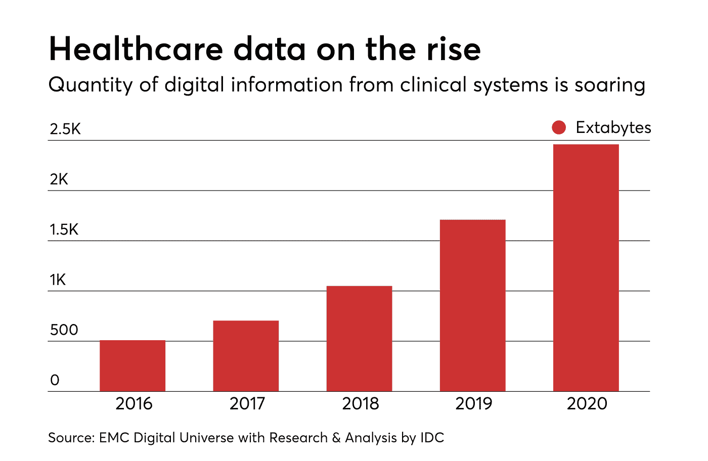
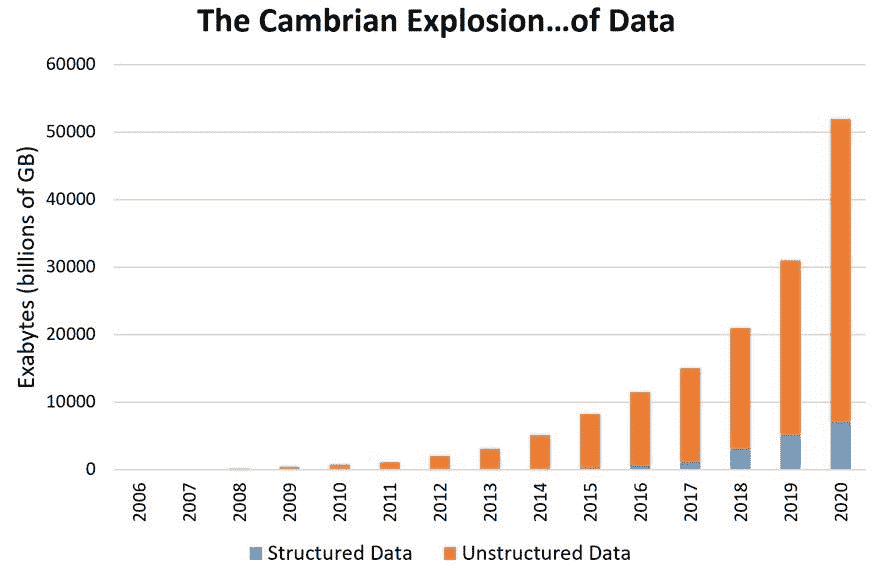
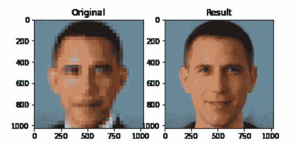

# 我们需要的不仅仅是数据:初创公司如何利用人工智能

> 原文：<https://medium.datadriveninvestor.com/we-need-a-lot-more-than-data-how-startups-can-harness-ai-74cb37e94f53?source=collection_archive---------12----------------------->

你打开手机，进行眼科检查，发现自己在未来 3-5 年内患老年痴呆症的风险，尽管你没有任何症状。

医生将数据(CT 扫描、基因组测试、血液实验室、人口统计数据等)作为输入，软件专门针对患者的生物标记进行训练，并给出什么药物最有效的建议。

兽医发现哪些批准用于人类的药物可以重新用于粉碎狗的特定癌症。由于癌症是一种常见的疾病，这些数据最终可以用于人类。

这些不是白日梦，而是真实公司的例子——分别是 [Neurotrack](http://neurotrack.com/) 、 [Onc.ai](http://onc.ai/) 和 [FidoCure](http://fidocure.com/) (完全披露:通过 Tau Ventures 投资)。几代人以来一直是科幻小说的个性化医疗，如今越来越少虚构，越来越多科学。在许多方面，人工智能是军队，创业公司是这场革命的将军。这篇文章不是关于人工智能的承诺和陷阱，而是当今世界的真实情况，总是强调机会。

我们有数据。很多。

2020 年 1 月，Waymo(谷歌又名 Alpahbet 的自动驾驶部门)宣布，它已经记录了 2000 万英里的驾驶里程。考虑到一年前他们有 1000 万，一年前接近 400 万——增长是指数级的。

也许没有其他领域比医学更能体现前寒武纪的数据爆炸。十年前，我记得听说你在医学院学到的东西有一半会在四年后毕业时过时。这显然是不正确的，因为核心概念将保持不变。但这也是事实，因为医学知识的总量不仅在增加，而且实际上还在加速增长。

摩尔定律确立了计算能力的趋势，这一趋势保持了近 50 年，我们需要一个框架来思考如何看待数据爆炸。在 Tau Ventures，我们对数据即服务持怀疑态度，但在一些领域，尤其是受监管的领域，我们看到了成功的商业模式。

 [## 人工智能、深度学习和医疗实践|数据驱动的投资者

### 人工智能和深度神经学习的效用看起来可能是合法和有前途的，特别是…

www.datadriveninvestor.com](https://www.datadriveninvestor.com/2020/06/24/disclosure-and-resolution-program-wont-prevent-physicians-from-practicing-defensive-medicine/) 

**2)但是数据需要按摩**

非结构化数据是未经打磨的钻石，未经标记的数据可能会掩盖傻瓜的黄金。在 Tau Ventures，我们相信有多个赢家——机会越来越多，这必然会导致许多创业公司获得成功。试图理解气候数据，以便种植作物并最大限度地提高产量？试图了解商店内人员的流动情况，以优化商品的摆放？试图弄清楚工厂的条件以确保更少的错误和更高的质量？这些都是真实的创业案例，我们作为投资者的观点是，成功的关键是选择正确的滩头阵地，获得重复性合同，并建立垂直聚焦的解决方案，因为我们离通用人工智能还很远。

**3)我们也需要调整数据**

在高层次上，今天的人工智能是一个强大的工具，可以帮助人类做出决定，特别是如果我们限制问题空间，即非常具体地询问我们的问题。人工智能的一个主要类型是监督学习，它基于包括响应在内的输入来推断关系——数据越好，模型就越好。另一种主要类型的人工智能是无监督学习，它基于没有响应的输入来推断关系——基本上是在数据中找到隐藏的模式。但在这两种情况下，我们可能会对某些类型的数据进行过采样，不仅遗漏了边缘案例，还遗漏了重要的用例。想想[的人工智能分类器无法识别奥巴马的脸](https://www.theverge.com/21298762/face-depixelizer-ai-machine-learning-tool-pulse-stylegan-obama-bias)，这提出了超出这篇短文范围的巨大问题。在 Tau Ventures，我们看到了许多初创公司帮助我们填补空白的需求，无论是调整偏差、收集隐藏数据的工具，还是实际创建/模拟数据的工具。

*原载于* [*数据驱动投资人*](https://www.datadriveninvestor.com/2020/07/19/we-need-a-lot-more-than-data-how-startups-can-harness-ai/) *，《我很乐意在其他平台上辛迪加。我是*[*Tau Ventures*](https://www.linkedin.com/pulse/announcing-tau-ventures-amit-garg/)*的管理合伙人和联合创始人，在硅谷工作了 20 年，涉足企业、创业公司和风险投资基金。这些都是专注于实践见解的有目的的短文(我称之为 GL；dr —良好的长度；确实读过)。我的许多文章都在*[*https://www . LinkedIn . com/in/am garg/detail/recent-activity/posts*](https://www.linkedin.com/in/amgarg/detail/recent-activity/posts/)*上，如果它们能让人们对某个话题产生足够的兴趣，从而进行更深入的探讨，我会感到非常兴奋。如果这篇文章有对你有用的见解，请评论和/或给文章和* [*Tau Ventures 的 LinkedIn 页面*](https://www.linkedin.com/company/tauventures) *点赞，感谢你对我们工作的支持。这里表达的所有观点都是我自己的。*

**访问专家视图—** [**订阅 DDI 英特尔**](https://datadriveninvestor.com/ddi-intel)