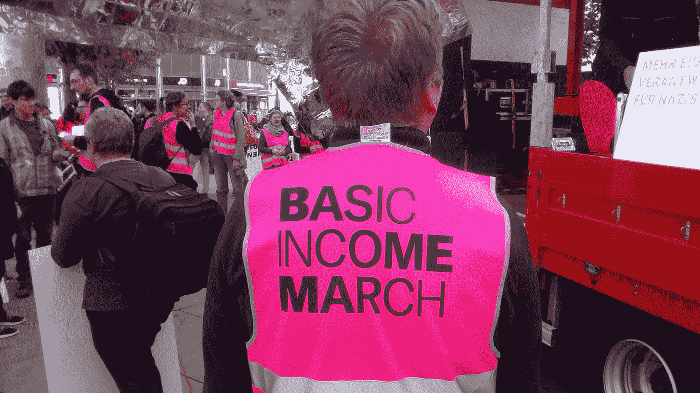

# 我们需要普遍的基本收入

> 原文：<https://medium.datadriveninvestor.com/we-need-a-universal-basic-income-bff9b6d2b870?source=collection_archive---------13----------------------->

## 需要大胆的解决方案来对抗大范围失业、驱逐和现代衰退所造成的伤害。

[Patrick Maynard](https://www.flickr.com/people/184864218@N06), Berlin Basic Income March, October 2019\. [https://commons.wikimedia.org/wiki/File:Berlin_UBI_marh_(48962529863).jpg](https://commons.wikimedia.org/wiki/File:Berlin_UBI_marh_(48962529863).jpg)

我们的工具箱里有一项政策，可以有效地解决美国的金融不安全问题，但我们需要从我们当选的领导人那里要求这项政策。这是一种普遍基本收入。UBI 是保证支付给美国每个人的款项(例如每月 1000 美元)。它基于一个简单的想法，即在美国，所有人都应该有足够的钱买得起食物和住所。

要了解 UBI 的有效性，你只需要看看 65 岁以上的人。社会保障是一个 UBI，它在老年人和贫困之间提供了一道屏障。我们从 1935 年就有了社会保障，为什么不能把这个福利扩大到所有人？全民健康保险甚至会比社会保险便宜得多。

UBI 对普通美国人来说是必要的。将近 40%的美国人在工作中断的情况下无法达到贫困线(T2)，这还是在疫情之前。现在再加上数千万失业人口，一个甚至不能延长失业救济的政府，以及一场经济灾难。UBI 是解决这些问题的实用方案。

普及基本保健是未来的政策，因为它几乎可以消除贫困。更好的是，它不会引起通货膨胀，会帮助数百万失去工作的美国人，不会使人们减少工作。最重要的是，它将为所有美国人提供金融保障。

## UBI 将抵消数年来对超级富豪数万亿美元的馈赠。

我们需要一个 UBI 来抵消由普通纳税人支付给最富裕人群的高得离谱的福利。

自 2017 年以来，最富有的美国人收到了足以支付多年 UBI 付款的施舍。2017 年减税和就业法案(TCJA)是对富人和企业的 1-2 万亿美元减税，增加了国债，减少了收入。TCJA 是一个由纳税人资助的 T2，是这个国家最富有的人的赠品。这将[进一步增加不可持续的赤字](https://www.brookings.edu/blog/up-front/2019/09/25/a-fixable-mistake-the-tax-cuts-and-jobs-act/)，对绝大多数美国人没有任何回报。总的来说，针对富人的宽松税法允许百万富翁和亿万富翁以比大多数美国人更低的税率纳税，并迫使绝大多数美国人买单。

政府支持 TCJA 的理由是，如果给企业和高财富个人数万亿美元，他们将创造就业机会。这要么是非常天真，要么是谎言。公司将 TCJA 的福利作为红利发放给股东，并解雇员工。没有创造新的就业机会的热潮。这只是对公司和富人的施舍。

对富人的施舍在 2017 年没有停止。自疫情封锁开始以来(过去六个月)，富人一直是美国财政政策的主要受益者。美联储通过购买证券将 1.5 万亿美元注入企业手中，然后立即连本带利地将这些证券卖了回去。关爱法案，一份 2 万亿美元的法案，给了我们大多数人 1200 美元的支票，给了百万富翁 160 万美元的支票。

CARES 法案也给了富人大量的税收优惠。该法案允许任何收入超过 50 万美元(即 1%)的人，不管盈利能力如何，都可以要求赔偿重大商业损失。这是一个彻底的泄露。

基本上，富人和实体可以[将 2020 年的新税收损失应用到他们 2015 年的收入中](https://www.propublica.org/article/the-cares-act-sent-you-a-1-200-check-but-gave-millionaires-and-billionaires-far-more)。这意味着百万富翁和亿万富翁将会因为 CARES 法案而获得退税。如果他们在 2015 年至 2020 年缴纳了税款，他们将获得退款，因为《关爱法案》追溯性地认定这些人*多付了*税款，使他们有权从国税局获得退款。雪上加霜的是，TCJA 允许公司将税收损失(这是税收损失，因为公司可以盈利，也可以有税收损失)结转到未来几年。富人可以避免支付昨天的税、今天的税和明天的税。

尽管向公司和 1%的人发放了救济金，但国会仍在为大多数美国人应该领取失业救济金多长时间而争论不休。国会正在争论数百万失业的美国人是否需要另一项刺激计划。当钱是对富人的施舍时，它不是问题，但给劳动人民 1200 美元是一场斗争。让人们额外获得 600 美元的失业救济金是一场斗争。对富人的片面施舍必须停止。是时候让每个美国人都有钱了。

## 我们需要一个 UBI，因为最富有的人正在囤积财富，导致通货紧缩危机。

如果富人普遍将钱再投资到经济中，那么向富人发放数万亿美元是可以理解的。如果向富人发放赠品能创造就业机会，那就更有意义了。不幸的是，这两件事都不是真的。相反，这些施舍加速了由财富囤积引起的日益逼近的通货紧缩危机。

富人正在囤积美国经济中的大部分资金。事实上，美国绝大多数的财富都掌握在收入最高的人手中。仅前 1%的[就拥有近 40%的财富](https://www.cbpp.org/research/federal-tax/substantial-income-of-wealthy-households-escapes-annual-taxation-or-enjoys#_ftn6)。收入最高的 10%的人(不包括 1%的人)拥有 [*另外* 39%的全部财富](https://www.cbpp.org/research/poverty-and-inequality/a-guide-to-statistics-on-historical-trends-in-income-inequality)。最富有的 10%的美国人也拿回了美国近一半的收入，1%的人拿走了总收入的 23%。大部分财富没有再投资到经济中去创造就业机会。如果财富被投资，通常是用于股票等被动投资，而不是创造就业机会。

除了少数人拥有世界上最强大国家的大部分财富这一明显问题之外，这种财富和收入的集中可能会导致通货紧缩。通货紧缩是价格和工资的长期下降，这使得借贷成本更高，并可能延长衰退。

这可以用一个例子来说明。如果你获得 1000 美元的无息贷款，然后赚取 1000 美元的收入，你就能够偿还贷款。如果出现通货紧缩，那么你的 1000 美元的价值将会增加，因为由于商品价格下降，购买力增加了。这意味着当你偿还贷款时，你偿还的是比你所借的更有价值的 1000 美元。如果你的 1000 美元在偿还时变得更有价值，那么你就失去了这笔贷款。

如果我们将这个例子应用于美国债务，那么如果美元贬值，我们所有的债务都会变得更加昂贵，因为我们的美元更加稀缺，因此更加值钱。这意味着我们不太可能摆脱债务。

美国可能很快就会陷入通货紧缩危机，部分原因是自疫情开始以来前所未有的政府支出。然而，这场危机的种子是由人们囤积巨额财富埋下的。[囤积资产导致通货紧缩](https://www.forbes.com/sites/timothylee/2013/04/14/hoarding-causes-deflation-not-the-other-way-around/#681d82128c01),因为经济中没有足够的流通现金来提高工资，企业无法足够快地对价格冲击做出反应。基本上，市场上没有足够的流动性，因为少数个人拥有大部分流动性。这意味着通缩取决于美国企业在不破产的情况下快速调整价格的能力。疫情时期的经济状况并不能激发人们的信心。

UBI 将解决通货紧缩问题。为 UBI 提供资金的最可持续的方式是通过对富人征税。更高的税收会将富人的流动性重新注入经济。向市场回笼资金将有助于防止通货紧缩。这将把钱放进美国人的口袋，并稳定美元的价值。

## 民主党人和共和党人都认为 UBI 是可行的。

政治光谱的双方都认为 UBI 是可能的。然而，分歧在于如何支付这笔费用。前总统候选人杨安泽提出了类似于 UBI 的计划。根据杨的计划，每个美国人每月将得到 1000 美元。该计划将通过对某些商品征收增值税来筹集资金，让福利受益人在 1000 美元现金或现有福利之间进行选择，并增加对富人的税收。杨的计划不会削减社会保障。

另一方面，美国企业研究所(American Enterprise Institute)推动的一项保守计划详细列出了每个美国人如何获得 1 万美元现金，以及必须用于医疗保健的 3000 美元。然而，AEI [提议](https://www.aei.org/articles/a-guaranteed-income-for-every-american/)通过削减所有福利项目来支付该计划，包括社会保障和对年收入在 3 万到 6 万美元之间的人(中产阶级)征税。

这两个计划都是在疫情之前出台的。当然，鉴于政府仅在《TCJA 法案》和《保健法案》之间就花费了 3.5 万亿美元，UBI 至少是可行的。

两个计划都承认的一件事是，有人将不得不支付更高的税收。除了数万亿美元的减税，我们目前的政府支出是不可持续的。在某个时候，美国将不得不对富人增税，因为他们拥有绝大多数的财富和收入。公司和股东也需要被征收更高的税率。如果对富人增税，也会有停止通货紧缩、结束贫困和为每个美国家庭提供现金的好处。然而，如果美国创建了一个 UBI，它将有可能在不创建*任何*新税或取消资助项目的情况下为其提供资金。

## UBI 对美国来说是完全负担得起的。

一个常见的误解是，UBI 每年将花费数万亿美元，因为它每年将向每个美国人支付 12，000 美元，总计超过 3 万亿美元。然而，UBI 的实际成本将接近 5000 亿美元——不到社会保障成本的一半。成本的巨大差异是由于 UBI 的机械工作方式。从概念上讲，UBI 通过收入再分配来支付大部分费用。正如牛津大学[的伊丽莎白·福克斯曼](https://theconversation.com/why-universal-basic-income-costs-far-less-than-you-think-101134)解释的那样:

> “……想象一下，一个房间里有 15 个人，他们希望以每人 2 美元的价格建立一个 UBI。该政策的前期费用为 30 美元。房间里最富有的 10 个人被要求每人捐助 3 美元来资助它。在他们每人投入 3 美元后，总共需要 30 美元，房间里的每个人都会得到 2 美元的普遍基本收入。但是因为房间里最富有的十个人贡献了 3 美元，然后作为 UBI 拿回了 2 美元，他们真正的净贡献实际上是每人 1 美元。所以 UBI 的实际成本是 10 美元。”

因此，虽然普遍无保障的总成本只是支付额乘以人口，但净成本只是初始成本的一小部分。乔治城大学的 Karl Widerquist 支持这一结论，他发现美国每年 UBI 的实际成本是总成本的 15.7%。这将总计约 5300 亿美元。Widerquist 的计算表明，用 5300 亿美元，我们可以每月向每个成年人提供 1000 美元，向每个儿童提供 500 美元。

这有助于正确看待 5300 亿美元。TCJA 每年耗资 2000 亿美元。每年*美国国税局因富人少缴税和大幅削减国税局审计预算而损失[约 4300 亿美元](https://www.cbpp.org/federal-tax/depletion-of-irs-enforcement-is-undermining-the-tax-code) *。在过去的六个月里,《关爱法案》和给企业的现金奖励花费了 3.5 万亿美元，相当于 7 年的基本医疗保险。**

*美国每年只需 5300 亿美元，就可以真正结束贫困，增加金融安全，制止通货紧缩，促进经济增长。它也可以通过只对富人进行审计而不通过新的税收来支付这个项目。“这太贵了”的言论忽略了一个事实，即当目标是帮助美国最富裕的人时，钱不是问题。为什么其他人不一样呢？*

## *UBI 不会让人们停止工作，并为普通美国人开辟了经济机会。*

*反对 UBI(以及一般的现金支付)的一个普遍观点是，它会让人们想要停止工作。但是想想看，没有一个 UBI 提案给出的比贫困工资多得多。一份普遍的基本收入涵盖了基本需求。每月 1000 美元的 UBI 应该包括合理的租金、食物和意外的医疗费用。12，000 美元的基本收入不足以辞掉你的日常工作，但足以消除贫困。没有人会因为能付得起房租而停止努力赚钱。*

*美国的例子已经证明了这一点。在加利福尼亚州的斯托克顿市，该市随机向市民发放了 500 美元的优待券。大多数受助人把钱花在了房租、车贷、债务和其他必要的生活开支上。这是一种有效的资源配置，因为它减轻了人们的财务障碍，让他们可以考虑像上大学这样的事情来改善他们的生活。*

*此外，美国人在文化上反对不工作。我们从工作和对社会的贡献中获得自我价值和快乐(这是否是一件好事是另一个话题)。考虑到这一点，我们为什么要指望人们辞职呢？尤其是现在，几千万人刚刚失业。人们想要工作，美国人觉得他们需要工作。涵盖房租和食物的 UBI 不会改变这种心态。*

## *不，UBI 不仅仅是对房东的刺激。*

*反对 UBI 的另一个普遍观点是，房东只会提高所有房客的租金。这是一种可以理解的担忧；然而，就政策和结果而言，这种担忧是有根本缺陷的。*

*有人认为 UBI 是个坏主意，因为房东会吸走这笔钱，这与美国的政策背道而驰。从本质上讲，UBI 给人们带来了更多的收入。如果论点是“给人们更多的钱是一个坏主意，因为提高了租金”，那么我们永远不应该试图在任何情况下提高工资:没有 15 美元/小时，没有工会支持的更高的工资，没有最低工资期限，没有社会保障，没有刺激检查。房东租金应该阻止人们要求生活工资，这并不是一个严肃的论点，这同样适用于 UBI。*

*对房东提高房租的担忧在现实中也没有得到证实。例如，假设我们每个月都有 1000 美元的 UBI 收入。如果你的房东把你的房租提高了 1000 美元，那么你就要去找一个没有提高房租的新房东了。房东希望人们出租他们的单元，哄抬价格是让房客流失到任何不哄抬价格的房东手里的快速方法。房东可以获得整个 UBI 的唯一方法是每个房东将所有租金提高 1000 美元，并且永远不要降低租金来吸引其他租户。这是不现实的。*

*数据中也没有显示房东房租的大幅上涨。由于 UBI 与最低工资增长具有相同的经济效应，我们可以预期两者与租金具有相似的关系。去年发表的一项研究分析了最低工资增长和房租上涨之间的关系。研究发现，就房东得到的任何东西而言，他们最多只能得到总收益的 3%-6%。因此，如果你的最低工资是 7.50 美元，翻倍到 15 美元，那么你每年将增加 15，000 美元的工资，你的房东每年可能会得到 435-870 美元的额外收入。*

*因此，如果 UBI 就像最低工资的固定增长，那么当你收到 12，000 美元时，你的房东最多会拿 360 美元到 720 美元。对房东哄抬租金的担忧被夸大了。*

*全民健康保险是未来的政策。我们有机会真正结束贫困，让美国继续工作。它是负担得起的，不会产生新的税收，会把钱循环回到最有可能花钱的人手中，而不是囤积起来。地球上最伟大的国家没有理由让它的人民过上一个远离贫困的生活。现在是改变的时候了。*