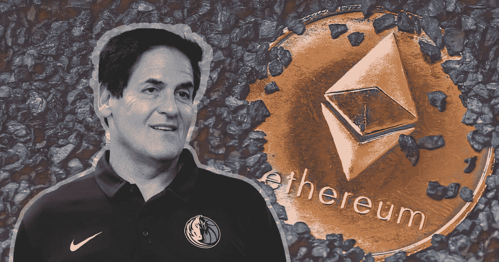

# 我们揭示了马克·库班的密码组合

> 原文：<https://medium.datadriveninvestor.com/we-reveal-mark-cubans-crypto-portfolio-bd910cc405b0?source=collection_archive---------0----------------------->

亿万富翁投资者、NBA 达拉斯小牛队(Dallas Mavericks)老板马克·库班今天意外地展示了他的以太坊(ETH)钱包，展示了他拥有的大部分 DeFi ERC-20 代币。

这样做的披露是无意的，但更令人惊讶的是马克·库班的秘密显然已经有多深。我们现在来仔细看看他在这个过程中持有哪些代币。

# 库班对他的作品给出了有趣的见解

昨天，亿万富翁投资者马克·库班意外暴露了他的以太坊钱包。

然而，库班泰然处之，对自己以太坊钱包的曝光做出了回应:

然而，库班泰然处之，并对他的以太坊钱包的曝光做出了回应:

> 我绝对有我的 shitcoin lol 的份额。

这是在库班发布了一段自己穿着小牛队服装跳舞的视频后实现的。你可以从位于区块链的不可替代代币(NFT)市场 Rarible 的账户上购买所有东西，并附上一张纸条。

这位善良的绅士当然不知道，这使得找到他的以太坊地址变得很容易。所以如果你推广你想推销自己的 NFT，要注意:地址的匿名性已经没有了。

# 马克·库班的“狗屎硬币”

但现在我们来到了一个有趣的问题:马克·库班拥有哪些代币？

当库班以太坊钱包的内容被披露后，用户发现他目前只拥有 0.54 ETH(694 美元)。他持有的 ERC 20 股票中，最大的一部分是 450 枚 AAVE (stkAAVE)股票。这意味着库班将价值 126499 英镑的 AAVE 押在了分散化的金融平台上。

对许多人来说，令人惊讶的是，库班先生似乎已经深深地沉浸在加密中，他已经积极地在 DeFi 领域下注。

库班的以太坊钱包还拥有 40 种其他代币。例如，这位亿万富翁持有不同数量的资产，如《福利之友》(Friends With Benefits)(FWB)、MASQ、LADZ、Parachute (PAR)、HYVE、Fantom Token (FTM)等。

因此，对于马克·库班的 Shitcoin 投资组合来说，今天应该是相当令人鼓舞的一天。例如，他的一些代币目前已经大幅上涨。例如，根据 CoinMarketCap 的数据，HYVE 的价格突然达到了 0.078 美元左右的历史新高，一天内涨幅高达 60%。

Fantom 的价格也同样飙升，在过去 5 天里从 0.25 美元攀升至 0.88 美元。因此，这场反弹甚至在古巴钱包被发现之前就已经开始了。无论如何，对于所涉及的象征性项目来说，这无疑是一个意想不到但令人愉快的营销噱头。

我在每月的[时事通讯中分享了更多私密的想法，你可以在这里查看](https://mailchi.mp/bf8f8e8ed697/keep-in-touch-with-lukas)。请在评论中告诉我，让我们通过 [Patreon](https://www.patreon.com/lukaswiesflecker) 建立你的秘密世界。在各种社交媒体平台上加入我:

[推特](https://twitter.com/WiesfleckerL)●[insta gram](https://www.instagram.com/lukaswiesflecker/)●[Patreon](https://www.patreon.com/lukaswiesflecker)●[脸书](https://www.facebook.com/lukaswiesfleckerr)●[Snapchat](https://www.snapchat.com/add/luggooo)●[LinkedIn](https://www.linkedin.com/in/lukas-wiesflecker-1b11251a5/)