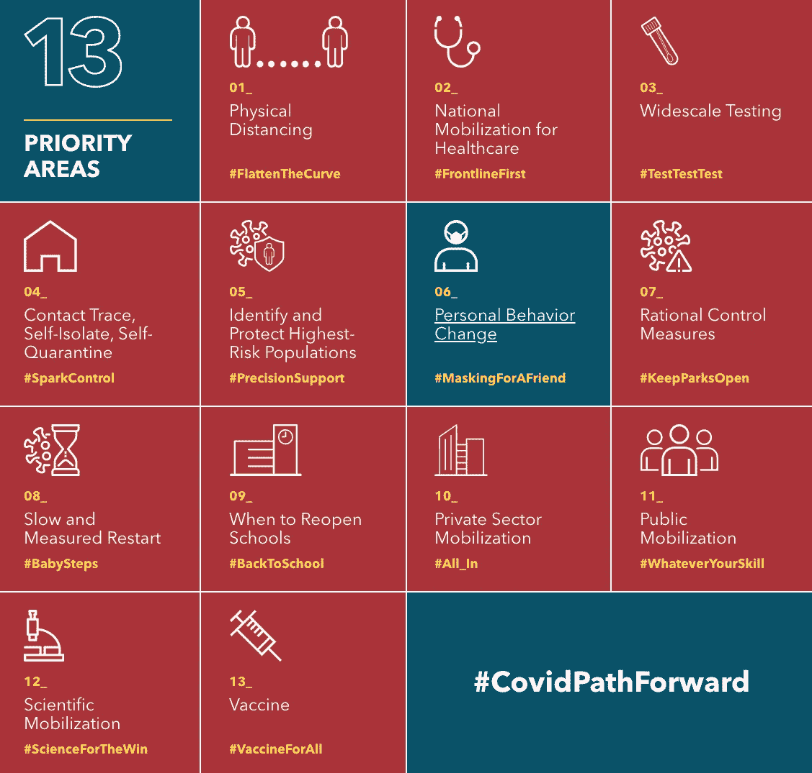
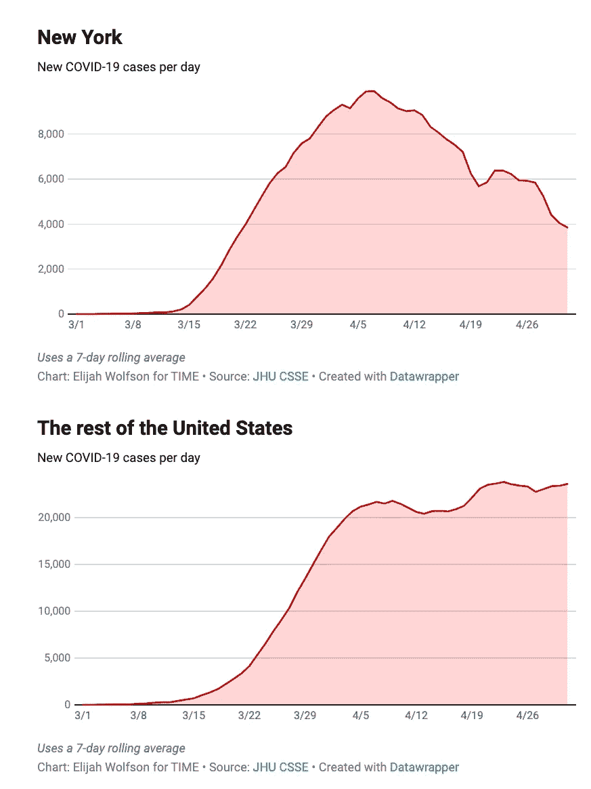
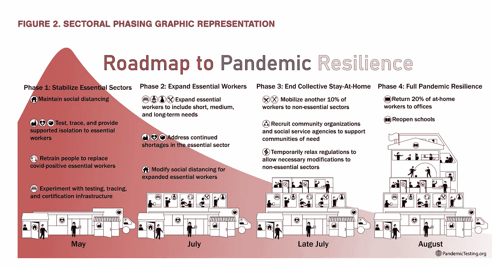
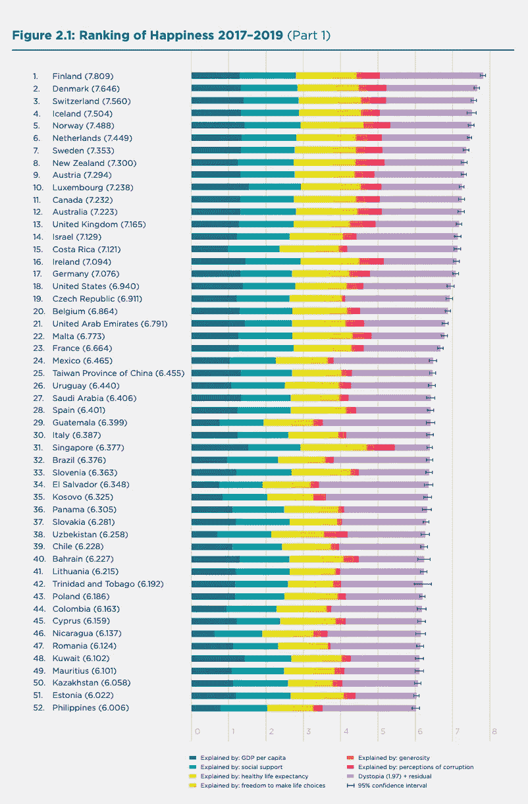
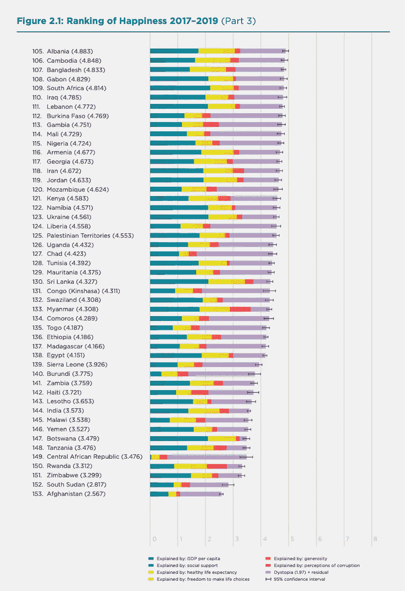
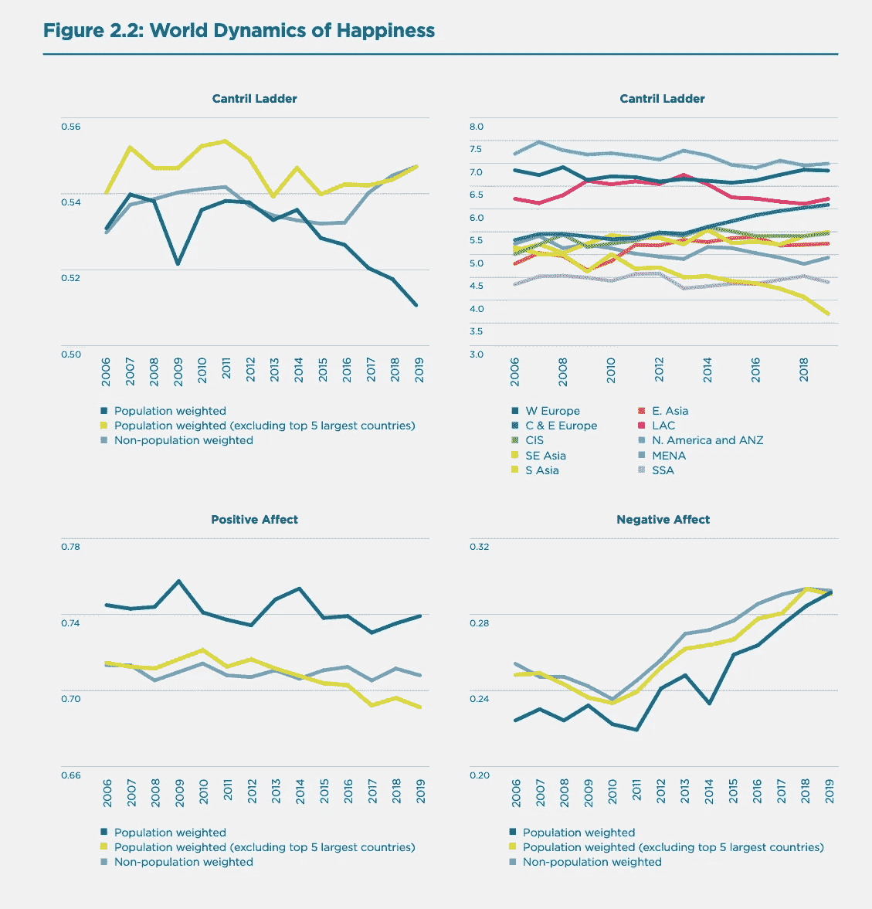
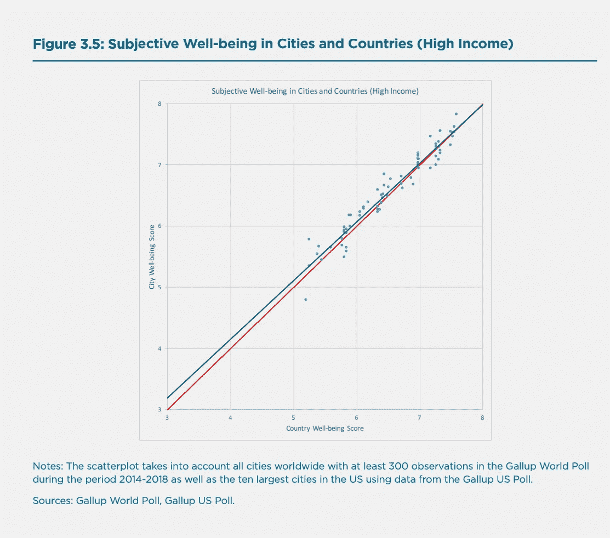
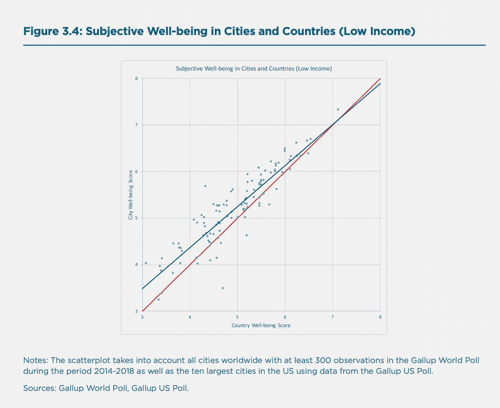
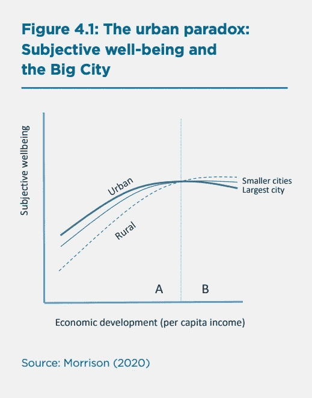
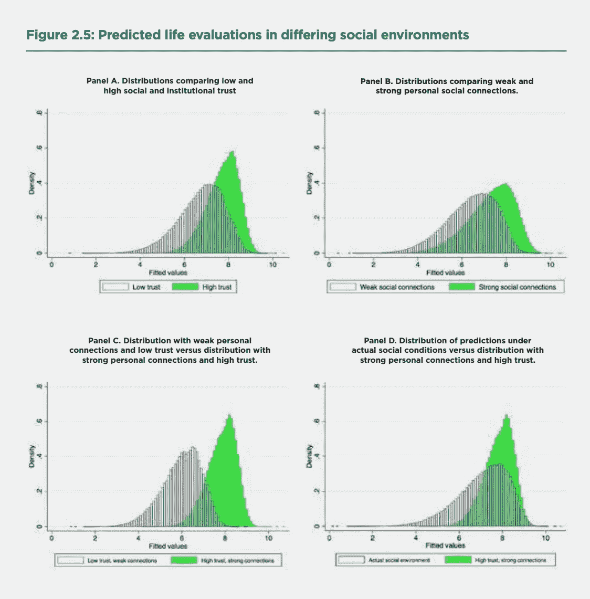

# 我们已经不高兴了:新冠肺炎只是让事情变得更清楚了

> 原文：<https://medium.datadriveninvestor.com/we-were-already-unhappy-covid-19-just-made-it-clearer-62b42cc4b719?source=collection_archive---------9----------------------->

There are quite a few plans to save our lives and the economy. The only thing left to do is execute it. ([image](https://covidpathforward.com/); Harvard TH Chan, School of Public Health)

*世界幸福报告:主观幸福感、城乡差距、可持续发展目标，以及区块链如何帮助解决所有这些问题*

随着我们进入纽约州新冠肺炎疫情的第十周，有迹象表明,[的患病人数正在减少，住院和死亡人数持续 14 天下降；30%的医院空缺和重症监护室床位；每月每 1，000 名居民至少进行 30 次病毒检测；每 100，000 名居民至少有 30 名工作接触者；T4 是否有足够的标准让这座城市重新开业？](https://www1.nyc.gov/site/doh/covid/covid-19-data.page)

然而，随着纽约州病例数量的减少，许多州仍然很脆弱，全国大部分地区正朝着相反的方向发展。

NY case counts are decreasing, but the rest of the nation is going the opposite direction ([source](https://time.com/5832365/new-york-covid-cases-us/))

幸运的是，CDC 发布了[重新开放指南](http://cdn.cnn.com/cnn/2020/images/04/30/reopening.guidelines.pdf)，哈佛大学 Edmond J. Safra 伦理中心发布了[疫情复原力的详细路线图](https://ethics.harvard.edu/files/center-for-ethics/files/roadmaptopandemicresilience_updated_4.20.20_0.pdf)(如下)，其中包括:(1)大规模测试，(2)追踪，(3)支持隔离(TTSI)以及研发优先领域(开头的数字)。

Phases 1 through 4: aggressive research and development ([source](https://ethics.harvard.edu/files/center-for-ethics/files/roadmaptopandemicresilience_updated_4.20.20_0.pdf))

尽管如此，不管这些基于证据的建议，许多州长正在开业或计划开业，尽管有人警告说试图过早重新开放经济将导致人类悲剧和经济灾难(阅读[此处](https://www.cnn.com/interactive/2020/us/states-reopen-coronavirus-trnd/)50 个州中的每一个都主张重新开放)。

> 这是为什么呢？是什么推动了这些决定？

# #1:看起来我们生活的经历不同:高收入、中收入和低收入的差距

许多人认为评估疫情威胁、信任政府政策和遵循指导方针完全是由党派政治驱动的(我在这里写了这个)。

然而，接受科学证据作为政策指南的理由不仅仅是相信科学。公共行为改变的强大驱动力取决于个人和社会的[信任感和幸福感](https://happiness-report.s3.amazonaws.com/2020/WHR20.pdf)，即:(1)人均 GDP，(2)社会支持，(3)健康的预期寿命，(4)做出生活选择的自由，(5)慷慨，(6)免于腐败。

 [## 数字货币、区块链和货币的未来|数据驱动的投资者

### “区块链”、“加密货币”、“令牌化”，以及现在的“央行数字货币”已经成为…

www.datadriveninvestor.com](https://www.datadriveninvestor.com/2020/02/18/digital-currencies-blockchain-and-the-future-of-money/) 

总的来说，**享有制度信任的社区和国家**比健康不佳、失业、低收入、歧视、家庭破裂和对街头安全的担忧占主导地位的情况要好得多。生活在信任的社会环境中不仅有助于直接支持所有个体的生活，还有助于社区的生存。

事实上，正如《2020 年世界幸福报告》所描述的那样，欧洲国家、美国、东南亚和南美洲比中东、前苏联和非洲国家享有更高水平的主观幸福感(见下图)。前十名中有八个是欧洲人，另外两个是澳大利亚和新西兰；垫底的 10 个国家中有 8 个是非洲国家，另外两个是阿富汗和印度；美国排名第 18。

Top 50 ranking countries

Bottom 50 ranking countries

尽管经济和主观幸福感多年来一直在变化(特别是在中欧和东欧，以及撒哈拉以南非洲)，但自 2008 年金融危机以来，他们的不幸福感一直在普遍增加，以每年 8-10%的速度持续恶化。

[Using Gallop’s Cantril Ladder](https://news.gallup.com/poll/122453/understanding-gallup-uses-cantril-scale.aspx), the global trends for worry, sadness, and anger all move in the same direction, starting to increase about 2009\. increasing around 8~10% in the 9 years span ([source](https://happiness-report.s3.amazonaws.com/2020/WHR20.pdf))

> 换句话说，不快乐至少在十年前就开始了，而且自新冠肺炎事件以来变得更加糟糕。

# #2:看起来我们没有同样的经历:城乡差距

大城市遵循了相同的国家福祉趋势，高收入国家的金融富裕资本通常表现良好。前 10 名城市中有 7 个是欧洲城市，另外 3 个是布里斯班、惠灵顿和特拉维夫；排名垫底的 10 个城市中有 6 个在非洲，其他的是喀布尔、萨那、加沙和海地的太子港。

然而，尽管国家和城市之间的主观幸福感普遍一致，但高收入国家和低收入国家之间有一个有趣的差异。下面的结果表明，只有在高收入国家，平均国家幸福指数是城市幸福指数的强有力预测指标，而在低收入国家，情况并非如此。

> 换句话说，当经济繁荣消失时，城市幸福也就消失了。

General correlation coefficient between country-city pairs stands at 0.96 (F-test = 35.90)

The correlation coefficient is slightly lower at 0.90 (F-test = 35.72)

这挑战了城市化主要由收入和经济机会的变化驱动的观点。或许这在城市经济发展的早期阶段是正确的，但是随着第四次工业革命的到来，城市中非农业生产和服务的地理聚集变得不那么合理了。

如果人们从农村向城市地区的迁移不能提供更高的就业机会和更高的工资，而农村地区的职业结构继续提供更高的工资和生活水平，城市化或郊区化的逆转是不可避免的(见下文)。

This is referred to as the “Urban paradox”

这种“城市悖论”可以解释为:

*人的因素*:家庭收入和富裕程度、就业状况；经济乐观主义；健康问题和疼痛体验；社会支持；公民参与；对国家安全状况的感受；制度质量、腐败和自由意识。

*地点因素:*水和空气质量；公共基础设施；交通、医疗保健、教育；住房负担能力；当地就业市场状况；社区归属感和多样性。

‘People factors’ may be still ahead in the cities, but ‘place factors’ make rural living more attractive.

> 换句话说:在高收入国家，大城市已经失去了吸引力，尤其是在受到经济衰退压力的时候(比如新冠肺炎)。

# #3:这真的是关于信任

直观地看，可持续发展和主观幸福感密切相关，最强的相关性是:人均收入、社会支持和良好的健康状况。然而，在实现可持续发展目标时，如:没有贫困；零饥饿；工业、创新和基础设施；体面工作和经济增长；可持续性的最强预测因素是机构信任和社区参与(见下文)。

High institutional trust and strong community connections are the strongest indicators for sustainable growth

因此，当各州宣布“重返工作岗位”，通过拒绝向人们提供失业保险来迫使他们像现代的工资奴隶一样工作时，如果人们不信任当地政府，他们就无法迫使人们再次消费、投资和购买。

*正是这种信任的缺乏*滋生了过多的[字母形状的复苏预测](https://www.brookings.edu/blog/up-front/2020/05/04/the-abcs-of-the-post-covid-economic-recovery/?utm_campaign=Brookings%20Brief&utm_source=hs_email&utm_medium=email&utm_content=87402482) : Z 形(最乐观)、V 形(仍然乐观)、U 形(更有可能)、耐克 Swoosh(像 U)、W 形(悲观)、L 形(最悲观)。

家庭的消费能力和意愿将是关键，因为即使经济开放，人们也可能无法或不愿意像以前那样乐于消费。同样，企业将试图安排融资、寻找地点和供应商、雇佣工人，但投资的下降可能会使这些公司生产率下降或关闭。

为了安全地“开放经济”,我们应该试着模仿一种公民技术反应，正如杰伦·拉尼尔和 e .格伦·韦伊尔(e . Glen Weyl)—*所描述的，一种去中心化技术、行动主义和公民参与的结合。指导原则是，没有自上而下的集中控制，而是基于社区的公私合作伙伴关系，相互尊重和隐私得到精心保护，避免技术官僚(美国、中国)和技术恐惧症*(欧洲)。

> 我们应该设计高、中、低收入和城乡混合的解决方案，并量身定制我们的建议，而不是一刀切的解决方案

考虑到新冠肺炎社区脆弱性指数([【CCVI】](https://precisionforcovid.org/ccvi?utm_source=newsletter&utm_medium=email&utm_campaign=newsletter_axiosvitals&stream=top))，其中包括:社会经济地位；家庭构成；残疾；住房；运输；少数民族地位；除了更广为人知的流行病学和医疗保健因素。

# 最终想法:

*   我们有一段时间不开心了。新冠肺炎已经说得很清楚了。
*   医疗保健已经有一段时间不起作用了。新冠肺炎说得更清楚了。
*   美国不需要像台湾、韩国或德国那样摆脱 COVID，而是像台湾**和**韩国**和**德国那样——因为美国不同的地区需要不同的解决方案类型。

> 既然我们可能正走向一个数字化、虚拟化、远程化、自动化、相互依存的未来，个人、社区和机构的信任将变得至关重要。如果有的话，我们将更需要区块链，而不是更少。

*如果你喜欢你所读的内容，* ***请在下面“鼓掌”，这样其他人也会看到(最多允许 50 次鼓掌！)***