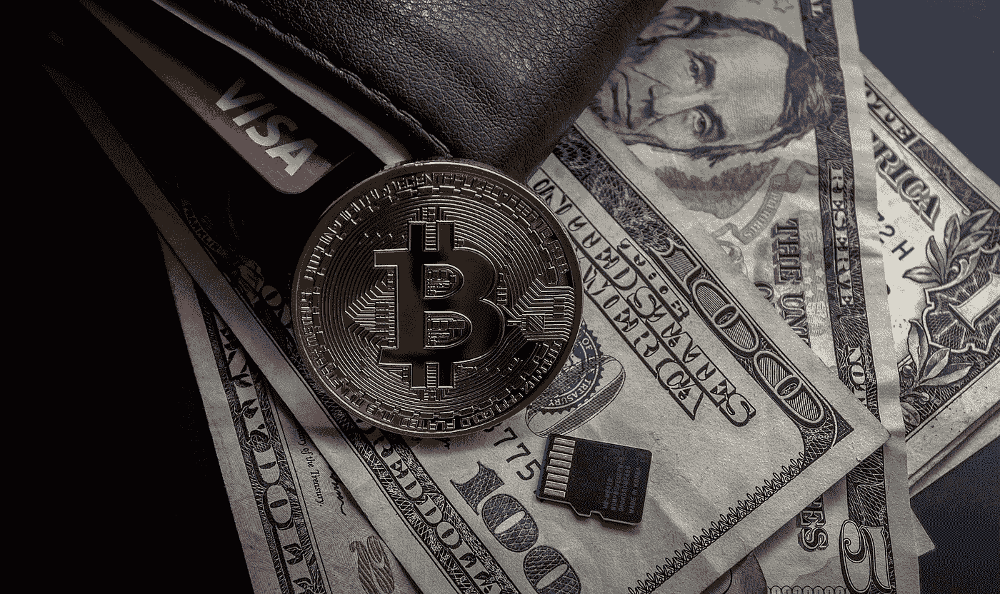

# 我们会后悔每一个比特币和密码监管

> 原文：<https://medium.datadriveninvestor.com/we-will-regret-every-bitcoin-and-crypto-regulation-49a38091ee20?source=collection_archive---------10----------------------->

## 比特币不应该被一个失败的金融体系吸收

Image by [WorldSpectrum](https://pixabay.com/users/worldspectrum-7691421/?utm_source=link-attribution&utm_medium=referral&utm_campaign=image&utm_content=3409655) from [Pixabay](https://pixabay.com/?utm_source=link-attribution&utm_medium=referral&utm_campaign=image&utm_content=3409655)

有一种观点认为，比特币监管的缺失正在扼杀加密领域的创新。我们从政府那里需要的唯一规则是承诺不去管它。相反，监管将粉碎创新，特别是如果每个从事加密交易的人都需要注册为“货币服务企业”/“汇款人”，或者符合银行的模式。

此外，让比特币处于这种“监管边缘”只会让潜在的创新者担心它可能明天就会被宣布为非法。*(我已经在这里***说明了为什么以及如何会发生这种情况。)**

*在这一点上，我倾向于相信，要么 A)密码将一直处于监管不明确的状态，直到并且除非它变得非常流行和广泛使用，在这一点上，他们将迅速打击它，要么 B)无论监管以何种速度移动，最终结果将是加密货币将比今天的货币和银行受到更多的监管。*

*我们必须记住，比特币背后没有一家公司，无论从哪方面来看，它都没有主人。这是人民的钱，如果这种情况继续下去，人民需要挺身而出，反对监管。*

*在一个完美的世界里，比特币将牢牢掌握在人民手中，而不受政府和企业的控制。*

*看看政府[试图用区块链技术做什么](https://www.verdict.co.uk/coronavirus-tracking-mynxg/)—[追踪](https://www.wsj.com/articles/BL-CIOB-11267)并且比以前更加监视我们。*

*我们已经知道一旦政府插手某事会发生什么——它获得了一个立足点，然后试图介入、吸收和改变整个该死的事情。*

*想要将比特币用作价值储存手段或交易手段，或者出于任何有利于人们的原因，这都是好的，但如果它在美国成为万事达卡(MasterCard)或维萨卡(Visa)之外的另一条支付轨道，人们将失去对它的控制，如果我们不小心，我们可能会失去它。*

*我们不需要政府去开采它；我们不需要政府来花。我们根本不需要政府介入。*

*再看看某些实体兑换比特币收取的费用，几乎不收任何费用的愿景怎么了？我认为加密爱好者需要对他们选择与谁进行比特币交易有敏锐的洞察力和决断力。看在上帝的份上:没有人需要银行保管他们的密码！人家没有自己的私人钥匙已经够糟糕了！*

*我们生活在一个各种等级制度正在瓦解的时代。比特币不是在任何等级体系中来到我们面前的——我们究竟为什么要让它被插入一个失败的金融体系的等级体系中，由一个等级体系可能也将结束的政府管理？*

*记住我的话，如果我们再让出一英寸，比特币和整个加密货币的概念都将被阉割，我们将后悔我们愚蠢地允许对它进行的每一项让步和监管。监管真正起到的唯一作用是让大投资者安心，并允许政府对其征税。*

*这场对话多快就变成了对未实现收益征税的可能性？你没看到发生了什么吗？*

*我不认为政府会真正满足于允许比特币的大规模使用，除非他们让每个人都交出他们的钥匙。*

*真正相信比特币的人可能很少关心大型机构投资者，就像他们很少关注央行的整体概念一样。*

*我完全明白我所说的可能会被认为是短视和反动的。我最终担心的是失去最初给我们比特币的运动的本质。*

*比特币是通过一个简单而美好的偶然时刻来到我们身边的，它诞生于政府和企业的控制之外。在我们能控制的范围内让他们碰它是愚蠢的。为了达到其最初的目的，它必须不受银行、公司和政府的控制。*

*否则，我们将最终失去它，如果我们这样做，我们将失去它从一个失败和破碎的法定货币体系中独立出来的巨大潜力。*

**你可能喜欢的相关文章:**

* [## 我们未来的权利取决于权力下放

### 今天有两种强大的对立力量在斗争:政府和企业，它们日益扩大…

link.medium.com](https://link.medium.com/HCKrQGO5Bdb)  [## 你准备好应对实时通胀了吗？

### 有人说，通货膨胀是一种“隐性税收”，因为流通货币供应量的增加会导致我们的货币贬值。

link.medium.com](https://link.medium.com/8VotBPF5Bdb)  [## 人们不明白监管加密意味着什么吗？

### 当我回顾关于区块链创新法案和数字分类法案的新闻时，我有点激动

link.medium.com](https://link.medium.com/vPo960I5Bdb)*