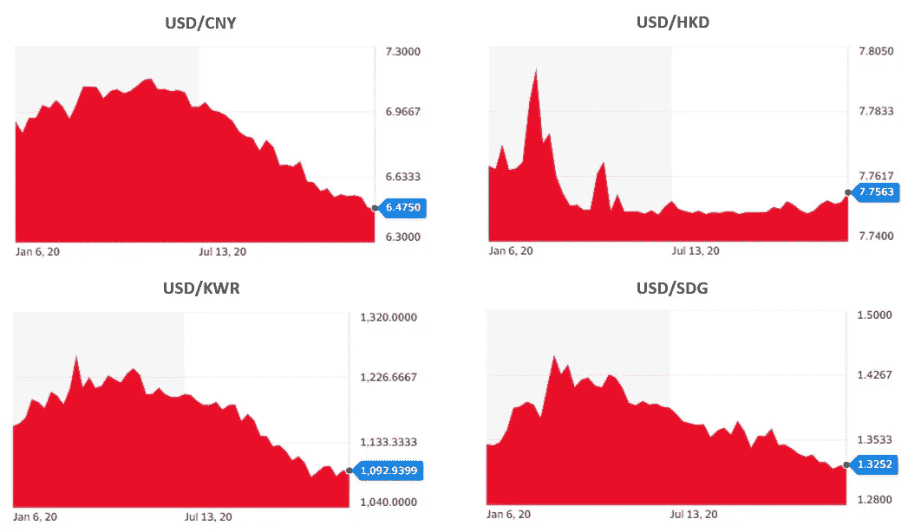

# 美元走软刺激了对外国市场股票的需求

> 原文：<https://medium.datadriveninvestor.com/weakening-dollar-fuels-demand-for-foreign-market-equities-6fb0cc8775ce?source=collection_archive---------14----------------------->

## 金融市场

## 2021 年，欧洲、东南亚和新兴市场的股票可能有巨大的上涨潜力，但通货再膨胀交易正在获得牵引力

Photo by [Mike Enerio](https://unsplash.com/@mikeenerio?utm_source=medium&utm_medium=referral) on [Unsplash](https://unsplash.com?utm_source=medium&utm_medium=referral)

过去一年，美元兑大多数发达经济体货币走软，逆转了金融危机和欧债危机后美元走强的趋势。

这一新趋势可能会持续下去，美元将在 2021 年进一步贬值。不仅对欧元、日元和英镑，而且对许多发展中经济体的货币。

有几个因素推动着汇率波动。其中包括柯维德-疫情病毒的发展轨迹，政府遏制病毒的对策，以及封锁带来的经济痛苦。

预期的美元贬值对美国和外国投资者都有影响，他们不仅应该考虑股票的预期回报，还应该考虑考虑汇率波动的价格。

US Dollar 1-year performance against developed economy currencies (Euro, Japanese Yen, British Pound, and Swiss Franc). Source: Yahoo Finance

投资者应该注意，美元贬值并不一定意味着美国股票指数表现不佳。美元和标准普尔 500 之间的相关性是[在](https://www.fool.com/investing/2020/08/19/when-the-dollar-falls-what-should-investors-do/) 0.38 左右(注意这并不意味着因果关系)。

美国内部存在大量机会，高盛(Goldman Sachs)预计，到 2022 年底，标准普尔 500 将接近 4600 点。

S&P 500 forecast, Q3 2020\. Source: Goldman Sachs GIR via Twitter

当美元预期贬值时，投资者可以从向国外市场出口的美国公司中受益。

这些公司要么以美元计价获得更好的价格，要么看到对其产品的需求增加，因为以终端市场货币计价的价格已经下降。因此，在这个阶段，跨国公司是投资者的热门目标。

相反，严重依赖国外生产的中间投入品、主要在美国国内销售的公司，可能会看到利润率下降。

投资者也可以放眼国外。目前，欧洲股票的交易价值远低于美国同行。美国投资者可能会看到，随着欧洲经济随着疫苗接种的展开而重新开放，以及欧元走强，欧元区的投资受到多重扩张的推动。

 [## CAPE 比率表明股票市场是有吸引力的

### 坎贝尔和诺贝尔奖得主席勒发明的这一指标预示着股市的乐观前景

medium.com](https://medium.com/datadriveninvestor/the-cape-ratio-suggests-the-stock-market-is-attractive-7eb3fc22816b) 

非美国投资者将避免他们的回报被货币贬值稀释。放眼美国以外，投资者应该考虑美国市场产生的收入份额。

几家欧洲工业和制药公司的大部分收入来自对美国的出口，因此，当美元贬值时，它们的利润将会缩水。

如下图所示，机构投资者已开始对冲美元风险。散户投资者应该考虑采取行动，要么对冲持有美元计价资产的不利影响，要么利用预期的汇率轨迹。

Currency positions of currency head funds. Source: J.P. Morgan, CFTC, Bloomberg via Twitter

欧元区并不是唯一对投资者有吸引力的市场。其他欧洲市场，如英国(英国退出欧盟的不确定性正在下降，货币仍然被认为是便宜的)，斯堪的纳维亚，甚至欧洲以外的市场。

预计在未来十年，东南亚经济体的增长将超过西方经济体。位于台湾、越南、印度尼西亚甚至新加坡等发达国家或与这些国家有业务往来的公司将从中受益。

美元贬值将进一步加强在该地区投资的前景。

US Dollar 1-year performance against East and South-East Asian currencies (Chinese Yuan, Hong Kong Dollar, Korean Won, Singaporean Dollar). Source: Yahoo Finance

在南亚，印度股市也可能从美元走软中大幅受益。南美仍然存在高汇率和高政治风险。

未来一年，散户投资者应该考虑将资金配置到亚洲和欧洲股市。美国境外的投资者也可以利用美元走软的机会，以更具吸引力的价格投资美国股票。

US Dollar 1-year performance against developing economy currencies (Indian Rupee, Brazil Real, South African Rand, Mexcian Peso). Source: Yahoo Finance

随着美联储承诺实施宽松的货币政策，拜登政府正在计划大规模的刺激支出和基础设施投资——增加财政赤字——美元可能在未来一年贬值超过 10%。

 [## 蓝色风暴对市场意味着什么

### 民主党在佐治亚州决胜选举中获胜后，金融市场的五个重要主题

medium.com](https://medium.com/datadriveninvestor/what-a-blue-sweep-means-for-markets-518bd9655af1)  [## 这么说一家大型风投基金正在投资你的初创公司？4 实际考虑|数据驱动的投资者

### 首先，恭喜你。融资总是需要努力的，一个大的风险投资基金当然是一个大的…

www.datadriveninvestor.com](https://www.datadriveninvestor.com/2020/08/09/so-a-big-vc-fund-is-investing-in-your-startup-4-practical-considerations/) 

## 摩根大通认为美元在蓝色风暴后走强

尽管许多策略师预计未来一年美元将进一步贬值，但摩根大通策略师约翰·诺曼德在接受[彭博](https://www.bloomberg.com/news/articles/2021-01-11/what-macro-strategists-are-saying-about-impact-of-u-s-stimulus?srnd=premium-europe)采访时表示，由于民主党控制了国会两院，美元实际上可能会升值:

> 在一个统一的政府下，12 月底的 9000 亿美元刺激计划应该在 2021 年初再配套 9000 亿美元。我们还认为，鉴于脆弱的经济，增税只是象征性的。
> 
> 这种破坏可能是通过更高的通胀预期、更高的债券收益率和更强劲的美元来实现的，这颠覆了股票中价值轮换的新兴市场成分，以及固定收益中最令人信服的均值回归机会。

额外刺激计划和大型基础设施投资计划带来的预期财政扩张已经提高了通胀预期。因此，美国市场 10 年盈亏平衡通胀率高于美联储 2%的目标。

这导致投资者猜测，尽管美联储承诺在 2024 年前保持低利率，但它需要在 2021 年底或 2022 年期间加息。

一些投资者甚至在*通货再膨胀交易*(美联储加息，在这种情况下是在 2022 年 3 月至 12 月之间)上下大赌注，如下图 *:*

Source: Bloomberg via Cormac Mullen

由于当前的经济环境，拜登政府可能需要推迟增加税收的措施。这意味着财政支出将通过更大的赤字来融资。

为了弥补赤字，政府将出售国债。更高的美国国债供应量将导致更高的收益率，吸引目前远离近零收益率的投资者。

因此，资金流入美国国债可能会令美元走强。如果摩根大通(J.P. Morgan)的策略师是对的，那么未来几个月将是美国以外的投资者买入美国股票的绝佳时机。

美元相对便宜(如果在短期内评估)，但可能不会像格鲁吉亚选举前预期的那样贬值。最重要的是，拜登政府将提供财政支持，特别是对受益于基础设施投资的行业。

太阳能、氢能、电动汽车供应商和绿色科技等绿色股票可能会受到当前宏观经济和政治环境的影响。

投资者利用共识从一种观点转变为另一种观点的情况，将会看到他们的回报增加。

 [## 市盈率捕捉到的信息比许多人想象的要多

### 作为一个估值工具，这个比率是不够的，但它是更大图景中的一个重要部分

medium.com](https://medium.com/datadriveninvestor/the-p-e-ratio-captures-more-information-than-many-think-2d266c221ae9) 

**访问专家视图—** [**订阅 DDI 英特尔**](https://datadriveninvestor.com/ddi-intel)