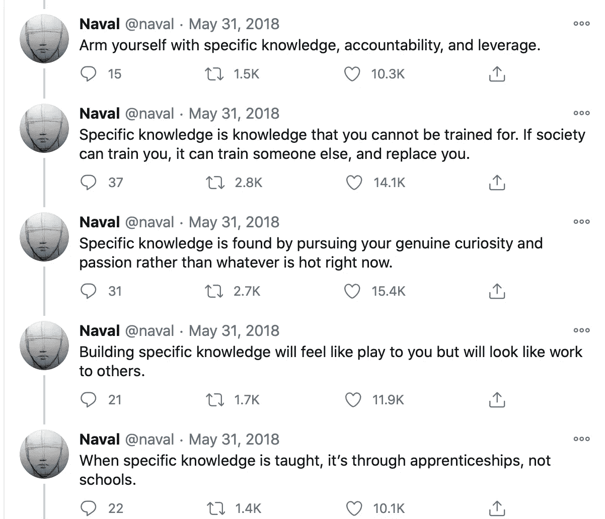

# 财富与幸福硅谷风格

> 原文：<https://medium.datadriveninvestor.com/wealth-happiness-silicon-valley-style-983612ac88b1?source=collection_archive---------9----------------------->

纳维尔·拉维康德《年鉴》的启示和思考

Image Credit [Kal Visuals](https://unsplash.com/photos/aK4iPNYipnU)

《纳威·拉维康德年鉴:财富和幸福指南》是由埃里克·乔根森整理的投资者[纳威·拉维康德](https://www.navalmanack.com)的各种沉思、想法和微博的简短阅读。

 [## 海军拉维康德年鉴

### 这本书从推特、播客和过去十年的文章中收集和整理了 Naval 的智慧。…的智慧

www.navalmanack.com](https://www.navalmanack.com) 

# 赚钱

拉维康德著名的关于财富的[推特风暴](https://twitter.com/naval/status/1002103360646823936?lang=en)总结了他的许多信念和见解。值得一读。关于“致富”的一些要点:

*   知道做什么，和谁一起做，什么时候做。
*   给予社会它想要但不知道如何得到的东西。在规模上。
*   选择一个你可以玩长期游戏的行业
*   用具体的知识武装自己；您无法接受培训的知识，或者不容易外包或自动化的知识。
*   财富需要杠杆:资本、人力和没有边际成本的产品。
*   杠杆是你判断的力量倍增器

虽然这些都不是什么超级新知识，但最后两点特别有条理。我喜欢这样的概念，即你能贡献的价值是你的**独特知识和判断**，这些可以用**高杠杆**封装在产品中，这些产品可以零边际成本销售，并且可以创造财富——例如**软件或媒体产品，**。

# 快乐

这本书转向哲学，分享了拉维康德关于幸福的信念。这里总结了一些要点:

*   完善你的欲望比做一些你并不 100%渴望的事情要好
*   你是你的习惯和你相处的人的结合体
*   花时间不分心，独自自省，写日记，冥想，解决未解决的问题，让我们从精神肥胖变得健康。
*   徒步就是行走冥想。写日记就是写冥想。祈祷是感恩冥想。
*   建立系统，而不是目标。运用你的判断来找出你能在什么样的环境中茁壮成长，然后在你周围创造一个环境，这样你就有可能取得成功。

许多见解与我在这篇博客中写的古代智慧相似。

 [## 古代智慧和现代科学的交汇处

### 来自神经科学、中国哲学和原子习惯的生命课程。

ztalib.medium.com](https://ztalib.medium.com/where-ancient-wisdom-meets-modern-science-60688154659e)  [## 取代你的风投？企业家的 5 条原则|数据驱动的投资者

### 在 Tau Ventures，我们建议所有企业家将融资过程中的勤奋过程视为双向的…

www.datadriveninvestor.com](https://www.datadriveninvestor.com/2020/11/29/replacing-your-vc-5-principles-for-entrepreneurs/) 

# 摘要

这本书有点老套，但有一些关于永恒知识的很好的提醒。我确实很欣赏对在新的知识经济中创造财富的技能的重新构想，以及对那些你可以**做出独特贡献的领域**、**创造独特价值**以及与长期个人和长期行业合作的提醒。

这是总结他的信念的一个很好的引用:

> 你总有一天会死，这些都不重要了。所以尽情享受吧。做一些积极的事情。表达一些爱。让某人开心。笑一点。感激这一刻。做你的工作。

# 资源

*   [播客笔记](https://podcastnotes.org/naval-periscope-sessions/naval-nivi-21/)

**访问专家视图—** [**订阅 DDI 英特尔**](https://datadriveninvestor.com/ddi-intel)