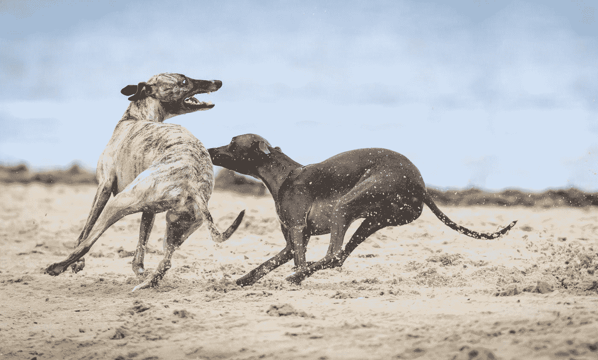

# 《分工产生的原则:国富论》第二章

> 原文：<https://medium.datadriveninvestor.com/wealth-of-nations-chapter-2-43e5235f394e?source=collection_archive---------5----------------------->

# 要求

***分工源于人性，只存在于人类。***

Photo by [Sven Brandsma](https://unsplash.com/@seffen99?utm_source=medium&utm_medium=referral) on [Unsplash](https://unsplash.com?utm_source=medium&utm_medium=referral)

如果你错过了，[第一章发布](https://medium.com/datadriveninvestor/of-the-division-of-labour-wealth-of-nations-chapter-1-d173464feae8)。

# 人性

人类想要交易。这对他们来说是自然的；所有人都有的。

> “这是人性中某种倾向的必然结果，尽管非常缓慢和渐进，但这种倾向并不具有如此广泛的效用；用一件东西交换另一件东西的倾向。”

然而，它是人类独有的。两只狗会一起追一只兔子，但是它们之间没有契约。也没有看到一只狗与另一只狗交换骨头。一旦一只动物完全长大了，它很大程度上就能自己养活自己了，它们从人或另一只动物那里得到东西的唯一途径就是交朋友。

就我个人而言，我有时也许能说服我的朋友帮我一个忙。然而，我没有时间为每一个需求都这样做。大多数商品都需要以物易物。我需要让他们相信这对他们来说是一笔好交易。我诉诸于他们自身的利益。

> “如果他能引起他们对他有利的自爱，并向他们表明为他做他要求他们做的事是为了他们自己的利益，他就更有可能获胜。”

每一次购买或物物交换都诉诸于自爱，而不是仁慈。

# **乞丐——反例**

我可以用一个乞丐作为反例。他们主要依靠社区的善意。对吗？**错了。**

乞丐可能会得到钱、衣服或食物。但是，他们收到钱后会怎么处理呢？如果慈善机构给他们钱，他们会用钱来换食物、衣服或其他任何需要的东西。甚至一件新外套也可能在某个时候被换成更好的尺寸或更迫切的需求

即使是乞丐，也大多是通过物物交换或购买获得食物..

# 贸易导致劳动分工

在一个既有猎人又有牧羊人的部落里，会有人擅长制作弓箭。猎人会愿意把一些狩猎任务交给优秀的制箭手。用上好的箭，猎人可以得到更多的食物。箭匠还通过贸易获得了更多的食物。因此，只有通过利己主义，双方才开始分工。

同样的道理也适用于擅长搭建帐篷或制作服装的人。他们交换剩余，社区的每个成员都得到了改善。他们有更多的商品，而且质量更高。

# 人才之争

天赋并不是我们想象的那么重要。人才差异是劳动分工的结果，而不是原因。

医生和电工是非常不同的领域。然而，我不能通过观察一个孩子来判断他们将来会成为什么样的人。他们太像 5 岁的孩子了。但是通过教育、训练、习惯和风俗，他们开始分化。

慢慢地他们分开了。最终，他们会大相径庭。但是，如果没有劳动分工，这两个人在个性和才能方面会更加相似。

如果没有物物交换，他们就需要学会满足自己的所有需求。天赋的差异只是因为物物交换才有用。

动物有非常不同的天赋。獒犬与灵缇非常不同，灵缇与西班牙猎犬也非常不同。

Photo by [Mark Galer](https://unsplash.com/@markgaler?utm_source=medium&utm_medium=referral) on [Unsplash](https://unsplash.com?utm_source=medium&utm_medium=referral)

獒犬的力量和灰狗的速度是相辅相成的。尽管如此，每种动物都需要支持和保护自己。这个物种并没有从一系列天赋中受益。他们没有物物交换系统，因此，一系列的人才是没有帮助的。

相反，男人有不同的兴趣，整体有助于增加生产和财富。

对于本章的播客摘要，请听[书呆子刺客金融星期五](https://anchor.fm/thenerdassassin)。或者[继续阅读第三章](https://thenerdassassin.medium.com/that-the-division-of-labour-is-limited-by-the-extent-of-the-market-wealth-of-nations-chapter-3-59bbdca82be7)。

###链接##

推特:【https://twitter.com/thenerdassassin 

领英:[https://www.linkedin.com/in/thenerdassassin](https://www.linkedin.com/in/thenerdassassin)

https://www.facebook.com/thenerdassassin/脸书

insta gram:[https://www.instagram.com/thenerdassassin/](https://www.instagram.com/thenerdassassin/)

中:[https://thenerdassassin.medium.com](https://thenerdassassin.medium.com)

https://www.tiktok.com/@thenerdassassin

播客:https://anchor.fm/thenerdassassin