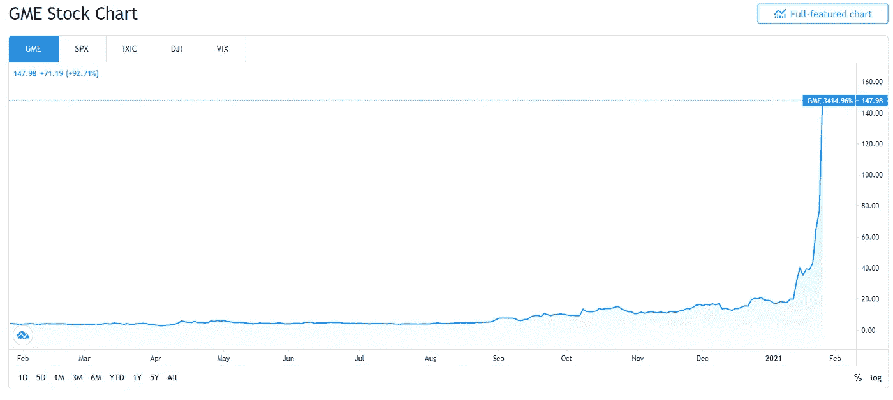

# 武器化的日内交易——当愚蠢的钱智胜聪明的钱

> 原文：<https://medium.datadriveninvestor.com/weaponized-day-trading-when-stupid-money-outwits-smart-money-2a4696ea9cb?source=collection_archive---------8----------------------->

GameStop Gamma Squeeze

 [## GME 股票价格和图表-纽约证券交易所:GME -交易视图

### GameStop Corp .从事多频道视频游戏、消费电子产品和无线服务的零售。它…

www.tradingview.com](https://www.tradingview.com/symbols/NYSE-GME/) 

没有一个人可以垄断知识。这同样适用于团体。互联网时代，信息和知识已经去中心化。

GME 卖空交易被主流媒体错误地框定了。据说，Reddit 帖子 r/wallstreetbets 上的一些无知的罗宾汉小孩不假思索地涌入了 GME 股票。

这种说法是错误的。需要揭穿的是错误信息。

# **原罪——精明的投资者在一笔交易中过度拥挤**

愚蠢的资金显然看到了聪明的资金的做空错误。这个错误就是某个行业过度拥挤。精明的资金卖空者在 GameStop (GME)上建立了巨额空头头寸。仅淡仓就相当于 GME 已发行股票的 130%以上。

从数学上来说，它注定会以悲剧收场。挤压是不可避免的。对冲基金犯了一个巨大的错误。这是一堂关于头寸规模的课。还应该从整体市场的角度来看待所采取的立场，而不是仅仅从基金的角度来看待。

聪明的投资者积累空头头寸是因为他们非常确信 GameStop 不会在目前正在进行的消费者变化浪潮中幸存下来，因为游戏玩家会在网上购买游戏产品。做空决定是有道理的。短裤的尺寸不合理。

# **推动价格上涨的不是罗宾汉，而是卖空者**

一个常见的错误观念是，r/wallstreetbets 用户不断购买股票，因此股价不断上涨。这是不对的。Reddit 粉丝不必不断购买股票来支撑高价。他们所要做的就是购买足够的股票来引发价格上涨。所需的初始涨幅刚好足以引发卖空者追加保证金的要求。

卖空者借入股票并卖出，等待价格下跌，以便以更低的价格买入。如果价格上涨，他就亏损了。由于头寸是按市值计价的，因此随着价格的上涨，追加保证金的要求会逐渐增加。久而久之，借入的股票将到期，卖空者必须在公开市场上以更高的价格买入，以平仓。这推动了价格上涨。

另一个因素在起作用。罗宾汉·芬托克夫妇购买了该股票的看涨期权。这些看涨期权的卖方必须对冲他们的风险。看涨期权实质上是赋予持有者以预定价格购买股票的权利。如果价格上涨，看涨期权的卖方就会亏损。银行/经纪商/对冲基金的审慎风险管理意味着，它们必须覆盖它们出售的部分看涨期权。这就是伽马发挥作用的地方。他们必须购买真正的股份。这种行为抬高了股票价格。

因此，我们有两个群体在哄抬价格。我们有卖空者和看涨期权的作者。它们被挤压。数学法则迫使他们违背自己的信念，将价格推得越来越高。

这是一个致命的反馈循环。卖空本质上是一种致命的交易，因为它有有限的上升空间(利润)和无限的下降空间。华尔街在玩火，影子华尔街(Reddit 用户)发现了这一点。

概括一下这一部分:

*   Reddit 上的 Robinhood kids 只需发起涨价，然后等待乐趣。
*   卖空者被迫在每次价格上涨时对冲或退出头寸。因为他们在交易中过于拥挤，以对冲为目的的购买足以推高价格。让他们用自己的绳子上吊。
*   这是经典的做空挤压，但因为 GME 的做空挤压涉及买入许多看涨期权，所以被称为伽玛挤压。

散户投资者的力量在于他们的数量，似乎通过对卖空者的攻击，他们找到了一种在不违反法律的情况下让自己的声音发挥作用的方法。

# **这是一场战斗**

*   散户投资者对机构投资者。
*   “傻钱”对聪明钱。
*   大卫对战歌利亚。

毫无疑问，许多人会支持这个小家伙。战斗的想法是在大画面中。这很可能是一个持续的趋势。通过利用数量上的优势，小家伙们不知不觉地将日内交易武器化，损害了那些通过救助享受到无穷好处的大家伙们(也就是大鳍的损失社会化)

# **不再业余**

Reddit 用户在 GME 采取的行动呼吁我们重新审视我们将散户投资者视为业余爱好者的做法。业余选手不会做出如此精心计算和执行的动作。

GameStop gamma 挤压是一种力量的展示。

爆米花，买单！软饮料，买单！VR 眼镜，检查！

让游戏开始吧。

这将是有趣的一年。

再见。