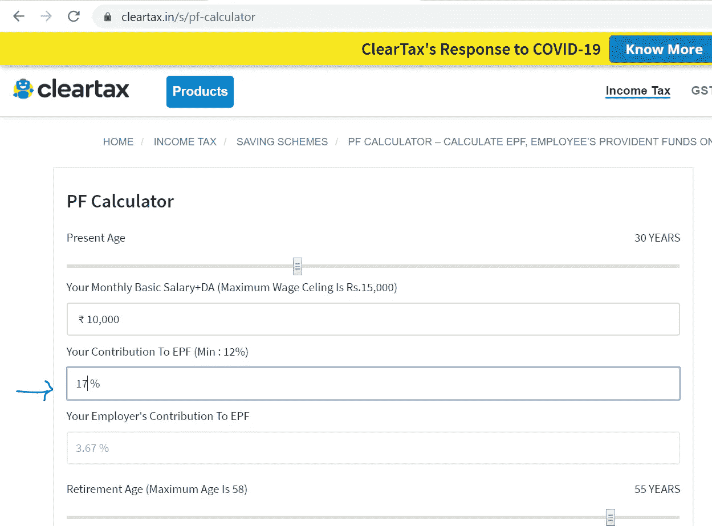
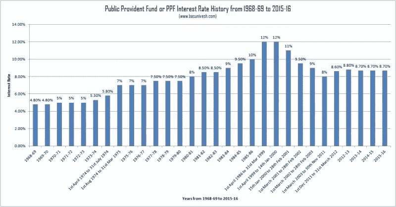
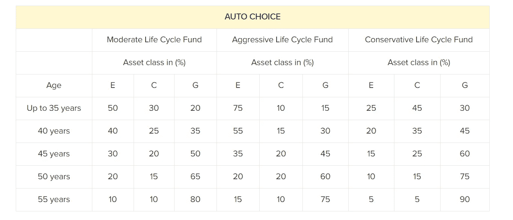

# 印度人眼中让你经济独立的武器

> 原文：<https://medium.datadriveninvestor.com/weapons-to-make-you-financially-independent-in-indian-perspective-dab62d54b400?source=collection_archive---------17----------------------->

这里所说的想法是我个人的观点。我不是注册财务顾问。

希望你们在一级防范禁闭期间一切顺利。所有被雇佣的男人和女人，真了不起！！在这个不幸的疫情，你比那些仍在努力找工作或失业的人在经济上更有保障。虽然就业不是最终目标，但我们的旅程从这里开始，走向婚姻、孩子、退休、父母的健康问题等等。

这篇文章适合 20 多岁、30 多岁或 40 多岁的人。如果你的月收入足够支付你的开销和 EMIs，那就太好了。但这还不是全部。新冠肺炎教我们未雨绸缪，为未知的未来做好准备。

我们都应该为几乎所有前所未有的时期储蓄和投资我们的收入。我研究并亲自投资了下面我要讲述的想法。希望它能帮助你规划你的财务目标。

在你做这些之前。请记住要节俭，在你的储蓄账户里至少有一年的应急基金。每月有预算，量入为出，一定是你的个人属性。

 [## 更好的预算，打造更大的|数据驱动型投资者

### 即使是专家也承认它们并不完美。从 1 到 10 的范围内，安东尼·科普曼和德尔…

www.datadriveninvestor.com](https://www.datadriveninvestor.com/2018/11/08/budget-better-to-build-bigger/) 

如果你有房屋贷款或信用卡贷款，请及时还款。如果你还有工作，请不要把付款推迟到下个月。你会成为债务雪球的受害者，这迟早会给你带来麻烦。

因为我们住在印度，我知道有时父母会把他们的孩子从与金钱相关的事情中解救出来。在这种情况下，我总是建议你坚持自己的立场，不要从父母那里获得一个卢比的帮助或支持。他们创造的财富，是他们可以享用的，而不是你可以随意挥霍的。越早明白这一点，你走向未来的道路就越平坦坚实。

无论你的收入有多少，拥有多张信用卡都是一件大事(T2，不，不，T3)。虽然我总是不要信用卡，但是有一张信用卡来应付任何不幸的事情也没关系。我建议不要用这张卡支付日常开销。

现在让我们来谈要点。我要叙述的观点，我们都知道或听过。但是我们倾向于忽略它们，给出一些琐碎的借口，比如我不信任政府管理的基金、银行、AMC 等等。虽然这是你的血汗钱，是你做决定的选择。

这些工具经过测试，证明从长远来看是有效的。请记住，没有捷径，也没有快速解决办法。

# 1.VPF(自愿节约储金)

是的，我知道你们都知道。虽然你知道，但你从未考虑投资它。因为这听起来太传统或者人们认为一些钱已经从我的工资中扣除了。几块额外的钱不会给它增加任何显著的价值。我们再深入一点。

通俗地说，VPF 是你的 EPF 的一个额外补充。利率与 EPF 相同，即 8.65%。优于 FD 比率(6–7%)。如果你投资超过 5 年，它会给你 80C 以下的税收优惠或 EEE 类别。

PF 基金(EPF/VPF)是长期的。换工作或为了额外的钱而退出不是一个好主意。这对你没用。那些资金主要用于退休目的。如果您提前退休，或因女儿结婚、子女高等教育等紧急情况，您可以部分提取。如果你在 VPF 投资，你可以使用 VPF，而不是 EPF。

由于 VPF 是灵活的，你可以从你的基本工资的 1-88%供款，因为 12%已经向 EPF 供款。

此外，VPF 就像 EPF 一样，会在你的工资存入银行账户之前扣除。你不能在财政年度内对 VPF 做任何改变。要启动、关闭或修改它，您必须等待财政年度的开始月份。在三月，它开放给变化和新的贡献。你必须向你的人力资源部申请开设 VPF 账户。

与 EPF 不同，VPF 没有雇主的贡献。即使你只为 VPF 贡献基本工资的 5 %, 25 年后也会成为一笔巨大的财富。这不是一种快速致富或类似的方法。而是一条被证明可靠的可持续致富之路。你可以在这里计算总数。([https://cleartax.in/s/pf-calculator](https://cleartax.in/s/pf-calculator))。例如，EPF 12 %, VPF 5 %,总公积金金额将为 17%。

请注意，你的基本工资会逐渐增加。每年可能增长 10%以上。当你换工作时，它可能会在你职业生涯的最初阶段急剧增加。

推荐的方法是保持每年增加 VPF 百分比(至少每年 1%)，除非你有任何其他更好的工具。

如果你能想象 VPF 的力量，我会建议你考虑每月存一点额外的钱到一个有很高利率的安全的银行，直到你退休(25-40 年)。

# 2.PPF(公共公积金)

这是一所像 VPF 一样的老学校。虽然它没有链接到你的 EPF 帐户，你也不能链接它。它的超能力是它能把你的钱锁起来 15 年，在那之前你不能提取它。你可以在 5 年后退出，以防你患有绝症或接受高等教育或改变居住地(海外就业)。

现在的利率是 7.1%，而在科罗纳·疫情之前，利率曾超过 8%。正因为如此，很少有人开始认为这是一种较弱的投资。

现在如果你看这个图表，你会发现 PPF 在 1999 年到 2000 年间曾经是 12%。自那以后，它就再也没有碰过那个顶部。基金管理公司根据我们的经济状况做出了调整回报。

自从疫情事件以来，我们的经济可能已经衰退了。但如果你阅读历史而不是新闻预测，你会明白经济总是会复苏，并在更长时间内走高。

例如，随着时间的推移，人类已经经历了许多战争和文明冲突，但我们仍然从石器时代进入了数字时代。

PPF 可以在任何银行或邮局开立。您每年最多可以向该账户存入 15 万卢比。不能是联名账户持有人。只能用一个人的名字打开。如果你在接下来的 15 年里每年投入 15 万卢比，你最终会积累 400 万卢比。你还可以享受 80 度以下的税收优惠。

对于一个额外的信息，我想分享，PPF 可以超过 15 年。你可以在每个学期结束时继续增加 5 年。很少有人会不喜欢这样，因为它将你的钱绑定 15 年，但它会在期末给你一笔财富。即使你每月投入 2000 印度卢比，并保持每年 10%的增长率，你也会有一个合理的本金。

我知道这不是你驾驶梅赛德斯或法拉利的方式，但你有任何不同的选择来增加你的财富吗？如果是的话，欢迎你代替 PPF 试用它们。

理财不是拥有奢侈品，而是为你和你的家人创造可持续的财富。

# 3.国家养老金计划

与印度政府 2009 年向公众推出的其他计划相比，这是一个相对较新的计划。它实际上是从 2004 年开始面向政府雇员的。

这是在工资记入你的工资账户之前扣除的。你可以在一个财政年度的任何时候选择它。

如果我开始写 NPS，那将会是一篇很长的文章。简单地说，这是一种由资产管理公司(AMC)管理的共同基金计划，如 hdfc、icici、sbi、lic 等。

它有两层:第 1 层和第 2 层。您不能退出第 1 级，除非您有紧急情况，如绝症、女儿的婚姻、孩子的高等教育等。

扣除退出负荷后，您可以随时退出第 2 级。无论您支付的是第 1 级还是第 2 级，只要您在 3 年内不提取，您都可以利用 80C 税赎回。

每个月你只有 10%的基本工资可以用于 NPS。您也可以通过在线自愿捐款，并享受高达 50，000 印度卢比的 80D 税收减免。

NPS 分为四类投资:

计划 E(股权)允许高达 75%的股权参与，投资于股票

计划 C(公司债)，仅投资于高质量公司债券，最高可达 100%

计划 G(政府/金边债券),仅投资政府债券，最高可达 100%

方案 A(另类投资)，允许高达 5%(新增加的资产类别仅适用于有主动选择权的私营部门认购者)

在订阅期间，它有选择自动选择和主动选择。

自动选择由基金管理公司的专业人士管理。

而主动选择由用户自己管理。仍然主动选择不允许超过 75%的股权。

自动选择有 3 个生命周期:

1.进取型生命周期基金(LC75)

2.适度生命周期基金(LC50)

3.保守生命周期基金(LC25)

在进一步研究生命周期之前，我们必须了解资产涉及的风险:

(Source: ET Money)

由于股票具有较高的相关风险，NPS Auto Choice 的分类如下:

(Source: ET Money)

股票意味着它被投资到股票市场。

进取型生命周期基金(LC75)；最多允许 75%的股权。

中等生命周期基金(LC50)；最多允许 50%的股权。

在保守的生命周期基金(LC25)；最多允许 25%的股权。

其他资产类别比股票相对安全。

不过，政府债券、公司债券和另类基金更安全。根据风险回报概念，这里的回报低于股票资产类别。

如果你通过 NPS 计算器([http://www.npstrust.org.in/content/pension-calculator](http://www.npstrust.org.in/content/pension-calculator))，你会发现，如果你从 25 岁到 60 岁开始每月投资 3000 印度卢比，并以每年 10%的速度递增，你将会有价值十亿的本金。或者退休后每月获得 50000 印度卢比/月的养老金。

请注意，网页上有简单的计算方法，而每年 10%的增量是我自己用 excel 表格计算出来的。即使考虑直截了当的计算，60 岁以后也不是个小数目。

请注意，您必须从 NPS 网站中提到的基金管理公司购买年金才能获得养老金。年金促进了养老金的发放，直至投保人死亡，如果您选择直至投保人及其配偶死亡。

这是一种在政府监管下管理的可靠和值得信赖的产品。

你应该只根据你的理解投资，不要受任何文章的影响，甚至是我的文章。

最后，我想说的是，你必须严格控制你的个人财务。除非你是一个企业主或者一个成功的副业骗子，否则你必须考虑投资这些工具。在实施这些想法之前，你必须写下你的短期和长期目标。市场上与 ULIP 相关的仪器很少，有时好有时坏。没有阅读和理解，你不应该报名参加他们。财务自由是一段旅程，需要耐心、节俭和自律来实现。虽然市场上还有其他几种更好的方案，但我只提到了那些投资者在投资 时会感到舒适和安全的方案。

如果你有房地产这样的被动收入来源，那就恭喜你了。

省吃俭用，多挣钱，永远伤害不了谁。

***PS:本文是通过持续关注公共和私营部门的员工及其消费习惯而撰写的。***