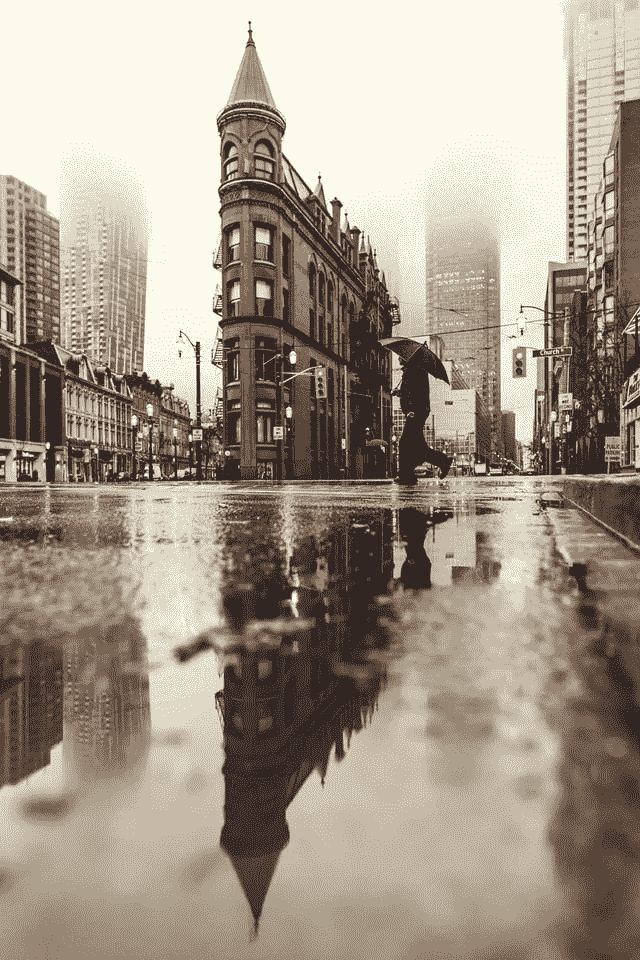

# 该死的天气穿衣服

> 原文：<https://medium.datadriveninvestor.com/wear-clothes-for-the-damn-weather-2130bb9eb2bf?source=collection_archive---------23----------------------->

这是我今天被告知的。

Photo by [Matthew Henry](https://unsplash.com/@matthewhenry?utm_source=unsplash&utm_medium=referral&utm_content=creditCopyText) on [Unsplash](https://unsplash.com/s/photos/rainy-day?utm_source=unsplash&utm_medium=referral&utm_content=creditCopyText)

从上午 11 点到下午 1 点 15 分，今天就像其他任何一天一样。大约在下午 1 点 25 分，我的一整天就这样过去了，而我甚至还不知道。(哦，惊喜！)人人都爱惊喜！

> 那些有益无害的。

我应该在 2 点钟有一个约会，我在高速公路上大约 10 分钟的路程。我低头看了看我的温度计，看到它缓慢但稳定地慢慢靠近顶部的红色标记。“不不不……”我想。我把车停在公路边，熄火，努力保持冷静。“这很好，你只需要让它冷却下来”我打电话给我的约会对象，告诉他我要迟到了，我的车过热了，我现在停在高速公路上。

我们挂了电话，我觉得车够凉了，可以试着走远一点。我去打开我的车，现在它甚至不能启动。我现在又生气又害怕。我打电话给帮助创造我的人；比尔，告诉他发生了什么事，我想这是我的冷却剂，但我上周才加满，所以很奇怪。当和他谈话时，我意识到为什么汽车不能启动…我从来没有把它放在驻车档。

> 我是 facepalm。“至少解决了一个问题”我想。他告诉我试着继续前进，当引擎太热时停下来。

我发动了汽车，大约 10 分钟后就没事了。现在是下午 1 点 45 分，整个过程一直持续到下午 2 点 40 分。我在乡下的一个加油站停下来加油、加机油和冷却液。我抓起我的面具，进去，得到一些奇怪的眼神，因为我是唯一一个戴着面具的人，付钱，然后离开那里。我去加油，然后就上路了。我离我要去的地方还有 6 分钟。我大约 20 分钟后到达那里。

 [## 健身房 10 年的 10 条人生经验|数据驱动的投资者

### 走错一步，他们就会掉下去。两位登山者优雅地回到了地面。他们在那里…

www.datadriveninvestor.com](https://www.datadriveninvestor.com/2020/02/03/10-life-lessons-from-10-years-in-the-gym/) 

我终于赴约了，一切都很顺利。我在车里放了些冷却剂，然后就出发了。所以我想…我在大约一英里外停下来。我现在很热。我说了一些话，然后打电话给比尔。“嘿我又停下来了..我只走了大约 5 分钟。“好的，我来了”他说。

好在他住的地方离那里只有 20 分钟的路程，所以不会太麻烦。我看了看我的后座，看到一条毯子，“是的！一些温暖的东西”我想。我的暖气不太好使，所以当他找到我的时候，我已经冻僵了。

我看见他停在我的车后面，我摇下车窗。他说打开引擎盖，从我车里拿出冷却液。他环顾四周，告诉我我的冷却剂箱有一个裂缝，我需要一个新的软管。

我叹了口气，说“好吧”。他把冷却剂放在散热器里，说“嘿，你看起来很冷，你应该穿上衣服来适应这该死的天气”，然后吃吃地笑。

我穿着紧身裤和毛衣。他是对的。我应该穿件夹克，带些手套。或许还穿过雪裤？谁知道呢。密歇根现在是 11 月，冬天即将来临。

我今天学到了两个有价值的教训。为该死的天气穿上衣服，或者带回来。第二个教训是坚持检查我的车内液体，并对我的车进行适当的保养。

你活着，你学习，然后你做出更好的选择。

## 访问专家视图— [订阅 DDI 英特尔](https://datadriveninvestor.com/ddi-intel)