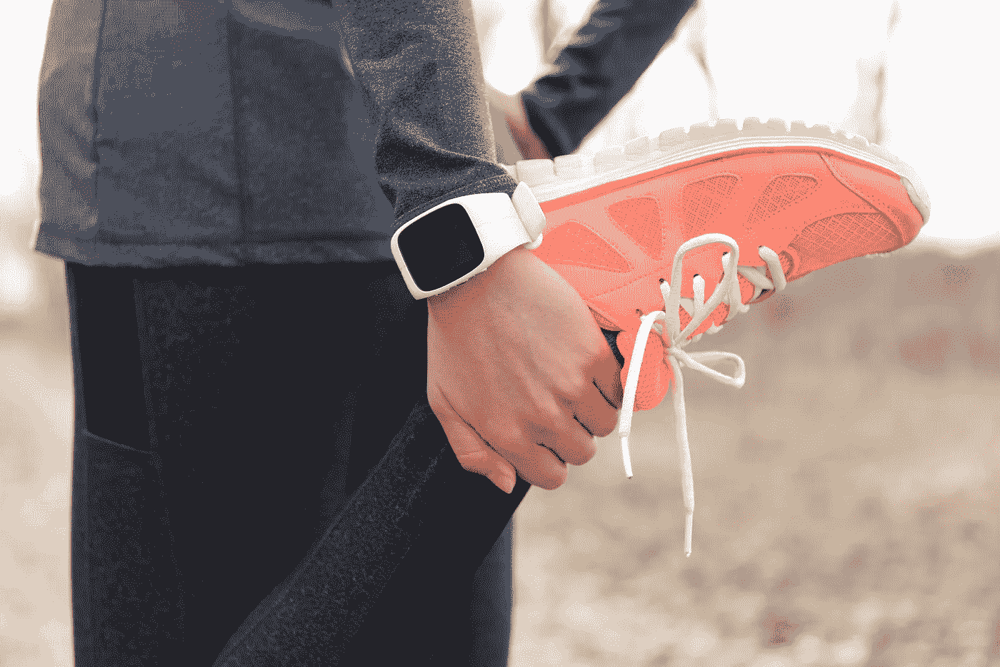
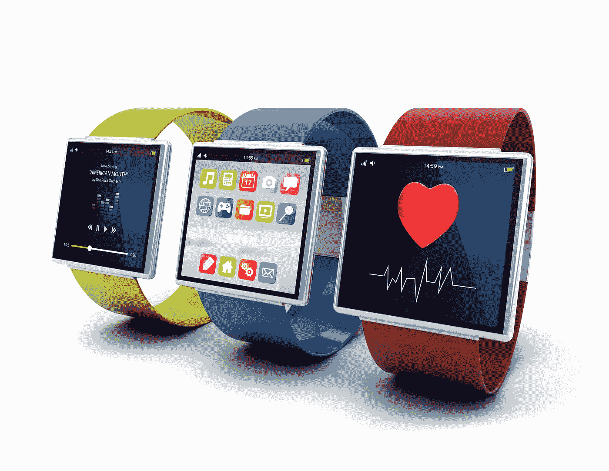
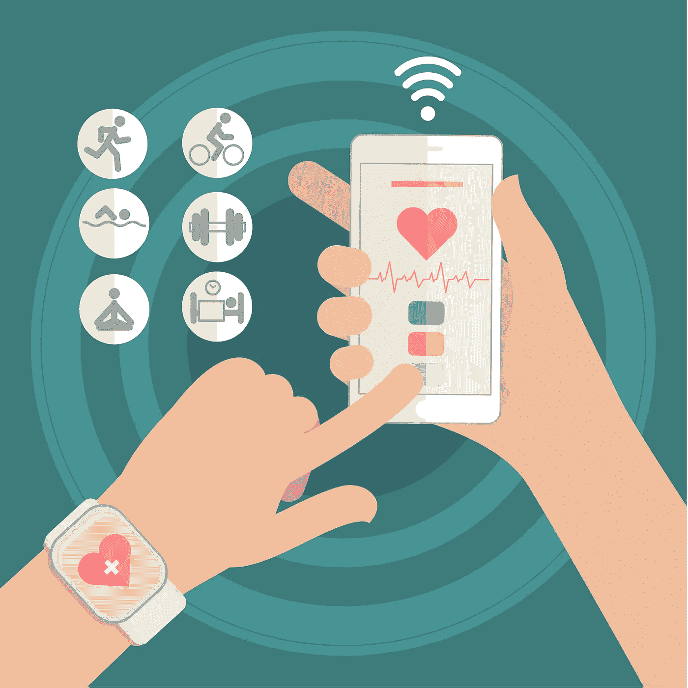

# 可穿戴设备:释放生产力的钥匙

> 原文：<https://medium.datadriveninvestor.com/wearable-devices-the-key-to-unlock-your-productivity-733e7b3d6477?source=collection_archive---------6----------------------->

## 但是进步值得我们以健康为代价吗？

Source: [Maridav](https://depositphotos.com/portfolio-2069237.html) / [Depositphotos.com](http://www.depositphotos.com)

这是一个快节奏的世界，雇主要求员工不断提高生产力。可悲的是，健康往往是我们快速进步的牺牲。压力、熬夜和快餐是常态。但是谁来照顾我们的健康呢？我们还有时间吗？可穿戴设备可以让我们两全其美——它们可以提高我们的生产力，同时密切关注我们的健康。这些小小的科技奇迹可以让我们更专注于从我们无尽的待办事项清单中划掉项目，而不是那些可能会或可能不会困扰我们的事情。

[可穿戴技术](https://www.sciencedirect.com/science/article/pii/S0003687018306094#bib12)是具有先进传感器和计算技术的产品，可以在日常活动中穿戴在身上，以生成、存储和传输数据。它们可以在监控生产力、识别危险以及在风险出现时进行干预方面派上用场。他们还可以提供改善任务管理的建议。最重要的是，它们可以促进使用者的健康和福祉。

Source: [Georgejmclittle](https://depositphotos.com/portfolio-1607243.html) / [Depositphotos.com](http://www.depositphotos.com)

最早的可穿戴设备是  [简易手表](https://www.ncbi.nlm.nih.gov/pmc/articles/PMC6278615/#ref6)。这些值得信赖的创新让员工知道一天中的时间，从而改善了他们监控自己活动的方式。几年前，它们被当作项链佩戴或放在口袋里随身携带。为了提高效率和方便使用，手表后来被设计成可以缠绕在手腕上，从而标志着目前正在彻底改变世界的创新的下一步。今天，由于传感器和人工智能的引入，这些简单的时间监控机器已经发展成为智能手表和其他技术。

随着可穿戴设备从各个角度冲击市场，我们不禁预测它们在提高生产力和监测健康方面将扮演的角色。

# 可穿戴设备到底是如何提升生产力的？

2017 年  [的一项研究](https://www.researchgate.net/publication/318426626_The_Use_of_Wearable_Devices_in_the_Workplace_-_A_Systematic_Literature_Review)显示，可穿戴设备在提高工作场所的生产力方面发挥着重要作用。根据作者的说法，它们有助于监控心理和生理因素(压力)，提高运营效率，促进工作场所的安全和保障，以及改善工人的健康。

> “到 2020 年，超过 7500 万台可穿戴设备将渗透到工作场所。”
> 
> *-普华永道报告(2016)*

2016 年，普华永道  [报告](https://www.pwc.com/us/en/services/consulting/library/consumer-intelligence-series.html)预测，“到 2020 年，超过 7500 万台可穿戴设备将渗透到工作场所。”正如普华永道和其他研究人员预测的那样，可穿戴设备的渗透率和使用量确实有所增加。下面是它们的使用方法:

Source: [Alphaspirit](https://depositphotos.com/portfolio-1001201.html) / [Depositphotos.com](http://www.depositphotos.com)

# 1.监控员工的压力因素

密切关注员工的心理和生理健康对于提高生产力至关重要。可穿戴设备可以收集数据；一些  [研究人员](https://www.ncbi.nlm.nih.gov/pmc/articles/PMC6515276/)使用心脏活动、皮肤电导和加速度计信号对压力水平、放松时间活动和较高认知负荷进行分类。他们通过利用机器学习方法实现了这一点。

现在，智能手表、表带、服装、嵌入传感器的贴片、小型便携式设备和移动应用等可穿戴设备可以记录并提供许多不同身体表现变量的反馈。这些变量由一组研究人员确定，包括心肺功能、运动模式、汗液分析、组织氧合、睡眠、情绪状态和认知功能的变化。由利夫治疗公司开发的  [【利夫】](https://www.getlief.com/)等设备可以测量你的心脏和呼吸，通过使用一种经临床证明的压力生物标志物——心率变异性(HRV)，实时跟踪压力水平。

# 2.提高运营效率

可穿戴设备可以改善沟通渠道。它们让员工了解所有工作流程的最新情况，而不会影响效率和服务交付。人工智能与 AR 相结合，可以使通信更准确，更容易理解。

像  [HPE 视觉远程引导(VRG)](https://www.myroom.hpe.com/VRG) 这样的设备提供了一种安全的企业就绪型解决方案，能够通过与扩展团队进行视觉引导的互动会话来提高生产力、效率并降低组织的成本。

RealWear Ready Partner: Hewlett Packard Enterprise (HPE)

# 3.促进工作场所的安全和安保

当员工感到安全时，他们会更有动力去工作(从而更有效率)。为煤矿工人或重型机器操作员集成可穿戴设备有助于避免危险。它们可以检测危险的工作区域，同时限制错误警报，并警告员工潜在的风险因素，如噪音水平、  [、极端温度](https://www.sciencedirect.com/science/article/pii/S0160412018329799)和有害毒素。

Source: [VectorStory](https://depositphotos.com/portfolio-4038693.html) / [Depositphotos.com](http://www.depositphotos.com)

# 4.改善工人的总体健康状况

由人工智能和机器学习支持的智能手表、贴片和其他形式的可穿戴技术可以监控心率、血压、体温和生命体征。例如，[Apple Watch Series 5](https://www.apple.com/watch/)能够生成类似于单导联心电图的心电图。如果出现问题，它甚至可以提醒用户。此外，它还可以监控月经周期，并在噪音水平上升到可能损害听力的程度时通知用户。

# 结论

虽然人工智能改变了我们生活的方方面面，但可穿戴技术的实用性将继续增长。它们让各种工作变得更容易、更有保障、更安全、更有效率。

你如何看待使用可穿戴技术来提高你在工作场所的效率？这是你会采纳的吗？你已经有了吗？让我们知道可穿戴数字技术如何影响您的工作效率。

*最初发布于*[*https://www . aim blog . io*](https://www.aimblog.io/2020/10/19/wearable-devices-the-key-to-unlock-your-productivity/)*。*