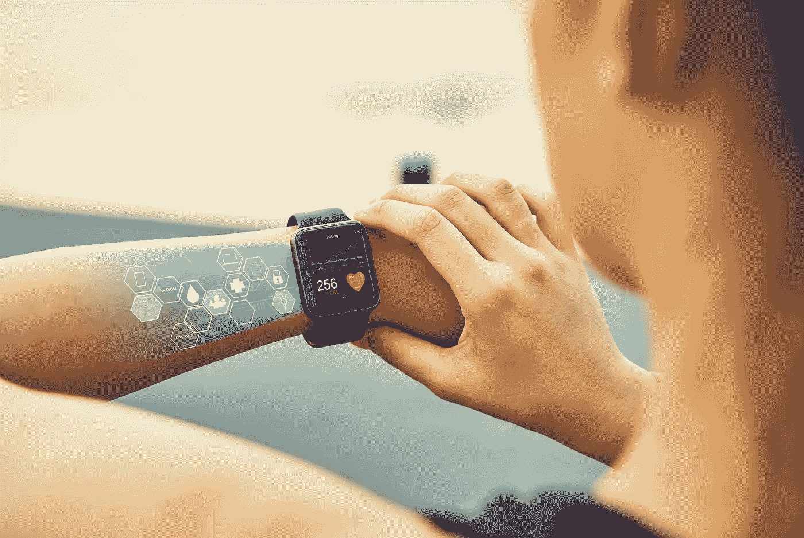
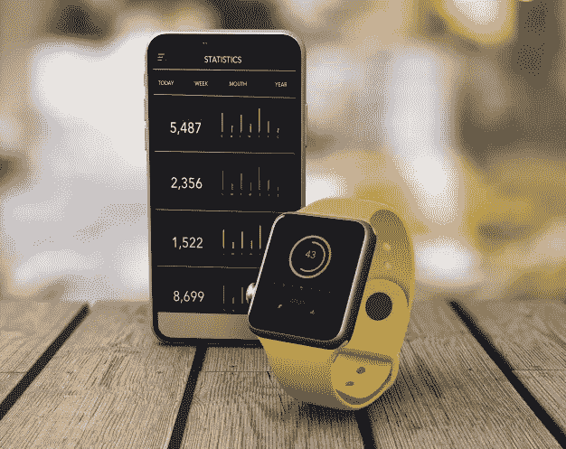

# 可穿戴技术:初创企业的机遇

> 原文：<https://medium.datadriveninvestor.com/wearable-tech-an-opportunity-for-start-ups-f2b1ca4ea527?source=collection_archive---------20----------------------->

由于全球医疗保健市场的价格敏感性，价格低于 50 美元的可穿戴设备继续占据主导地位。作为许多新想法和产品的源泉，可穿戴技术对于不断推出可穿戴电子产品新创新的初创公司来说是一个令人兴奋的市场。

虽然主要被视为手表和腕带，但可穿戴设备也可以耳机、贴片、智能服装和植入设备等形式出现。该技术的价值主张在于能够实时获取大量数据并对其进行分析，从而为佩戴者提供有益的见解。

想知道为什么可穿戴技术市场是正确的进入领域吗？我们会告诉你原因。

**你为什么要考虑在可穿戴技术市场开展业务？**

随着人工智能和增强现实为初创企业进入竞争创造了越来越多的机会，可穿戴技术正在一个偶然的时间进入市场。不用说，智能可穿戴设备类别中有很多创新，包括但不限于智能眼镜和手表等设备。由于企业级采用可穿戴技术的巨大潜力，可穿戴设备正在席卷全球。最初是[健身或健康产业](https://www.quytech.com/fitness-app-development.php)的事情，现在已经渗透到其他几个领域，包括履行仓库、执法和军事。如果你是一名梦想接下电话并引领潮流的初露头角的企业家，可穿戴设备确实是一个不错的开始。

*还不确定？*

这里有一些你需要知道的关于全球可穿戴技术市场的令人兴奋的事实。

*   根据美国运动医学学院进行的一项调查，可穿戴技术可能会成为 2021 年的最大健身趋势。
*   IDTechEx 的一份报告指出，2019 年可穿戴技术市场价值超过 500 亿美元，这表明该市场自 2014 年以来已经翻了一番。
*   2017 年连接到 4G 网络的可穿戴用户总数为 4.27 亿。根据 Statista 的一项研究，这一数字预计将在 2022 年底达到 9 亿。
*   可穿戴健身技术对于城市人口，尤其是千禧一代来说是一个至关重要的小工具。盖洛普进行的一项调查表明，近 35%的郊区居民使用此类产品。
*   到 2022 年底，联网可穿戴设备的数量可能会达到 11 亿。

*现在，当你决定在可穿戴设备市场为自己开拓一个利基市场时，这里有一些行之有效的方法，你可以从中分一杯羹。*

**如何在可穿戴技术市场取得成功？**

在一个由科技巨头高度主导的市场取得成功并不是一件容易的事情。不过，也没那么难。这里是你如何去计划和保持领先于竞争对手，包括新的实体。

**定义你的定位**

如果你刚开始涉足可穿戴设备，最好跳过人群，把自己定位在一个竞争不激烈的市场。在这里，你如何定位自己是关键。试着专注于一个既能满足客户需求，又能与你的兴趣相交的细分市场。我们建议你识别需要的时刻，选择一个开放的市场。例如，你可以跳过智能手表市场，转而选择安全嵌入式可穿戴设备，在需要时向佩戴者提供紧急服务。设计您的设备时，请牢记更高的目标。这将最终引导你找到一款真正能引起用户共鸣的产品。

**利用数据的力量**

作为一家可穿戴初创企业，你需要不断关注细节，并利用数据来提升用户体验。一些初创企业自豪地展示仪表盘，并通过配套应用向用户提供信息，然而，如果你一次又一次地展示相同的数据点，这种新鲜感很快就会失去光泽。想办法提供见解，开发实际上与用户的旅程和需求保持同步的应用。例如，如果你正在处理帮助用户保持良好健康的可穿戴设备，可收集的数据可能包括睡眠和呼吸模式、水和食物摄入量的详细信息，或者可能是一整天燃烧的卡路里。重要的是要记住，可穿戴设备公司可以使用高级分析来最好地实现设备的潜力。因此，你在机器学习和分析上投入的时间越多，这款设备就越有利可图。

**继续创新**

可穿戴领域一直活跃着。然而，仍然有创新的空间。这意味着初创企业有充足的机会通过在其他市场看不到或面对的几个社会方面进行创新来制造全球产品。到目前为止，可穿戴技术的主体一直围绕着用户健身追踪器。然而，范围远远不止于此。如果你想预测可穿戴技术行业的下一步，最好的方法是站在一家老牌科技公司的角度。仔细思考如何将数字基础设施很好地融入用户的生活方式。随着技术的发展，我们已经见证了有助于提高生活质量、实现远程监控和家庭诊断的传感器。但是，随着科技的突飞猛进，这只是冰山一角！

你能说出一些因创新典范而声名鹊起的成功创业公司吗？

*嗯，这个问题的答案是肯定的！*

以 Myontec 为例，它现在是一家尖端的可穿戴公司，利用肌肉激活技术为理解肌肉行为提供了一个新的维度。同样，walk with path 也是一家有前途的初创公司，它集中提供解决帕金森病问题的产品，并提出了激光鞋的概念。

**编造故事，开展众筹活动**

利用讲故事的力量来提供对产品和意识形态背后的人们的一瞥。使用视觉效果、设计模型和引人入胜的视频，以便在社交媒体上分享。开发一个众筹活动，帮助你触发冲动反应，在那里你最有可能将观众转化为预购者和分享者。请记住，资助你的人不是在寻找一种产品，而是一种他们可以信任和分享的体验。缜密思考，深入到支持者的内心。为他们提供参与分析过程的空间，分享意见，并成为成功故事中的积极因素。

*给你灵感的成功故事:*在发起众筹活动时， *t* 借鉴初创公司的做法，如 **Embr Wave** 在 Kickstarter 上筹集了高达 629，856 美元的资金，或者你也可以从成功发起活动并通过 Indiegogo 预购超过 150，000 美元的 Haikara 那里获得灵感。