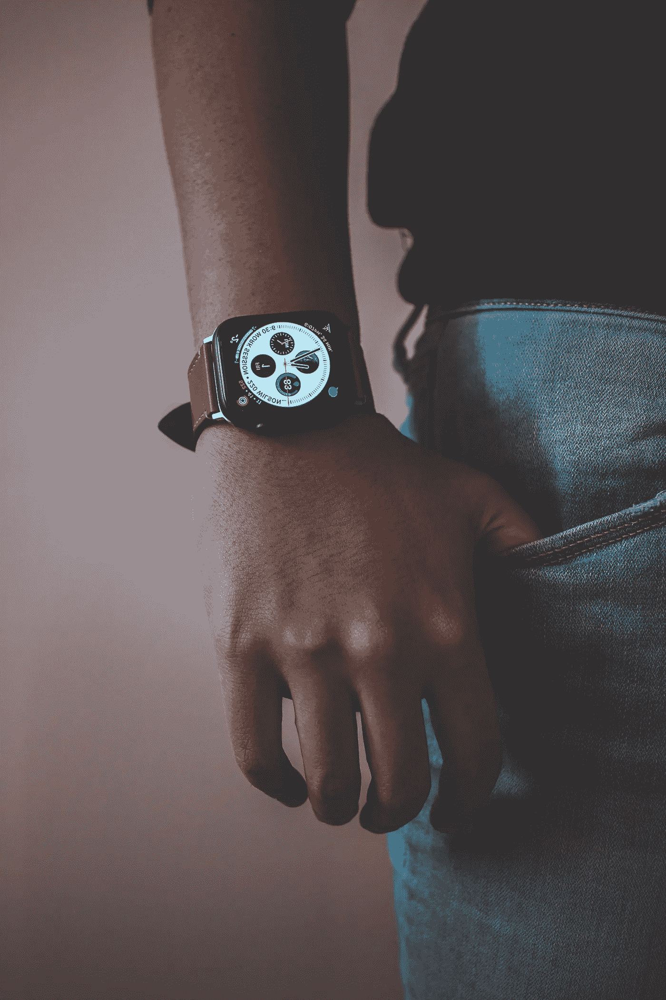
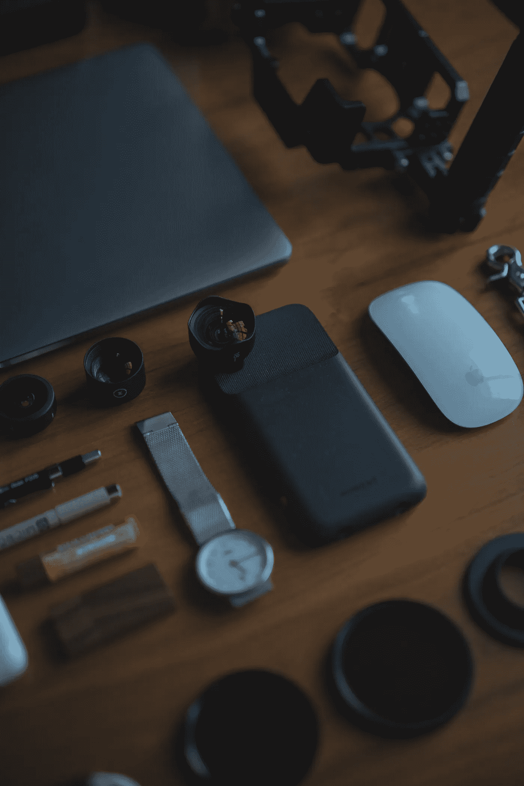
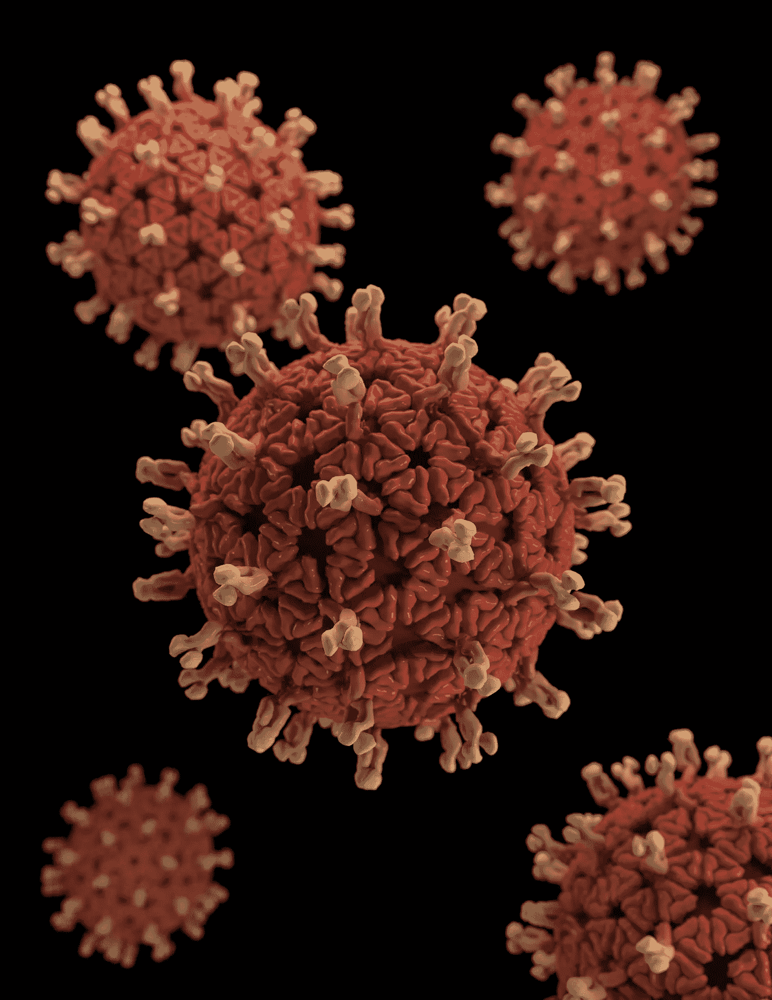
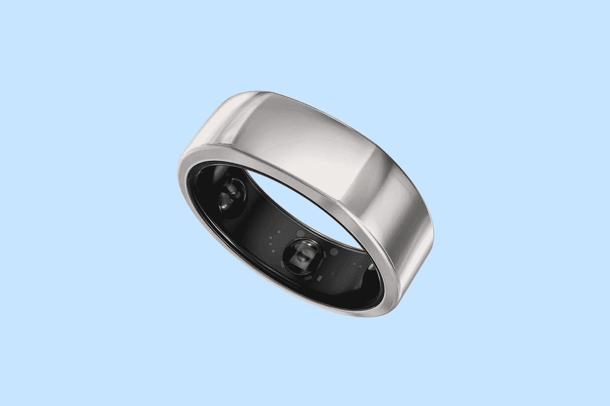

# 可穿戴设备、人工智能和病毒追踪让数百万人用他们的数据进行创新研究

> 原文：<https://medium.datadriveninvestor.com/wearables-a-i-and-virus-tracking-enrolling-millions-with-their-data-in-innovative-studies-49977d6095e4?source=collection_archive---------25----------------------->

Photo by [Nadine Shaabana](https://unsplash.com/@nadineshaabana?utm_source=unsplash&utm_medium=referral&utm_content=creditCopyText) on [Unsplash](https://unsplash.com/s/photos/health-wearables?utm_source=unsplash&utm_medium=referral&utm_content=creditCopyText)

手表、戒指和其他华丽的时尚形式在一个被杀手病毒[新冠肺炎](https://www.cdc.gov/coronavirus/2019-ncov/symptoms-testing/symptoms.html)笼罩的世界里，随着研究[可穿戴设备](https://en.wikipedia.org/wiki/Wearable_technology)发展出了新的生命。手表不再仅仅是给朋友留下深刻印象的东西。

现在，手表、[戒指](https://techcrunch.com/2020/03/23/oura-partners-with-ucsf-to-determine-if-its-smart-ring-can-hep-detect-covid-19-early/)和其他将要开发的设备将贡献有价值的[个人健康数据](https://www.businessinsider.com/wearable-technology-healthcare-medical-devices)并自动“登记”某人进入疾病或健康的临床研究，如[检测](https://detectstudy.org/)(**D**数字 **E** 啮合& **T** 机架 **E** 早期 **C** 控制&**T**研究人员正试图招募更多的人参与他们的研究。如果您希望参与，请访问他们的网站了解更多信息。****

“作为我们 DETECT health 研究的参与者，您将能够跟踪您的静息心率，并与 Scripps Research 的科学家分享这些信息。

“我们的目标是快速识别病毒爆发的地区。我们希望早期预警有一天可以给公共卫生官员更多的时间采取行动，让你更好地照顾自己和你爱的人。

“我们还希望开发出更个性化的医疗保健方法。我们不是将您的心率(或其他生命体征)与“平均值”进行比较，而是想了解您的正常情况。最终，这可能有助于我们更好地预测你生病的时间。“未来已经到来。

这些可穿戴设备的一个意想不到的好处是，临床研究将可以接触到数千甚至数百万名受试者。数据的广度令人印象深刻，它可以提供一个更有意义的信息宝库，在这个疾病和死亡的黑暗时代，它是一盏明灯。

如果我们扩大“可穿戴”这个词的含义，各种类型的可穿戴设备在我们生活中的时间比我们想象的要长。如果我们这样做，那么我们知道在 13 世纪，第一个可穿戴的眼镜的设计被开发出来了。虽然这似乎是在延伸这个术语，但它确实标志着一种技术发展，提供了发展今天的激光、计算机和每一种视觉环境测量或感知管理的手段。

计算机，这些充满房间的旧机器，开始受益于技术。他们的小型化带来了以前无法想象的可穿戴计算机，现在已经被集成到手表和戒指中。

"*[*第一台可穿戴计算机*](https://www.researchgate.net/publication/2336885_The_Invention_of_the_First_Wearable_Computer) *是由作者(Edward O. Thorp)在 1955 年构想出来的，用来预测轮盘赌，并在 1960-61 年与麻省理工学院的 Claude Shannon 共同努力下达到顶峰。最终的操作版本于 1961 年 6 月在香农的家庭地下室实验室进行了测试。**

**

*Photo by [Lee Campbell](https://unsplash.com/@leecampbell?utm_source=unsplash&utm_medium=referral&utm_content=creditCopyText) on [Unsplash](https://unsplash.com/s/photos/wearable-computers?utm_source=unsplash&utm_medium=referral&utm_content=creditCopyText)*

*我们现在在哪里？*

*自第一台小型计算机问世以来，65 年过去了，微型化将这些复杂的部件压缩成了一只迪克·特雷西(Dick Tracy)的模型手表。然后，手表中加入了通信功能，这使它不仅能显示时间，还能驾驶我们的汽车，避免交通堵塞，以及预测天气。*

*在一个管理大量即时数据需求的世界里，手表必须不仅仅是一只手表。不仅是手表，其他形式的可穿戴设备也必须被开发出来。对变革的推动再次带来了创新，这种情况还在继续。*

*如果老年人独自生活，他们需要一种个人保护手段。那些患有需要持续监测心率、血压和血糖的疾病的人必须拥有能够应对挑战的设备。*

*诚然，我们需要实时监控身体健康数据，但我们是否也可以以不同的、面向未来的方式利用数据呢？新冠肺炎病毒的出现为这种新方法提供了动力。*

**

*Photo by C.D.C. on [Unsplash](https://unsplash.com/s/photos/virus?utm_source=unsplash&utm_medium=referral&utm_content=creditCopyText)*

*加州大学旧金山分校的研究人员正在探索一种算法，该算法从 Oura 智能戒指的 T5 T6 T7 T8 T9 T10 获取数据，可以捕捉到体温或心率的上升，这可能是医护人员感染病毒的信号。*

**“在圣地亚哥，斯克里普斯研究转化研究所的科学家们正在招募几乎任何类型的可穿戴设备——从苹果手表到 Fitbits——的人，试图利用心率、温度、活动和睡眠水平的数据来预测病毒的区域集群*。”*

*可穿戴设备有一样东西可以证明在流感或 COVID–19 病毒等呼吸道感染的情况下非常有价值；温度数据。研究人员已经确定，体温的变化可能是病毒疾病即将来临的信号，当时尚未显示任何其他症状。*

**

*Photo: Wired, U.K.*

*正是考虑到这种温度变化，研究人员正在寻找任何有助于他们快速收集可能显示体温变化的医务人员的大量数据集的方法。*

*旧金山急救医疗工作者正在试用的 Oura 环，以及其他医疗中心的研究，可能会提供多达 15 万名这些环用户的医疗数据。这种疾病的早期检测被证明是有效治疗、隔离和控制感染者死亡率的关键。*

*一个并不严重的障碍是，必须自愿招募个人佩戴戒指并提供数据，这可能被视为侵犯隐私。一旦数据在人道主义努力中被收集，谁拥有它？*

*虽然 Oura 是目前正在研究的一个，但几乎可以肯定的是，[苹果](https://www.cnbc.com/2019/05/17/apple-research-development-spending.html)和 [Fitbit](https://healthsolutions.fitbit.com/researchers/) 将进入这个快速增长的研究机会。数百万美元的资金已经涌入了 Oura 项目，这似乎是未来可穿戴设备治疗各种疾病的第一步。*