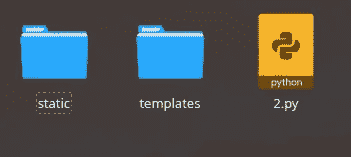
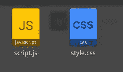
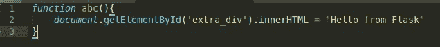
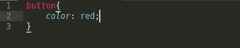
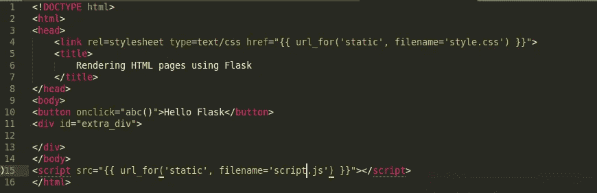
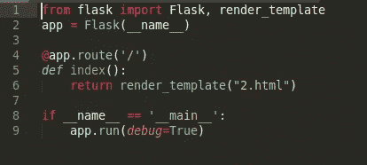
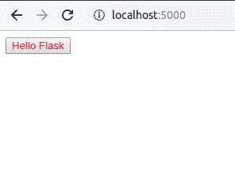
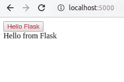

# 使用 Python 的虚拟主机第 3 部分

> 原文：<https://medium.datadriveninvestor.com/web-hosting-using-python-part-3-5bcec13b6ed0?source=collection_archive---------7----------------------->

大家好，在本教程系列的前几部分中，我们看到了如何在 Flask 服务器上托管网页，以及如何在网页的 HTML 中包含 CSS 和 JavaScript(链接[此处](https://medium.com/@akalla/web-hosting-using-python-part-2-ec081e48631e))。现在我们将看看如何从外部 CSS 和 JavaScript 文件在 HTML 页面中呈现 CSS 和 JavaScript。与将 CSS 和 JavaScript 应用于基本的 HTML 页面相比，这样做的步骤略有不同，因为 Flask 遵循一个通用的目录结构，在引用静态文件时必须遵循这个目录结构。我们已经看到，HTML 文件存储在 templates 文件夹中，然后由 flask 服务器呈现。让我们看看包含 CSS 和脚本文件的目录结构。

**Flask 服务器上静态文件的文件结构**

正如我们从之前的教程帖子中了解到的，HTML 文件存储在 templates 文件夹中，类似地，CSS 和 JavaScript 文件存储在 static 文件夹中。包含静态文件夹后的目录结构如下所示。

File Structure

在这里，我们创建了一个静态文件夹来保存 CSS 和 JavaScript 文件，templates 文件夹保存 HTML 文件，Python 文件用于运行 Flask 服务器。

**静态文件夹的结构**

Static Folder Structure

这里，静态文件夹包含两个文件，JavaScript 文件包含使用的脚本，CSS 文件包含使用的样式。

**Inside script.js**

script.js

script.js 包含可以从 HTML 文件中调用的函数 abc()。JavaScript 类似于上一教程中嵌入在 HTML 文件中的 JavaScript。相反，在这里它是分开在一个不同的文件，这使得它更容易使用。

**Inside style.css**

style.css

style.css 包含调用时应用于 HTML 页面的 css。它也类似于前一个教程中 HTML 文件中使用的 CSS，但在这里它被分离为一个不同文件的一部分，使得它更容易使用和修改。

**HTML 文件内**

HTML file

为了在我们的 HTML 代码中使用脚本和 CSS 文件，我们需要引用它。这样做的方法不同，但很简单。在代码的第 4 行，我们引用了 CSS 文件，在第 15 行，我们引用了 JavaScript。为了做到这一点，我们在这些文件的源代码中使用了 url_for()函数。该函数用于为目录中的不同文件(包括模板)创建 URL。如果我们计划更改整个应用程序的根 url，这使得 URL 的更改更加容易。在我们的例子中，我们使用“static ”,它指向包含我们的文件的文件夹，并在 file name 参数中写入需要呈现的实际文件名。这样，我们的 flask 服务器可以很容易地引用这些文件。

**Python 文件内部**

Python File

与前一篇文章相比，Python 文件没有任何变化。第 6 行用于引用我们已经编辑过的 HTML 文件。完成所有这些更改后，我们就可以通过运行 Python 文件来运行我们的 Flask 服务器了。

Output Before Button Click

Output After Button Click

正如你所看到的，我们的结果与我们在上一篇文章中看到的结果相似，唯一的不同是，这里所有的静态代码都保存在单独的文件中，而不是包含在 HTML 文件本身中，这使得我们在需要时很容易修改。

 [## 数据驱动的投资者|微软比 Chrome 有“优势”

### 简史我从来不是浏览器的粉丝，确切地说，我只是一个浏览器的粉丝，Chrome。这是我的…

www.datadriveninvestor.com](https://www.datadriveninvestor.com/2020/03/29/microsoft-having-an-edge-over-chrome/) 

**感谢阅读**

在接下来的出版物中，我们将看到如何向服务器添加多个模板，以及如何将它们链接在一起作为单独的网页。

请在下面评论你的观点和建议。