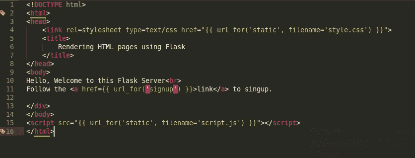
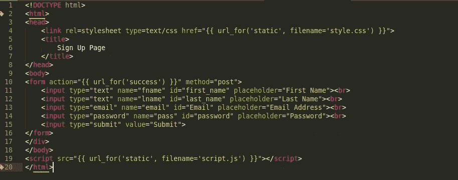
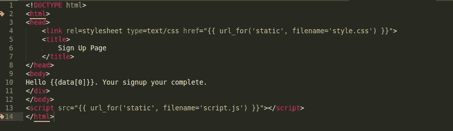
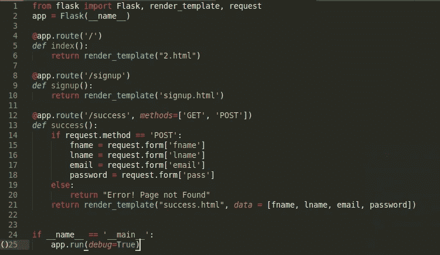
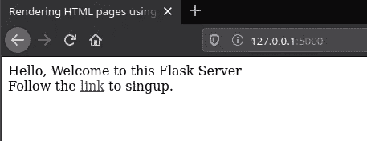
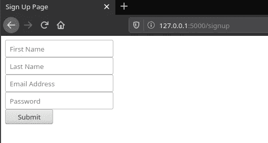
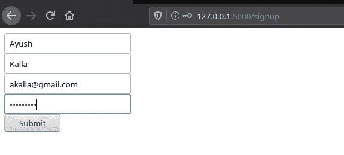
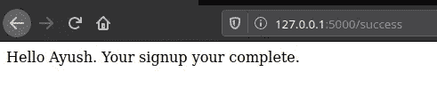
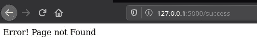

# 使用 Python 的虚拟主机第 4 部分(Flask 中的路由和链接)

> 原文：<https://medium.datadriveninvestor.com/web-hosting-using-python-part-4-routes-and-links-in-flask-de72ce1fc0ff?source=collection_archive---------6----------------------->

大家好，在之前的故事中，我们看了如何在 Flask 环境中渲染外部文件，以及这样做的好处(链接[此处](https://medium.com/datadriveninvestor/web-hosting-using-python-part-3-5bcec13b6ed0))。由于我们计划使用 Flask 作为我们网站的服务器，所以我们的网站很可能会有多个网页，并且这些网页会链接在一起。让我们看看如何将多个网页添加到我们的服务器。

**任务**

对于这个故事和下面的几个故事，让我们假设我们的任务是创建一个网站，允许用户登录，在登录时向他们发送电子邮件，将他们的凭据存储在 SQL 数据库中，并允许用户以后登录。

**添加多个 HTML 页面**

Home Page

这里，第一页是默认情况下向用户显示的主页。注意在第 11 行，url_for()函数引用了一个到另一个 HTML 页面的链接。创建后，单击此链接会将我们重定向到“注册”页面。

Sign Up Page

上面我们已经创建了一个注册页面，当用户点击主页上的重定向链接或者试图直接访问注册页面时，就会显示这个页面(我们将在后面的故事中讨论)。请注意，这个页面包含一个传统的 HTML 表单，唯一的区别是第 10 行，在这里，当表单被填写和提交时，函数 url_for()用于重定向到成功页面。在下一步中，我们将创建“success.html”页面(在正确输入表单细节后显示)。前面的故事中提到了 url_for()函数的使用。

Sign Up success Page

在上面的代码片段中，我们创建了一个 HTML 页面，一旦用户成功注册，就会显示该页面。注意在第 10 行，显示了注册的用户的名字。一会儿我们将看看如何从表单访问用户名到“success.html”页面。

**将页面添加到 Flask 服务器**

Python File

一旦我们创建了新的 HTML 文件(它需要位于 templates 文件夹中)，我们现在需要在服务器上路由这些页面。

 [## 数据驱动的投资者|微软比 Chrome 有“优势”

### 简史我从来不是浏览器的粉丝，确切地说，我只是一个浏览器的粉丝，Chrome。这是我的…

www.datadriveninvestor.com](https://www.datadriveninvestor.com/2020/03/29/microsoft-having-an-edge-over-chrome/) 

在上面例子中的第 4 行，我们可以看到传递的参数是'/'，这表示当试图访问给定的链接时，下面编写的代码行将被执行。由于参数只包括'/'，因此当服务器启动时将访问下面编写的代码。因此，这是我们服务器的默认页面。

Home Page

Sign Up Page

在这里，一旦我们在地址栏中键入我们的本地主机地址(127.0.0.1:5000 ),后跟“/signup ”,就会加载页面“signup.html”。如果我们单击上一页中的链接，也可以访问该页。

Filling Up the signup form

我们在表格中填写详细信息以完成注册过程，然后进入下一页。

**确认用户注册**

Sign Up Page

请记住，在注册模板中，表单使用 post 方法指向 success.html 模板，这意味着一旦填写了表单并按下了提交按钮，我们就会被重定向到 success.html 页面。我们现在可以捕获表单值，向页面添加错误处理。

**获取用户输入**

Python File

在第 13 行，我们调用 success 函数，以防表单被提交。第 14 行的 if 条件确保只有当表单第一次提交时才调用该函数，并在用户试图直接访问页面时向用户显示一个错误。第 15-18 行用于存储用户在上一页表格中填写的变量。第 19 行的 else 语句处理当用户试图直接访问页面而没有首先填写表单时的错误。第 21 行中的参数“data”用于在“success.html”文件中传递这些变量。我们将看看如何在 html 页面上使用这些变量。还记得在第 1 行导入请求。

**向用户显示注册成功**

Sign Up success Page

请注意，在第 10 行，{{data[0]}} '用于访问用户在上一页中输入的名字。数据是我们之前传递的变量的名称，0 表示数据变量中名字的索引。

**用户注册成功**

Successful Sign Up

**错误处理**

Error Handling

如上所示，如果试图直接访问“success.html”而没有先访问表单，则会向用户显示一条错误消息，因为所涉及的方法不是“POST”。

**感谢阅读**

如您所见，我们已经向服务器添加了多个模板，并将它们链接在一起。在接下来的故事中，我计划添加在成功注册后向用户发送电子邮件的功能，将用户凭证以哈希形式存储在 SQL 数据库中，并为用户提供以后登录的选项。

请在下面评论你的观点和建议。