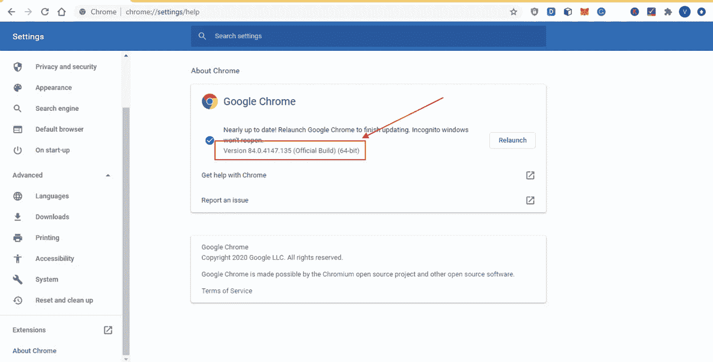
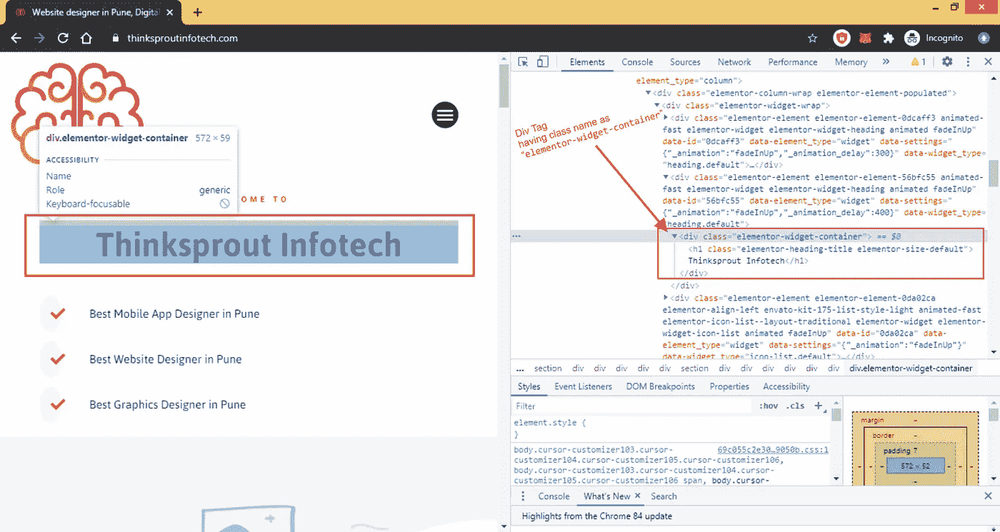

# 使用 python 进行网页抓取|网页抓取的简单步骤|方法

> 原文：<https://medium.datadriveninvestor.com/web-scraping-easy-steps-for-web-scraping-methods-python-da3333f8d959?source=collection_archive---------3----------------------->

## 网络抓取本身并不违法。事实上，web 抓取或 web 爬行在历史上与众所周知的搜索引擎如 Google 或 Bing 相关联。这些搜索引擎抓取网站并索引网络。

从网页抓取过程开始，需要以下步骤:

> **所需进口:**

**1。** **xlrd**

xlrd 是一个允许 Python 从 Excel 文件中读取数据的模块。

**安装:**

pip 安装 xlrd

**2。** **硒**

Selenium WebDriver 是最流行的 Web UI 自动化工具之一。

**安装:**

pip 安装硒

**3。美汤**

Beautiful Soup 是一个库，可以很容易地从网页上抓取信息

**安装:**

pip 安装 beautifulsoup4

**4。** **熊猫**

Pandas 是一个 Python 包，它提供了快速、灵活和富于表现力的数据结构，旨在使结构化(表格、多维、潜在异构)和时序数据的处理变得既简单又直观。

**安装:**

pip 安装熊猫

**5。** x **lwt**

xlwt 是一个开发人员用来生成与 Microsoft Excel 版本 95 到 2003 兼容的电子表格文件的库。

**安装:**

pip 安装 xlwt

# 在下面的步骤中，我们将进行 Web 抓取，以获取组织的详细信息。

> 步骤 1:导入导入

```
**import xlrd****from selenium import webdriver****from bs4 import BeautifulSoup****import pandas as pd****import xlwt****from xlwt import WorkbookStep 2: Importing the imports**
```

> 步骤 2:为 Excel 工作表创建对象

```
**wb1 = Workbook()**
```

> 步骤 3:在 Excel 中创建工作表

```
**sheet1 = wb1.add_sheet('Sheet 1')**
```

> 步骤 4:处理循环的列和行的变量

```
**col=0****row=0**
```

> 步骤 5:包含用于抓取的数据集的 Excel 表的路径变量

```
**loc = ("C:/Users/Thinksprout Infotech/Desktop/CompReg_31AUGUST2020.xlsx")**
```

**我们正在使用测试版 Chrome 浏览器。**

**必须要有 chrome 浏览器。**

[](https://www.datadriveninvestor.com/2020/05/20/simulating-popular-distributions-in-python/) [## 在 Python 中模拟流行的分布|数据驱动的投资者

### 近年来，对机器学习和数据科学的兴趣一直在快速增长。越来越多的学生…

www.datadriveninvestor.com](https://www.datadriveninvestor.com/2020/05/20/simulating-popular-distributions-in-python/) 

检查你的 Chrome 版本，并下载同样的兼容版本。



## *可从*下载 Chrome 测试网络浏览器驱动程序

 [## 下载-Chrome driver-Chrome 的 WebDriver

### Chrome 的网络驱动

Chromechromedriver.chromium.org 的 web 驱动程序](https://chromedriver.chromium.org/downloads) 

> 步骤 6:用于设置测试 web 浏览器驱动程序位置的变量

```
**driver = webdriver.Chrome("C:/Users/ Thinksprout Infotech /Desktop/chromedriver_win32/chromedriver"**
```

> 步骤 7:从 excel 中读取数据集的工作簿对象

```
**wb = xlrd.open_workbook(loc)****sheet = wb.sheet_by_index(0)**
```

> 步骤 8:遍历数据集

## *继续循环直到结束*

```
**for i in range(sheet.nrows):** **cin = sheet.cell_value(i, 0)** **name = sheet.cell_value(i, 1)**
```

> 步骤 9:抓取网页的网址

```
#HiddenData is the URL of website to be webscrapped
#brackets ‘{ }’ represents the data for parameters to the website URL**stuff_in_string = "https://HiddenData/{}/{}".format(name,cin)**
```

> 步骤 10:向网络浏览器发送 URL 数据

```
**driver.get(stuff_in_string)****content = driver.page_source****soup = BeautifulSoup(content,"html.parser")**
```

> 第 11 步:实际网站标签的数据必须刮和数据必须提取


**例如:**

[https://thinksproutinfotech.com](https://thinksproutinfotech.com/)

如果我们想从我的组织网站 URL 获取 Thinksprout Infotech 名称

在网页上单击右键—>单击“检查”



```
**content1 = soup.find('div', {"class": " elementor-widget-container"})****article = ''**
```

> 步骤 12:将数据导出到新的 Excel 表格

```
*#another Loop in our previous for loop***for i in content1.findAll('p'):** **article =i.text** **print(article)** **sheet1.write(row, col, article)** **wb1.save('C:/Users/Viraj Shelar/Desktop/data2.csv')** **row+=1**
```

> 步骤 13:关闭测试版 Chrome 浏览器

```
*#outside the second for loop i.e inside second first for loop***driver.quit()**
```

**这个循环将继续，直到数据集的所有数据都没有被解析。**

# 结论:

每次成功执行数据集中的数据后，Chrome 测试浏览器将重新启动，继续处理数据中的数据值。

当稀疏化数据并同时获取值时，它会将获取的数据存储到新的 Excel 表中。同时执行是因为在元组、列表或字典中存储数据可能会由于互联网连接失败而导致数据丢失。

为了避免这个缺点，最好同时执行。

# 参考资料:

1.  [https://www . geeks forgeeks . org/reading-excel-file-using-python/](https://www.geeksforgeeks.org/reading-excel-file-using-python/)
2.  [https://www . geeks forgeeks . org/writing-excel-sheet-using-python/？ref=lbp](https://www.geeksforgeeks.org/writing-excel-sheet-using-python/?ref=lbp)
3.  [https://www . extend office . com/documents/excel/2517-excel-if-column-contains-value-text-then-copy-cell . html](https://www.extendoffice.com/documents/excel/2517-excel-if-column-contains-value-text-then-copy-cell.html)
4.  [https://Matthew-Brett . github . io/teaching/string _ formatting . html](https://matthew-brett.github.io/teaching/string_formatting.html)
5.  图片:[https://unsplash.com/photos/RYyr-k3Ysqg](https://unsplash.com/photos/RYyr-k3Ysqg)

**访问专家视图—** [**订阅 DDI 英特尔**](https://datadriveninvestor.com/ddi-intel)