# 面向数据科学家的网络搜集

> 原文：<https://medium.datadriveninvestor.com/web-scraping-for-data-scientists-6f179c23d667?source=collection_archive---------5----------------------->

*足够的现成 CSV 文件；以现实生活的方式研究数据科学。*

[Michael Dziedzic on Unsplash](https://unsplash.com/photos/1bjsASjhfkE)

正如维基百科所描述的，****网页抓取*** *，* ***网页采集*** *或* ***网页数据提取*** *是一种复制的形式，其中从网页上收集并复制特定的数据，通常将其复制到中央本地数据库或电子表格中，以供以后检索或分析。”**

***TL；DR；**下面是代码的 GitHub 链接:[https://GitHub . com/Steve kola/articles _ based _ projects/blob/main/Web % 20 scraping % 20 for % 20 data % 20 scientists/scraper . ipynb](https://github.com/SteveKola/articles_based_projects/blob/main/Web%20Scraping%20for%20Data%20Scientists/scraper.ipynb)*

*在我们的数据科学工作流中，大多数时候我们不会有一个 CSV 文件，用丝带绑着，等着我们去探索。我们必须从数据库中查询数据，从 API 中消费数据，等等。另一种获取数据的方式是通过网络抓取，这在非程序员看来是一种黑暗的艺术，因为这是一个程序自己探索互联网和收集数据的能力。如果您是 It 新手，这听起来可能有点陌生，但它是最符合逻辑、最容易访问的数据源之一。*

*作为一名数据科学家，大多数项目的第一步是获得一个适当的相关数据集。在这方面，网络抓取是一个必不可少的工具，因为它让你几乎可以无限制地访问互联网上的信息宝库。常言道，“数据是新的石油”，网络就像盛产石油的沙特阿拉伯。*

*请记住，一些网站不希望任何人抓取他们的网站，当网站格式改变时，你可能需要更新你的网页抓取工具。*

*在本教程中，我们将通过抓取尼日利亚数据科学网站[https://www.datasciencenigeria.org/2020-bootcamp-attendees/](https://www.datasciencenigeria.org/2020-bootcamp-attendees/)上的 2020 年人工智能训练营参与者名单，并将其保存在 CSV 文件中，来浏览网络抓取的基本组成部分。*

*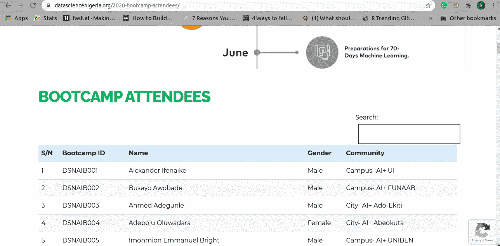*

*我们在这里可以看到，桌子上的每一行(attendee)都有序列号、训练营 ID、姓名、性别和他/她所属的 AI 社区。我们的目标是为每个参与者检索这些信息。*

*我们将使用 Python 请求库来完成这项任务。 ***请求*** 被广泛认为是人类的*HTTP*，它使检索网站变得相当轻松。如果您想了解使用请求的概况，请随时查看位于[https://requests.readthedocs.io/en/master/user/quickstart/](https://requests.readthedocs.io/en/master/user/quickstart/)的快速指南。*

*   *因此，第一步是通过导入所需的库(稍后我们可能会导入其他库)来准备我们的 Jupyter 笔记本，正如我们在下面的代码片段中所做的；*

**

*   *数据的 URL 是 https://www.datasciencenigeria.org/2020-bootcamp-attendees/的。让我们运行一个快速测试，确保我们可以检索到网页。*

*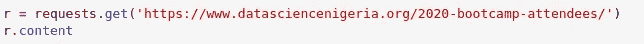*

*   *这段代码调用站点，检索信息，并将其存储在 *r* 对象中。我们可以从 *r* 对象中检索很多属性，但是我们现在只想要内容。我们可以在下面的截图中看到输出；*

*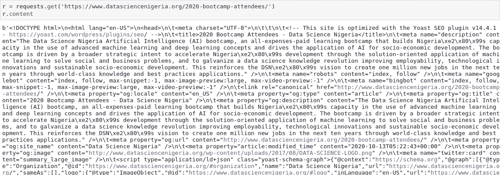*

*下一步是检查页面元素，看看如何解析页面数据；*

*   *在 Chrome 中打开 DSN 网页，右键单击页面上的任意位置。*
*   *你应该看到*检查。*点击它。页面现在应该是这样的；*

*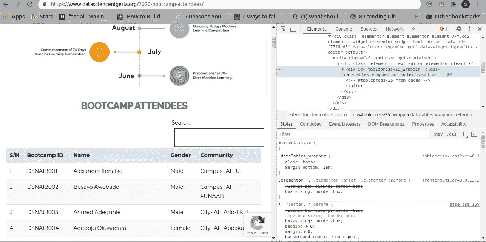*

*   *在我们刚刚打开的工具中，左上角有一个带箭头的正方形。点击该按钮，然后点击页面上名为 *1* 的*序列号*。它应该如下所示:*

*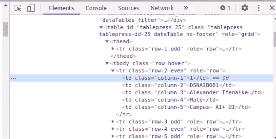*

*   *从这里我们可以看到，该行的数据在一个表中(我们有一个 table，在我们的 present 标签上有 thead、tbody 和 tr 标签),第一个 *td* 包含 S/N，第二个包含参加者的 Bootcamp ID，第三个包含参加者的姓名，第四个包含参加者的性别，第五个包含参加者所属的 AI 社区。*

*现在让我们开始构建代码来测试我们对数据的解析。我们将使用一个名为 **BeautifulSoup** 的库来解析 HTML。BeautifulSoup 是一个流行的、易于使用的 Python HTML 解析库。如果您还没有 pip，可以安装它。虽然它预装了 Anaconda，但是如果您在 conda 环境中，就不必担心这个问题。它的文件可以在 https://www.crummy.com/software/BeautifulSoup/bs4/doc/找到。*

*   *首先，我们只需将页面内容传递给 *BeautifulSoup* 类，如下所示；*

*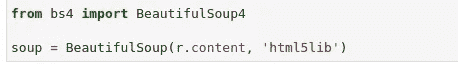*

*   *现在我们可以使用我们创建的这个 *soup* 对象开始解析这个表。让我们试着在网页上检索包含参与者数据的 *tr* 标签。*

*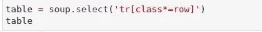*

*   *我们在前面的代码中所做的是选择所有包含*行*作为其名称一部分的*tr*。这些是包含我们想要的数据的文件。*
*   *接下来，让我们看看下面这段代码的输出；*

*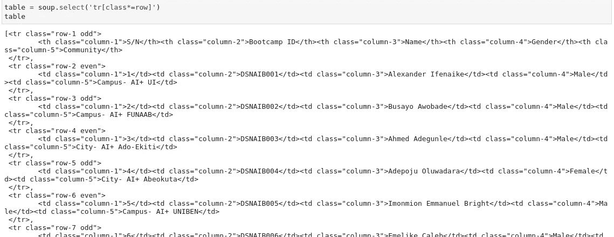*

*   *注意，我们有一个包含所有我们想要的 *tr* 标签的 Python 列表。让我们通过检查列表的长度来确认；*

*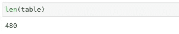*

*   *考虑到我们有 479 名训练营参加者+一个标题行，这完全有意义。*

## *提取单个数据点*

*现在我们已经有了所有参与者数据的*tr*，我们需要提取每个参与者的个人数据点。*

*这些都是我们想要瞄准的点；*

*   *与会者的序列号。*
*   *与会者的训练营 ID。*
*   *与会者的姓名。*
*   *与会者的性别。*
*   *与会者的 AI 社区。*

*让我们从第一行开始:*

*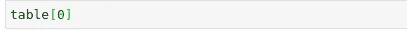*

*前面的代码给出了以下输出:*

*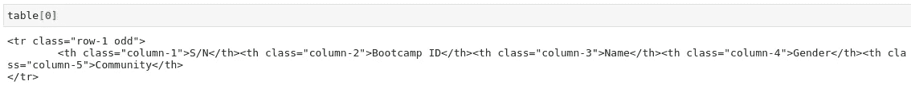*

*请注意，第一行包含标题。我们可能应该从第二行开始寻找我们的数据。*

*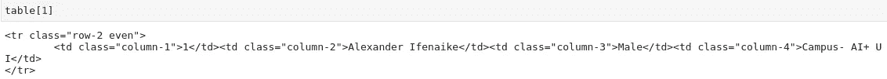*

*耶！第二行包含我们需要的所有数据点。下一步是开始我们的解析，分别针对它们。*

*让我们首先解析出我们的 S/N 列。我们可以用另一个 *select* 语句来实现，如下所示:*

*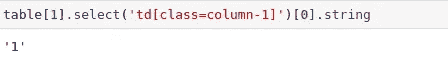*

*这正是我们所希望的。我们现在可以继续检索与会者的其他数据点。*

*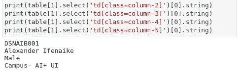*

*我们现在已经得到了我们想要的所有数据。现在让我们把它们放在一个循环中，这样我们就可以从每一行中提取数据，并保存到一个列表中。*

*在下面的代码中，我们将取出每行的所有数据点；*

*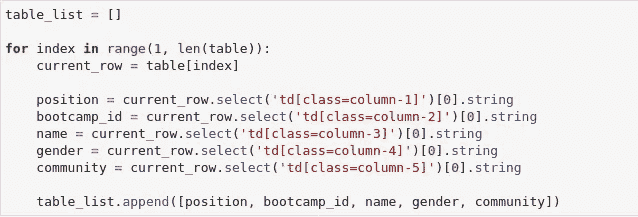*

*让我们解包我们在前面的代码中做了什么。我们知道页面上有 480 行包含 Bootcamp 参与者，所以我们为创建了一个*循环，遍历每个参与者并提取数据，然后将所有参与者添加到 *table_list。***

*我们将用下面的*打印*语句来验证: *table_list。*这会产生以下输出:*

*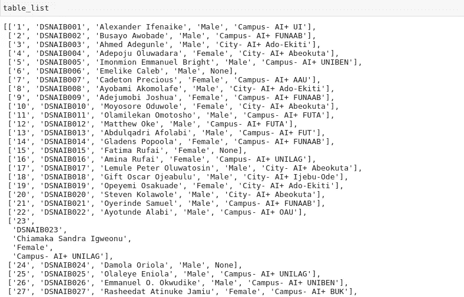*

*这就是刮痧！恭喜你走到这一步。*

## *为将来的分析整理我们的数据*

*现在我们有了数据，下一步是将它移到一个熊猫数据框架中，这样我们就可以更容易地使用它。我们还会将它保存在一个 CSV 文件中，以供将来使用。*

*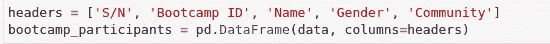*

*让我们通过调用*boot camp _ participants . head()*来检查我们的数据*

**

*维奥拉。现在我们的数据看起来很像我们在 Kaggle 和 Zindi 的现成 csv 文件上调用的 *pd.read_csv()* 。*

*最后一步是保存在 CSV 文件中，以供将来分析。*

**

*这样，我们就有了对网络抓取的第一次介绍。我希望我们能继续从更多的网站上下载更多的数据。*

*谢谢你走到这一步！如果你在抓取网页的过程中遇到任何问题，请不要犹豫，通过 [Twitter](https://twitter.com/steveddev) 和 [LinkedIn](https://www.linkedin.com/in/steven-kolawole-80/) 联系我。请将此分享给任何需要网络抓取入门的人。*

*刮的开心！*